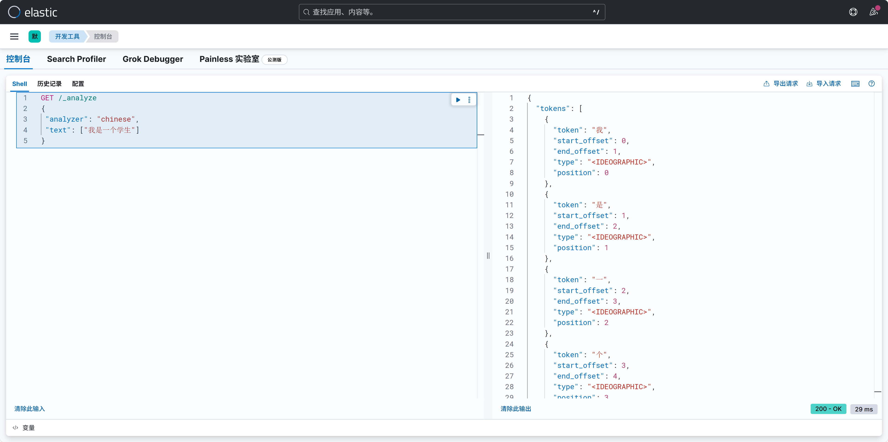
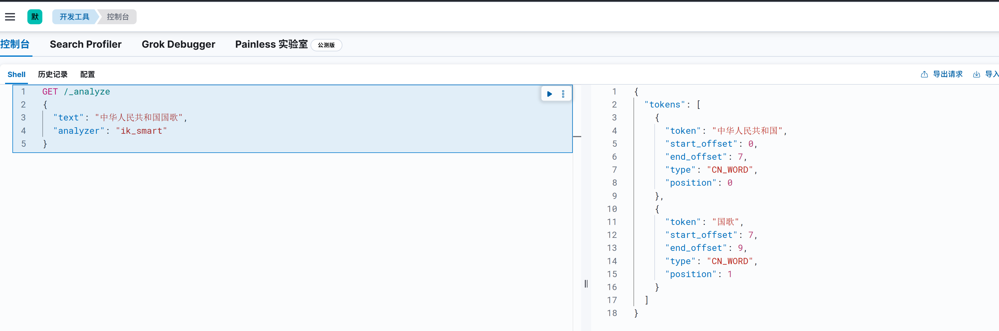
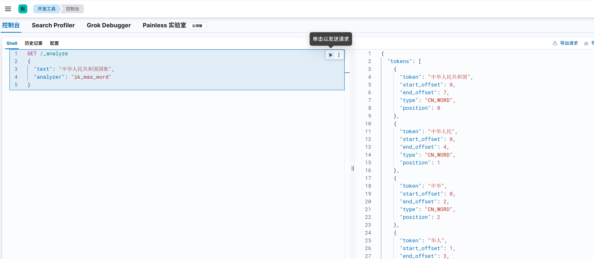

# Elasticsearch安装分词器

我们在使用 Elasticsearch 官方默认的分词插件时会发现，其对中文的分词效果不佳，经常分词后得效果不是我们想要的。

如：我是一个学生，被分词为：\"我\", \"是\" ,\"一\" ,\"个\" ,\"学\" ,\"生\"

```
GET _analyze
{
 "analyzer": "chinese",
 "text": ["我是一个学生"]
}
```



## 第一步：下载分词器

为了能够更好地对中文进行搜索和查询，就需要在Elasticsearch中集成好的分词器插件，而 IK 分词器就是用于对中文提供支持得插件。

**Github**：[infinilabs/analysis-ik](https://github.com/infinilabs/analysis-ik)

**IK分词器下载地址**：[Index of: analysis-ik/stable/](https://release.infinilabs.com/analysis-ik/stable/)

需要注意的是，下载的IK分词器版本一定要与ES版本号完全一致，否则会出现不兼容的情况。

## 第二步：安装

将下载的zip压缩包，放入Elasticsearch安装目录下的plugins目录中，并将其解压：

```shell
 $ unzip elasticsearch-analysis-ik-8.17.3.zip -d ./plugins/ik/
```

## 第三步：重启并验证

重启后，即可验证IK分词器。

IK 分词器提供了两个分词算法：

- ik_smart: 最少切分
- ik_max_word:最细粒度划分






