# Elasticsearch搜索相关性

> [4.1 搜索相关性详解.note](https://note.youdao.com/ynoteshare/index.html?id=16adbf53c13f129e57e1155cc107b7ac&type=note&_time=1745146715975)

## 一. 相关性概述

### 1.1 什么是相关性

搜索是用户和搜索引擎的对话，用户关心的是搜索结果的相关性

- 是否可以找到所有相关的内容（召回率）
- 有多少不相关的内容被返回了（精度）
- 文档的打分是否合理

- 结合业务需求，平衡结果排名

相关性是指在搜索引擎中，描述一个文档与查询语句匹配程度的度量标准。这种相关性通过为每个匹配查询条件的文档计算一个相关性评分（_score）来实现，评分越高表示文档与查询语句的匹配程度越高。

如下例子：显而易见，查询JAVA多线程设计模式，文档id为2,3的文档的算分更高。

| 关键词   | 文档 ID     |
| -------- | ----------- |
| JAVA     | 1,2,3       |
| 设计模式 | 1,2,3,4,5,6 |
| 多线程   | 2,3,7,9     |

**Elasticsearch 使用评分算法，根据查询条件与索引文档的匹配程度来确定每个文档的相关性**。同时，为了满足各种特定的业务需求，Elasticsearch 也充分允许用户自定义评分。

在下面示例中，_score 就是 Elasticsearch 检索返回的评分，其值可以衡量每个文档与查询的匹配程 度，即相关性。每个文档都有对应的评分，该得分由正浮点数表示。文档评分越高，则该文档的相关性越高。

### 1.2 计算相关性评分

Elasticsearch使用布尔模型查找匹配文档，并用一个名为“实用评分函数”的公式来计算相关性。这个公式借鉴了 `TF-IDF`（词频-逆向文档频率）和向量空间模型，同时加入了一些现代的新特性，如协调因子、字段长度归一化以及词/查询语句权重提升。

Elasticsearch 5之前的版本，评分机制或者打分模型是基于 `TF-IDF` 实现的。从 Elasticsearch 5之后，默认的打分机制改成了`Okapi BM25`。其中 `BM` 是 `Best Match` 的缩写，25是指经过25次迭代调整之后得出的算法，它是由 `TF-IDF` 机制进化来的。

传统 `TF-IDF` 和 `BM25` 都使用逆向文档频率来区分普通词（不重要）和非普通词（重要），使用词频来衡量某个词在文档中出现的频率。两种机制的逻辑相似：首先，文档里的某个词出现得越频繁，文档与这个词就越相关，得分越高；其次，某个词在集合中所有文档里出现的频次越高，则它的权重越低、得分越低。也就是说，某个词在集合中所有文档里越罕见，其得分越高。

`BM25` 在传统 `TF-IDF` 的基础上增加了几个可调节的参数，使得它在应用上更佳灵活和强大，具有较高的实用性。

#### 1.2.1 `TF-IDF` 评分公式

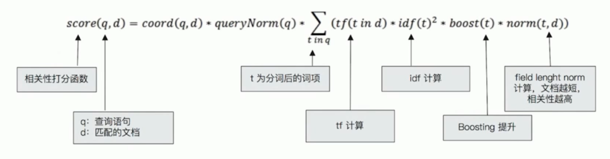

- `TF` 是词频(Term Frequency)：检索词在**文档**中出现的频率越高，相关性也越高。

  ```txt
  词频（TF） = 某个词在文档中出现的次数 / 文档的总词数
  ```

- `IDF` 是逆向文本频率(Inverse Document Frequency)：每个检索词在**索引**中出现的频率，频率越高，相关性越低。总文档中有些词比如“是”、“的” 、“在” 在所有文档中出现频率都很高，并不重要，可以减少多个文档中都频繁出现的词的权重。

  ```txt
  逆向文本频率（IDF）= log (语料库的文档总数 / (包含该词的文档数+1))
  ```

- 字段长度归一值（field-length norm)：检索词出现在一个内容短的 title 要比同样的词出现在一个内容长的 content 字段权重更大。

以上三个因素：词频（term frequency）、逆向文本频率（inverse document frequency）和字段长度归一值（field-length norm）——**是在文档被索引时计算并存储的，最后将它们结合在一起计算单个词在特定文档中的权重**。

#### 1.2.2 `BM25` 评分公式

`BM25` 就是对 `TF-IDF` 算法的改进，对于 `TF-IDF` 算法，`TF(t)` 部分的值越大，整个公式返回的值就会越大。

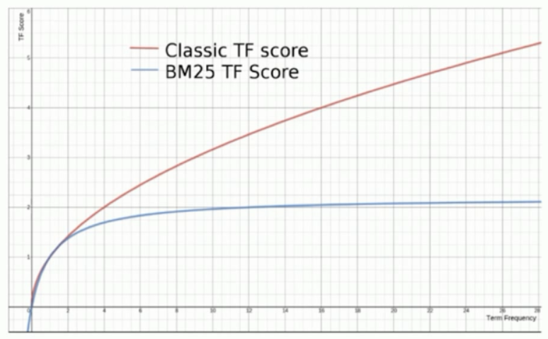

`BM25` 公式：

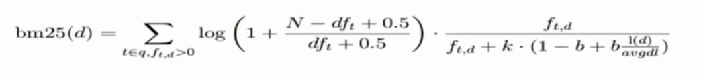

#### 1.2.3 通过 Explain API 查看算分明细

```java
PUT /test_score/_bulk
{
    "index": {
        "_id": 1
    }
}{
    "content": "we use Elasticsearch to power the search"
}{
    "index": {
        "_id": 2
    }
}{
    "content": "we like elasticsearch"
}{
    "index": {
        "_id": 3
    }
}{
    "content": "Thre scoring of documents is caculated by the scoring formula"
}{
    "index": {
        "_id": 4
    }
}{
    "content": "you know,for search"
}
```

第二步：查询数据

```json
GET /test_score/_search
{
    "explain": true,
    "query": {
        "match": {
            "content": "elasticsearch"
        }
    }
}
```

在查询中增加 `explain=true` 选项，我们就可看到Elasticsearch查询解释：
```json
{
    "took": 3, //该查询请求花费的时间，单位是毫秒。这里took: 3意味着查询耗时 3 毫秒。
    "timed_out": false, //查询是否超时。false表明查询未超时。
    "_shards": {
        "total": 1, //参与查询的分片总数，这里是 1。
        "successful": 1, //成功执行查询的分片数量，这里为 1。
        "skipped": 0, //被跳过的分片数量，这里是 0。
        "failed": 0 //查询失败的分片数量，这里是 0。
    },
    "hits": {
        "total": {
            "value": 2, //匹配查询条件的文档总数，这里是 2。
            "relation": "eq" //表示value和实际匹配文档数的关系，eq代表相等。
        },
        "max_score": 0.8713851, //所有匹配文档中的最高得分，这里是 0.8713851。
        "hits": [
            {
                "_shard": "[test_score][0]", //文档所在的分片信息。
                "_node": "Uzem2zI7R2CgvIYzeQ89kw", //文档所在的节点 ID。
                "_index": "test_score", //文档所在的索引名称。
                "_id": "2", //文档的唯一 ID。
                "_score": 0.8713851, //文档的得分，这里是 0.8713851。
                "_source": {
                    "content": "we like elasticsearch" //文档的原始内容。
                },
                "_explanation": { // 算分过程解释
                    "value": 0.8713851,
                    "description": "weight(content:elasticsearch in 1) [PerFieldSimilarity], result of:",
                    "details": [
                        {
                            "value": 0.8713851,
                            "description": "score(freq=1.0), computed as boost * idf * tf from:", // 文档得分的计算公式为：score = boost * idf * tf
                            "details": [
                                {
                                    "value": 2.2,
                                    "description": "boost",
                                    "details": []
                                },
                                {
                                    "value": 0.6931472,
                                    "description": "idf, computed as log(1 + (N - n + 0.5) / (n + 0.5)) from:", //idf计算公式
                                    "details": [
                                        {
                                            "value": 2,
                                            "description": "n, number of documents containing term", //n，包含term的文档数
                                            "details": []
                                        },
                                        {
                                            "value": 4,
                                            "description": "N, total number of documents with field", //N，包含字段的文档总数
                                            "details": []
                                        }
                                    ]
                                },
                                {
                                    "value": 0.5714286,
                                    "description": "tf, computed as freq / (freq + k1 * (1 - b + b * dl / avgdl)) from:", //tf计算公式
                                    "details": [
                                        {
                                            "value": 1,
                                            "description": "freq, occurrences of term within document",
                                            "details": []
                                        },
                                        {
                                            "value": 1.2,
                                            "description": "k1, term saturation parameter", //系数
                                            "details": []
                                        },
                                        {
                                            "value": 0.75,
                                            "description": "b, length normalization parameter",
                                            "details": []
                                        },
                                        {
                                            "value": 3,
                                            "description": "dl, length of field",
                                            "details": []
                                        },
                                        {
                                            "value": 6,
                                            "description": "avgdl, average length of field",
                                            "details": []
                                        }
                                    ]
                                }
                            ]
                        }
                    ]
                }
            }，
            .......
        ]
    }
}
```

我们以 `ID=2` 的文档为例进行分析，从查询解释可以得出：

得分的计算公式为：`score = boost * idf * tf`

1. `boost`

- **含义**：查询时为该字段设置的权重，默认值是 1，这里是 2.2。较高的`boost`值会使包含该词的文档得分更高。
- **示例值**：`value = 2.2`

2. `idf`（逆文档频率）

- **含义**：体现了一个词在整个索引中的稀有程度。词越稀有，`idf`值越高，文档得分也越高。

- 计算公式：

  ```
  idf = log(1 + (N - n + 0.5) / (n + 0.5))
  ```

  - **`n`**：包含该词的文档数量，这里是 2。
  - **`N`**：包含该字段的文档总数，这里是 4。

- **示例计算**：

```python
import math
n = 2
N = 4
idf = math.log(1 + (N - n + 0.5) / (n + 0.5))
print(idf)  
```

计算结果为 0.6931472。

3. `tf`（词频）

- **含义**：表示一个词在文档中出现的频率。不过，为了避免长文档因为词多而得分过高，会进行长度归一化处理。

- 计算公式：

  ```
  tf = freq / (freq + k1 * (1 - b + b * dl / avgdl))
  ```

  - **`freq`**：词在文档中出现的次数，这里是 1。
  - **`k1`**：词频饱和度参数，默认值为 1.2。它控制着词频对得分的影响程度。
  - **`b`**：长度归一化参数，默认值为 0.75。用于平衡文档长度对得分的影响。
  - **`dl`**：文档字段的长度，`_id`为`2`的文档中`dl`是 3。
  - **`avgdl`**：该字段所有文档的平均长度，这里是 6。

- **示例计算（以`_id`为`2`的文档为例）**：

```python
freq = 1
k1 = 1.2
b = 0.75
dl = 3
avgdl = 6
tf = freq / (freq + k1 * (1 - b + b * dl / avgdl))
print(tf)  
```

计算结果为 0.5714286。

以`_id`为`2`的文档为例，最终得分计算如下：

```python
boost = 2.2
idf = 0.6931472
tf = 0.5714286
score = boost * idf * tf
print(score)  
```

计算结果为 0.8713851，与响应中的`_score`值一致。

综上所述，Elasticsearch 通过综合考虑词的稀有程度、在文档中的出现频率以及文档长度等因素，为每个匹配的文档计算得分。

### 1.3 自定义评分策略

自定义评分是用来优化Elasticsearch默认评分算法的一种有效方法，可以更好地满足特定应用场景的需求。

自定义评分的核心是通过修改评分来修改文档相关性，在最前面的位置返回用户最期望的结果。

Elasticsearch自定义评分的主要作用如下：

1. 排序偏好：通过在搜索结果中给每个文档自定义评分，可以更好地满足搜索用户的排序偏好。
2. 特殊字段权重：通过给特定字段赋予更高的权重，可以让这些字段对搜索结果的影响更大。
3. 业务逻辑需求：根据业务需求，可以定义复杂的评分逻辑，使搜索结果更符合业务需求。

4. 自定义用户行为：可以使用用户行为数据（如点击率）作为评分因素，提高用户搜索体验。

**搜索结果相关性与自定义评分的关系**:

搜索引擎本质是一个匹配过程，即从海量的数据中找到匹配用户需求的内容。判定内容与用户查询的相关性一直是搜索引擎领域的核心研究课题之一。如果搜索引擎不能准确地识别用户查询的意图并将相关结果排在前面的位置，那么搜索结果就不能满足用户的需求，从而影响用户对搜索引擎的满意度。

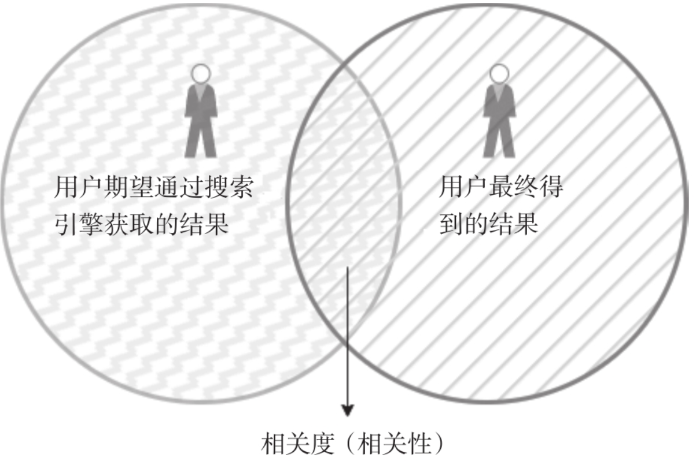

如上图所示，左侧圆圈代表用户期望通过搜索引擎获取的结果，右侧圆圈代表用户最终得到的结果。左右两个圆的交集部分即为预期结果与实际结果的相关性。

## 二. 自定义评分策略

然而，如何实现这样的自定义评分策略，以确保搜索结果能够最大限度地满足用户需求呢？我们可以从多个层面，包括索引层面、查询层面以及后处理阶段着手。

以下是几种主要的自定义评分策略：

- Index Boost: 在索引层面修改相关性 
- boosting: 修改文档相关性 
- negative_boost: 降低相关性 
- function_score: 自定义评分 
- rescore_query：查询后二次打分

### 2.1 在索引层面修改相关性（Index Boost）

Index Boost这种方式能在跨多个索引搜索时为每个索引配置不同的级别。所以它适用于索引级别调整评分。

**案例**：一批数据里有不同的标签，数据结构一致，要将不同的标签存储到不同的索引(A、B、C)，并严格按照标签来分类展示（先展示A类，然后展示B类，最后展示C类），应该用什么方式查询呢？

**准备数据**：

创建三个索引，并分别插入一条数据：

```json
PUT my_index_100a/_doc/1
{
    "subject":"subject 1"
}
PUT my_index_100b/_doc/1
{
    "subject":"subject 1"
}
PUT my_index_100c/_doc/1
{
    "subject":"subject 1"
}
```

由于三个索引中数据都是一致的，所以我们查询的 `subject.keyword="subject 1"` 的数据的 `TF` 和 `IDF` 都是一致的，所以可以看到，最终查询出来的三个文档得分都是一致的：
```json
POST my_index_100*/_search
{
    "query": {
        "term": {
            "subject.keyword": {
                "value": "subject 1"
            }
        }
    }
}
```

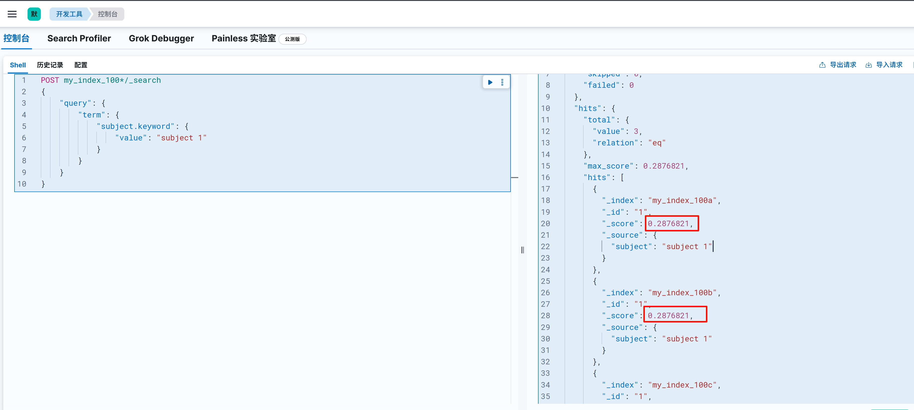

如果我们想让文档最终得分，按照 先展示A类，然后展示B类，最后展示C类的顺序展示，我们可以借助 `indices_boost` 提升索引的权重，让A排在最前，其次是B，最后是C。 

```json
POST my_index_100*/_search
{
    "query": {
        "term": {
            "subject.keyword": {
                "value": "subject 1"
            }
        }
    },
    "indices_boost": [
        {
            "my_index_100a": 1.5
        },
        {
            "my_index_100b": 1.2
        },
        {
            "my_index_100c": 1
        }
    ]
}
```

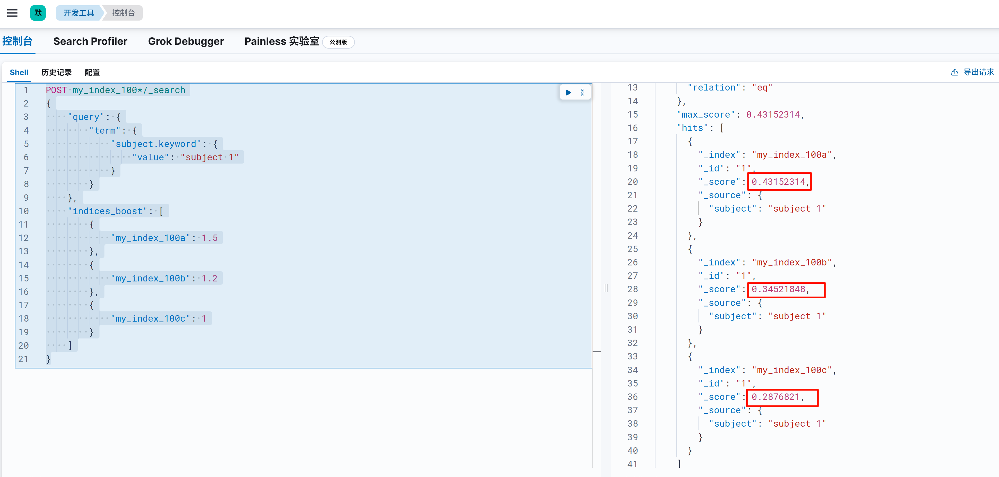

### 2.2 修改文档相关性（boosting）

boosting可在查询时修改文档的相关度。boosting值所在范围不同，含义也不同。

- 若boosting 值为0～1，如0.2，代表降低评分；
- 若 boosting 值＞1，如1.5，则代表提升评分。

适用于某些特定的查询场景，用户可以自定义修改满足某个查询条件的结果评分。

**准备数据**：

```json
POST /blogs/_bulk
{"index":{"_id":1}}
{"title":"Apple iPad","content":"Apple iPad,Apple iPad"}
{"index":{"_id":2}}
{"title":"Apple iPad,Apple iPad","content":"Apple iPad"}
```

两个文档有一定相似性，它们都包含了 `title`、`content` 字段，并且都有 `Apple iPad` 词项，区别是 `ID=1` 的文档 `content` 长一点，`ID=2` 的文档 `title` 长一点。

**查询**：

```json
GET /blogs/_search
{
    "query": {
        "bool": {
            "should": [
                {
                    "match": {
                        "title": {
                            "query": "apple,ipad"
                        }
                    }
                },
                {
                    "match": {
                        "content": {
                            "query": "apple,ipad"
                        }
                    }
                }
            ]
        }
    }
}
```

> `should` 数组中的子查询属于可选条件。只要文档匹配 `should` 数组里的任意一个子查询，就会被视为匹配查询。最终，Elasticsearch 会依据文档与各个子查询的匹配程度来计算文档的相关性得分。详细查询语法参考：[DSL查询](./_5DSL查询.md)

由于两个文档中 `title` 和 `content` 字段都包含了 "Apple" 和 "iPad"，并且“词频”和“逆向文本频率”是一致的

得分情况：

| 文档 | title 词频得分                     | title 逆向文本频率得分             | content 词频得分                   | content 逆向文本频率得分           |
| ---- | ---------------------------------- | ---------------------------------- | ---------------------------------- | ---------------------------------- |
| ID=1 | Apple(0.5714286)+ipad(0.5714286)   | Apple(0.18232156)+ipad(0.18232156) | Apple(0.5263158)+ipad(0.5263158)） | Apple(0.18232156)+ipad(0.18232156) |
| ID=2 | Apple(0.5263158)+ipad(0.5263158)） | Apple(0.18232156)+ipad(0.18232156) | Apple(0.5714286)+ipad(0.5714286)   | Apple(0.18232156)+ipad(0.18232156) |

ID=1，2的数据 `IDF(逆向文本频率)` 值都是一致的，但是ID=1 `title` 字段的 `TF(词频)` 与 ID=2 `content`字段 `TF(词频)` 是一致的，同时ID=1 `content` 字段的 `TF(词频)` 与ID=2 `title`字段 `TF(词频)` 也是一致的，导致两个文档最终的得分相同。

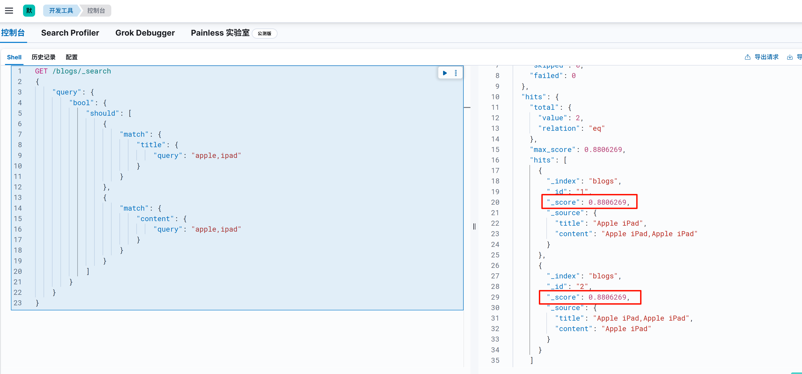

此时**如果我们需要增加title计算相关性的权重**，可以使用 `boosting`：

```json
GET /blogs/_search
{
    "query": {
        "bool": {
            "should": [
                {
                    "match": {
                        "title": {
                            "query": "apple,ipad",
                            "boost": 4
                        }
                    }
                },
                {
                    "match": {
                        "content": {
                            "query": "apple,ipad",
                            "boost": 1
                        }
                    }
                }
            ]
        }
    }
}
```

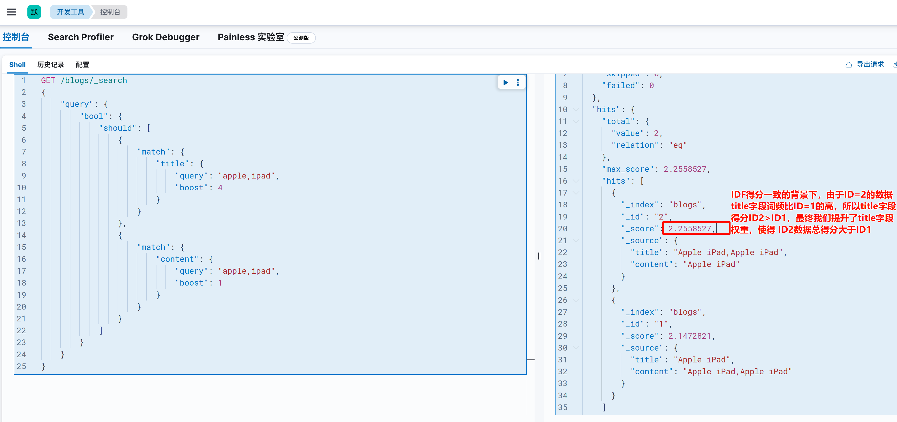

### 2.3 降低文档相关性（nagative_boost）

若对某些返回结果不满意，但又不想将其排除(must_not)，则可以考虑采用negative_boost的方式。原理说明如下：

- `negative_boost` 仅对查询中定义为 `negative` 的部分生效。
- 计算评分时，不修改 `boosting` 部分评分，而 `negative` 部分的评分则乘以 `negative_boost` 的值。
- `negative_boost` 取值为0～1.0，如0.3。

案例：要求苹果公司的产品信息优先展示

**准备数据：**

```json
POST /news/_bulk
{"index":{"_id":1}}
{"content":"Apple Mac"}
{"index":{"_id":2}}
{"content":"Apple iPad"}
{"index":{"_id":3}}
{"content":"Apple employee like Apple Pie and Apple Juice"}
```

**正常查询包含 `apple` 关键字的文档：**

```json
GET /news/_search
{
    "query": {
        "bool": {
            "must": {
                "match": {
                    "content": "apple"
                }
            }
        }
    }
}
```

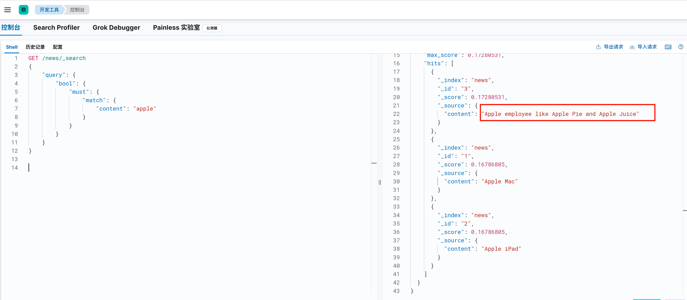

可以看到这样将所有带有 `apple` 关键词的文档都查询出来了，该查询会返回所有包含`apple`关键词的文档，但无法区分产品与其他关联内容（如`Apple Pie`）。若希望排除与苹果公司产品无关的内容（如`pie`），可使用`must_not`：

```json
GET /news/_search
{
    "query": {
        "bool": {
            "must": {
                "match": {
                    "content": "apple"
                }
            },
            "must_not": {
                "match":{
                    "content": "pie"
                }
            }
        }
    }
}
```

但此方法会直接排除包含`pie`的文档，可能影响查询召回率。为在不排除文档的前提下，优先展示苹果公司产品信息，可采用`negative_boost`：

```json
GET /news/_search
{
    "query": {
        "boosting": {
            "positive": {
                "match": {
                    "content": "apple"
                }
            },
            "negative": {
                "match": {
                    "content": "pie"
                }
            },
            "negative_boost": 0.2
        }
    }
}
```

- **positive**：它是一个标准的查询对象，像 `match`、`term` 这类查询都能使用。只要文档匹配了 `positive` 查询，就会在最终的相关性评分里得到提升。
- **negative**：同样也是标准的查询对象。要是文档匹配了 `negative` 查询，其相关性评分就会降低。
- **negative_boost**：取值在 0 到 1 之间，此值用于降低匹配 `negative` 查询的文档的相关性评分。数值越小，降低的幅度就越大。

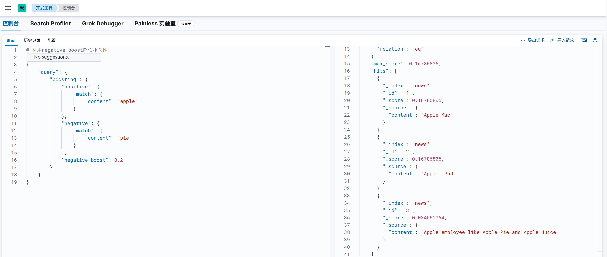

你或许会有这样的疑问，我们在上一节介绍boosting修改文档相关性时指出，boost的值也可以定义为 0~1 之间，那和此处介绍的 `nagative_boost` 有啥区别呢？

虽然`boost`的值在 0~1 之间时与 `negative_boost` 都能起到降低文档相关性评分的作用，但二者在使用场景、作用范围和逻辑机制上存在明显区别：

- 使用场景
  - **`boost`（0~1）**：主要用于在同一查询逻辑内，对不同字段或不同查询条件的评分进行相对调整。比如在多字段查询中，希望弱化某个字段对整体相关性评分的影响，像在搜索博客文章时，降低`content`字段在整体相关性计算中的权重 ，从而突出`title`字段的重要性。
  - **`negative_boost`**：侧重于处理在满足主要查询条件的基础上，对部分不希望完全排除但需要降低其相关性的文档进行调整。例如在搜索新闻时，对于包含某些特定关键词（如与产品无关的词汇）的文档，不想直接排除它们，但又希望优先展示更相关的内容。
- 作用范围
  - **`boost`（0~1）**：直接作用于对应的查询子句，只要文档匹配该查询子句，其评分就会按照设定的`boost`值进行调整，影响范围是单个查询子句对应的文档匹配情况。
  - **`negative_boost`**：需要结合`boosting`查询中的`positive`和`negative`部分共同作用。只有当文档同时匹配`positive`查询（保证是相关文档）且匹配`negative`查询（需要降低相关性的部分）时，`negative_boost`才会生效，对文档评分进行调整，影响范围是满足特定组合条件的文档。
- 逻辑机制
  - **`boost`（0~1）**：是对查询子句计算出的原始评分直接进行乘法运算，属于在正常查询评分计算流程中对某一部分的权重调整，改变的是该部分查询对整体相关性评分的贡献程度。
  - **`negative_boost`**：是在已经完成整体相关性评分计算后，针对满足`negative`查询条件的文档，额外进行一次评分修正。它不改变`positive`查询部分以及其他正常查询部分的评分计算过程，只是对匹配`negative`查询的文档评分进行二次处理 ，起到微调相关性排序的作用。

综上所述，`boost`（0~1）和`negative_boost`虽然都能降低文档相关性评分，但在实际应用中，应根据具体的业务需求和查询逻辑，选择合适的方式来优化搜索结果的相关性排序。

### 2.4 自定义评分（function_score）

该方式支持用户自定义一个或多个查询语句及脚本，达到精细化控制评分的目的，以对搜索结果进行高度个性化的排序设置。适用于需进行复杂查询的自定义评分业务场景。

案例1：商品信息如下，如何同时根据销量和浏览人数进行相关度提升？

| 商品 | 销量 | 浏览人数 |
| ---- | ---- | -------- |
| A    | 10   | 10       |
| B    | 20   | 20       |

想要提升相关度评分，则将每个文档的原始评分与其销量和浏览人数相结合，得到一个新的评分。例如，使用如下公式：

评分 = 原始评分 ×（销量 + 浏览人数）

这样，销量和浏览人数较高的文档就会有更高的评分，从而在搜索结果中排名更靠前。这种评分方式不仅考虑了文档与查询的匹配度（由_score表示），还考虑了文档的销量和浏览人数，非常适用于电子商务等场景。

该需求可以借助script_score实现，代码如下，其评分是基于原始评分和销量与浏览人数之和的乘积计算的结果。

**数据准备**：

```json
PUT my_index_products/_bulk
{"index":{"_id":1}}
{"name":"A","sales":10,"visitors":10}
{"index":{"_id":2}}
{"name":"B","sales":20,"visitors":20}
{"index":{"_id":3}}
{"name":"C","sales":30,"visitors":30}
```

**基于function_score实现自定义评分检索**:

```json
POST my_index_products/_search
{
    "query": {
        "function_score": {
            "query": {
                "match_all": {}
            },
            "script_score": {
                "script": {
                    "source": "_score*(doc['sales'].value+doc['visitors'].value)"
                }
            }
        }
    }
}
```

- `script_score` 是 `function_score` 查询中的一种评分函数，它允许你使用自定义的脚本（通常是 Painless 脚本）来计算文档的得分。

  - `source`：指定脚本的内容。在这个脚本中：
    - `_score`：表示文档在原始查询（这里是 `match_all` 查询）中的得分。由于 `match_all` 查询对所有文档的初始得分通常是 1.0，所以它是一个基础得分。
    - `doc['sales'].value`：表示文档中 `sales` 字段的值。
    - `doc['visitors'].value`：表示文档中 `visitors` 字段的值。

  脚本的作用是将文档的原始得分乘以 `sales` 字段和 `visitors` 字段值的总和，从而得到一个新的得分。例如，如果一个文档的 `sales` 值为 10，`visitors` 值为 20，原始得分是 1.0，那么新的得分就是 `1.0 * (10 + 20) = 30`。

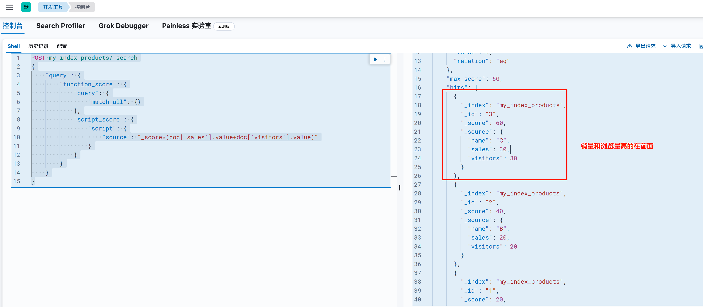

### 2.5 查询后二次打分（rescore_query）

在 Elasticsearch 的搜索场景中，有时候默认的查询结果排序并不能完全满足业务需求。例如，在电商搜索中，除了考虑商品与搜索关键词的匹配度，还希望将热门商品、促销商品等因素纳入排序考量；在文档搜索中，可能需要根据文档的时效性、重要性等对初始搜索结果进行调整。这时，`rescore_query` 就成为了优化搜索结果排序的得力工具。

二次评分，即重新计算查询所返回的结果文档中指定文档的得分，是 `rescore_query` 的核心功能。Elasticsearch 在执行查询时，会先按照默认的相关性算法计算所有文档的初始得分，并截取返回前 N 条结果。而 rescore_query 则允许我们使用预定义的二次评分方法，对这些初始结果中的部分文档重新计算得分，进而调整整体的结果排序。

之所以不对全部有序的结果集进行重新排序，是因为这将带来巨大的开销。想象一下，当索引中有海量文档时，对所有结果重新计算得分并排序会消耗大量的计算资源和时间。而 `rescore_query` 通过只处理结果集的子集，在保证一定精准度的同时，有效控制了性能损耗，这也是其在实际应用中备受青睐的原因。

**语法**：

```json
GET your_index/_search
{
    "query": {
        // 初始查询语句，用于获取初步结果集
        "match": {
            "your_field": "your_keyword"
        }
    },
    "rescore": {
        "query": {
            "rescore_query": {
                // 二次评分查询语句，定义重新计算得分的逻辑
                "match": {
                    "another_field": "another_keyword"
                }
            },
            "query_weight": 0.7,
            "rescore_query_weight": 1.2
        },
        "window_size": 50
    }
}
```

- **query**：初始查询部分，负责获取初步的搜索结果集。它可以是任何 Elasticsearch 支持的查询类型，如match、bool、term等。

- **rescore**：二次评分配置部分，核心参数如下：

  - `rescore_query`：用于定义二次评分的查询逻辑。通过这个查询，指定哪些文档需要重新计算得分。例如，在图书搜索中，可以使用 `rescore_query` 筛选出特定作者的图书，并重新计算其得分。

  - `query_weight`：初始查询得分的权重，取值范围通常为 0 到 1 之间。它决定了初始查询得分在最终得分中的重要程度。假设`query_weight` 为 0.7，意味着初始查询得分在最终得分中占比 70%。

  - `rescore_query_weight`：二次评分查询得分的权重，该值通常大于query_weight，以突出二次评分的影响。例如，`rescore_query_weight` 为 1.2，表示二次评分查询得分在最终得分中的占比更高，能够更显著地调整文档排序。

  - `window_size`：指定从分片结果中选取用于二次评分的文档数量。它就像是一个 “窗口”，Elasticsearch 只会对这个 “窗口” 内的文档重新计算得分。设置合适的 `window_size` 非常关键，值过小可能导致重要文档无法被重新评分，影响排序效果；值过大则会增加计算成本，降低查询性能。

**数据准备**：

```json
PUT my_index_books-demo/_bulk
{"index":{"_id":"1"}}
{"title":"ES实战","content":"ES的实战操作，实战要领，实战经验"}
{"index":{"_id":"2"}}
{"title":"MySQL实战","content":"MySQL的实战操作"}
{"index":{"_id":"3"}}
{"title":"MySQL","content":"MySQL一定要会"}
```

**初始查询**：

```json
GET my_index_books-demo/_search
{
    "query": {
        "match": {
            "content": "实战"
        }
    }
}
```

此时，Elasticsearch 会根据默认的相关性算法计算文档得分并排序，返回初步结果：

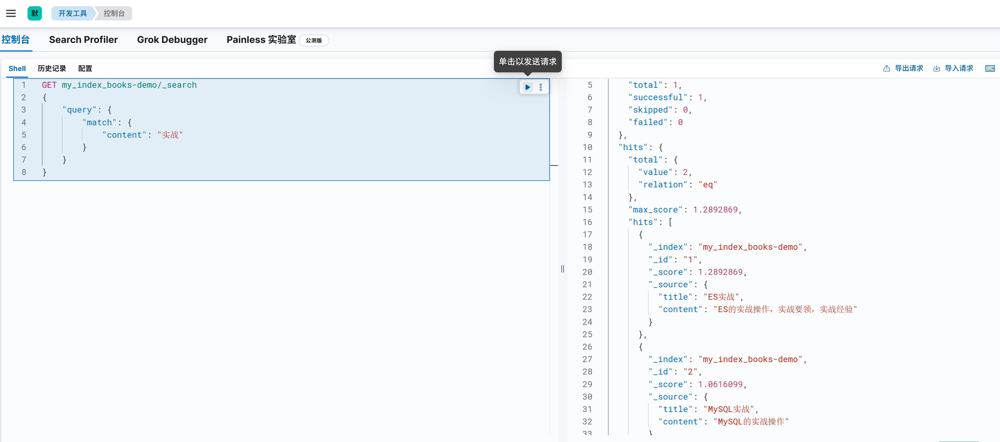

**二次评分查询**：

假设我们希望对上述查询结果进行优化：查询content字段中包含 “实战” 的文档，其初始查询得分权重设为 0.7；同时，对文档中title为 “MySQL” 的文档增加评分，二次评分查询得分权重设为 1.2，并且取分片结果的前 50 个文档进行重新算分。对应的查询语句如下：

```json
GET my_index_books-demo/_search
{
    "query": {
        "match": {
            "content": "实战"
        }
    },
    "rescore": {
        "query": {
            "rescore_query": {
                "match": {
                    "title": "MySQL"
                }
            },
            "query_weight": 0.7,
            "rescore_query_weight": 1.2
        },
        "window_size": 50
    }
}
```

## 三. 多字段搜索场景优化

多字段搜索的三种场景：

- 最佳字段(Best Fields) ： 多个字段中返回评分最高的

当字段之间相互竞争，又相互关联。例如，对于博客的 title 和 body这样的字段，评分来自最匹配字段

- 多数字段(Most Fields)：匹配多个字段，返回各个字段评分之和

处理英文内容时的一种常见的手段是，在主字段( English Analyzer)，抽取词干，加入同义词，以匹配更多的文档。相同的文本，加入子字段（Standard Analyzer），以提供更加精确的匹配。其他字段作为匹配文档提高相关度的信号，匹配字段越多则越好。

- 混合字段(Cross Fields)： 跨字段匹配，待查询内容在多个字段中都显示

对于某些实体，例如人名，地址，图书信息。需要在多个字段中确定信息，单个字段只能作为整体的一部分。希望在任何这些列出的字段中找到尽可能多的词。

### 3.1 数据准备

```json
DELETE /blogs

PUT /blogs/_doc/1
{
  "title": "Quick brown rabbits",
  "body": "Brown rabbits are commonly seen."
}

PUT /blogs/_doc/2
{
  "title": "Keeping pets healthy",
  "body": "My quick brown fox eats rabbits on a regular basis."
}
```

为了方便后续示例的演示，我们先创建一个 `blogs` 索引，里面有 `title` 和 `body` 字段，并为索引添加两条数据。

### 3.2 查询“棕色的狐狸”的博客

```json
POST /blogs/_search
{
  "query": {
    "bool": {
      "should": [
        {
          "match": {
            "title": "Brown fox"
          }
        },
        {
          "match": {
            "body": "Brown fox"
          }
        }
      ]
    }
  }
}
```

执行前，你们可以想象一下查询结果是啥样的，我想你可能会认为文档2排在最前面，因为文档2能够完全匹配我的搜索词“brown fox”，但实时并不是这样。

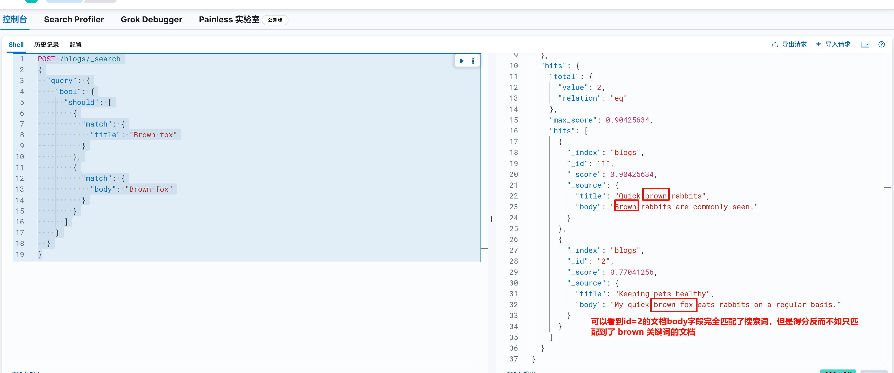

可以看到 `id=2` 的文档 `body` 字段完全匹配了所有搜索词（“brown fox”），但是得分反而不如只匹配到了 `brown` 关键词的文档。

这是因为 `bool should` 的评分机制导致的：`bool should` 会将所有匹配子句的评分**累加**，并乘以 `匹配子句数 / 总子句数`。

- 对于文档1：
  - `title` 匹配 `Brown`（评分部分匹配）。
  - `body` 匹配 `Brown`（评分部分匹配）。
  - **总分 = 两字段部分匹配的累加**。
- 对于文档2：
  - `body` 完全匹配 `Brown fox`（评分较高）。
  - `title` 未匹配。
  - **总分 = 仅 `body` 的评分**。

### 3.3 评分分析

评分计算过程，我们可以通过 `explain` 关键字看到详细的计算过程：

```json
POST /blogs/_search
{
  "explain": true,
  "query": {
    "bool": {
      "should": [
        {
          "match": {
            "title": "Brown fox"
          }
        },
        {
          "match": {
            "body": "Brown fox"
          }
        }
      ]
    }
  }
}
```

**文档一**：

1. 匹配词项

- **`title` 字段**：匹配 `brown`。
- **`body` 字段**：匹配 `brown`。

2. 评分计算

- **`title:brown` 的贡献**：
  - boost：2.2
  - **TF（词频得分）**：0.45454544。
  - **IDF**：0.6931472（`title` 字段中 `brown` 的全局稀缺性较高）。
  - **得分**：`2.2 * 0.45454544 * 0.6931472 ≈ 0.693`。
- **`body:brown` 的贡献**：
  - boost：2.2
  - **TF（词频得分）**：0.5263158
  - **IDF**：0.18232156（`body` 字段中 `brown` 的全局稀缺性较低）
  - **得分**：`2.2 * 0.5263158 * 0.18232156 ≈ 0.211`。

3. 总分

- **累加得分**：`0.693 (title) + 0.211 (body) = 0.904`。

**文档2**：

1. 匹配词项

- **`body` 字段**：匹配 `brown` 和 `fox`。

2. 评分计算

- **`body:brown` 的贡献**：
  - boost：2.2
  - **TF**： 0.40000004
  - **IDF**：0.18232156（与文档1相同）
  - **得分**：`2.2 * 0.40000004 * 0.18232156 ≈ 0.160`。
- **`body:fox` 的贡献**：
  - boost：2.2
  - **TF**：0.40000004。
  - **IDF**：0.6931472。
  - **得分**：`2.2 * 0.40000004 * 0.6931472 ≈ 0.610`。

3. 总分

- **累加得分**：`0.160 (brown) + 0.609 (fox) = 0.770`。

**因为文档1因两个字段都匹配 `Brown`，总分高于文档2的单个字段完全匹配。这不符合预期，一般的用户大多都希望优先展示完全匹配 `Brown fox` 的文档2**。

### 3.4 dis_max 查询

`dis_max`（Disjunction Max Query）是 Elasticsearch 中一种特殊的多字段查询，专门用于处理字段间存在竞争关系的搜索场景。下面我将从原理、语法、使用场景和实际案例等方面全面解析这个查询。

#### 3.4.1 什么是 `dis_max` 查询？

`dis_max`（Disjunction Max Query）意为"分离最大化查询"，它的核心特点是：

- 对多个子查询执行**逻辑或(OR)**操作，但只采用**得分最高的子查询**的评分作为主评分
- 其他匹配的子查询评分可以按比例(`tie_breaker`)加入总分。

语法：

```json
{
  "query": {
    "dis_max": {
      "queries": [
        { "match": { "title": "quick brown fox" }},
        { "match": { "content": "quick brown fox" }}
      ],
      "tie_breaker": 0.3
    }
  }
}
```

|     参数      |                             说明                             |
| :-----------: | :----------------------------------------------------------: |
|   `queries`   |                    包含多个查询条件的数组                    |
| `tie_breaker` | 浮点数，取值范围 0~1，默认 0.0。改参数用于控制非最高评分子查询对总分的贡献比例 |

评分公式：

```
最终得分 = max(子查询得分) + tie_breaker * sum(其他子查询得分)
```

#### 3.4.2 示例

针对上面查询“棕色的狐狸”的案例中使用 `should` 查询反应出来的问题，我们可以通过 `dis_max` 查询来优化：

```json
POST /blogs/_search
{
  "query": {
    "dis_max": {
      "queries": [
        {
          "match": {
            "title": "Brown fox"
          }
        },
        {
          "match": {
            "body": "Brown fox"
          }
        }
      ]
    }
  }
}
```

默认情况下，`tie_breaker` 参数为 0，也就意味着只有得分最高的查询子句参与得分，这样就能得到另我们满意的结果：

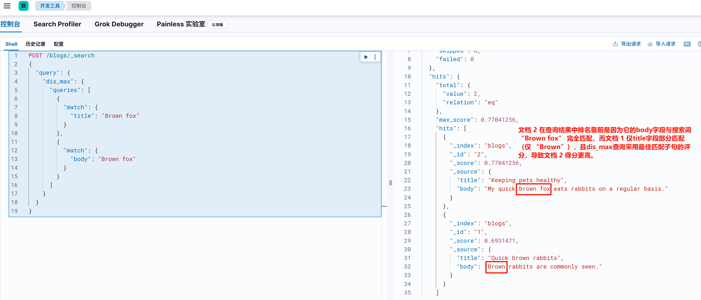

你以为使用了 `dis_max` 查询就能高枕无忧了，我们看看下面这个例子：

```json
POST /blogs/_search
{
  "query": {
    "dis_max": {
      "queries": [
        { "match": { "title": "Quick pets" }},
        { "match": { "body": "Quick pets" }}
      ]
    }
  }
}
```

我们尝试查询 `Quick pets` 关键字，文档1中只能在 `title` 中匹配到 `quick`，而文档2可以在 `title` 中匹配到 `pets`，在 `body` 中匹配到 `quick`，所以我们更愿意将文档二排在前面，但是实际上，由于我们没有指定 `tie_breaker` (代表 `tie_breaker=0`)，这也就意味着只有最高分子查询参与算分，所以两个文档，都只有 `title` 字段子查询参与算分，最终两个文档得分一致，ID小的文档排前面，与我们的预期不一致：

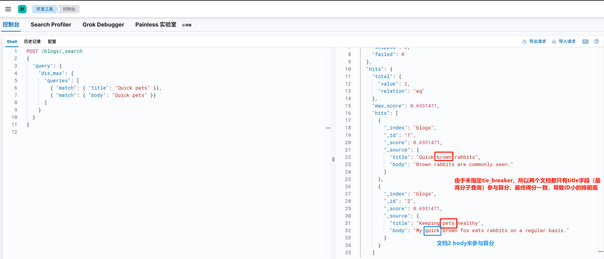

此时，我们调整 `tie_breaker` 的值，让最高分子查询以外的查询也参与一定的算分，即可解决问题：

```json
POST /blogs/_search
{
  "query": {
    "dis_max": {
      "queries": [
        { "match": { "title": "Quick pets" }},
        { "match": { "body": "Quick pets" }}
      ],
      "tie_breaker": 0.1
    }
  }
}
```

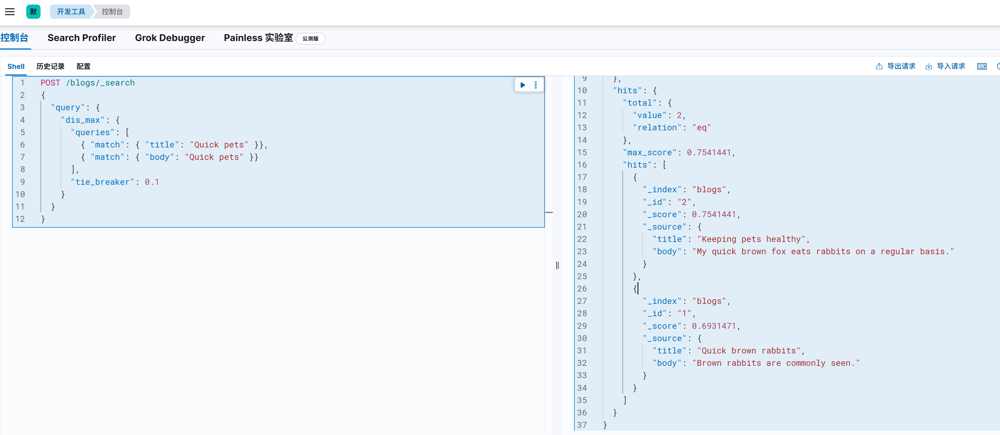

算分过程：

**文档一**：只有**`title:quick` 参与贡献**：0.6931471

**文档二**：

- **`title:pets` 参与贡献**：0.6931471
- **`body:quick` 参与贡献**：0.60996956
- 最终得分：`0.6931471+(0.60996956)*0.1 ≈ 0.754144`

### 3.5 best_fields 查询

#### 3.5.1 best_fields 介绍

`best_fields` 是 Elasticsearch 中 `multi_match` 查询的一种类型，主要用于在多个字段中搜索相同查询词时，优先返回匹配度最高的字段结果。与上一节介绍的`dis_max` 查询算分逻辑是一致的，事实上当使用`best_fields`时，Elasticsearch会将其转换为一个`dis_max`查询。

Best Fields是默认类型，可以不用指定，等价于dis_max查询方式：

```json
POST /blogs/_search
{
  "query": {
    "multi_match": {
      "type": "best_fields",
      "query": "Brown fox",
      "fields": ["title", "body"],
      "tie_breaker": 0.2
    }
  }
}
```

#### 3.5.2 与 `dis_max` 查询的区别

|      特性      |        best_fields         |             dis_max              |
| :------------: | :------------------------: | :------------------------------: |
|  **查询类型**  |   multi_match的一种类型    |           独立查询类型           |
| **语法简洁性** |   更简洁，自动处理多字段   |      需要显式写出所有子查询      |
|  **字段权重**  | 支持字段级boost(如title^3) |    需要在每个子查询中单独设置    |
|  **使用场景**  |    专门为多字段匹配优化    | **更通用，可用于任意子查询组合** |

那我们如何选择这两种查询呢？

- 当满足一下条件时，建议使用`best_fields`：
  - 需要在多个字段上搜索相同内容
  - 想要更简洁的语法
  - 需要方便的字段级boost
- 当满足一下条件时，使用`dis_max`：
  - 需要组合不同类型的子查询(如match + phrase)
  - 需要更精细的控制
  - 查询结构比较复杂

虽然`best_fields`查询本质上是通过`dis_max`实现的，但由于语法糖和特定优化，它们并不完全等价。**可以认为`best_fields`是`dis_max`在multi_match查询中的一种特化实现**，专为多字段文本搜索场景优化。

### 3.6 most_fields 查询

`most_fields` 是 `multi_match` 查询的另一种类型，专门为需要**综合多个字段匹配程度**的场景设计。其核心特征是：

1. **评分累加机制**：将所有匹配字段的评分累计得到最终评分
2. **权重放大作用**：适合通过多字段叠加相关性信号
3. 典型应用场景：
   - 主字段（包含词干扩展）+ 子字段（精确匹配）的组合
   - 希望强化跨字段匹配的综合相关性

most_fields策略获取全部匹配字段的累计得分（综合全部匹配字段的得分），等价于bool should查询方式。

前面我们介绍了基于 `bool should` 多字段查询：
```json
POST /blogs/_search
{
  "query": {
    "bool": {
      "should": [
        {
          "match": {
            "title": "Brown fox"
          }
        },
        {
          "match": {
            "body": "Brown fox"
          }
        }
      ]
    }
  }
}
```

可以等价于 `most_fields` 查询：

```json
POST /blogs/_search
{
  "query": {
    "multi_match": {
      "type": "most_fields",
      "fields": ["title","body"],
      "query": "Brown fox"
    }
  }
}
```

### 3.7 cross_fields 查询

#### 3.7.1 核心概念

`cross_fields` 是 `multi_match` 查询的一种类型，专为**跨字段联合匹配**场景设计。其核心特点是：

- **字段融合**：将多个字段视为一个逻辑上的大字段
- **统一统计**：合并所有字段的**词项统计信息**（如IDF）
- **强制覆盖**：要求查询词中的**每个词项**必须出现在**至少一个字段**中

#### 3.7.2 适用场景

典型使用场景包括：

|    场景类型    |          示例          |         字段示例         |
| :------------: | :--------------------: | :----------------------: |
|  **人名搜索**  |      "John Smith"      |  first_name, last_name   |
|  **地址搜索**  | "123 Main St, Boston"  |   street, city, state    |
|  **产品信息**  | "iPhone 13 Pro 256GB"  | name, specs, description |
| **跨字段实体** | "ISBN 978-7-01-019..." |   isbn, title, author    |

#### 3.7.3 查询语法详解

```json
POST /_search
{
  "query": {
    "multi_match": {
      "query": "search text",
      "type": "cross_fields",
      "fields": ["field1", "field2^3"], // 支持字段权重
      "operator": "and",                // 默认为or
      "minimum_should_match": "75%",    // 覆盖参数
      "tie_breaker": 0.3                // 非主要参数
    }
  }
}
```

关键参数解析：

- operator：
  - `or`（默认）：任意词项匹配即可
  - `and`：要求所有词项必须匹配
- minimum_should_match：
  - 控制最少需要匹配的词项比例
  - 示例：`"75%"` 表示在4个词项中至少匹配3个
- analyzer：
  - 可指定统一的分析器覆盖字段原有设置

#### 3.7.5 案例

```json
DELETE /address
PUT /address
{
  "settings": {
    "index": {
      "analysis.analyzer.default.type": "ik_max_word"
    }
  }
}


PUT /address/_bulk
{"index": { "_id": "1"} }{"province": "湖南","city": "长沙"}{ "index": { "_id": "2"} }{"province": "湖南","city": "常德"}{ "index": { "_id": "3"} }{"province": "广东","city": "广州"}{ "index": { "_id": "4"} }{"province": "湖南","city": "邵阳"}


#使用 most_fields 的方式结果不符合预期，会将湖南其它城市查询出来，不支持 operator
GET /address/_search
{
  "query": {
    "multi_match": {
      "query": "湖南常德",
      "type": "most_fields",
      "fields": [
        "province",
        "city"
      ]
    }
  }
}


#与 copy_to 相比，其中一个优势就是它可以在搜索时为单个字段提升权重。
GET /address/_search
{
  "query": {
    "multi_match": {
      "query": "湖南常德",
      "type": "cross_fields",
      "operator": "and",
      "fields": [
        "province",
        "city"
      ]
    }
  }
}
```

也可以使用copy_to完成类似效果：

```json
DELETE /address

PUT /address
{
  "mappings": {
    "properties": {
      "province": {
        "type": "keyword",
        "copy_to": "full_address"
      },
      "city": {
        "type": "text",
        "copy_to": "full_address"
      }
    }
  },
  "settings": {
    "index": {
      "analysis.analyzer.default.type": "ik_max_word"
    }
  }
}

PUT /address/_bulk
{"index": { "_id": "1"} }
{"province": "湖南","city": "长沙"}
{ "index": { "_id": "2"} }
{"province": "湖南","city": "常德"}
{ "index": { "_id": "3"} }
{"province": "广东","city": "广州"}
{ "index": { "_id": "4"} }
{"province": "湖南","city": "邵阳"}

GET /address/_search
{
  "query": {
    "match": {
      "full_address": {
        "query": "湖南常德",
        "operator": "and"
      }
    }
  }
}
```

### 3.8 三种查询类型的区别

|    查询类型    |         评分策略         | 字段关系 |       典型用例       |
| :------------: | :----------------------: | :------: | :------------------: |
| `best_fields`  |      取最高字段得分      | 竞争关系 |   博客标题 vs 正文   |
| `most_fields`  |     累加所有字段得分     | 互补关系 |  主字段+子字段组合   |
| `cross_fields` | 合并字段统计计算综合得分 | 协同关系 | 姓名、地址等分散信息 |

#### 
