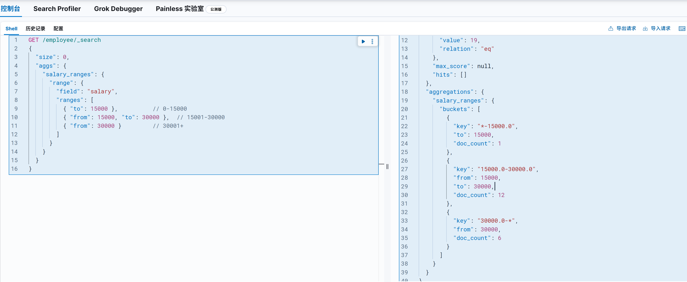

# Elasticsearch聚合查询

## 一. 概述

Elasticsearch除搜索以外，提供了针对ES 数据进行统计分析的功能。[聚合(aggregations)](https://www.elastic.co/guide/en/elasticsearch/reference/current/search-aggregations.html)可以让我们极其方便的实现对数据的统计、分析、运算。例如：

- 什么品牌的手机最受欢迎？

- 这些手机的平均价格、最高价格、最低价格？
- 这些手机每月的销售情况如何？

### 1.1 聚合的基本语法

聚合查询的语法结构与其他查询相似，通常包含以下部分：

1. **查询条件**：指定需要聚合的文档，可使用标准的 Elasticsearch 查询语法，如 `term`、`match`、`range` 等。
2. **聚合函数**：指定要执行的聚合操作，如 `sum`、`avg`、`min`、`max`、`terms`、`date_histogram` 等，每个聚合命令都会生成一个聚合结果。
3. **聚合嵌套**：聚合命令可以嵌套，以便更细粒度地分析数据。

```json
GET <index_name>/_search
{
  "aggs": {
    "<aggs_name>": { // 聚合名称需要自己定义
      "<agg_type>": {
        "field": "<field_name>"
      }
    }
  }
}
```

字段说明：

| 字段名       | 说明                                                         |
| ------------ | ------------------------------------------------------------ |
| `aggs_name`  | 聚合函数的名称，需自定义。                                   |
| `agg_type`   | 聚合种类，如桶聚合（`terms`）、指标聚合（`avg`、`sum`、`min`、`max` 等）。 |
| `field_name` | 参与聚合的字段名称（域名）。                                 |

### 1.2 聚合分类

- Metric Aggregation（指标聚合）：一些数学运算，可以对文档字段进行统计分析，类比 MySQL 中的 `min()`、`max()`、`sum()` 操作。

```json
# SELECT MIN(price), MAX(price) FROM products
# Metric聚合的DSL类比实现
GET products/_search
{
  "aggs": {
    "min_price": {
      "min": {
        "field": "price"
      }
    },
        "max_price": {
      "max": {
        "field": "price"
      }
    }
  }
}
```

- Bucket Aggregation（桶聚合）： 一些满足特定条件的文档的集合放置到一个桶里，每一个桶关联一个key，类比 `MySQL` 中的 `group by` 操作。

```json
# SELECT COUNT(*) FROM products GROUP BY category 
# Metric聚合的DSL类比实现 
GET products/_search
{
  "size": 0,
  "aggs": {
    "by_category": {
      "terms": {
        "field": "category.keyword"
      }
    }
  }
}
```

- Pipeline Aggregation：对其他的聚合结果进行二次聚合。

### 1.3 数据准备

```json
DELETE /employee

# 创建索引
PUT /employee
{
    "mappings": {
        "properties": {
            "age": {
                "type": "integer"
            },
            "gender": {
                "type": "keyword"
            },
            "job": {
                "type": "text",
                "fields": {
                    "keyword": {
                        "type": "keyword",
                        "ignore_above": 50
                    }
                }
            },
            "name": {
                "type": "keyword"
            },
            "salary": {
                "type": "integer"
            }
        }
    }
}

# 写入数据
PUT /employee/_bulk
{ "index" : { "_id" : "1" } }
{ "name" : "Emma","age":32,"job":"Product Manager","gender":"female","salary":35000 }
{ "index" : { "_id" : "2" } }
{ "name" : "Underwood","age":41,"job":"Dev Manager","gender":"male","salary": 50000}
{ "index" : { "_id" : "3" } }
{ "name" : "Tran","age":25,"job":"Web Designer","gender":"male","salary":18000 }
{ "index" : { "_id" : "4" } }
{ "name" : "Rivera","age":26,"job":"Web Designer","gender":"female","salary": 22000}
{ "index" : { "_id" : "5" } }
{ "name" : "Rose","age":25,"job":"QA","gender":"female","salary":18000 }
{ "index" : { "_id" : "6" } }
{ "name" : "Lucy","age":31,"job":"QA","gender":"female","salary": 25000}
{ "index" : { "_id" : "7" } }
{ "name" : "Byrd","age":27,"job":"QA","gender":"male","salary":20000 }
{ "index" : { "_id" : "8" } }
{ "name" : "Foster","age":27,"job":"Java Programmer","gender":"male","salary": 20000}
{ "index" : { "_id" : "9" } }
{ "name" : "Gregory","age":32,"job":"Java Programmer","gender":"male","salary":22000 }
{ "index" : { "_id" : "10" } }
{ "name" : "Bryant","age":20,"job":"Java Programmer","gender":"male","salary": 9000}
{ "index" : { "_id" : "11" } }
{ "name" : "Jenny","age":36,"job":"Java Programmer","gender":"female","salary":38000 }
{ "index" : { "_id" : "12" } }
{ "name" : "Mcdonald","age":31,"job":"Java Programmer","gender":"male","salary": 32000}
{ "index" : { "_id" : "13" } }
{ "name" : "Jonthna","age":30,"job":"Java Programmer","gender":"female","salary":30000}
{ "index" : { "_id" : "14" } }
{ "name" : "Marshall","age":32,"job":"Javascript Programmer","gender":"male","salary": 25000}
{ "index" : { "_id" : "15" } }
{ "name" : "King","age":33,"job":"Java Programmer","gender":"male","salary":28000 }
{ "index" : { "_id" : "16" } }
{ "name" : "Mccarthy","age":21,"job":"Javascript Programmer","gender":"male","salary": 16000}
{ "index" : { "_id" : "17" } }
{ "name" : "Goodwin","age":25,"job":"Javascript Programmer","gender":"male","salary": 16000}
{ "index" : { "_id" : "18" } }
{ "name" : "Catherine","age":29,"job":"Javascript Programmer","gender":"female","salary": 20000}
{ "index" : { "_id" : "19" } }
{ "name" : "Boone","age":30,"job":"DBA","gender":"male","salary": 30000}
{ "index" : { "_id" : "20" } }
{ "name" : "Kathy","age":29,"job":"DBA","gender":"female","salary": 20000}
```

## 二. 指标聚合

**作用**：对数值型字段进行统计计算，输出单个或多个指标结果（如平均值、总和、最大值、最小值等）。
**核心功能**：

1. 基础统计指标（单值分析：只输出一个结果）
   - **`avg`**：计算平均值（如商品价格的平均值）。
   - **`sum`**：计算总和（如订单金额的总和）。
   - **`min/max`**：获取最小值 / 最大值（如库存的最小值、用户年龄的最大值）。
   - **`value_count`**：统计非空值的数量（如有效订单的数量）。
   - **`cardinality`**：计算去重后的唯一值数量（如统计活跃用户数）。

2. 高级统计指标（多值分析：输出多个分析结果）

   - **`states`**：用于一次性计算某个字段的多项统计指标（如计数、最小值、最大值、平均值和总和）
   - **`extended_stats`**：返回扩展统计信息（包括方差、标准差等）。

   - **`percentile`**：计算百分位数（如响应时间的 95% 分位数）。
   - **`percentile_ranks`**：计算某个**具体数值在数据中的百分位排名**，即该数值小于等于多少比例的数据（例如薪资 20000 的百分位排名是 50%，表示 50% 的数据 ≤20000）。

### 2.1 基础统计指标

#### 2.1.1 查询员工的最高最低平均薪资

如果是在关系型数据库，我们会通过下列SQL查询数据：
```sql
-- 查询最高薪资、最低薪资、平均薪资（直接计算所有员工）
SELECT
  MAX(salary) AS max_salary,    -- 最高工资
  MIN(salary) AS min_salary,    -- 最低工资
  AVG(salary) AS avg_salary     -- 平均工资
FROM employee;
```

在ES中我们同样也能通过聚合实现：

```json
GET /employee/_search
{
  "size": 0, //如果仅仅是想查询聚合后的结构，这里需要将size置为0，代表不返回数据项，只返回聚合结果。
  "aggs": {
    "min_salary": {
      "min": {
        "field": "salary"
      }
    },
    "max_salary": {
      "max": {
        "field": "salary"
      }
    },
    "avg_salary": {
      "avg": {
        "field": "salary"
      }
    }
  }
}
```

查询结果：


#### 2.1.2 查询年龄20至30岁员工的最高最低以及平均薪资

关系型数据库，我们只需要加入where条件即可：

```sql
-- 查询年龄20至30岁员工的最高最低以及平均薪资
SELECT
  MAX(salary) AS max_salary,    -- 最高工资
  MIN(salary) AS min_salary,    -- 最低工资
  AVG(salary) AS avg_salary     -- 平均工资
FROM employee
WHERE age>=20 AND age<=30;
```

ES中我们在执行聚合操作时，同样可以使用筛选项：
```json
GET /employee/_search
{
  "size": 0,//如果仅仅是想查询聚合后的结构，这里需要将size置为0，代表不返回数据项，只返回聚合结果。
  "aggs": {
    "min_salary": {
      "min": {
        "field": "salary"
      }
    },
    "max_salary": {
      "max": {
        "field": "salary"
      }
    },
    "avg_salary": {
      "avg": {
        "field": "salary"
      }
    }
  },
  "query": {
    "range": {
      "age": {
        "gte": 20,  // 大于等于20
        "lte": 30   // 小于等于30
      }
    }
  }
}
```

### 2.2 高级统计指标

#### 2.2.1 states

**作用**

一次性计算某个字段的 **基础统计指标**，包括计数、最小值、最大值、平均值和总和。

**核心参数**

- **`field`**：需统计的数值型字段（如 `salary`、`age`）。
- **`missing`**：处理缺失值（默认忽略 `null`，可指定默认值）。

**案例：统计员工薪资的基础指标**

```json
GET /employee/_search
{
  "size": 0,  // 不返回文档，只返回聚合结果
  "aggs": {
    "salary_stats": {
      "stats": {
        "field": "salary"
      }
    }
  }
}
```

查询结果：


#### 2.2.2 **extended_stats** 

**作用**

在 `stats` 的基础上，额外返回 **方差、标准差、平方和、平均值标准误差** 等更高级的统计指标，适合深入分析数据分布。

**核心参数**

同 `stats`，但返回更多指标。

**案例：统计员工薪资的扩展指标**

```json
GET /employees/_search
{
  "size": 0,
  "aggs": {
    "salary_extended_stats": {
      "extended_stats": {
        "field": "salary"
      }
    }
  }
}
```

查询结果示例：

```json
{
  "aggregations": {
    "salary_extended_stats": {
      "count": 20,           // 有效记录数
      "min": 9000.0,         // 最小值
      "max": 50000.0,        // 最大值
      "avg": 25350.0,        // 平均值
      "sum": 507000.0,       // 总和
      "sum_of_squares": 1.58235e+10,  // 平方和
      "variance": 1.0334775e+08,      // 方差
      "std_deviation": 10165.911111111,  // 标准差
      "std_deviation_bounds": {       // 标准差边界（用于估算数据分布）
        "upper": 45681.822222222,     // 上限：avg + std_dev
        "lower": 5018.1777777778      // 下限：avg - std_dev
      }
    }
  }
}
```

#### 2.2.3 percentiles

如果我需要分别查询50%、75%、90%的员工薪资都在什么水平，就可以使用到 `percentiles` 查询。

计算指定字段（如薪资）的**百分位数值**，即返回某个百分比位置的值（例如第 50 百分位是中位数）。

```json
GET /employee/_search
{
  "size": 0,
  "aggs": {
    "percentile_salary": {
      "percentiles": {
        "field": "salary",       // 目标字段（薪资）
        "percents": [50, 75, 90] // 需计算的百分位（如 50%、75%、90%）
      }
    }
  }
}
```

结果如下：


#### 2.2.4 percentile_ranks

percentile_ranks用于计算某个**具体数值在数据中的百分位排名**，即该数值小于等于多少比例的数据（例如薪资 20000 的百分位排名是 50%，表示 50% 的数据 ≤20000）。

例如我们如果需要计算 20000 和 30000 薪资，分别超过了多少百分比的人，就可以使用如下查询：

```json
GET /employee/_search
{
  "size": 0,
  "aggs": {
    "percentile_rank_salary": {
      "percentile_ranks": {
        "field": "salary",       // 目标字段（薪资）
        "values": [20000, 30000] // 需计算排名的具体薪资值
      }
    }
  }
}
```

结果如下：


需要注意的是 `percentile_ranks` 查询有一定限制：

1. **数据类型**
   字段需为数值型（如 `integer`、`double`），示例中 `salary` 是 `integer`，符合要求。

2. **精度控制**

   - ES 默认使用 `TDigest` 算法计算百分位，可通过 `compression` 参数调整精度（数值越小精度越高，默认 100）：

     ```json
     "percentiles": {
       "field": "salary",
       "compression": 50 // 提高精度（牺牲内存）
     }
     ```

3. **过滤条件**
   若需先过滤数据（如年龄范围），可通过 `query` 或 `filter` 子句实现。

## 三. 桶聚合

在 Elasticsearch（ES）中，**桶聚合（Bucket Aggregations）** 是一种强大的数据分组机制，用于将文档根据特定规则划分到不同的 “桶” 中，类似于 SQL 中的 `GROUP BY` 子句。每个桶相当于一个文档集合，后续可对桶内文档进行统计分析。以下是详细讲解：

### 3.1 核心概念

**桶（Bucket）**

- 满足特定条件的文档集合（如 “年龄在 20-30 岁的员工”、“职位为 Java 程序员的员工”）。
- 桶聚合会为每个符合条件的桶生成一个文档计数（`doc_count`）。

**指标（Metric）**

- 对桶内文档进行统计计算（如计算平均工资、最大年龄）。
- 桶聚合常与 **指标聚合（如 `avg`、`sum`）** 嵌套使用。

### 3.2 常见的桶聚合类型

#### 3.2.1 **Terms 聚合：按字段值分组**

**案例：按职位（`job`）统计员工数量**

```json
GET /employee/_search
{
  "size": 0,
  "aggs": {
    "jobs": {
      "terms": {
        "field": "job.keyword",  // 使用 keyword 类型避免分词
        "size": 10               // 返回前 10 个桶（默认）
      }
    }
  }
}
```

查询结果：


#### 3.2.2  Range 聚合：按数值范围分组

将文档按数值字段的范围分组（如年龄区间、价格区间）。

**案例：按薪资范围统计员工数量**

```json
GET /employee/_search
{
  "size": 0,
  "aggs": {
    "salary_ranges": {
      "range": {
        "field": "salary",
        "ranges": [
          { "to": 15000 },          // 0-15000
          { "from": 15000, "to": 30000 },  // 15001-30000
          { "from": 30000 }         // 30001+
        ]
      }
    }
  }
}
```

查询结果：



#### 3.2.3  **Date Range 聚合：按日期范围分组**

与 `range` 类似，但专门用于日期字段（如按月份、季度分组）。

**案例：按入职日期统计员工数量**

```json
GET /employees/_search
{
  "size": 0,
  "aggs": {
    "hire_date_ranges": {
      "date_range": {
        "field": "hire_date",
        "format": "yyyy-MM",  // 返回日期格式
        "ranges": [
          { "from": "2022-01-01", "to": "2022-12-31" },  // 2022年
          { "from": "2023-01-01" }                         // 2023年至今
        ]
      }
    }
  }
}
```

#### 2.3.5 **Histogram 聚合：按固定间隔分组**

**作用**

将数值型字段（如薪资、年龄）按指定的 **固定间隔（interval）** 分组，统计每组的文档数量或其他聚合指标。

**核心参数**

- **`field`**：需分组的数值字段（如 `salary`、`age`）。
- **`interval`**：分组间隔（如 `10000` 表示每 10000 为一组）。
- **`min_doc_count`**：允许空桶显示（默认 `0` 显示，`1` 不显示）。
- **`extended_bounds`**：强制包含指定范围的桶（即使无数据）。

**案例：按薪资区间统计员工数量**

假设需将员工按薪资分为 `0-10000`、`10001-20000`、`20001-30000` 等区间：

```json
GET /employee/_search
{
  "size": 0,
  "aggs": {
    "salary_groups": {
      "histogram": {
        "field": "salary",
        "interval": 10000,     // 每 10000 为一个区间
        "min_doc_count": 0,    // 显示空桶
        "extended_bounds": {  // 强制包含 0-50000 的桶
          "min": 0,
          "max": 50000
        }
      }
    }
  }
}
```

查询结果：


#### 2.3.6 **Date Histogram 聚合：按时间间隔分组**

**作用**

将日期字段（如 `create_time`、`birth_date`）按 **时间单位（如天、周、月）** 分组，常用于时序数据分析（如流量趋势、销售统计）。

**核心参数**

- **`field`**：需分组的日期字段（如 `create_date`）。
- **`calendar_interval`**：时间间隔（如 `day`、`week`、`month`、`quarter`、`year`）。
- **`fixed_interval`**：固定时间间隔（如 `1h`、`30m`），不随月份 / 年份变化。
- **`format`**：返回时间的格式（如 `yyyy-MM-dd`）。
- **`min_doc_count`**：同 `histogram`。

**案例：按入职月份统计员工数量**

假设员工索引包含 `hire_date` 字段（格式为 `2023-01-15`），需统计每月入职人数：

```json
GET /employee/_search
{
  "size": 0,
  "aggs": {
    "monthly_hires": {
      "date_histogram": {
        "field": "hire_date",
        "calendar_interval": "month",  // 按月份分组
        "format": "yyyy-MM",           // 返回格式
        "min_doc_count": 0,            // 显示空月份
        "extended_bounds": {           // 强制包含 2023 年全年
          "min": "2023-01-01",
          "max": "2023-12-31"
        }
      }
    }
  }
}
```

**返回结果示例**

```json
{
  "aggregations": {
    "monthly_hires": {
      "buckets": [
        { "key_as_string": "2023-01", "doc_count": 3 },  // 1月：3人
        { "key_as_string": "2023-02", "doc_count": 0 },  // 2月：0人（空桶）
        { "key_as_string": "2023-03", "doc_count": 5 },  // 3月：5人
        // ... 其他月份
      ]
    }
  }
}
```

### 3.3 嵌套聚合

#### 3.3.1 案例一：按照工作类型分桶，并统计工资信息

```json
POST employee/_search
{
  "size": 0,
  "aggs": {
    "Job_salary_stats": {
      "terms": {
        "field": "job.keyword"
      },
      "aggs": {
        "salary": {
          "stats": {
            "field": "salary"
          }
        }
      }
    }
  }
}
```

查询结果：


#### 3.3.2 案例二：根据工作类型分桶，然后按照性别分桶，计算工资的统计信息

```json
POST employee/_search
{
  "size": 0,
  "aggs": {
    "Job_gender_stats": {
      "terms": {
        "field": "job.keyword"
      },
      "aggs": {
        "gender_stats": {
          "terms": {
            "field": "gender"
          },
          "aggs": {
            "salary_stats": {
              "stats": {
                "field": "salary"
              }
            }
          }
        }
      }
    }
  }
}
```

查询结果：


## 四. 管道聚合

在 Elasticsearch（ES）中，**管道聚合（Pipeline Aggregations）** 是一种特殊的聚合类型，它不直接处理文档数据，而是对**其他聚合的结果进行二次计算**，常用于生成衍生指标（如差值、增长率、累计和等）。以下是详细讲解：

### 4.1 核心概念

**管道聚合的特点**

- **输入源**：基于其他聚合的输出结果（称为 “父聚合”）。
- **输出结果**：作为新的指标嵌入到父聚合的响应中。
- **应用场景**：时间序列分析、趋势计算、对比分析等。

**常见管道聚合类型**

- **兄弟管道（Sibling Pipeline）**：与父聚合同级，生成新的独立指标。
- **子管道（Child Pipeline）**：嵌套在父聚合内部，修改父聚合的桶。

### 4.2 兄弟管道聚合

生成与父聚合同级的新指标，常用于计算统计值（如总和、平均值、最大值等）。

#### 4.2.1 **stats_bucket 聚合：计算桶的统计指标**

计算父聚合中所有桶的统计信息（如计数、最小值、最大值、平均值、总和）。

**案例：统计各职位的平均薪资，并计算所有职位的总平均薪资**

```json
GET /employee/_search
{
  "size": 0,
  "aggs": {
    "jobs": {
      "terms": {
        "field": "job.keyword"
      },
      "aggs": {
        "avg_salary": { "avg": { "field": "salary" } }  // 各职位平均薪资
      }
    },
    "global_avg_salary": {  // 所有职位的总平均薪资
      "stats_bucket": {
        "buckets_path": "jobs>avg_salary"  // 指向父聚合路径
      }
    }
  }
}
```

查询结果示例：

```json
{
  "aggregations": {
    "jobs": {
      "buckets": [
        { "key": "Java Programmer", "doc_count": 7, "avg_salary": { "value": 25000 } },
        { "key": "QA", "doc_count": 4, "avg_salary": { "value": 21000 } },
        // ...其他职位
      ]
    },
    "global_avg_salary": {  // 新增的兄弟指标
      "count": 5,
      "min": 18000,
      "max": 35000,
      "avg": 23800,
      "sum": 119000
    }
  }
}
```

#### 4.2.2 **avg_bucket 聚合：计算桶的平均值**

简化版的 `stats_bucket`，仅计算平均值。

**案例：计算各部门平均薪资的全局平均值**

```json
"aggs": {
  "departments": {
    "terms": { "field": "department.keyword" },//按照department分组
    "aggs": { "dept_avg_salary": { "avg": { "field": "salary" } } }// 分组后，根据salary字段求平均值
  },
  "global_avg": {  // 所有部门平均薪资的平均值
    "avg_bucket": {
      "buckets_path": "departments>dept_avg_salary"
    }
  }
}
```

#### 4.2.3 **max_bucket/min_bucket/sum_bucket 聚合**

分别计算桶的最大值、最小值和总和。

#### 4.2.4 percentiles_bucket 聚合：父聚合中多个桶的百分位数

**作用**

计算一组桶（如时间序列中的多个时间点）的 **百分位数值**，例如：

- 计算过去 12 个月销售额的第 95 百分位（即 95% 的月份销售额低于该值）。
- 统计不同部门薪资的中位数（第 50 百分位）。

**与 `percentiles` 聚合的区别**

- **`percentiles`**：直接基于文档字段值计算百分位数（如统计所有员工的薪资百分位）。
- **`percentiles_bucket`**：基于其他聚合的结果（如各部门的平均薪资）计算百分位数。

**案例：统计各职位平均工资的百分位数**

```json
# 各岗位平均工资的百分位数
POST employee/_search
{
  "size": 0,
  "aggs": {
    "jobs": {
      "terms": {
        "field": "job.keyword",
        "size": 10
      },
      "aggs": {
        "avg_salary": {
          "avg": {
            "field": "salary"
          }
        }
      }
    },
    "percentiles_salary_by_job": {
      "percentiles_bucket": {
        "buckets_path": "jobs>avg_salary"
      }
    }
  }
}
```


### 4.3 子管道聚合

嵌套在父聚合内部，修改桶的内容（如添加新字段、替换原有字段）。

#### 4.3.1 **derivative 聚合：计算相邻桶的差值（导数）**

常用于分析增长率或变化趋势（如每日销量的环比变化）。

**案例：计算每月薪资总和的环比增长**

```json
GET /employee/_search
{
  "size": 0,
  "aggs": {
    "monthly_salary": {
      "date_histogram": {
        "field": "hire_date", //前面给的employee没有hire_date字段，此处只做查询示例
        "calendar_interval": "month"
      },
      "aggs": {
        "total_salary": { "sum": { "field": "salary" } },
        "salary_growth": {  // 环比增长
          "derivative": {
            "buckets_path": "total_salary"
          }
        }
      }
    }
  }
}
```

**返回结果示例**：

```json
{
  "aggregations": {
    "monthly_salary": {
      "buckets": [
        {
          "key_as_string": "2023-01-01",
          "doc_count": 3,
          "total_salary": { "value": 100000 },
          "salary_growth": { "value": null }  // 第一个月无增长
        },
        {
          "key_as_string": "2023-02-01",
          "doc_count": 5,
          "total_salary": { "value": 120000 },
          "salary_growth": { "value": 20000 }  // 增长 20000
        }
      ]
    }
  }
}
```

#### 4.3.2 cumulative_sum 聚合：计算累计和

常用于生成累计数据（如累计销售额、累计用户数)

案例：按年龄（以 1 为间隔）分组计算员工的平均工资，并对每个年龄组的平均工资进行累计求和，最终展示不同年龄的平均工资及其累计值。

```json
POST employee/_search
{
  "size": 0,
  "aggs": {
    "age": {
      "histogram": {
        "field": "age",
        "min_doc_count": 0,
        "interval": 1
      },
      "aggs": {
        "avg_salary": {
          "avg": {
            "field": "salary"
          }
        },
        "cumulative_salary": {
          "cumulative_sum": {
            "buckets_path": "avg_salary"
          }
        }
      }
    }
  }
}
```

在这个查询中，**累计值（`cumulative_sum`）** 指的是 **按年龄从小到大排序后，每个年龄组的平均工资不断累加的结果**。例如：

- 年龄 20 岁组的平均工资是 5000 元，累计值为 5000 元。
- 年龄 21 岁组的平均工资是 6000 元，累计值为 5000 + 6000 = 11000 元。
- 年龄 22 岁组的平均工资是 7000 元，累计值为 11000 + 7000 = 18000 元。
- 以此类推，直到所有年龄组计算完毕。

| 年龄 | 平均工资（当前组） | 累计工资（到当前组为止） |
| ---- | ------------------ | ------------------------ |
| 20   | 5000               | 5000                     |
| 21   | 6000               | 11000（5000+6000）       |
| 22   | 7000               | 18000（11000+7000）      |
| 23   | 5500               | 23500（18000+5500）      |

## 五. 聚合不精确的原因

ES 在聚合的时候发生了一个奇怪的现象，聚合的语句里面size设置为5和10聚合的数量不一致，这个size不就是返回的条数吗？会影响统计结果吗？

```jsx
{
  "aggs": {
    "topcount": {
      "terms": {
        "field": "xx",
        "size": 10
      }
    }
  }
}
```

就是这个 size，设置 5 和 10 将可能会导致聚合结果不一样。

**结论：Elasticsearch terms 分桶聚合结果是不精确的**

### 5.1 Elasticsearch 如何检索/聚合数据

接收客户端请求的节点为：协调节点。如下图中的节点 1 。在协调节点，搜索任务被分解成两个阶段：query 和 fetch 。真正搜索或者聚合任务的节点称为：数据节点。如下图中的：节点 2、3、4。


聚合步骤：

1. 客户端发送请求到协调节点。
2. 协调节点将请求推送到各数据节点。
3. 各数据节点指定分片参与数据汇集工作。
4. 协调节点进行总结果汇集。

### 5.2 为什么聚合结果不精确

假设现在有一个3个节点，3个主分片，每个分片有5个产品的数据的集群，用户期望返回Top3结果如下：

```jsx
产品X：40
产品A：40
产品Y：35
```

用户执行如下 terms 聚合，期望返回集群 prodcuts 索引Top3 结果：

```jsx
POST products/_search
{
  "size":0,
  "aggs": {
    "product_aggs": {
      "terms": {
        "field":"name.keyword"，
        "size":3
      }
    }
  }
}
```

这就产生了实际聚合结果和预期聚合结果不一致，也就是聚合结果不精确。


导致聚合不精确的原因分析：

- **效率因素**：每个分片的取值Top X，并不是汇总全部的 TOP X。
- **性能因素**：ES 可以不每个分片Top X，而是全量聚合，但势必这会有很大的性能问题。

### 5.3 如何提高聚合精确度？

1. 方案1：设置主分片为1，适用数据量小小集群规模业务场景。
2. 方案2（我采用的方法）：调大shard_size的值，设置 shard_size 为比较大的值，官方推荐：size*1.5+10，适用数据量大、分片数多的集群业务场景。shard_size 值越大，结果越趋近于精准聚合结果值。此外，还可以通过show_term_doc_count_error参数显示最差情况下的错误值，用于辅助确定 shard_size 大小。
3. 方案3：将size设置为全量值，将size设置为2的32次方减去1也就是分片支持的最大值，来解决精度问题。全量带来的弊端就是：如果分片数据量极大，这样做会耗费巨大的CPU 资源来排序，而且可能会阻塞网络。适用对聚合精准度要求极高的业务场景，由于性能问题，不推荐使用。
