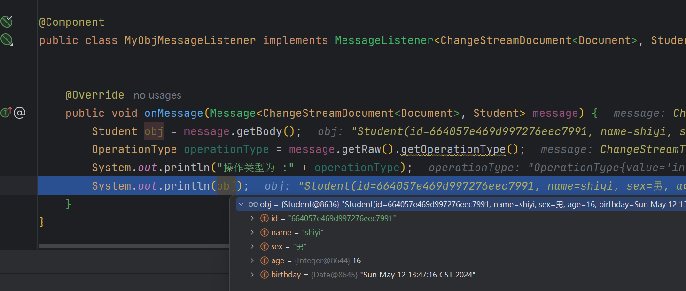

# MongoDB Change Streams

## 一. 什么是 Change Stream

Change Stream 是 MongoDB 用于实现变更追踪的解决方案，类似于关系数据库的触发器，但原理不完全相同：

|      | Change Stream | 触发器      |
| ---- | ------------- | -------- |
| 触发方式 | 异步            | 同步（事务保证） |
| 触发位置 | 应用回调事件        | 数据库触发器   |
| 触发次数 | 每个订阅事件的客户端    | 1次（触发器）  |
| 故障恢复 | 从上次断点重新触发     | 事务回滚     |

## 二. Change Stream 的实现原理

Change Stream 是基于 `oplog` 实现的。它在 `oplog` 上开启一个 `tailable cursor` 来追踪所有复制集上的变更操作，最终调用应用中定义的回调函数。被追踪的变更事件主要包括：

- insert/update/delete：插入、更新、删除

- drop：集合被删除

- rename：集合被重命名

- dropDatabase：数据库被删除

- invalidate：drop/rename/dropDatabase 将导致 invalidate 被触发，并关闭 change stream

## 三. OpLog 结构

MongoDB Oplog中的内容及字段介绍：

```json
{
    "ts": Timestamp(1446011584,
    2),
    "h": NumberLong("1687359108795812092"),
    "v": 2,
    "op": "i",
    "ns": "test.nosql",
    "o": {
        "_id": ObjectId("563062c0b085733f34ab4129"),
        "name": "mongodb",
        "score": "100"
    }
}
```

- ts： 操作时间，当前timestamp + 计数器，计数器每秒都被重置

- h：操作的全局唯一标识

- v：oplog版本信息

- op：操作类型
  
  - i：插入操作
  - u：更新操作
  - d：删除操作
  - c：执行命令（如createDatabase，dropDatabase）

- n：空操作，特殊用途

- ns：操作针对的集合

- o：操作内容，如果是更新操作

- o2：操作查询条件，仅update操作包含该字段


## 四. SpringBoot 使用 Change Stream

### 4.1 环境准备

使用 ChangeStream 需要开启 MongoDB 的 oplog，单节点 MongoDB 默认不开启 oplog。

### 4.2 SpringBoot 接入 MongoDB Change Stream

第一步：引入Maven

```xml
<dependency>
    <artifactId>spring-boot-starter-test</artifactId>
    <artifactId>spring-boot-starter</artifactId>
</dependency>
```

第二步：核心配置

```yaml
server:
  port: 8080
spring:
  data:
    mongodb:
      uri: mongodb://10.10.10.12:27017/test
```

第三步：编写实体类

```java
package cn.bigcoder.mongo.mongodemo.model;

import com.fasterxml.jackson.annotation.JsonFormat;
import java.util.Date;
import lombok.Data;
import org.springframework.data.mongodb.core.mapping.Document;
import org.springframework.data.mongodb.core.mapping.MongoId;

/**
 * @author: Jindong.Tian
 * @date: 2024-05-12
 **/
@Document(collection="students")
@Data
public class Student {

    /**
     * 使用 @MongoID 能更清晰的指定 _id 主键
     */
    @MongoId
    private String id;
    private String name;
    private String sex;
    private Integer age;
    @JsonFormat(pattern = "yyyy-MM-dd", timezone = "GMT+8")
    private Date birthday;
}
```

第四步：编写Oplog监听类

MongoMessageListener 类 ，顾名思义，该类用于监听特定数据库下的集合数据变化使用的，在实际开发中，该类的作用也是非常重要的，类似于许多中间件的客户端监听程序，当监听到数据变化后，做出后续的业务响应，比如，数据入库、推送消息到kafka、发送相关的事件等等

```java
package cn.bigcoder.mongo.mongodemo.listener;

import cn.bigcoder.mongo.mongodemo.model.Student;
import com.mongodb.client.model.changestream.ChangeStreamDocument;
import com.mongodb.client.model.changestream.OperationType;
import org.bson.Document;
import org.springframework.data.mongodb.core.messaging.Message;
import org.springframework.data.mongodb.core.messaging.MessageListener;
import org.springframework.stereotype.Component;

@Component
public class MyObjMessageListener implements MessageListener<ChangeStreamDocument<Document>, Student> {


    @Override
    public void onMessage(Message<ChangeStreamDocument<Document>, Student> message) {
        Student obj = message.getBody();
        OperationType operationType = message.getRaw().getOperationType();
        System.out.println("操作类型为 :" + operationType);
        System.out.println(obj);
    }
}
```

第五步：配置监听容器

```java
package cn.bigcoder.mongo.mongodemo.config;

import org.springframework.context.annotation.Bean;
import org.springframework.context.annotation.Configuration;
import org.springframework.data.mongodb.core.MongoTemplate;
import org.springframework.data.mongodb.core.messaging.DefaultMessageListenerContainer;
import org.springframework.data.mongodb.core.messaging.MessageListenerContainer;
import java.util.concurrent.Executor;
import java.util.concurrent.Executors;
@Configuration
public class MongoConfig {
    @Bean
    MessageListenerContainer messageListenerContainer(MongoTemplate mongoTemplate){
        Executor executor = Executors.newFixedThreadPool(5);
        return new DefaultMessageListenerContainer(mongoTemplate,executor){
            @Override
            public boolean isAutoStartup(){
                return true;
            }
        };
    }
}
```

第六步：注册监听器

注册监听器时可以指定需要监听的操作类型。

```java
package cn.bigcoder.mongo.mongodemo.config;

import cn.bigcoder.mongo.mongodemo.listener.MyObjMessageListener;
import cn.bigcoder.mongo.mongodemo.model.Student;
import org.springframework.beans.factory.annotation.Autowired;
import org.springframework.boot.CommandLineRunner;
import org.springframework.context.annotation.Configuration;
import org.springframework.data.mongodb.core.aggregation.Aggregation;
import org.springframework.data.mongodb.core.messaging.ChangeStreamRequest;
import org.springframework.data.mongodb.core.messaging.MessageListenerContainer;
import org.springframework.data.mongodb.core.query.Criteria;

@Configuration
public class ChangeStreamConfig implements CommandLineRunner {

    @Autowired
    private MyObjMessageListener mongoMessageListener;
    @Autowired
    private MessageListenerContainer messageListenerContainer;

    @Override
    public void run(String... args) {
        ChangeStreamRequest<Student> request = ChangeStreamRequest.builder(mongoMessageListener).collection("students")
                .filter(Aggregation.newAggregation(
                        Aggregation.match(Criteria.where("operationType").in("insert", "update", "replace")))).build();
        messageListenerContainer.register(request, Student.class);
    }
}
```

第七步：测试

启动服务后，向数据库中插入一条数据：




