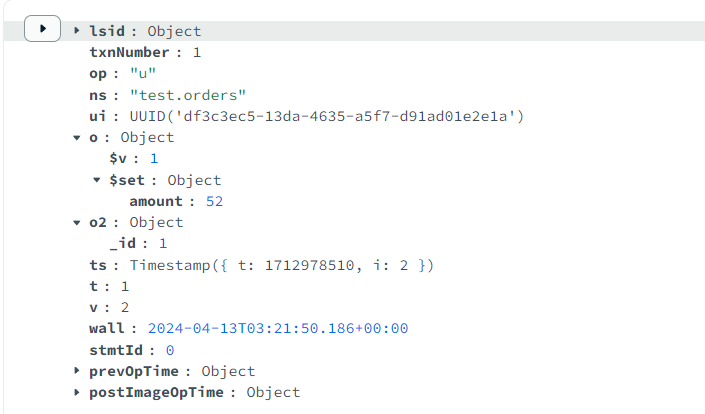

# MongoDB Change Streams

## 一. 什么是 Change Stream

Change Stream 是 MongoDB 用于实现变更追踪的解决方案，类似于关系数据库的触发器，但原理不完全相同：

|      | Change Stream | 触发器      |
| ---- | ------------- | -------- |
| 触发方式 | 异步            | 同步（事务保证） |
| 触发位置 | 应用回调事件        | 数据库触发器   |
| 触发次数 | 每个订阅事件的客户端    | 1次（触发器）  |
| 故障恢复 | 从上次断点重新触发     | 事务回滚     |

## 二. Change Stream 的实现原理

Change Stream 是基于 `oplog` 实现的。它在 `oplog` 上开启一个 `tailable cursor` 来追踪所有复制集上的变更操作，最终调用应用中定义的回调函数。被追踪的变更事件主要包括：

- insert/update/delete：插入、更新、删除

- drop：集合被删除

- rename：集合被重命名

- dropDatabase：数据库被删除

- invalidate：drop/rename/dropDatabase 将导致 invalidate 被触发，并关闭 change stream

## 三. OpLog 结构

MongoDB Oplog中的内容及字段介绍：

```json
{
    "ts": Timestamp(1446011584,
    2),
    "h": NumberLong("1687359108795812092"),
    "v": 2,
    "op": "i",
    "ns": "test.nosql",
    "o": {
        "_id": ObjectId("563062c0b085733f34ab4129"),
        "name": "mongodb",
        "score": "100"
    }
}
```

- ts： 操作时间，当前timestamp + 计数器，计数器每秒都被重置

- h：操作的全局唯一标识

- v：oplog版本信息

- op：操作类型
  
  - i：插入操作
  - u：更新操作
  - d：删除操作
  - c：执行命令（如createDatabase，dropDatabase）

- n：空操作，特殊用途

- ns：操作针对的集合

- o：操作内容，如果是更新操作

- o2：操作查询条件，仅update操作包含该字段



## 四. SpringBoot 使用 Change Stream


