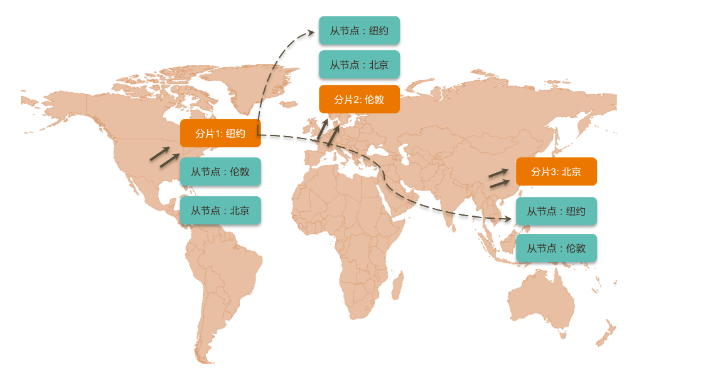

# MongoDB 分片集群机制及原理

## 一. MongoDB 常见部署架构

MongoDB 有三种常见的部署架构：

- 单机版：只有一个单节点，一般用来做开发和测试
- 复制集：绝大部分 MongoDB 实例上线的时候都使用复制集、高可用模式，1主2从（或更多从节点），至少是三个节点的架构
- 分片集群：节点数明显增多，一般有 9 个实例

绝大部分使用场景是**复制集**。

## 二. 为什么要使用分片集群

- 数据容量日益增大，访问性能日渐降低，怎么办？
- 新品上线异常火爆，如何支撑更多的并发用户？
- 单库已有 10TB 数据，恢复需要1-2天，如何加速？
- 地理分布数据，你的数据需要服务全球用户

## 三. 分片如何解决

假设现在交易表中已经有 10 亿条数据，刚开始放到一个 mongod 实例表中，发现读写很慢。

把数据分成两半，放到2个库物理里

把交易号 0 ~ 500000000 的交易数据放到第一台 mongodb 机器中中，500000000 ~ 1000000000 的交易号数据放到第二台 mongodb 实例中。

把数据分成4部分，放到4个物理库里

完整的分片集群

以上是一个完整的 4 分片的 mongodb 集群，有 `Primary`，`Secondary` 数据节点，有 `mongos` 路由节点，有 `config` 配置节点，有应用程序和驱动程序。

## 四. 分片集群解剖

### 4.1 路由节点 mongos

mongs 作用：

- 为应用程序提供一个集群单一入口，一般情况下只使用一个 mongos，其它的 mongos 作为高可用存在
- 你的数据可能存在多个分片（shard）上，mongos 能够转发你的请求到相应的分片服务器上，并且把结果进行合并再返回给应用端
- mongs 至少有两个，目的是做高可用，更多的 mongos 可以做 Load Balance 的效果

### 4.2 配置节点 config

配置节点就是一个标准的普通的 mongodb 实例产生而来，它就是一个普通的复制集（3个节点），3个节点的目的是提供高可用，在 mongodb 集群中是没有单点故障的，所有的地方都是高可用的。

3个配置节点存储的数据是相同的，它存储的数据是集群中的元数据，配置节点中最重要的一张表就是 `Shard`表，它存储了 key 的范围和 Shard 的映射关系，即一段数值的文档是存在哪一个分片上，比如编号是 0 ~ 1000 的文档存在 Shard0 上。

| Lower | Uppwer | Shard  |
| ----- | ------ | ------ |
| 0     | 1000   | Shard0 |
| 1001  | 2000   | Shard1 |

### 4.3 数据节点 mongod

数据节点包含 `Primary` 和 `Secondary`，以复制集为单位（一个分片一个复制集），最大 1024 个分片。

分片中的数据是不重复的，比如有 4 个分片，那么每个分片就占了25%的数据，少了任意一个分片就少了 25 %的数据，所有分片在一起才可完整工作。

## 五. 分片集群特点

- 应用全透明，无特殊处理：单复制集的应用程序代码可以无缝升级到分片集群，代码无需更改
- 数据自动均衡：数据在分片之间是自动均衡的，mongodb 会在背后自动检测各个分片的数据情况，如果发现不均衡的话会自动把数据从一个分片迁移到另一个分片
- 动态扩容，无须下线：可以先使用一个复制集，在需要的时候在线上无需下线的情况下，把新的节点加到集群中，实现线上动态扩容的机制
- 提供三种分片方式

## 六. 分片集群数据分布方式

### 6.1 基于范围

基于范围是最常见的方式，就是选择一个或几个组合字段，把字段的值划分为一个范围空间，然后进行分块，分成 Chunk1、Chunk2、Chunk3，Chunk4等，这个 Chunk 是一个逻辑的分块。

| Pros（优点）  | Cons（缺点）                                 |
| --------- | ---------------------------------------- |
| 片键范围查询性能好 | 数据分布可能不均匀                                |
| 优化读       | 容易有热点，比如用自增ID值划分Chunk，那么新进来的数据都会写到同一个分片上 |

### 6.2 基于 Hash

hash 是按某个字段值进行 hash，这样写入的时候就可以把文档写到不同的分块上。

| Pros（优点）   | Cons（缺点） |
| ---------- | -------- |
| 数据分布均匀，写优化 | 范围查询效率低  |

### 6.3 基于 zone / tag

通过给分片打标签的方式，可以把地域化的数据组织到当地的分片上。

## 七.分片键的约束

ShardKey 必须是一个索引。非空集合须在 ShardCollection 前创建索引；空集合 ShardCollection 自动创建索引

- 4.4 版本之前：

  - ShardKey 大小不能超过 512 Bytes；

  - 仅支持单字段的哈希分片键；
  - Document 中必须包含 ShardKey；
  - ShardKey 包含的 Field 不可以修改。

- 4.4 版本之后: 
  - ShardKey 大小无限制；
  - 支持复合哈希分片键；
  - Document 中可以不包含 ShardKey，插入时被当做 Null 处理；
  - 为 ShardKey 添加后缀 refineCollectionShardKey 命令，可以修改 ShardKey 包含的 Field；

而在 4.2 版本之前，ShardKey 对应的值不可以修改；4.2 版本之后，如果 ShardKey 为非_ID 字段，那么可以修改 ShardKey 对应的值。

## 八. 总结

- 分片集群可以有效解决性能瓶颈及系统扩容问题
- 分片额外消耗较多，成本高，管理复杂，能不分片尽量不要分片

> 本文转载至：[MongoDB 分片集群机制及原理 | 一代键客 (zhangquan.me)](https://zhangquan.me/2023/03/26/mongodb-fen-pian-ji-qun-ji-zhi-ji-yuan-li/)
