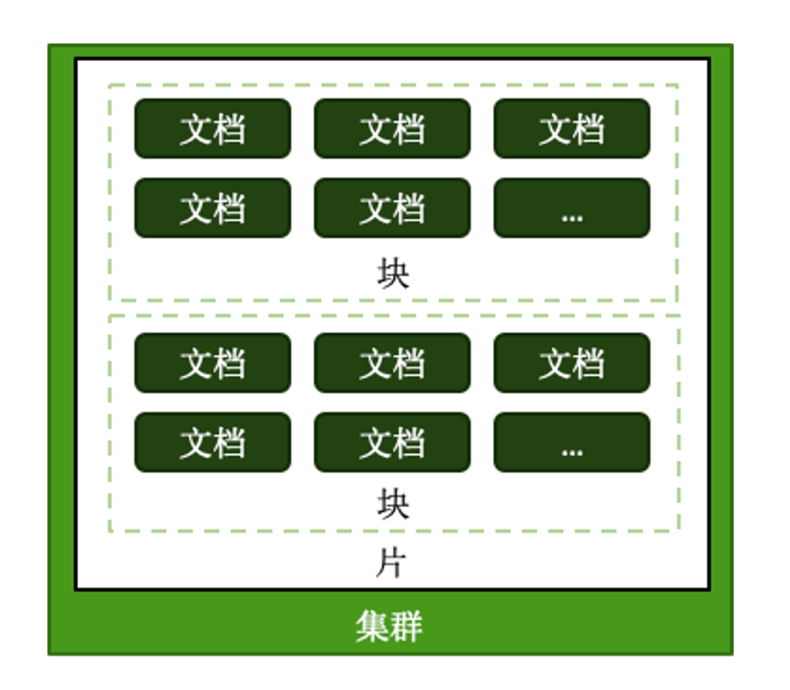

# MongoDB 分片集群设计

对于开发者来说最重要的就是如何对 mongodb 进行**模型设计**，对DBA运维来说最重要的就是如何对 mongodb 进行**分片集群设计**。

## 一. 如何用好分片集群

- 合理的架构
  - 是否需要分片？
  - 需要多少分片？
  - 数据的分布规则
- 正确的姿势
  - 选择需要分片的表
  - 选择正确的键
  - 使用合适的均衡策略
- 足够的资源
  - CPU
  - RAM
  - 存储

## 二. 合理的架构

### 2.1 分片大小

- 分片的基本标准：
  - 关于数据：数据量不超过3TB，尽可能保持在2TB一个片
  - 关于索引：常用索引必须容纳进内存
- 按照以上标准初步确定分片后，还需要考虑业务压力，随着压力增大，CPU、RAM、磁盘中的任何一项出现瓶颈时，都可以通过添加更多分片来解决

### 2.2 需要多少个分片

这里有一个粗略的公式：

```txt
A = 所需存储总量 / 单服务器可挂载容量

B = 工作集大小 / 单服务器内存容量

C = 并发量总数 / （单服务器并发量 * 0.7）

分片数量 = max(A, B, C)
```

第一：估计下要存储多少年的数据，每天增量有多少，计算出**所需存储总量**，比如有8TB，按照 2TB 一分片，那么：

```txt
A = 8TB / 2TB = 4
```

第二：估计下工作集大小，工作集大小指的是热数据所占用空间加上索引所占用空间，比如新闻那么最近几天的数据都是热数据，这些热数据都要放到内存中，比如我们服务器的内存是 256G，工作集占用 400G空间，注意：256G是物理内存，真正 mongdb 用来做缓存的话默认是占用 60%，那么：

```txt
B = 400GB / (256G * 0.6) = 3
```

第三：估计下并发数，比如高峰是有 30000 的并发，单台服务器有 9000 并发，但从单节点变成分片节点会有一些额外的开销，所以一般会使用 70% 的数值来计算单台服务器并发，那么：

```javascript
C = 30000 / (9000 * 0.7) = 6
```

最后分片数量为：

```javascript
max(4, 3, 6) = 6
```

### 2.3 其他需求

考虑分片的分布

- 是否需要跨机房分布分片？
- 是否需要容灾？
- 高可用的要求如何

## 三. 正确的姿势



各种概念从小到大：

- 片键（shard key）：文档中的一个字段或多个字段
- 文档（doc）：包含片键的一行数据
- 块（Chunk）：包含 n 个文档，逻辑概念
- 分片（Shard）：包含 n 个块
- 集群（Cluster）：包含 n 个分片

### 3.1 选择合适的片键

影响片键效率的主要因素有：

- 取值基数（Cardinality）
- 取值分布
- 分散写，集中读
- 被尽可能多的业务场景用到
- 避免单调递增或递减的片键

### 3.2 选择基数大的片键

**所谓基数就是一个字段**，比如姓名中的姓这个字段，在中文姓最多只有几百个，但在英文姓中可能有几万个，再比如年龄这个字段，基数就是 0 ~ 100多。

例如：存储一个高中的师生数据，以年龄（假设年龄范围为15~65岁）作为片键，那么：

15<=年龄<=65，且只为整数，最多只会有51个 chunk。

假设我们有 10TB 的数据，那么 10TB / 50 = 200GB，每个块有 200GB数据，水平扩展时你想要移动 200GB的块基本是失败的。

对于小基数的片键：

- 备选值范围决定了块的数量，如果备选值有限，我们的块又是根据片键范围来确定的，那么块的总数量就有限
- 随着数据增多，块的大小会越来越大
- 太大的块，会导致水平扩展时移动块会非常困难

**结论：取值基数要大！**

### 3.3 选择分布均匀的片键

所谓分布就是值范围可能很大，但经常被使用到的值就集中在某一块。

例如：存储一个学校的师生数据，以年龄（假设年龄范围为15~65岁）作为片键，那么：

15<=年龄<=65，且只为整数，大部分人的年龄范围为15~18岁（学生） ,15、16、17、18四个 chunk 的数据量、访问压力远大于其他 chunk。

对于分布不均匀的片键：

- 造成某些块的数据量急剧增大
- 这些块压力随之增大
- 数据均衡以 chunk 为单位，所以系统无能为力

**结论：取值分布应尽可能均匀**

### 3.4 对主要查询要具有定向能力

比如：有4个分片的集群，你希望读取到某条特定的数据，请求进来到达 mongos：

- 如果查询条件中有片键，那么 mongos 是知道该查询去哪个分片上去查询，它会把查询直接发到某个具体的分片上
- 如果查询条件中没有片键，那么 mongos 不知道去哪个分片上去查询，mongos 要去4 个分片上都查询一下

查询条件中有片键只需要等待一个分片响应后就直接返回给客户端，没有片键需要等待 4 个分片全部响应完成后才返回给客户端。

**结论：我们的片键是常用查询中的字段**

### 3.5 一个 email 系统的片键例子

以下是一个 email 文档结构：

```json
{
	_id: ObjectId(),  // 自增产生的
	user_id: 123,  // 用户ID
	time: Date(), // email 发送时间
	subject: “...”, // email 主题
	recipients: [],  // email 接收者
	body: “...”,  // 正文
	attachments: [] // 附件信息
}
```

使用 `{_id:自增值}`来作片键：

| 考虑因素     | 是否满足                                                     |
| :----------- | :----------------------------------------------------------- |
| 基数大       | 满足，自增产生的 _id 值可以是无穷大的                        |
| 分布均匀     | 不满足，因为 _id 是自增的，它一直会向某个分片写入，等到分片数量太多时再把数据再迁移到另外的分片 |
| 具有定向查询 | 不满足，一般查询条件中不会使用自增 _id 来查询文档            |

使用 `{_id: "hashed"}`来作片键：

| 考虑因素     | 是否满足                                                     |
| :----------- | :----------------------------------------------------------- |
| 基数大       | 满足，自增产生的 _id 值可以是无穷大的，hash 后的值也是无穷尽的 |
| 分布均匀     | 满足，_id 经过 hash 后就变成了随机的，这里可以随机写到各个分片上 |
| 具有定向查询 | 不满足，一般查询条件中不会使用自增 _id 来查询文档            |

使用 `{user_id: "user_id值"}`来作片键：

| 考虑因素     | 是否满足                                                     |
| :----------- | :----------------------------------------------------------- |
| 基数大       | 不满足，某个用户的邮件数据可能都只在某一个 chunk 里，随着时间越长，这个 chunk就会变成一个超级大的块，水平扩展时移动块会非常困难 |
| 分布均匀     | 满足，正常情况下每个用户的邮件数量是差不多的                 |
| 具有定向查询 | 满足，一般查询条件中就会查询某个用户的邮件                   |

最经常的一种方式就是使用组合片键，使用 `{user_id: "user_id值", time: "time值"}`来作片键：

| 考虑因素     | 是否满足                                                     |
| :----------- | :----------------------------------------------------------- |
| 基数大       | 满足，虽然user_id基数不大，但time一直在自增变化，user_id 再加上 time这样基数就会非常大 |
| 分布均匀     | 满足，正常情况下每个用户的邮件数量是差不多的                 |
| 具有定向查询 | 满足，一般查询条件中就会查询某个用户的邮件                   |

## 四. 足够的资源

mongs 与 config 通常消耗很少的资源，可以选择低规格虚拟机。资源的重点在于 shard 服务器：

- 需要足以容纳热数据和索引的内存
- 正确创建索引后 CPU 通常不会成为瓶颈，除非涉及非常多的计算
- 磁盘尽量选用 SSD

即使项目初期已经具备了足够的资源，仍然需要考虑在合适的时候扩展。建议监控各项资源使用情况，无论哪一项达到60%以上，则开始考虑扩展，因为：

- 扩展需要新的资源，申请新资源需要时间
- 扩展后数据需要均衡，均衡需要时间。应保证新数据入库速度慢于均衡速度
- 均衡需要资源，如果资源即将或已经耗尽，均衡也是会很低效的

## 五. 总结

- 合理的架构 ：选择合适的分片大小与数量
- 正确的姿势：选择合适的片键
- 足够的资源：给足够的存储和内存资源个分片服务器

> 本文转载至：[MongoDB 分片集群设计 | 一代键客 (zhangquan.me)](https://zhangquan.me/2023/03/27/mongodb-fen-pian-ji-qun-she-ji/)