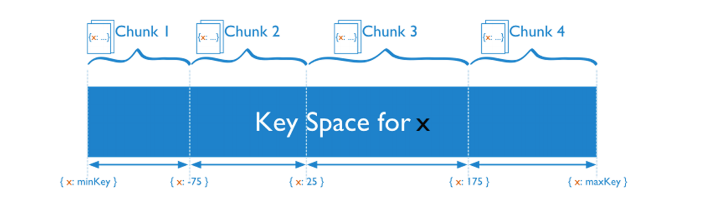
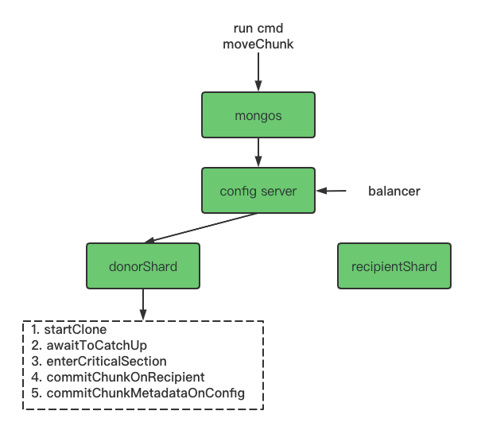

# 一文读懂 MongoDB chunk 迁移

## 一. chunk简介

### 1.1 什么是 chunk

MongoDB在Sharding模式下（对于Sharding不了解的可以参考[shard介绍](https://docs.mongodb.com/manual/sharding/)），通过Mongos向开启了shard分片的集合写入文档，这些文档会根据其shardKey分散到MongoDB的不同shard上。



如上图，假设集合的shardKey x（以范围分片为例，哈希分片类似），写入该集合的文档根据其x的取值范围，会被分散到chunk1到chunk4中，每个chunk只包含特定范围的数据（比如chunk2就只包含x的取值在[-75, 25)范围内的文档），同一chunk的文档只会存储在一个shard上，一个shard可能包含多个chunk，chunk具体存储在哪个shard，由记录在config server中的路由信息决定。

### 1.2 chunk分裂

默认情况下，一个chunk的最大值默认为64MB（可调整），进行数据插入、更新、删除时，如果此时mongos感知到了目标chunk的大小超过上限，则会触发chunk分裂。chunk分裂动作为逻辑上的概念，它会对需要分裂的chunk进行分段，指定split point标记切割的位置。


### 1.3 chunk的迁移

MongoDB默认情况下会开启一个balancer模块用于定期检测各个shard上的chunk数量分布，当检测到各个shard上的chunk数量存在分布不均匀的情况时，就会触发chunk迁移。如下图，三个shard的chunk数量分别为3、3、1，此时balancer认为chunk数量分布不均，于是会将shard B上的chunk迁移一个到shard C上，这样三个shard的chunk数量分布最终就会变为3、2、2，分布更为均匀。


上文提到的balancer通过特定规则来筛选出来需要进行迁移的chunk，这些规则具体是什么呢？当前，mongoDB会对以下三种类型的chunk进行迁移（优先级由高到底）：

- chunk属于正在进行排水（即draining，一般出现在shard删除，move primary等情况下，表示该chunk需要尽快被删除）的shard
- chunk是否违反了zones的约束（zones的定义[见此](https://docs.mongodb.com/manual/tutorial/manage-shard-zone/)）
- 如果不属于以上两种情况，则通过计算各个shard之间的chunks数量进行负载均衡，原则上balancer会让各个shard在满足zones约束的条件下尽可能均衡

选定了需要迁移的chunk后，balancer会选择当前shards中chunks数最少的一个作为迁移的目标。

## 二. chunk 迁移原理

chunk 迁移操作通过 moveChunk 命令发起，moveChunk 命令即可以被 balancer 自动调用（balancer每隔10s扫描哪些chunk需要被迁移），也支持用户主动发起。迁移chunk的整个过程实际上就是一次两个shard进行数据交换的过程，发送chunk的一方称为发送方（donorShard），接收chunk的一方称为接收方（recipientShard）。发送方和接收方通过一系列精心设计的步骤来实现chunk的迁移。


完成一次chunk迁移需要进行以下7个步骤： 

1. 发送方发起迁移: configsvr向发送方请求进行指定chunk的迁移任务（同一时刻只能执行一个chunk迁移）。如果此时发现已有一个相同的chunk的迁移任务，跳过此次迁移，否则会新发起一个迁移任务。

2. 接收方发起chunk拷贝: 发送方进行迁移参数的校验，校验通过后，向接收方发送recvChunkStart命令，接收方进行一些传送文档数据的初始化工作后，会不断重复地向发送方发送migrateClone命令批量拉取chunk中的文档并将拉取的文档进行批量插入，即进行文档的全量拷贝。

3. 接收方拉取增量修改: 文档全量拷贝完成后，接收方通过不断重复发送transferMods命令拉取chunk的增量修改（包括插入、更新、删除），并将其应用到自身。

4. 发送方等待接收方chunk拷贝完成: 发送方不断向接收方发送recvChunkStatus命令查询文档增量同步是否完成或超时，当增量同步完成时，表示此时接受方已进入“steady”状态，可以进行接下来的流程。

5. 发送方进入临界区: 一旦当接收方的文档数据同步完成，发送方就会进入临界区(critical section)，此时发送方接下来的操作不可被打断，并且所有发送方的写操作将被挂起，直到发送方退出临界区。

6. 接收方执行commit: 发送方进入临界区后，接下来会同步地调用recvChunkCommit命令给接收方，接收方再一次进行chunk文档的增量同步，同步完成后，向接收方返回同步完成的结果，接收方退出临界区。

7. configsvr执行commit: 接收方收到同步完成的结果后，向configsvr发送configsvrCommitChunkMigration命令，表示迁移完成。（configsvrCommitChunkMigration命令返回前，发送方的读操作会被挂起）

以上便为MongoDB进行chunk迁移的基本步骤，在下一节我们将会从源码层面对迁移流程的每一阶段代码做详细解读。

## 三. trunk 迁移源码分析

### 3.1 发送方发起迁移



moveChunk迁移命令一般通过balancer或者mongos发起，由configsvr接收和处理。迁移请求的主要参数有 待迁移的chunk、chunk的发送方及接收方、迁移时的写入级别SecondaryThrottle、是否在迁移成功后等待发送方的chunk删除。这些参数检验通过时，configsvr便会向发送方shard发送chunk迁移开始的请求。

发送方收到configsvr的moveChunk请求后，会初始化迁移请求，管理整个迁移任务的进度，（迁移进度切换、信息交互、waitForDelete操作等），直至整个迁移任务结束。以下为发送方的迁移任务状态管理代码片段，通过代码可以看出，发送方在这里执行的迁移流程和第二节所讲的迁移步骤是对应的。

```c++
// 初始化迁移任务管理对象migrationSourceManager 
MigrationSourceManager migrationSourceManager(opCtx, moveChunkRequest, donorConnStr, recipientHost);
// 开始chunk文档拷贝
migrationSourceManager.startClone(opCtx);
// 等待增量同步完成
migrationSourceManager.awaitToCatchUp(opCtx);
// 发送方进入临界区
migrationSourceManager.enterCriticalSection(opCtx);
// 接收方执行commit
migrationSourceManager.commitChunkOnRecipient(opCtx);
// 发送方将迁移结果持久化（更新chunks路由信息）
migrationSourceManager.commitChunkMetadataOnConfig(opCtx);
```

假如上述整个迁移流程完成后，configsvr中存储的chunk路由此时已被更新，迁移后的chunk存储地址会由发送方变为接收方，这时通过mongos已不能访问到发送方的chunk（这类chunk被称为孤儿chunk）。此时，根据waitForDelete参数，发送方会决定是否同步等待其孤儿chunk删除，否则直接返回，将孤儿chunk的删除任务放入队列等待后台异步删除（一般会在十几分钟后延迟删除）。部分代码如下：

```c++
if (moveChunkRequest.getWaitForDelete()) { //开启了waitForDelete，会同步等待孤儿chunk删除
  auto& replClient = repl::ReplClientInfo::forClient(opCtx->getClient());
  replClient.setLastOpToSystemLastOpTime(opCtx);

  WriteConcernResult writeConcernResult;
  writeConcernResult.wTimedOut = false;
  // 通过比对secondary和primary的optime来保证孤儿chunk被大多数成员删除
  Status majorityStatus = waitForWriteConcern(
    opCtx, replClient.getLastOp(), kMajorityWriteConcern, &writeConcernResult);
  if (!majorityStatus.isOK()) {
    if (!writeConcernResult.wTimedOut) {
      uassertStatusOK(majorityStatus);
    }
    return false;
    }
}
```

### 3.2 接收方发起chunk拷贝


接收方收到startClone请求后，将自身状态初始化为READY，向发送方发起拷贝chunk的请求，然后发送方进入awaitToCatchUp函数，不断轮询接收方的状态变化。接收方总共定义了8种状态来表示接收侧的迁移任务进行到哪个阶段，各个状态含义如下所示：

```c++
// 接收方的状态类型
enum State { 
    READY, // 初始状态
    CLONE, // chunk文档全量拷贝阶段
    CATCHUP,  // chunk文档增量同步阶段
    STEADY,  // chunk文档同步完成
    COMMIT_START,  // 开始进行commit
    DONE, // commit完成
    FAIL,  // 任务失败
    ABORT // 任务取消
};
```

紧接着，接收方进行chunk迁移的一些初始化工作，这些准备工作按线性顺序列出如下：

- 获取chunk所属的集合元数据
- 如果集合不存在则根据集合元数据创建集合及其索引
- 若集合存在，且有残留的孤儿文档，则先同步删除这部分孤儿文档
- 接收方将自身状态置为CLONE
- 新建一个名为sessionMigrate的会话用于不断从发送方获取该集合的增量变化
- 开始实际进行chunk的全量拷贝任务

进入chunk的全量拷贝（CLONE）阶段后，接收方通过定义两个函数fetchBatchFn和insertBatchFn，分别进行chunk文档的批量拉取和批量插入，并且两个函数分别会在独立的线程并行执行，以提高文档拷贝的效率。

fetchBatchFn函数实现解析： fetchBatchFn函数通过调用 `_migrateClone` 命令从发送方批量拉取chunk文档。批量拉取函数会通过chunk中的文档id来查询对应文档，达到批量拉取的大小限制后一并将这些文档进行返回。批量拉取的大小由默认配置指定，但其最大值不能超过mongoDB的限制，其中最核心的代码如下：

```c++
        Snapshotted<BSONObj> doc; //定义一个空文档
        //通过it查找对应文档并赋值，这里的findDoc内部实现和普通的find操作并无差别
        //it为chunk文档的ID
        if (collection->findDoc(opCtx, *it, &doc)) { 
            if (arrBuilder->arrSize() &&
                (arrBuilder->len() + doc.value().objsize() + 1024) > BSONObjMaxUserSize) {
                                //达到批量拉取的大小限制则会返回
                break;
            }
                        //查找到文档并不会立即返回，而是累积查询一定数量的文档再批量返回
            arrBuilder->append(doc.value());
        }
```

insertBatchFn函数实现解析：批量插入函数主要的流程也比较简单，通过不断消费批量拉取函数拉取的文档，接收方依次将这些文档通过insert命令来进行插入，从而实现文档拷贝。值得注意的是这里的 insert 命令依然会产生对应的 oplog，和普通插入请求并无区别，只是其oplog的fromMigrate字段会被置为true。详细代码解析如下：

```c++
        auto insertBatchFn = [&](OperationContext* opCtx, BSONObj arr) {
            auto it = arr.begin();
            //遍历批量拉取的文档集合arr
            while (it != arr.end()) {
                int batchNumCloned = 0;
                int batchClonedBytes = 0;
                const int batchMaxCloned = migrateCloneInsertionBatchSize.load();

                assertNotAborted(opCtx);

                write_ops::Insert insertOp(_nss);
                insertOp.getWriteCommandBase().setOrdered(true);
                insertOp.setDocuments([&] {
                        //定义一个名为toInsert的vector用于存储将要批量插入的文档
                    std::vector<BSONObj> toInsert; 
                    //达到每次批量插入的最大值则不再继续添加文档
                    while (it != arr.end() &&
                           (batchMaxCloned <= 0 || batchNumCloned < batchMaxCloned)) { 
                        const auto& doc = *it;
                        BSONObj docToClone = doc.Obj();
                        toInsert.push_back(docToClone); //向toInsert中添加文档
                        batchNumCloned++;
                        batchClonedBytes += docToClone.objsize();
                        ++it;
                    }
                    return toInsert;
                }());
                //performInserts实际进行文档的批量插入，内部实现其实也是逐条依次插入
                //和普通插入一样都会生成oplog，只是其oplog信息中会额外带有字段{"fromMigrate": true}
                const WriteResult reply = performInserts(opCtx, insertOp, true);

                for (unsigned long i = 0; i < reply.results.size(); ++i) {
                            //不允许批量插入部分成功
                    uassertStatusOKWithContext(
                        reply.results[i],
                        str::stream() << "Insert of " << insertOp.getDocuments()[i] << " failed.");
                }

                {
                    stdx::lock_guard<stdx::mutex> statsLock(_mutex);
                    _numCloned += batchNumCloned;
                    _clonedBytes += batchClonedBytes;
                }
                //若通过chunk迁移参数SecondaryThrottle指定了迁移时的写入级别
                //则根据参数等待接收方shard的成员同步插入操作完成
                if (_writeConcern.shouldWaitForOtherNodes()) {
                    repl::ReplicationCoordinator::StatusAndDuration replStatus =
                        repl::ReplicationCoordinator::get(opCtx)->awaitReplication(
                            opCtx,
                            repl::ReplClientInfo::forClient(opCtx->getClient()).getLastOp(),
                            _writeConcern);
                    if (replStatus.status.code() == ErrorCodes::WriteConcernFailed) {
                        //需要注意，批量插入时如果等待其他成员同步插入操作超时了
                        //这里仍会继续后续的批量插入流程，因为后续还会有流程再次进行写入级别的检查
                        warning() << "secondaryThrottle on, but doc insert timed out; "
                                     "continuing";
                    } else {
                        //shard状态异常，不能保证写入级别
                        uassertStatusOK(replStatus.status);
                    }
                }
                //每轮批量插入操作会间隔一段时间
                sleepmillis(migrateCloneInsertionBatchDelayMS.load());
            }
        };
```

### 3.3 接收方拉取增量修改


迁移流程到这里，接收方便完成了chunk文档的全量拷贝，接下来要开始进行chunk文档增量同步，来同步chunk全量拷贝开始后该chunk文档的相关修改。注意这里的增量修改信息不能完全等同于MongoDB中的oplog，而是经过筛选后的针对迁移中的chunk的一些特定格式的信息。

开始增量同步前，接收方会将自身的状态置为CATCHUP，接着会开始执行不断拉取chunk增量修改的while循环，如下：

```c++
        while (true) {
            //通过向发送方发送_transferMod命令来获取chunk指定时间之后的增量修改信息
            //这些增量修改信息在上述步骤2建立sessionMigrate时，发送方就已经开始进行收集
            auto res = uassertStatusOKWithContext(
                fromShard->runCommand(opCtx,
                                      ReadPreferenceSetting(ReadPreference::PrimaryOnly),
                                      "admin",
                                      xferModsRequest,
                                      Shard::RetryPolicy::kNoRetry),
                "_transferMods failed: ");

            uassertStatusOKWithContext(Shard::CommandResponse::getEffectiveStatus(res),
                                       "_transferMods failed: ");

            const auto& mods = res.response;

                        //全量同步开始（在上述步骤2建立sessionMigrate的时间）后没有新的增量修改产生，退出循环
            if (mods["size"].number() == 0) {
                break;
            }

                        //回放拉取的增量修改，失败则继续尝试拉取
            if (!_applyMigrateOp(opCtx, mods, &lastOpApplied)) {
                continue;
            }
                        //代码运行到这里表示回放增量修改成功

                        //从这里开始检查接收方shard的secondary节点是否跟上了增量修改的回放
            const int maxIterations = 3600 * 50; //设置检查的超时时间,大约为1小时
            int i;
            for (i = 0; i < maxIterations; i++) {
                opCtx->checkForInterrupt();

                if (getState() == ABORT) {
                    log() << "Migration aborted while waiting for replication at catch up stage";
                    return;
                }

                //等待secondary成员同步增量修改
                //由_writeConcern写入级别参数决定最少等待几个secondary成员同步成功
                if (opReplicatedEnough(opCtx, lastOpApplied, _writeConcern))
                                        //secondary同步oplog成功
                    break;

                                //提示secondary同步速度可能已经很难跟上primary
                if (i > 100) {
                    log() << "secondaries having hard time keeping up with migrate";
                }

                sleepmillis(20); //每次检查间隔20ms
            }

                        //达到最大尝试次数（默认1小时），标记迁移任务失败并退出循环
            if (i == maxIterations) {
                _setStateFail("secondary can't keep up with migrate");
                return;
            }
        }
```

至此，接收方完了成增量同步和写入级别的检查，即完成了chunk拷贝的所有操作，接收方的副本集已经拥有了和发送方“一致”的chunk，这里的一致打引号是因为迁移的整个流程还未完成，在后续阶段发送方的chunk可能还有新增增量修改（但至少在这里我们已经同步了绝大多数数据，后续的迁移过程相对耗时很短，产生的增量修改会很小）。

### 3.4 发送方等待接收方chunk拷贝完成

接收方完成了chunk集合的同步，这时会将自身状态置为STEADY，并开始一个while循环不断进行commit操作（发送方此时会感知到接收者为STEADY状态，发送方的后续动作稍后再讲）。


这里接收方尝试commit的主要代码如下：

```c++
        //Wait for commit
        setState(STEADY); //设置接收者状态为STEADY

        /*由于发送方会不断轮询接收方的状态，当感知到接收者状态变为STEADY时，发送方进入临界区，挂起一切写操作，并发送startCommit命令给接收者。接收者在startCommit函数中会将自身状态修改为COMMIT_START，并停止sessionMigare的oplog同步过程，同时也将触发条件变量的广播（条件变量的作用在这里不详细说明）。所以，此时的接收者状态可能为STEADY或COMMIT_START中的任一种（当然了，为STEADY的概率会大很多）*/
        bool transferAfterCommit = false; //表示接收者是否已经收到了startCommit命令
        while (getState() == STEADY || getState() == COMMIT_START) {
            opCtx->checkForInterrupt();

            if (getState() == COMMIT_START) {
                transferAfterCommit = true;
            }

                        //至少执行一次增量同步，拉取可能的新oplog
            auto res = uassertStatusOKWithContext(
                fromShard->runCommand(opCtx,
                                      ReadPreferenceSetting(ReadPreference::PrimaryOnly),
                                      "admin",
                                      xferModsRequest,
                                      Shard::RetryPolicy::kNoRetry),
                "_transferMods failed in STEADY STATE: ");

            uassertStatusOKWithContext(Shard::CommandResponse::getEffectiveStatus(res),
                                       "_transferMods failed in STEADY STATE: ");

            auto mods = res.response;

                        //有新的oplog则进行回放，然后再进行下一轮commit的尝试
            if (mods["size"].number() > 0 && _applyMigrateOp(opCtx, mods, &lastOpApplied)) {
                continue;
            }
                        //没有新的oplog产生

            if (getState() == ABORT) {
                log() << "Migration aborted while transferring mods";
                return;
            }

                        //满足以下两个条件表示接收方的commit操作完成，才能退出循环
            // 1) 发送方向接收方发送了startCommit命令，接收方状态变为COMMIT_START，此时发送方禁止写操作
            // 2) 至少执行过一次oplog增量同步
            if (getState() == COMMIT_START && transferAfterCommit == true) {
                if (_flushPendingWrites(opCtx, lastOpApplied)) {
                    break;
                }
            }

            // 间隔10ms继续尝试commit
            if (getState() == STEADY)
                sleepmillis(10);
        }
        
        setState(DONE); //执行commit成功，进入DONE状态
```

下面再补充说明一下发送方此时的操作：当接收方将其状态置为STEADY后，此时发送方通过轮询感知到接收方的状态变化，于是从awaitToCatchUp函数中返回，执行enterCriticalSection函数进入临界区，发送方代码流程如下：

```c++
  //命令接收者发起chunk拷贝任务
  uassertStatusOKWithWarning(migrationSourceManager.startClone(opCtx));
  //等待chunk同步完成，即接收方进入STEADY状态（最长等待6小时，不可修改）
  uassertStatusOKWithWarning(migrationSourceManager.awaitToCatchUp(opCtx));
  //进入临界区，挂起主从的写操作（流程设计上保证进入临界区的时间足够小）
  uassertStatusOKWithWarning(migrationSourceManager.enterCriticalSection(opCtx));
  //通知接收方接收最后一批oplog并向接收者同步调用startCommit，注意startCommit为阻塞调用
  uassertStatusOKWithWarning(migrationSourceManager.commitChunkOnRecipient(opCtx));
```

### 3.5 发送方进入临界区

本小节介绍一下发送方进入临界区前后做了哪些操作

```c++
Status MigrationSourceManager::enterCriticalSection(OperationContext* opCtx) {
    invariant(!opCtx->lockState()->isLocked());
    invariant(_state == kCloneCaughtUp);
    auto scopedGuard = MakeGuard([&] { cleanupOnError(opCtx); });
    _stats.totalDonorChunkCloneTimeMillis.addAndFetch(_cloneAndCommitTimer.millis());
    _cloneAndCommitTimer.reset();

        //如果有需要写入一条no op的oplog，保证接收者至少执行一次oplog增量拉取
    _notifyChangeStreamsOnRecipientFirstChunk(opCtx, _getCurrentMetadataAndCheckEpoch(opCtx));

    // Mark the shard as running critical operation, which requires recovery on crash.
    //
    // NOTE: The 'migrateChunkToNewShard' oplog message written by the above call to
    // '_notifyChangeStreamsOnRecipientFirstChunk' depends on this majority write to carry its local
    // write to majority committed.
        //本地更新迁移的metaData，阻塞写操作
    Status status = ShardingStateRecovery::startMetadataOp(opCtx);
    if (!status.isOK()) {
        return status;
    }

    _critSec.emplace(opCtx, _args.getNss());

        //发送方标记自身为临界区状态
    _state = kCriticalSection;

        //向secondary发送信号，令secondary在有新的mongos请求时，从configsvr进行一次路由更新（因果一致性）
    Status signalStatus =
        updateShardCollectionsEntry(opCtx,
                                    BSON(ShardCollectionType::ns() << getNss().ns()),
                                    BSONObj(),
                                    BSON(ShardCollectionType::enterCriticalSectionCounter() << 1),
                                    false /*upsert*/);
    if (!signalStatus.isOK()) {
        return {
            ErrorCodes::OperationFailed,
            str::stream() << "Failed to persist critical section signal for secondaries due to: "
                          << signalStatus.toString()};
    }

        //成功进入临界区
    log() << "Migration successfully entered critical section";

    scopedGuard.Dismiss();
    return Status::OK();
}
```

进入临界区后，发送方会调用_recvChunkCommit命令让接收者执行startCommit，并在下面函数返回前恢复写操作：

```c++
_callRecipient(createRequestWithSessionId(kRecvChunkCommit, _args.getNss(), _sessionId));
```

### 3.6 接收方执行commit

已在3.2.4进行介绍。

### 3.7 configsvr执行commit


至此，迁移流程中的chunk已经完成同步。此时发送者也进入了临界区，挂起一切写操作，接收者也已经完成了commit。接下来，发送方将会进行chunk迁移的最后一步，向configsvr的发起commit操作，包括：

- 发送者增大已迁移的chunk元数据的version（相当于标记为旧数据）
- 读操作挂起
- 向configsvr发送commit请求，刷新路由
- 等待configsvr的secondary同步刷新路由操作完成
- 上述过程若出错（如发送者stepDown、configsvr异常），则尽量保留现场用于恢复迁移任务
- 执行chunk的删除或延迟删除
- 恢复写操作

### 3.8 孤儿文档删除

当chunk迁移完成后，发送方还需要清理残留的chunk，这种chunk称之为孤儿chunk，孤儿chunk中的文档称为孤儿文档。一般情况孤儿chunk的删除是异步执行的（迁移完成后15分钟），每次删除128个文档，每次间隔20ms；但也可以指定waitForDelete在迁移流程中同步对孤儿chunk进行删除。 实际删除孤儿chunk前，需要判断该chunk是否能被删除，逻辑如下：

```c++
auto MetadataManager::cleanUpRange(OperationContext* opCtx,
                                   const Collection* collection,
                                   ChunkRange const& range,
                                   Date_t whenToDelete) -> CleanupNotification {
    stdx::lock_guard<stdx::mutex> lg(_managerLock);
    invariant(!_metadata.empty());

    auto* const activeMetadata = _metadata.back().get();
    auto* const overlapMetadata = _findNewestOverlappingMetadata(lg, range);

        //待删除的chunk没有被标记为孤儿chunk
    if (overlapMetadata == activeMetadata) {
        return Status{ErrorCodes::RangeOverlapConflict,
                      str::stream() << "Requested deletion range overlaps a live shard chunk"};
    }

        //待删除的chunk正在进行迁移
    if (rangeMapOverlaps(_receivingChunks, range.getMin(), range.getMax())) {
        return Status{ErrorCodes::RangeOverlapConflict,
                      str::stream() << "Requested deletion range overlaps a chunk being"
                                       " migrated in"};
    }

    if (!overlapMetadata) {
                //没有基于该chunk的查询，通过whenStr指定延迟删除时间，将删除任务放入任务队列异步删除
        const auto whenStr = (whenToDelete == Date_t{}) ? "immediate"_sd : "deferred"_sd;
        log() << "Scheduling " << whenStr << " deletion of " << _nss.ns() << " range "
              << redact(range.toString());
        return _pushRangeToClean(lg, range, whenToDelete);
    }

        //当前有基于该chunk的查询，通过文档的cursor找到这些文档并打印提示信息到日志
    logRangeDeletionWaitingOnOpenCursors(opCtx, collection, _nss, range);

    //将待删除chunk放入metaDataTracker的孤儿文档删除队列，之后找机会删除（可能会等待更长时间才会最终删除）
    auto& orphans = overlapMetadata->orphans;
    orphans.emplace_back(ChunkRange(range.getMin().getOwned(), range.getMax().getOwned()),
                         whenToDelete);

    return orphans.back().notification;
}
```

实际进行chunk删除时，也是调用collection逐条进行删除，如下（流程代码比较多，如删除前记录flat file，锁及yield等，这里先不展开）：

```c++
//collection类调用deleteDocument方法删除文档，注意最后一个参数true表示删除是迁移任务引入的
//整个删除流程到这里并没有指定write concern，即使用默认的primary级别
collection->deleteDocument(opCtx, kUninitializedStmtId, rloc, nullptr, true);
```

在执行上述删除逻辑前，有一点需要着重提下，对于不是第一次进行删除（即之前的删除流程失败）的孤儿chunk，删除流程还会令secondary节点对primary进行watch，保证删除期间所有依赖该chunk的读取操作都不会执行或被kill（通过设置ignoreChunkMigration的read-concern参数进行读取可以不被kill）。代码如下：

```c++
            // Secondaries will watch for this update, and kill any queries that may depend on
            // documents in the range -- excepting any queries with a read-concern option
            // 'ignoreChunkMigration'
            try {
                AutoGetCollection autoAdmin(
                    opCtx, NamespaceString::kServerConfigurationNamespace, MODE_IX);

                Helpers::upsert(opCtx,
                                NamespaceString::kServerConfigurationNamespace.ns(),
                                BSON("_id"
                                     << "startRangeDeletion"
                                     << "ns"
                                     << nss.ns()
                                     << "epoch"
                                     << epoch
                                     << "min"
                                     << range->getMin()
                                     << "max"
                                     << range->getMax()));
            } catch (const DBException& e) {
                stdx::lock_guard<stdx::mutex> scopedLock(csr->_metadataManager->_managerLock);
                csr->_metadataManager->_clearAllCleanups(
                    scopedLock,
                    e.toStatus("cannot push startRangeDeletion record to Op Log,"
                               " abandoning scheduled range deletions"));
                return boost::none;
            }
```

## 四. chunk迁移的影响

### 4.1 性能方面的影响

从上面chunk迁移的流程和源码分析可以看出，chunk迁移操作其实和普通的读写操作并无差别，虽然在迁移过程中MongoDB通过读写操作批量化一定程度上减轻了迁移的开销，但由于迁移操作是chunk级别的并发，且存在大量密集的写入和删除操作，如果恰好遇到业务高峰或累积了大量chunk需要迁移，对于性能还是有不小的影响。


例如，我们在实际运营过程中就发现过这么一个案例：用户在某一时刻发现忽然一台secondary节点忽然出现很多慢查询，持续数分钟之久。可用户读写请求的qps一直很平稳，读写量级很小，业务模型同样也没有改变，按理说不应该忽然出现这么多慢查询。经过分析，发现原来是MongoDB不久前刚执行完一次chunk迁移，在之后不久刚好触发孤儿chunk的延迟删除，删除操作导致了多个secondary节点的dirty cache升高，由于某一个secondary节点规格较小，dirty cache很快就超过20%，此时WT引擎会优先进行cahce evict操作进行内存释放，频繁的内存释放操作阻塞了读写，最终导致该secondary节点出现了大量慢查询。

从上面案例可以看出，即使业务量不大，经过一段时间的积累，可能也会触发chunk迁移，而chunk迁移过程又需要一定的开销，影响业务的读写。

### 4.2 孤儿文档的影响

一般情况下，发送方的孤儿文档会在chunk迁移后立即或延迟删除（根据waitForDelete参数来决决定），但如果chunk迁移发生了异常，则有可能在发送方和接收方产生孤儿文档。如果用户一直是通过mongos进行分片集合的读写，那孤儿文档并不会对读写造成实际的影响。但如果用户通过直连分片集群（当然了，这样的行为并不推荐）的shard进行读写，就会有可能发现同一个文档存在于多个shard上，出现读写不一致的现象。

### 4.3 如何规避chunk自动迁移的影响

如下几点措施可以在一定程度上规避chunk自动迁移对业务的影响：

- 指定只在特定时间点可以进行chunk迁移（或者关闭balancer），避开业务高峰期
- 设置合理的分片建，保证chunk分布均匀，减少chunk迁移操作
- 预分片，减少chunk的迁移
- 如果集合数据分布有较强的倾向性，不一定总能保证chunk的均衡，划分zones也能避免chunk频繁迁移，如下图，数据的分片键X处于不同范围的数据会被划分到三个不同的zones，不满足zones约束条件的chunk不会迁移到该zones下的shard。


## 五. 总结

通过对MongoDB源码的阅读，本文对chunk迁移的各个步骤进行了深入解析，意图搞清楚迁移过程中MongoDB的具体行为及其可能带来的影响。同时，MongoDB的迁移流程作为一个数据迁移的一般方法，其思想也可以借鉴到类似的数据迁移场景。

> 本文转载至：[一文读懂 MongoDB chunk 迁移 | MongoDB中文社区 (mongoing.com)](https://mongoing.com/archives/77479)