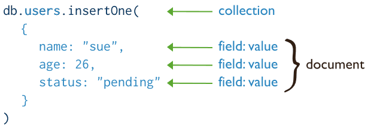

# MongoShell的CRUD操作

首先下载安装 Mongo Shell：[MongoDB Shell Download | MongoDB](https://www.mongodb.com/try/download/compass)

## 一. 连接和建库

### 1.1 连接Mongo服务器

```shell
$ mongosh --host 10.10.10.12:27017
Current Mongosh Log ID: 660f6a2dc1705fd55816c9b4
Connecting to:          mongodb://10.10.10.12:27017/?directConnection=true&appName=mongosh+2.2.3
Using MongoDB:          4.4.28
Using Mongosh:          2.2.3

For mongosh info see: https://docs.mongodb.com/mongodb-shell/

------
   The server generated these startup warnings when booting
   2024-04-04T11:15:03.470+00:00: /sys/kernel/mm/transparent_hugepage/enabled is 'always'. We suggest setting it to 'never'
------
```

### 1.2 查询数据库列表

```shell
> show dbs; # or show databases;
admin   0.000GB
config  0.000GB
local   0.000GB
test    0.000GB
```

### 1.3 建库

在 MongoDB 中，数据库会在你向其中插入数据时自动创建。当你向某个数据库中插入数据时，如果该数据库不存在，MongoDB 将会自动创建它。

例如，在使用 MongoDB shell 或 MongoDB 驱动程序时，当你使用 `use` 命令选择一个数据库并插入数据时，MongoDB 将会自动创建该数据库，如果它不存在的话。以下是一个示例：

```shell
> use test
switched to db test
> show dbs
admin   0.000GB
config  0.000GB
local   0.000GB
> db.myCollection.insertOne({name: "John", age: 30})
{
        "acknowledged" : true,
        "insertedId" : ObjectId("660f6c4672df6dbffd7387e7")
}
> show dbs
admin   0.000GB
config  0.000GB
local   0.000GB
test    0.000GB
```

### 1.4 删库

```shell
> use test
switched to db test
> db.dropDatabase()
{ "dropped" : "test", "ok" : 1 }
```

## 二. CRUD操作

[MongoDB CRUD官方文档](https://www.mongodb.com/docs/v3.6/crud/)

### 2.1 新增

创建或插入操作会将新文档添加到集合中。**如果该集合当前不存在，则插入操作将创建该集合**。

MongoDB 提供了以下方法将文档插入到集合中：

- `db.collection.insertOne()` 3.2 版新增功能
- `db.collection.insertMany()` 3.2 版新增功能

在 MongoDB 中，写入操作在单个文档级别上是原子的，即使该操作修改单个文档中的多个嵌入文档也是如此。当单个写操作修改多个文档时，每个文档的修改是原子的，但操作作为一个整体不是原子的，其他操作可能会交错。



示例：

1. 插入单个文档：

   ```shell
   > db.inventory.insertOne(
   	    { item: "canvas", qty: 100, tags: ["cotton"], size: { h: 28, w: 35.5, uom: "cm" } }
   )
   {
           "acknowledged" : true,
           "insertedId" : ObjectId("660f6d8a72df6dbffd7387e8")
   }
   ```

2. 插入多个文档：

   ```shell
   > db.inventory.insertMany([
   	    { item: "journal", qty: 25, tags: ["blank", "red"], size: { h: 14, w: 21, uom: "cm" } },
   	    { item: "mat", qty: 85, tags: ["gray"], size: { h: 27.9, w: 35.5, uom: "cm" } },
   	    { item: "mousepad", qty: 25, tags: ["gel", "blue"], size: { h: 19, w: 22.85, uom: "cm" } }
   ])
   {
           "acknowledged" : true,
           "insertedIds" : [
                   ObjectId("660f6dc672df6dbffd7387e9"),
                   ObjectId("660f6dc672df6dbffd7387ea"),
                   ObjectId("660f6dc672df6dbffd7387eb")
           ]
   }
   ```

   在 MongoDB 中，存储在集合中的每个文档都需要一个唯一的 _id 字段作为主键。如果插入的文档省略 `_id` 字段，MongoDB 驱动程序会自动为 `_id` 字段生成一个 ObjectId。

> 更多文档资料:
>
> [官方相关文档](https://docs.mongodb.com/v3.6/tutorial/insert-documents/)
>
> [官方相关示例 - Insert](https://docs.mongodb.com/v3.6/reference/method/db.collection.insert/#db.collection.insert)
>
> [官方相关示例 - InsertOne](https://docs.mongodb.com/v3.6/reference/method/db.collection.insertOne/)
>
> [官方相关示例 - InsertMany](https://docs.mongodb.com/v3.6/reference/method/db.collection.insertMany/)

### 2.2 查询

读取操作从集合中检索文档；即查询文档集合。 MongoDB 提供了以下方法从集合中读取文档：

- [`db.collection.find()`](https://www.mongodb.com/docs/v3.6/reference/method/db.collection.find/#db.collection.find)

您可以指定标识要返回的文档的查询过滤器或条件。


find方法中拥有两个参数：

| 参数名       | 类型 | 描述                                                         |
| :----------- | :--- | :----------------------------------------------------------- |
| `query`      | 文档 | 非必填。使用查询运算符指定选择过滤器。要返回集合中的所有文档，请省略此参数或传递空文档 ( `{}` )。 |
| `projection` | 文档 | 非必填。指定要在与查询过滤器匹配的文档中返回的字段。要返回匹配文档中的所有字段，请省略此参数。详细信息请参见投影。 |

#### 2.2.1 query

1. **查询所有文档**

如果想检索集合中的**所有文档**，可以在find方法中传一个**空文档**作为查询过滤条件。查询过滤参数确定选择条件：

```
db.inventory.find( {} )
```

上述操作对应如下SQL语句：

```
SELECT * FROM inventory
```

2. **等值查询**

在[查询过滤文档](https://docs.mongodb.com/manual/core/document/#std-label-document-query-filter)中使用 `<字段>:<值>` 表达式实现等值查询：

```
{ <field1>: <value1>, ... }
```

下面的案例返回inventory**集合中**status**等于**"D"**的所有文档:

```
db.inventory.find( { status: "D" } )
```

上述操作对应如下SQL语句：

```sql
SELECT * FROM inventory WHERE status = "D"
```

3. **查询条件中使用查询操作符**

[查询过滤文档](https://docs.mongodb.com/manual/core/document/#std-label-document-query-filter)中可以使用[查询操作符](https://docs.mongodb.com/manual/reference/operator/query/)来指定多个条件，格式如下:

```
{ <field1>: { <operator1>: <value1> }, ... }
```

下面的案例返回**inventory**集合中**status**等于**"A"**或**"D"**的所有文档。

```
db.inventory.find( { status: { $in: [ "A", "D" ] } } )
```

上述操作对应如下SQL:

```sql
SELECT * FROM inventory WHERE status in ("A", "D")
```

4. **AND条件**

可以指定文档中的多个字段作为查询条件。在查询语句中使用AND连接多个查询条件来检索集合中满足所有查询条件的文档。

下面的案例返回**inventory**集合中**status**等于**"A" **并且**qty**小于([$lt](https://docs.mongodb.com/manual/reference/operator/query/lt/#mongodb-query-op.-lt))**30**的所有文档:

```
db.inventory.find( { status: "A", qty: { $lt: 30 } } )
```

上述操作对应如下SQL:

```sql
SELECT * FROM inventory WHERE status = "A" AND qty < 30
```

关于MongoDB的比较操作符可以参考[比较操作符](https://docs.mongodb.com/v4.0/reference/operator/query-comparison/#query-selectors-comparison)

5. **OR条件**

使用[$or](https://docs.mongodb.com/v4.0/reference/operator/query/or/#op._S_or)运算符，可以指定一个联合查询，该查询将每个子句与逻辑 OR 连接起来，以便查询选择集合中至少匹配一个条件的文档。

下面的案例返回inventory集合中**status**等于**"A" **或者**qty**小于([$lt](https://docs.mongodb.com/manual/reference/operator/query/lt/#mongodb-query-op.-lt))30的所有文档。

```
db.inventory.find( { $or: [ { status: "A" }, { qty: { $lt: 30 } } ] } )
```

上述操作对应如下SQL:

```sql
SELECT * FROM inventory WHERE status = "A" OR qty < 30
```

6. 同时使用AND和OR

下面的案例返回inventory集合中status等于"A" 并且qty小于 ([$lt](https://docs.mongodb.com/manual/reference/operator/query/lt/#mongodb-query-op.-lt)) 30或者item 是以p字符开头的所有文档。

```sql
db.inventory.find( {
     status: "A",
     $or: [ { qty: { $lt: 30 } }, { item: /^p/ } ]
} )
```

上述操作对应如下SQL:

```sql
SELECT * FROM inventory WHERE status = "A" AND ( qty < 30 OR item LIKE "p%")
```

其他查询教程:

- [嵌套文档查询](https://docs.mongodb.com/manual/tutorial/query-embedded-documents/)
- [数组查询](https://docs.mongodb.com/manual/tutorial/query-arrays/)
- [数组中的嵌套文档查询](https://docs.mongodb.com/manual/tutorial/query-array-of-documents/)
- [查询语句中返回指定字段](https://docs.mongodb.com/manual/tutorial/project-fields-from-query-results/)
- [查询Null或者不存在的字段](https://docs.mongodb.com/manual/tutorial/query-for-null-fields/)

#### 2.2.2 projection

`projection` 参数确定匹配文档中返回哪些字段。 `projection` 参数采用以下形式的文档：

```shell
{ field1: <value>, field2: <value> ... }
```

`<value>` 可以是以下任意一种：

- `1` 或 `true` 表示结果中包含盖子段。
- `0` 或 `false` 排除该字段。
- 使用投影运算符的表达式，参考：[Projection Operators — MongoDB Manual](https://www.mongodb.com/docs/v3.6/reference/operator/projection/)。

> 对于 `_id` 字段，您不必显式指定 `_id: 1` 来返回 `_id` 字段。 `find()` 方法始终返回 _id 字段，除非您指定 `_id: 0` 抑制该字段。

### 2.3 更新

更新操作修改集合中的现有文档。 MongoDB 提供了以下方法来更新集合的文档：

- [`db.collection.updateOne()`](https://www.mongodb.com/docs/v3.6/reference/method/db.collection.updateOne/#db.collection.updateOne)
- [`db.collection.updateMany()`](https://www.mongodb.com/docs/v3.6/reference/method/db.collection.updateMany/#db.collection.updateMany) 
- [`db.collection.replaceOne()`](https://www.mongodb.com/docs/v3.6/reference/method/db.collection.replaceOne/#db.collection.replaceOne) 

在 MongoDB 中，更新操作针对单个集合。 MongoDB 中的所有写入操作在单个文档级别上都是原子的。

您可以指定用于标识要更新的文档的条件或过滤器。这些过滤器使用与读取操作相同的语法。


本页上的示例使用 `inventory` 集合。要创建和/或填充 `inventory` 集合，请运行以下命令：

```shell
db.inventory.insertMany( [
   { item: "canvas", qty: 100, size: { h: 28, w: 35.5, uom: "cm" }, status: "A" },
   { item: "journal", qty: 25, size: { h: 14, w: 21, uom: "cm" }, status: "A" },
   { item: "mat", qty: 85, size: { h: 27.9, w: 35.5, uom: "cm" }, status: "A" },
   { item: "mousepad", qty: 25, size: { h: 19, w: 22.85, uom: "cm" }, status: "P" },
   { item: "notebook", qty: 50, size: { h: 8.5, w: 11, uom: "in" }, status: "P" },
   { item: "paper", qty: 100, size: { h: 8.5, w: 11, uom: "in" }, status: "D" },
   { item: "planner", qty: 75, size: { h: 22.85, w: 30, uom: "cm" }, status: "D" },
   { item: "postcard", qty: 45, size: { h: 10, w: 15.25, uom: "cm" }, status: "A" },
   { item: "sketchbook", qty: 80, size: { h: 14, w: 21, uom: "cm" }, status: "A" },
   { item: "sketch pad", qty: 95, size: { h: 22.85, w: 30.5, uom: "cm" }, status: "A" }
] );
```

#### 2.3.1 更新集合中的文档

为了更新文档，MongoDB 提供了更新运算符，例如 `$set` 来修改字段值。

要使用更新运算符，请将以下形式的更新文档传递给更新方法：

```shell
{
  <update operator>: { <field1>: <value1>, ... },
  <update operator>: { <field2>: <value2>, ... },
  ...
}
```

如果字段不存在，某些更新运算符（例如 `$set` ）将创建该字段。有关详细信息，请参阅各个更新操作符参考。

1. **更新单个文档**

以下示例使用 `inventory` 集合上的 `db.collection.updateOne()` 方法来更新第一个文档，其中 `item` 等于 `"paper"` ：

```shell
db.inventory.updateOne(
   { item: "paper" },
   {
     $set: { "size.uom": "cm", status: "P" },
     $currentDate: { lastModified: true }
   }
)
```

- 使用 `$set` 运算符将 `size.uom` 字段的值更新为 `"cm"` ，将 `status` 字段的值更新为 `"P"`
- 使用 `$currentDate` 运算符将 `lastModified` 字段的值更新为当前日期。如果 `lastModified` 字段不存在， `$currentDate` 将创建该字段。有关详细信息，请参阅 [$currentDate](https://www.mongodb.com/docs/v3.6/reference/operator/update/currentDate/#up._S_currentDate) 。

2. **更新多个文档**

以下示例使用 `inventory` 集合上的 `db.collection.updateMany()` 方法来更新 `qty` 小于 `50` 的所有文档：

```shell
db.inventory.updateMany(
   { "qty": { $lt: 50 } },
   {
     $set: { "size.uom": "in", status: "P" },
     $currentDate: { lastModified: true }
   }
)
```

- 使用 `$set` 运算符将 `size.uom` 字段的值更新为 `"in"` ，将 `status` 字段的值更新为 `"P"`
- 使用 `$currentDate` 运算符将 `lastModified` 字段的值更新为当前日期。如果 `lastModified` 字段不存在， `$currentDate` 将创建该字段。有关详细信息，请参阅 [$currentDate](https://www.mongodb.com/docs/v3.6/reference/operator/update/currentDate/#up._S_currentDate) 。

#### 2.3.2 替换文档

要替换除 `_id` 字段之外的文档的全部内容，请将全新文档作为第二个参数传递给 `db.collection.replaceOne()` 。

替换文档时，替换文档必须仅包含字段/值对；即不包括更新运算符表达式。

替换文档可以具有与原始文档不同的字段。在替换文档中，您可以省略 `_id` 字段，因为 `_id` 字段是不可变的；但是，如果您确实包含 `_id` 字段，则它的值必须与当前值相同。

以下示例替换 `inventory` 集合中的第一个文档，其中 `item: "paper"` ：

```shell
db.inventory.replaceOne(
   { item: "paper" },
   { item: "paper", instock: [ { warehouse: "A", qty: 60 }, { warehouse: "B", qty: 40 } ] }
)
```

### 2.4 删除

删除操作从集合中删除文档。 MongoDB 提供了以下方法来删除集合中的文档：

- [`db.collection.deleteOne()`](https://www.mongodb.com/docs/v3.6/reference/method/db.collection.deleteOne/#db.collection.deleteOne)
- [`db.collection.deleteMany()`](https://www.mongodb.com/docs/v3.6/reference/method/db.collection.deleteMany/#db.collection.deleteMany)


示例：

```shell
> db.inventory.deleteMany({ status : "A" })
{ "acknowledged" : true, "deletedCount" : 4 }
> db.inventory.find( {} )
{ "_id" : ObjectId("5f1f96cf4326f1d6a51d3a7e"), "item" : "journal", "qty" : 25, "size" : { "h" : 14, "w" : 21, "uom" : "in" }, "status" : "P", "lastModified" : ISODate("2020-07-28T04:33:50.391Z") }
{ "_id" : ObjectId("5f1f96cf4326f1d6a51d3a80"), "item" : "mousepad", "qty" : 25, "size" : { "h" : 19, "w" : 22.85, "uom" : "in" }, "status" : "P", "lastModified" : ISODate("2020-07-28T04:33:50.391Z") }
{ "_id" : ObjectId("5f1f96cf4326f1d6a51d3a81"), "item" : "notebook", "qty" : 50, "size" : { "h" : 8.5, "w" : 11, "uom" : "in" }, "status" : "P" }
{ "_id" : ObjectId("5f1f96cf4326f1d6a51d3a82"), "item" : "paper", "instock" : [ { "warehouse" : "A", "qty" : 60 }, { "warehouse" : "B", "qty" : 40 } ] }
{ "_id" : ObjectId("5f1f96cf4326f1d6a51d3a83"), "item" : "planner", "qty" : 75, "size" : { "h" : 22.85, "w" : 30, "uom" : "cm" }, "status" : "D" }
{ "_id" : ObjectId("5f1f96cf4326f1d6a51d3a84"), "item" : "postcard", "qty" : 45, "size" : { "h" : 10, "w" : 15.25, "uom" : "in" }, "status" : "P", "lastModified" : ISODate("2020-07-28T04:33:50.392Z") }
```

### 2.5 BulkWrite

本质是就是将上述的操作批量化。

```js
try {
   db.characters.bulkWrite(
      [
         { insertOne :
            {
               "document" :
               {
                  "_id" : 4, "char" : "Dithras", "class" : "barbarian", "lvl" : 4
               }
            }
         },
         { insertOne :
            {
               "document" :
               {
                  "_id" : 5, "char" : "Taeln", "class" : "fighter", "lvl" : 3
               }
            }
         },
         { updateOne :
            {
               "filter" : { "char" : "Eldon" },
               "update" : { $set : { "status" : "Critical Injury" } }
            }
         },
         { deleteOne :
            { "filter" : { "char" : "Brisbane"} }
         },
         { replaceOne :
            {
               "filter" : { "char" : "Meldane" },
               "replacement" : { "char" : "Tanys", "class" : "oracle", "lvl" : 4 }
            }
         }
      ]
   );
}
catch (e) {
   print(e);
}
```

