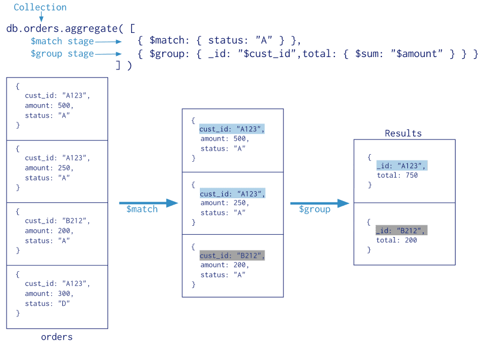
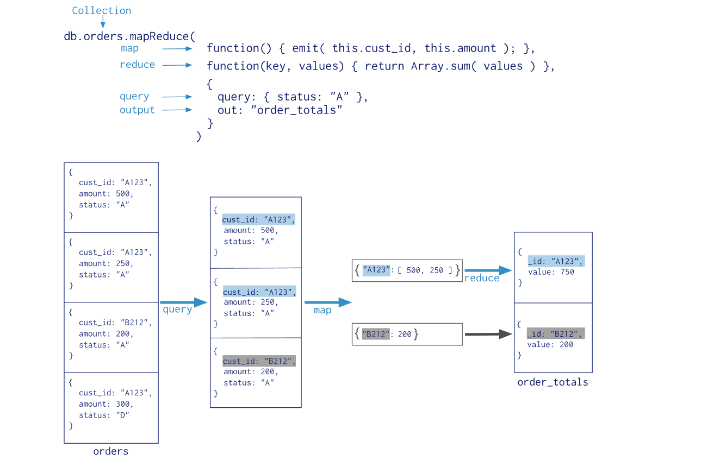

# MongoDB的聚合操作

聚合操作处理数据记录和 return 计算结果。聚合操作将来自多个文档的值组合在一起，并且可以对分组数据执行各种操作以返回单个结果。 MongoDB 提供了三种执行聚合的方法：[聚合管道](https://docs.mongoing.com/aggregation#聚合管道)，[map-reduce function](https://docs.mongoing.com/aggregation#map-reduce)和[单一目的聚合方法](https://docs.mongoing.com/aggregation#单用途聚合操作)。

## 一. 聚合管道

MongoDB 的[Aggregation framework](https://docs.mongoing.com/aggregation/aggregation-pipeline)是以数据处理管道的概念为蓝本的。文档进入多阶段管道，将文档转换为聚合结果。例如：

在这个例子中：

```
db.orders.aggregate([
   { $match: { status: "A" } },
   { $group: { _id: "$cust_id", total: { $sum: "$amount" } } }
])
```



**第一阶段**：[`$match`](https://docs.mongoing.com/aggregation)阶段按`status`字段过滤文档，并将`status`等于`"A"`的文档传递到下一阶段。

**第二阶段**：[`$group`](https://docs.mongoing.com/aggregation)阶段按`cust_id`字段将文档分组，以计算每个唯一值`cust_id`的金额总和。

最基本的管道阶段提供_过滤器_，其操作类似于查询和修改输出文档格式的_文档转换_。

其他管道操作提供了用于按特定字段对文档进行分组和排序的工具，以及用于汇总包括文档数组在内的数组内容的工具。另外，管道阶段可以将[运算符](https://docs.mongoing.com/aggregation)用于诸如计算平均值或连接字符串之类的任务。

管道使用MongoDB中的原生操作提供有效的数据聚合，并且是MongoDB中数据聚合的首选方法。

聚合管道可以在[分片集合 sharded collection](https://docs.mongoing.com/aggregation)上运行。

聚合管道可以使用索引来改善其某些阶段的性能。此外，聚合管道具有内部优化阶段。有关详细信息，请参阅[管道操作和索引](https://docs.mongoing.com/aggregation/aggregation-pipeline)和[聚合管道优化](https://docs.mongoing.com/aggregation/aggregation-pipeline/aggregation-pipeline-optimization)。

## 二. Map-Reduce

MongoDB 还提供[map-reduce](https://docs.mongoing.com/aggregation/map-reduce)操作来执行聚合。通常，map-reduce 操作有两个阶段：一个 map 阶段，它处理每个文档并为每个输入文档发出一个或多个对象，以及将map操作的输出组合在一起的 reduce 阶段。可选地，map-reduce 可以具有最终化阶段以对结果进行最终修改。与其他聚合操作一样，map-reduce 可以指定查询条件以选择输入文档以及对结果排序和限制。

Map-Reduce 使用自定义 JavaScript 函数来执行 map 和 reduce 操作，以及可选的 finalize 操作。与聚合管道相比，自定义JavaScript提供了很大的灵活性，但通常情况下，Map-Reduce 比聚合管道效率低，而且更复杂。

Map-Reduce 可以在[分片集合](https://docs.mongoing.com/aggregation)上运行。 Map-Reduce 操作也可以输出到分片集合。有关详细信息，请参阅[聚合管道和分片集合](https://docs.mongoing.com/aggregation/aggregation-pipeline/aggregation-pipeline-and-sharded-collections)和[Map-Reduce 和 Sharded Collections](https://docs.mongoing.com/aggregation/map-reduce/map-reduce-and-sharded-collections)。



