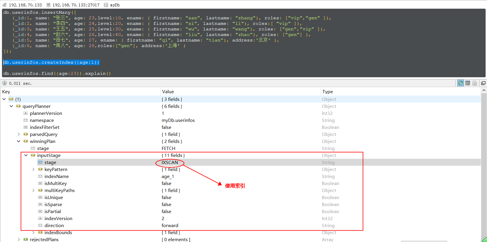
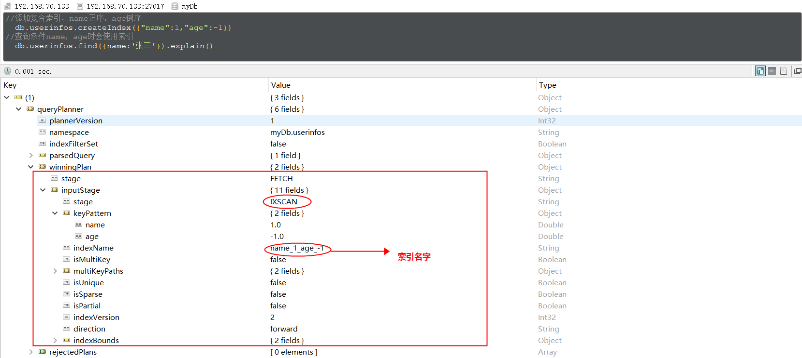
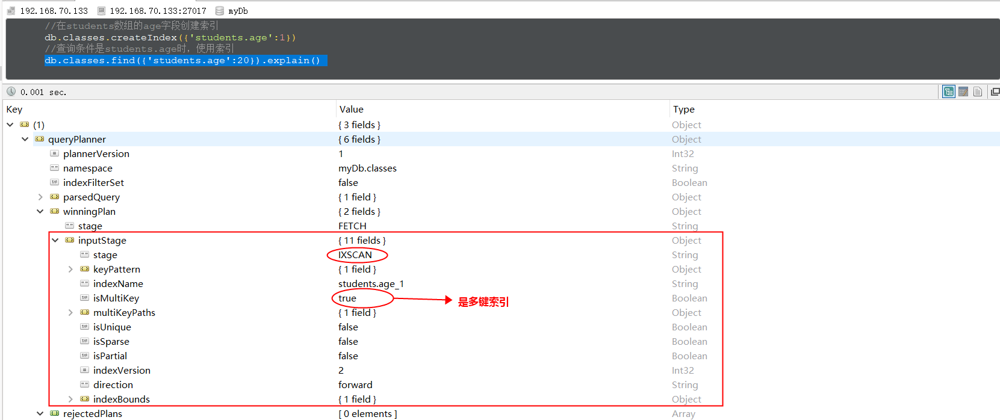
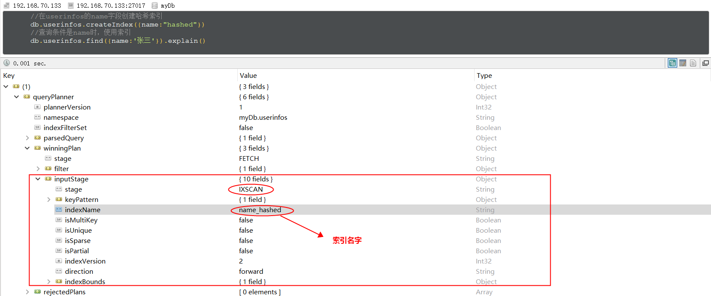
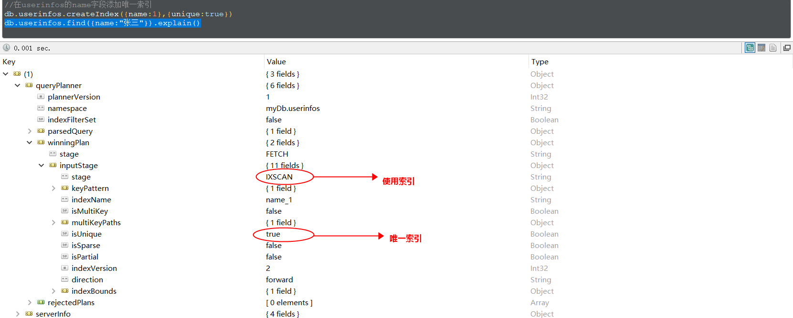
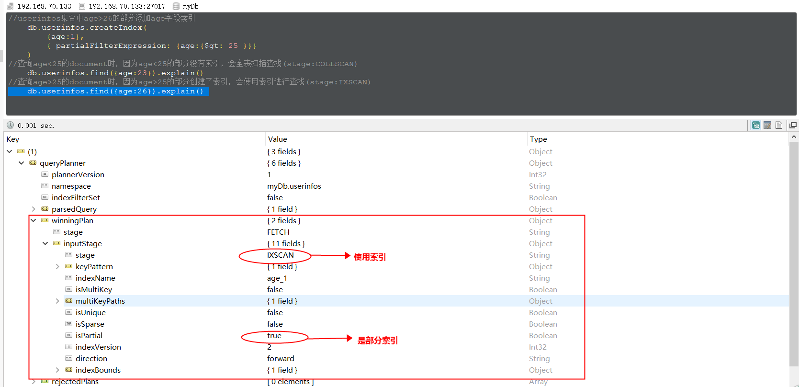
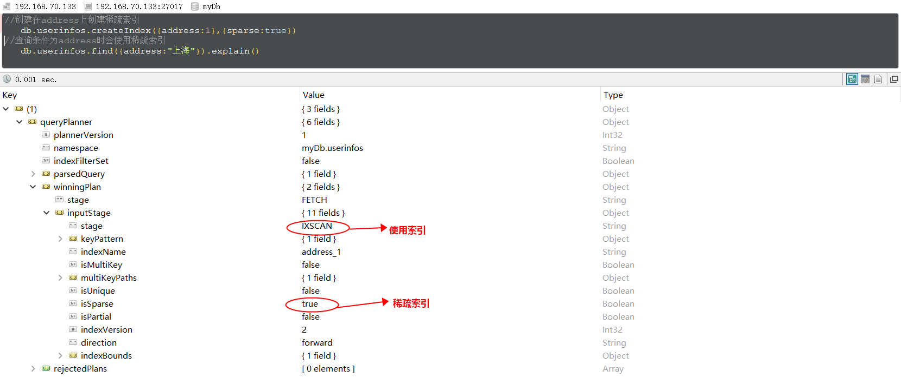

# MongoDB索引

节介绍mongoDB中的索引，熟悉mysql/sqlserver等关系型数据库的小伙伴应该都知道索引对优化数据查询的重要性。我们先简单了解一下索引：索引的本质就是一个排序的列表，在这个列表中存储着索引的值和包含这个值的数据(数据row或者document)的物理地址，索引可以大大加快查询的速度，这是因为使用索引后可以不再扫描全表来定位某行的数据，而是先通过索引表找到该行数据对应的物理地址(多数为B-tree查找)，然后通过地址来访问相应的数据。

索引可以加快数据检索、排序、分组的速度，减少磁盘I/O，但是索引也不是越多越好，因为索引本身也是数据表，需要占用存储空间，同时索引需要数据库进行维护，当我们对索引列的值进行增改删操作时，数据库需要更新索引表，这会增加数据库的压力。

我们要根据实际情况来判断哪些列适合添加索引，哪些列不适合添加索引，一般遵循的规律如下：

- 主/外键列，主键用于强制该列的唯一性和组织表中数据的排列结构；外键可以加快连接的速度；
- 经常用于比较的类(大于小于等于等)，因为索引已经排序，值就是大于/小于的分界点；
- 经常进行范围搜索，因为索引已经排序，其指定的范围是连续的；
- 经常进行排序的列，因为索引已经排序，这样查询可以利用索引的排序，加快排序查询时间；
- 经常进行分组的列，因为索引已经排序，同一个值的所有数据地址会聚集在一块，很方便分组。

我们看一下mongoDB的索引使用，首先准备数据：

```shell
db.userinfos.insertMany([
   {_id:1, name: "张三", age: 23,level:10, ename: { firstname: "san", lastname: "zhang"}, roles: ["vip","gen" ]},
   {_id:2, name: "李四", age: 24,level:20, ename: { firstname: "si", lastname: "li"}, roles:[ "vip" ]},
   {_id:3, name: "王五", age: 25,level:30, ename: { firstname: "wu", lastname: "wang"}, roles: ["gen","vip" ]},
   {_id:4, name: "赵六", age: 26,level:40, ename: { firstname: "liu", lastname: "zhao"}, roles: ["gen"] },
   {_id:5, name: "田七", age: 27, ename: { firstname: "qi", lastname: "tian"}, address:'北京' },
   {_id:6, name: "周八", age: 28,roles:["gen"], address:'上海' }
]);
```

## 一. 索引的管理

索引的增删改查还是十分简单的，我们看一下索引管理的几个方法：

```js
//创建索引,值1表示正序排序，-1表示倒序排序
db.collection.createIndex( <key and index type specification>, <options> )
// 例如：db.userinfos.createIndex({age:-1})

//查看userinfos中的所有索引
db.userinfos.getIndexes()

//删除特定一个索引
db.userinfos.dropIndex({name:1,age:-1})

//删除所有的索引(主键索引_id不会被删除)
db.userinfos.dropIndexes()
```

createIndex() 接收可选参数，可选参数列表如下：

| 参数               | 类型          | 描述                                                         |
| ------------------ | ------------- | ------------------------------------------------------------ |
| background         | Boolean       | 建索引过程会阻塞其它数据库操作，background可指定以后台方式创建索引，即增加 "background" 可选参数。 "background" 默认值为 false |
| unique             | Boolean       | 建立的索引是否唯一。指定为true创建唯一索引。默认值为 false。 |
| name               | string        | 索引的名称。如果未指定，MongoDB的通过连接索引的字段名和排序顺序生成一个索引名称。 |
| sparse             | Boolean       | 对文档中不存在的字段数据不启用索引；这个参数需要特别注意，如果设置为true的话，在索引字段中不会查询出不包含对应字段的文档.。默认值为 false. |
| expireAfterSeconds | integer       | 指定一个以秒为单位的数值，完成 TTL设定，设定集合的生存时间。 |
| v                  | index version | 索引的版本号。默认的索引版本取决于mongod创建索引时运行的版本。 |
| weights            | document      | 索引权重值，数值在 1 到 99,999 之间，表示该索引相对于其他索引字段的得分权重。 |
| default_language   | string        | 对于文本索引，该参数决定了停用词及词干和词器的规则的列表。 默认为英语 |
| language_override  | string        | 索引权重值，数值在 1 到 99,999 之间，表示该索引相对于其他索引字段的得分权重。 |
| dropDups           | Boolean       | 3.0+版本已废弃。在建立唯一索引时是否删除重复记录,指定 true 创建唯一索引。默认值为 false |

## 二. 常见的索引类型

### 2.1 单键索引

单键索引(Single Field Indexes)顾名思义就是单个字段作为索引列，mongoDB的所有collection默认都有一个单键索引_id，我们也可以对一些经常作为过滤条件的字段设置索引，如给age字段添加一个索引，语法十分简单：

```js
//给age字段添加升序索引
db.userinfos.createIndex({age:1})
```

其中 `{age:1}` 中的1表示升序，如果想设置倒序索引的话使用 `db.userinfos.createIndex({age:-1})` 即可。我们通过 `explain()` 方法查看查询计划，如下图，看到查询age=23的document时使用了索引，如果没有使用索引的话 `stage=COLLSCAN`。



因为document的存储是bson格式的，我们也可以给内置对象的字段添加索引，或者将整个内置对象作为一个索引，语法如下：

```js
//1.内嵌对象的某一字段作为索引
//在ename.firstname字段上添加索引
　　db.userinfos.createIndex({"ename.firstname":1})
//使用ename.firstname字段的索引查询
　　db.userinfos.find({"ename.firstname":"san"})

//2.整个内嵌对象作为索引
//给整个ename字段添加索引
　　db.userinfos.dropIndexes()
//使用ename字段的索引查询
　　db.userinfos.createIndex({"ename":1})
```

### 2.2 复合索引

复合索引(Compound Indexes)指一个索引包含多个字段，用法和单键索引基本一致。使用复合索引时要注意字段的顺序，如下添加一个name和age的复合索引，name正序，age倒序，document首先按照name正序排序，然后name相同的document按age进行倒序排序。mongoDB中一个复合索引最多可以包含32个字段。

```js
//添加复合索引，name正序，age倒序
db.userinfos.createIndex({"name":1,"age":-1}) 
//过滤条件为name，或包含name的查询会使用索引(索引的第一个字段)
db.userinfos.find({name:'张三'}).explain()
db.userinfos.find({name:"张三",level:10}).explain()
db.userinfos.find({name:"张三",age:23}).explain()

//查询条件为age时，不会使用上边创建的索引，而是使用的全表扫描
db.userinfos.find({age:23}).explain()
```

执行查询时查询计划如下：



### 2.3 多键索引

多键索引(mutiKey Indexes)是建在数组上的索引，在mongoDB的document中，有些字段的值为数组，多键索引就是为了提高查询这些数组的效率。看一个栗子：准备测试数据，classes集合中添加两个班级，每个班级都有一个students数组，如下：

```js
db.classes.insertMany([
     {
         "classname":"class1",
         "students":[{name:'jack',age:20},
                    {name:'tom',age:22},
                    {name:'lilei',age:25}]
      },
      {
         "classname":"class2",
         "students":[{name:'lucy',age:20},
                    {name:'jim',age:23},
                    {name:'jarry',age:26}]
      }]
  )
```

为了提高查询students的效率，我们使用 db.classes.createIndex({'students.age':1}) 给students的age字段添加索引，然后使用索引，如下图：



### 2.4 哈希索引

哈希索引(hashed Indexes)就是将field的值进行hash计算后作为索引，其强大之处在于实现O(1)查找，当然用哈希索引最主要的功能也就是实现定值查找，对于经常需要排序或查询范围查询的集合不要使用哈希索引。



## 三. 常见的索引属性

### 3.1 唯一索引

唯一索引(unique indexes)用于为collection添加唯一约束，即强制要求collection中的索引字段没有重复值。添加唯一索引的语法：

```js
//在userinfos的name字段添加唯一索引
db.userinfos.createIndex({name:1},{unique:true})
```

看一个使用唯一索引的栗子：



### 3.2 局部索引

局部索引(Partial Indexes)顾名思义，只对collection的一部分添加索引。创建索引的时候，根据过滤条件判断是否对document添加索引，对于没有添加索引的文档查找时采用的全表扫描，对添加了索引的文档查找时使用索引。使用方法也比较简单：

```js
//userinfos集合中age>25的部分添加age字段索引
    db.userinfos.createIndex(
        {age:1},
        { partialFilterExpression: {age:{$gt: 25 }}}
    )
//查询age<25的document时，因为age<25的部分没有索引，会全表扫描查找(stage:COLLSCAN)
    db.userinfos.find({age:23})
//查询age>25的document时，因为age>25的部分创建了索引，会使用索引进行查找(stage:IXSCAN)
    db.userinfos.find({age:26})
```

当查询age=23的记录时，stage=COLLSCAN，当查询age=26的记录时，使用了索引，如下：



### 3.3 稀疏索引

稀疏索引(sparse indexes)在有索引字段的document上添加索引，如在address字段上添加稀疏索引时，只有document有address字段时才会添加索引。而普通索引则是为所有的document添加索引，使用普通索引时如果document没有索引字段的话，设置索引字段的值为null。

稀疏索引的创建方式如下，当document包含address字段时才会创建索引：

```js
//创建在address上创建稀疏索引
db.userinfos.createIndex({address:1},{sparse:true})
```

看一个使用稀疏索引的栗子：



### 3.4 TTL索引

TTL索引(TTL indexes)是一种特殊的单键索引，用于设置document的过期时间，mongoDB会在document过期后将其删除，TTL非常容易实现类似缓存过期策略的功能。我们看一个使用TTL索引的栗子：

```js
//添加测试数据
db.logs.insertMany([
       {_id:1,createtime:new Date(),msg:"log1"},
       {_id:2,createtime:new Date(),msg:"log2"},
       {_id:3,createtime:new Date(),msg:"log3"},
       {_id:4,createtime:new Date(),msg:"log4"}
       ])
       //在createtime字段添加TTL索引，过期时间是120s
       db.logs.createIndex({createtime:1}, { expireAfterSeconds: 120 })


//logs中的document在创建后的120s后过期，会被mongoDB自动删除
```

注意：TTL索引只能设置在date类型字段(或者包含date类型的数组)上，过期时间为字段值+exprireAfterSeconds；document过期时不一定就会被立即删除，因为mongoDB执行删除任务的时间间隔是60s；capped Collection不能设置TTL索引，因为mongoDB不能主动删除capped Collection中的document。

## 四. 索引的无锁变更

默认情况下，创建索引的过程中将会阻止其它的操作；当在某个 collection 上创建索引的时候，该 collection 上的所有读、写操作都会被阻塞直到当前的索引创建成功为止；这样的话，会非常的影响 MongoDB 的查询；所以，为了保证 MongoDB 仍然可以对外正常的提供功能，Background 机制诞生了；

当有一个需要被长时间创建的索引，这个时候，可以考虑使用 **background** 机制，这样，在创建该索引的过程中，MongoDB 仍然能够尽最大可能保证当前可用；比如，你可以在一个庞大的 pepole collection 上对字段 zipcode 通过 background 的方式创建索引；

```js
db.people.createIndex( { zipcode: 1}, {background: true} )
```

默认情况下，**background** 取值为 false；

同时，你可以和其它的选项结合起来使用，

```js
db.people.createIndex( { zipcode: 1}, {background: true, sparse: true } )
```

这样，可以在后台创建一个稀疏索引；

需要注意的是，在后台创建索引的同时其它操作仍然可以进行；但有一个限制，那就是当前用于创建该索引的 connection 或 session 会被阻塞直到索引创建成功为止；所以，在后台创建索引的过程当中，若要继续对该索引进行操作，需要新建一个链接才可以；