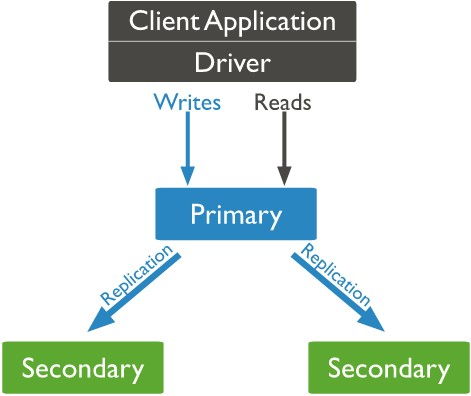
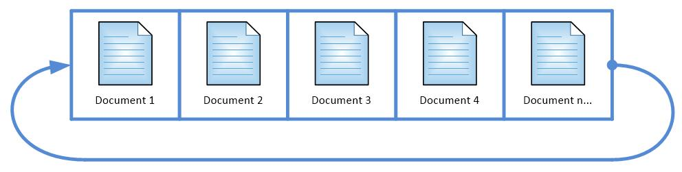
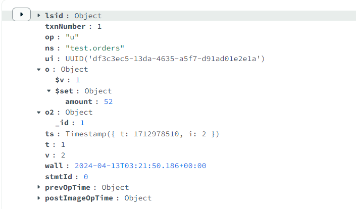
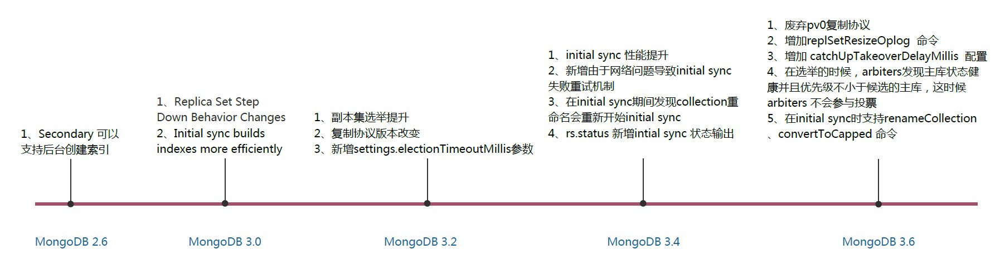
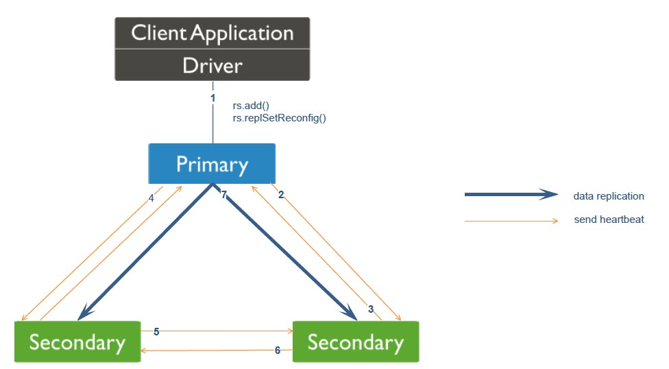
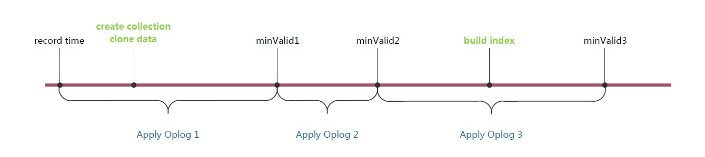
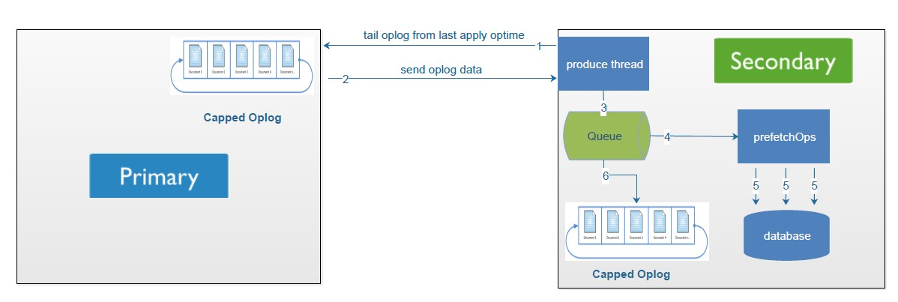
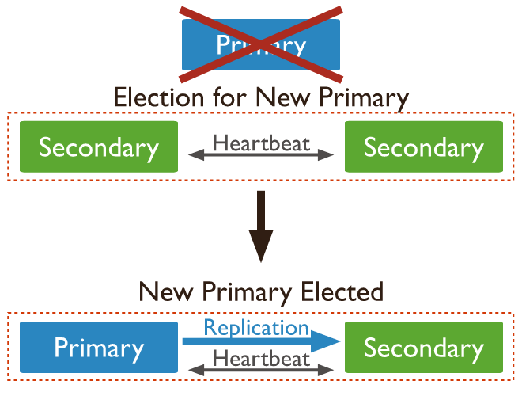

# MongoDB复制集原理

## 一. MongoDB复制简介

本章节首先会给大家简单介绍一些MongoDB复制集的一些基本概念，便于大家对后面内容的理解。

### 1.1 复制集的作用

- MongoDB 复制集的主要意义在于实现服务高可用，它的现实依赖于两个方面的功能：
  - 数据写入时将数据迅速复制到另一个独立的节点上
  - 在接受写入的节点发生故障时自动选举出一个新的替代节点
- 在实现高可用的同时，复制集实现了其他几个附加作用：
  - 数据分发：将数据从一个区域复制到另一个区域，减少另一个区域的读延迟
  - 读写分离：不同类型的压力分别在不同的节点上执行
  - 异地容灾：在数据中心故障的时候快速切换到异地

### 1.1 基本介绍

MongoDB有副本集及主从复制两种模式，今天给大家介绍的是副本集模式，因为主从模式在MongoDB 3.6也彻底废弃不使用了。

MongoDB副本集有Primary、Secondary、Arbiter三种角色。今天给大家介绍的是Primary与Secondary数据同步的内部原理。MongoDB副本集架构如下所示：



> 在 MongoDB 的副本集中，Arbiter（仲裁者）角色的节点并不是必须的，但通常情况下会建议至少有一个 Arbiter 节点。Arbiter 节点不存储数据，它的作用是帮助解决选举过程中的投票平局。当一个副本集中的节点数为偶数时，可能会出现投票平局的情况，此时 Arbiter 节点可以投出决定性的一票来解决这个问题。
>
> 为什么会有Arbiter：
>
> 有些场景下为了节省存储空间，没必要让复制集中所有的节点都进行数据复制，但是又需要奇数个节点解决投票平局的问题。

### 1.2 MongoDB Oplog

MongoDB Oplog 是 MongoDB Primary 和 Secondary 在复制建立期间和建立完成之后的复制介质，Primary 中所有的写入操作都会记录到 MongoDB Oplog 中，从节点通过在主节点上打开一个 `tailable` 游标不断获取新进入主节点的 `oplog`，并在自己的数据节点上回放，以此保持跟主节点的数据一致。这里的Oplog是MongoDB local数据库的一个集合，它是Capped collection，通俗意思就是它是固定大小，循环使用的。如下图：



MongoDB Oplog中的内容及字段介绍：

```json
{
    "ts": Timestamp(1446011584,
    2),
    "h": NumberLong("1687359108795812092"),
    "v": 2,
    "op": "i",
    "ns": "test.nosql",
    "o": {
        "_id": ObjectId("563062c0b085733f34ab4129"),
        "name": "mongodb",
        "score": "100"
    }
}
```

- ts： 操作时间，当前timestamp + 计数器，计数器每秒都被重置

- h：操作的全局唯一标识

- v：oplog版本信息

- op：操作类型

  - i：插入操作
  - u：更新操作
  - d：删除操作
  - c：执行命令（如createDatabase，dropDatabase）
- n：空操作，特殊用途
- ns：操作针对的集合
- o：操作内容，如果是更新操作
- o2：操作查询条件，仅update操作包含该字段



### 1.3 MongoDB复制发展

MongoDB目前已经迭代了很多个版本，下图我汇总了目前市面上常用版本中MongoDB在复制的一些重要改进。



## 二. MongoDB添加从库

### 2.1 添加从库命令

MongoDB添加从库比较简单，在安装从库之后，直接在主库执行 rs.add() 或者 replSetReconfig 命令即可添加，这两个命令其实在最终都调用 replSetReconfig 命令执行。大家有兴趣可以去翻阅MongoDB客户端JS代码。

### 2.2 具体步骤

然后我们来看副本集加一个新从库的大致步骤，如下图，右边的Secondary是我新加的从库。



通过上图我们可以看到一共有7个步骤，下面我们看看每一个步骤MongoDB都做了什么：

1. 主库收到添加从库命令
2. 主库更新副本集配置并与新从库建立心跳机制
3. 从库收到主库发送过来的心跳消息与主库建立心跳
4. 其他从库收到主库发来的新版本副本集配置信息并更新自己的配置
5. 其他从库与新从库建立心跳机制
6. 新从库收到其他从库心跳信息并跟其他从库建立心跳机制
7. 新加的节点将副本集配置信息更新到local.system.replset集合中，MongoDB会在一个循环中查询local.system.replset是否配置了replset 信息，一旦查到相关信息触发开启复制线程，然后判断是否需要全量复制，需要的话走全量复制，不需要走增量复制。
   8、 最终同步建立完成

注意：副本集所有节点之前都有相互的心跳机制，每2秒一次，在MongoDB 3.2版本以后我们可以通过heartbeatIntervalMillis参数来控制心跳频率。

上述过程大家可以结合副本集节点状态来看(rs.status命令)：

- STARTUP：在副本集每个节点启动的时候，mongod加载副本集配置信息，然后将状态转换为STARTUP2
- STARTUP2：加载配置之后决定是否需要做Initial Sync，需要则停留在STARTUP2状态，不需要则进入RECOVERING状态
- RECOVERING：处于不可对外提供读写的阶段，主要在Initial Sync之后追增量数据时候。

## 三. MongoDB复制流程详解

上面我们知道添加一个从库的大致流程，那我们现在来看主从数据同步的具体细节。当从库加入到副本集的时候，会判断自己是需要Initial Syc（全量同步）还是增量同步。那是通过什么条件判断的呢？

### 3.1 判断全量同步及增量同步

- 如果local数据库中的oplog.rs 集合是空的，则做全量同步。
- 如果minValid集合里面存储的是_initialSyncFlag，则做全量同步（用于init sync失败处理）
- 如果initialSyncRequested是true，则做全量同步（用于resync命令，resync命令只用于master/slave架构，副本集无法使用）

以上三个条件有一个条件满足就需要做全量同步。

我们可以得出在从库最开始加入到副本集的时候，只能先进行Initial Sync，下面我们来看看Initial Sync的具体流程

### 3.2 全量同步流程(Init sync)

#### 3.2.1 寻找同步源

这里先说明一点，MongoDB默认是采取级联复制的架构，就是默认不一定选择主库作为自己的同步源，如果不想让其进行级联复制，可以通过chainingAllowed参数来进行控制。在级联复制的情况下，你也可以通过replSetSyncFrom命令来指定你想复制的同步源。所以这里说的同步源其实相对于从库来说就是它的主库。那么同步源的选取流程是怎样的呢？

MongoDB从库会在副本集其他节点通过以下条件筛选符合自己的同步源。

- 如果设置了chainingAllowed 为 false，那么只能选取主库为同步源
- 找到与自己ping时间最小的并且数据比自己新的节点 （在副本集初始化的时候，或者新节点加入副本集的时候，新节点对副本集的其他节点至少ping两次）
- 该同步源与主库最新optime做对比，如果延迟主库超过30s，则不选择该同步源。
- 在第一次的过滤中，首先会淘汰比自己数据还旧的节点。如果第一次没有，那么第二次需要算上这些节点，防止最后没有节点可以做为同步源了。
- 最后确认该节点是否被禁止参与选举，如果是则跳过该节点。

通过上述筛选最后过滤出来的节点作为新的同步源。

其实MongoDB同步源在除了在Initial Sync和增量复制的时候选定之后呢，并不是一直是稳定的，它可能在以下情况下进行变更同步源：

- ping不通自己的同步源
- 自己的同步源角色发生变化
- 自己的同步源与副本集任意一个节点延迟超过30s

#### 3.2.2 删除MongoDB中除local以外的所有数据库

这里就到了Initial Sync的核心逻辑了，我下面以图和步骤的方式给大家展现MongoDB在做Initial Sync的具体流程。



同步流程如下：

1. **添加 _initialSyncFlag 到 minValid 集合：** 在同步过程中，我们向 minValid 集合中添加 _initialSyncFlag 字段，以便在同步过程中出现崩溃时能够重新启动初始同步。
2. **记录开始时间：** 记录当前主库最近一次的 oplog 时间，这是同步过程的起始点。
3. **克隆：** 从主节点克隆数据，即从当前主节点复制数据到副本集中的其他节点。
4. **设置 minValid1 到同步目标的最新 op 时间：** 将 minValid1 设置为同步目标节点的最新 op 时间，这将用于确定从主节点应用的操作的开始点。
5. **应用从开始到 minValid1 的操作，并根据需要获取缺失的文档（应用 Oplog 1）：** 在这一步中，副本集成员将应用从主节点的开始时间到 minValid1 时间点之间的操作，以确保它们的数据与主节点保持同步。如果有任何缺失的文档，副本集成员会从主节点获取这些文档。
6. **设置 minValid2 到同步目标的最新 op 时间：** 将 minValid2 设置为同步目标节点的最新 op 时间，这将用于确定从主节点应用的操作的终点。
7. **应用从 minValid1 到 minValid2 的操作（应用 Oplog 2）：** 在这一步中，副本集成员将应用从 minValid1 到 minValid2 时间点之间的操作，以确保它们的数据与主节点保持同步。
8. **构建索引：** 在副本集成员上构建索引，以确保数据的查询性能。
9. **设置 minValid3 到同步目标的最新 op 时间：** 将 minValid3 设置为同步目标节点的最新 op 时间，这将用于确定从主节点应用的操作的终点。
10. **应用从 minValid2 到 minValid3 的操作（应用 Oplog 3）：** 在这一步中，副本集成员将应用从 minValid2 到 minValid3 时间点之间的操作，以确保它们的数据与主节点保持同步。
11. **清理 minValid 集合：** 在同步过程完成后，清理 minValid 集合，包括移除 _initialSyncFlag 字段，并将时间戳设置为 minValid3 的 OpTime，以确保下一次同步能够正确地从这一点开始。

注：以上步骤直接copy的MongoDB源码中的注释。

以上步骤在Mongo 3.4 Initial Sync 有如下改进：

- 在创建的集合的时候同时创建了索引（与主库一样），在MongoDB 3.4版本之前只创建_id索引，其他索引等待数据copy完成之后进行创建。
- 在创建集合和拷贝数据的同时，也将oplog拷贝到本地local数据库中，等到数据拷贝完成之后，开始应用本地oplog数据。
- 新增由于网络问题导致Initial Sync 失败重试机制。
- 在Initial Sync期间发现collection 重命名了会重新开始Initial Sync。

上述4个新增特性提升了Initial Sync的效率并且提高了Initial Sync的可靠性，所以大家使用MongoDB最好使用最新版本MongoDB 3.4或者3.6，MongoDB 3.6 更是有一些令人兴奋的特性，这里就不在此叙述了。

全量同步完成之后，然后MongoDB会进入到增量同步的流程。

### 3.3 增量同步流程

上面我们介绍了Initial Sync，就是已经把同步源的存量数据拿过来了，那主库后续写入的数据怎么同步过来呢？下面还是以图跟具体的步骤来给大家介绍：



注：这里不一定是Primary，刚刚提到了同步源也可能是Secondary，这里采用Primary主要方便大家理解。

我们可以看到上述有6个步骤，那每个步骤具体做的事情如下：

1. Sencondary 初始化同步完成之后，开始增量复制，通过produce线程在Primary oplog.rs集合上建立cursor，并且实时请求获取数据。
2. Primary 返回oplog 数据给Secondary。
3. Sencondary 读取到Primary 发送过来的oplog，将其写入到队列中。
4. Sencondary 的同步线程会通过tryPopAndWaitForMore方法一直消费队列，当每次达到一定的条件之后，条件如下：

- 总数据大于100MB
- 已经取到部分数据但没到100MB，但是目前队列没数据了，这个时候会阻塞等待一秒，如果还没有数据则本次取数据完成。

上述两个条件满足一个之后，就会将数据给prefetchOps方法处理，prefetchOps方法主要将数据以database级别切分，便于后面多线程写入到数据库中。如果采用的WiredTiger引擎，那这里是以Docment ID 进行切分。

5. 最终将划分好的数据以多线程的方式批量写入到数据库中（在从库批量写入数据的时候MongoDB会阻塞所有的读）。
6. 然后再将Queue中的Oplog数据写入到Sencondary中的oplog.rs集合中。

## 四. MongoDB的高可用

上面我们介绍MongoDB复制的数据同步，我们知道除了数据同步，复制还有一个重要的地方就是高可用，一般的数据库是需要我们自己去定制方案或者采用第三方的开源方案。MongoDB则是自己在内部已经实现了高可用方案。

### 4.1 通过选举完成故障恢复

- 具有投票权的节点之前两两互相发送心跳
- 当 5 次心跳未收到时判断为节点失联
- 如果失联的是主节点，从节点会发起选举，选出新的主节点
- 如果失联的是从节点则不会产生新的选举
- 选举基于[RAFT一致性算法](https://raft.github.io/)实现，选举成功的必要条件是大多数投票节点存活
- 复制集中最多可以有 50 个节点，但具有投票权的节点最多 7 个



### 4.2 影响选举的因素

- 整个集群中必须有大多数节点存活
- 被选举为主节点的节点必须满足：
  - 能够与多数节点建立连接
  - 具有较新的 `oplog`
  - 具有较高的优先级（如果有配置）

### 4.3 常见选项

复制集在部署的时候有以下常见的选项可以进行配置：

- 是否具有投票权（v 参数）：有则参与投票
- 优先级（priority 参数）：优先级越高的节点越优先成为主节点。优先级为0的节点无法成为主节点
- 隐藏（hidden 参数）：复制数据，但对应用不可见。隐藏节点可以具有投票权，但优先级必须为0
- 延迟（slaveDelay 参数）：复制 n 秒之前的数据，保持与主节点的时间差

### 4.4 复制集注意事项

- 关于硬件
  - 因为正常的复制集节点都有可能成为主节点，它们的地位是一样的，因此硬件配置上必须一致
  - 为了保证节点不会同时宕机，各节点使用的硬件必须具有独立性
- 关于软件
  - 复制集各节点软件版本必须一致，以避免出现不可预知的问题
- 增加节点不会增加系统写性能

## 五. MongoDB复制总结

MongoDB复制内部原理已经给大家介绍完毕，以上其实还涉及很多细节没能一一列出。大家有兴趣可以自己去整理。这里还需要说明一点就是MongoDB版本迭代速度比较快，所以本文只针对于MongoDB 2.6 到MongoDB 3.4 版本，不过在某些版本可能会存在一些细节的变动，但是大体上的逻辑还是没有改变。最后大家如果有什么问题，也可以与我联系。