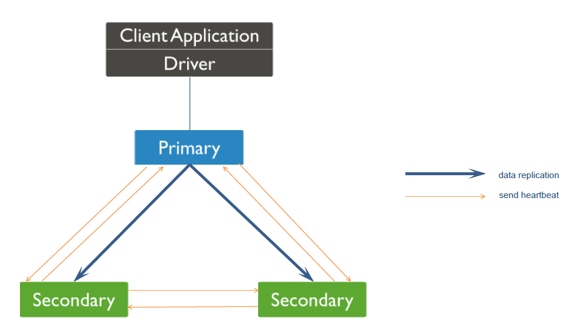

# MongoDB复制集原理

## 一. MongoDB复制简介

本章节首先会给大家简单介绍一些MongoDB复制的一些基本概念，便于大家对后面内容的理解。

### 1.1 基本介绍

MongoDB有副本集及主从复制两种模式，今天给大家介绍的是副本集模式，因为主从模式在MongoDB 3.6也彻底废弃不使用了。MongoDB副本集有Primary、Secondary、Arbiter三种角色。今天给大家介绍的是Primary与Secondary数据同步的内部原理。MongoDB副本集架构如下所示：


> 在 MongoDB 的副本集中，Arbiter（仲裁者）角色的节点并不是必须的，但通常情况下会建议至少有一个 Arbiter 节点。Arbiter 节点不存储数据，它的作用是帮助解决选举过程中的投票平局。当一个副本集中的节点数为偶数时，可能会出现投票平局的情况，此时 Arbiter 节点可以投出决定性的一票来解决这个问题。

### 1.2 MongoDB Oplog

MongoDB Oplog 是 MongoDB Primary 和 Secondary 在复制建立期间和建立完成之后的复制介质，就是 Primary 中所有的写入操作都会记录到 MongoDB Oplog 中，然后从库会来主库一直拉取Oplog并应用到自己的数据库中。这里的Oplog是MongoDB local数据库的一个集合，它是Capped collection，通俗意思就是它是固定大小，循环使用的。如下图：


MongoDB Oplog中的内容及字段介绍：

```json
{
    "ts": Timestamp(1446011584,
    2),
    "h": NumberLong("1687359108795812092"),
    "v": 2,
    "op": "i",
    "ns": "test.nosql",
    "o": {
        "_id": ObjectId("563062c0b085733f34ab4129"),
        "name": "mongodb",
        "score": "100"
    }
}
```

- ts： 操作时间，当前timestamp + 计数器，计数器每秒都被重置

- h：操作的全局唯一标识

- v：oplog版本信息

- op：操作类型

  - i：插入操作
  - u：更新操作
  - d：删除操作
  - c：执行命令（如createDatabase，dropDatabase）
- n：空操作，特殊用途
- ns：操作针对的集合
- o：操作内容，如果是更新操作
- o2：操作查询条件，仅update操作包含该字段


### 1.3 MongoDB复制发展

MongoDB目前已经迭代了很多个版本，下图我汇总了目前市面上常用版本中MongoDB在复制的一些重要改进。


## 二. MongoDB添加从库

### 2.1 添加从库命令

MongoDB添加从库比较简单，在安装从库之后，直接在主库执行 rs.add() 或者 replSetReconfig 命令即可添加，这两个命令其实在最终都调用 replSetReconfig 命令执行。大家有兴趣可以去翻阅MongoDB客户端JS代码。

### 2.2 具体步骤

然后我们来看副本集加一个新从库的大致步骤，如下图，右边的Secondary是我新加的从库。


通过上图我们可以看到一共有7个步骤，下面我们看看每一个步骤MongoDB都做了什么：

1. 主库收到添加从库命令
2. 主库更新副本集配置并与新从库建立心跳机制
3. 从库收到主库发送过来的心跳消息与主库建立心跳
4. 其他从库收到主库发来的新版本副本集配置信息并更新自己的配置
5. 其他从库与新从库建立心跳机制
6. 新从库收到其他从库心跳信息并跟其他从库建立心跳机制
7. 新加的节点将副本集配置信息更新到local.system.replset集合中，MongoDB会在一个循环中查询local.system.replset是否配置了replset 信息，一旦查到相关信息触发开启复制线程，然后判断是否需要全量复制，需要的话走全量复制，不需要走增量复制。
   8、 最终同步建立完成

注意：副本集所有节点之前都有相互的心跳机制，每2秒一次，在MongoDB 3.2版本以后我们可以通过heartbeatIntervalMillis参数来控制心跳频率。

上述过程大家可以结合副本集节点状态来看(rs.status命令)：

- STARTUP：在副本集每个节点启动的时候，mongod加载副本集配置信息，然后将状态转换为STARTUP2
- STARTUP2：加载配置之后决定是否需要做Initial Sync，需要则停留在STARTUP2状态，不需要则进入RECOVERING状态
- RECOVERING：处于不可对外提供读写的阶段，主要在Initial Sync之后追增量数据时候。

## 三. MongoDB复制流程详解

上面我们知道添加一个从库的大致流程，那我们现在来看主从数据同步的具体细节。当从库加入到副本集的时候，会判断自己是需要Initial Syc（全量同步）还是增量同步。那是通过什么条件判断的呢？

### 3.1 判断全量同步及增量同步

- 如果local数据库中的oplog.rs 集合是空的，则做全量同步。
- 如果minValid集合里面存储的是_initialSyncFlag，则做全量同步（用于init sync失败处理）
- 如果initialSyncRequested是true，则做全量同步（用于resync命令，resync命令只用于master/slave架构，副本集无法使用）

以上三个条件有一个条件满足就需要做全量同步。

我们可以得出在从库最开始加入到副本集的时候，只能先进行Initial Sync，下面我们来看看Initial Sync的具体流程

### 3.2 全量同步流程(Init sync)

#### 3.2.1 寻找同步源

这里先说明一点，MongoDB默认是采取级联复制的架构，就是默认不一定选择主库作为自己的同步源，如果不想让其进行级联复制，可以通过chainingAllowed参数来进行控制。在级联复制的情况下，你也可以通过replSetSyncFrom命令来指定你想复制的同步源。所以这里说的同步源其实相对于从库来说就是它的主库。那么同步源的选取流程是怎样的呢？

MongoDB从库会在副本集其他节点通过以下条件筛选符合自己的同步源。

- 如果设置了chainingAllowed 为 false，那么只能选取主库为同步源
- 找到与自己ping时间最小的并且数据比自己新的节点 （在副本集初始化的时候，或者新节点加入副本集的时候，新节点对副本集的其他节点至少ping两次）
- 该同步源与主库最新optime做对比，如果延迟主库超过30s，则不选择该同步源。
- 在第一次的过滤中，首先会淘汰比自己数据还旧的节点。如果第一次没有，那么第二次需要算上这些节点，防止最后没有节点可以做为同步源了。
- 最后确认该节点是否被禁止参与选举，如果是则跳过该节点。

通过上述筛选最后过滤出来的节点作为新的同步源。

其实MongoDB同步源在除了在Initial Sync和增量复制的时候选定之后呢，并不是一直是稳定的，它可能在以下情况下进行变更同步源：

- ping不通自己的同步源
- 自己的同步源角色发生变化
- 自己的同步源与副本集任意一个节点延迟超过30s

#### 3.2.2 删除MongoDB中除local以外的所有数据库

这里就到了Initial Sync的核心逻辑了，我下面以图和步骤的方式给大家展现MongoDB在做Initial Sync的具体流程。


同步流程如下：

1. **添加 _initialSyncFlag 到 minValid 集合：** 在同步过程中，我们向 minValid 集合中添加 _initialSyncFlag 字段，以便在同步过程中出现崩溃时能够重新启动初始同步。
2. **记录开始时间：** 记录当前主库最近一次的 oplog 时间，这是同步过程的起始点。
3. **克隆：** 从主节点克隆数据，即从当前主节点复制数据到副本集中的其他节点。
4. **设置 minValid1 到同步目标的最新 op 时间：** 将 minValid1 设置为同步目标节点的最新 op 时间，这将用于确定从主节点应用的操作的开始点。
5. **应用从开始到 minValid1 的操作，并根据需要获取缺失的文档（应用 Oplog 1）：** 在这一步中，副本集成员将应用从主节点的开始时间到 minValid1 时间点之间的操作，以确保它们的数据与主节点保持同步。如果有任何缺失的文档，副本集成员会从主节点获取这些文档。
6. **设置 minValid2 到同步目标的最新 op 时间：** 将 minValid2 设置为同步目标节点的最新 op 时间，这将用于确定从主节点应用的操作的终点。
7. **应用从 minValid1 到 minValid2 的操作（应用 Oplog 2）：** 在这一步中，副本集成员将应用从 minValid1 到 minValid2 时间点之间的操作，以确保它们的数据与主节点保持同步。
8. **构建索引：** 在副本集成员上构建索引，以确保数据的查询性能。
9. **设置 minValid3 到同步目标的最新 op 时间：** 将 minValid3 设置为同步目标节点的最新 op 时间，这将用于确定从主节点应用的操作的终点。
10. **应用从 minValid2 到 minValid3 的操作（应用 Oplog 3）：** 在这一步中，副本集成员将应用从 minValid2 到 minValid3 时间点之间的操作，以确保它们的数据与主节点保持同步。
11. **清理 minValid 集合：** 在同步过程完成后，清理 minValid 集合，包括移除 _initialSyncFlag 字段，并将时间戳设置为 minValid3 的 OpTime，以确保下一次同步能够正确地从这一点开始。

注：以上步骤直接copy的MongoDB源码中的注释。

以上步骤在Mongo 3.4 Initial Sync 有如下改进：

- 在创建的集合的时候同时创建了索引（与主库一样），在MongoDB 3.4版本之前只创建_id索引，其他索引等待数据copy完成之后进行创建。
- 在创建集合和拷贝数据的同时，也将oplog拷贝到本地local数据库中，等到数据拷贝完成之后，开始应用本地oplog数据。
- 新增由于网络问题导致Initial Sync 失败重试机制。
- 在Initial Sync期间发现collection 重命名了会重新开始Initial Sync。

上述4个新增特性提升了Initial Sync的效率并且提高了Initial Sync的可靠性，所以大家使用MongoDB最好使用最新版本MongoDB 3.4或者3.6，MongoDB 3.6 更是有一些令人兴奋的特性，这里就不在此叙述了。

全量同步完成之后，然后MongoDB会进入到增量同步的流程。

### 3.3 增量同步流程

上面我们介绍了Initial Sync，就是已经把同步源的存量数据拿过来了，那主库后续写入的数据怎么同步过来呢？下面还是以图跟具体的步骤来给大家介绍：


注：这里不一定是Primary，刚刚提到了同步源也可能是Secondary，这里采用Primary主要方便大家理解。

我们可以看到上述有6个步骤，那每个步骤具体做的事情如下：

1. Sencondary 初始化同步完成之后，开始增量复制，通过produce线程在Primary oplog.rs集合上建立cursor，并且实时请求获取数据。
2. Primary 返回oplog 数据给Secondary。
3. Sencondary 读取到Primary 发送过来的oplog，将其写入到队列中。
4. Sencondary 的同步线程会通过tryPopAndWaitForMore方法一直消费队列，当每次达到一定的条件之后，条件如下：

- 总数据大于100MB
- 已经取到部分数据但没到100MB，但是目前队列没数据了，这个时候会阻塞等待一秒，如果还没有数据则本次取数据完成。

上述两个条件满足一个之后，就会将数据给prefetchOps方法处理，prefetchOps方法主要将数据以database级别切分，便于后面多线程写入到数据库中。如果采用的WiredTiger引擎，那这里是以Docment ID 进行切分。

5. 最终将划分好的数据以多线程的方式批量写入到数据库中（在从库批量写入数据的时候MongoDB会阻塞所有的读）。
6. 然后再将Queue中的Oplog数据写入到Sencondary中的oplog.rs集合中。

## 四. MongoDB的高可用

上面我们介绍MongoDB复制的数据同步，我们知道除了数据同步，复制还有一个重要的地方就是高可用，一般的数据库是需要我们自己去定制方案或者采用第三方的开源方案。MongoDB则是自己在内部已经实现了高可用方案。下面我就给大家详细介绍一下MongoDB的高可用。

### 4.1 触发切换场景

首先我们看那些情况会触发MongoDB执行主从切换。

1. 新初始化一套副本集

2. 从库不能连接到主库（默认超过10s，可通过heartbeatTimeoutSecs参数控制），从库发起选举

3. 主库主动放弃primary 角色

   - 主动执行rs.stepdown 命令

   - 主库与大部分节点都无法通信的情况下

   - 修改副本集配置的时候（在Mongo 2.6版本会触发，其他版本待确定）

修改以下配置的时候：

- _id
- votes
- priotity
- arbiterOnly
- slaveDelay
- hidden
- buildIndexes

4. 移除从库的时候（在MongoDB 2.6会触发，MongoDB 3.4不会，其他版本待确定）

### 4.2 心跳机制

通过上面触发切换的场景，我们了解到MongoDB的心跳信息是MongoDB判断对方是否存活的重要条件，当达到一定的条件时，MongoDB主库或者从库就会触发切换。下面我给大家详细介绍一下心跳机制，MongoDB 副本集心跳机制图如下：



我们知道MongoDB副本集所有节点都是相互保持心跳的，然后心跳频率默认是2秒一次，也可以通过heartbeatIntervalMillis来进行控制。在新节点加入进来的时候，副本集中所有的节点需要与新节点建立心跳，那心跳信息具体是什么内容呢？

心跳信息内容：

```c
BSONObjBuilder cmdBuilder;
cmdBuilder.append("replSetHeartbeat", setName);
cmdBuilder.append("v", myCfgVersion);
cmdBuilder.append("pv", 1);
cmdBuilder.append("checkEmpty", checkEmpty);
cmdBuilder.append("from", from);
if (me &gt; -1) {
cmdBuilder.append("fromId", me);
}  
```

注：上述代码摘抄MongoDB 源码中构建心跳信息片段。

具体在MongoDB日志中表现如下：

```txt
command admin.$cmd command: replSetHeartbeat { replSetHeartbeat: "shard1", v: 21, pv: 1, checkEmpty: false, from: "10.13.32.244:40011", fromId: 3 } ntoreturn:1 keyUpdates:0
```

那副本集所有节点默认都是每2秒给其他剩余的节点发送上述信息，在其他节点收到信息后会调用ReplSetCommand命令来处理心跳信息，处理完成会返回如下信息：

```c
result.append("set", theReplSet-&gt;name());
MemberState currentState = theReplSet-&gt;state();
result.append("state", currentState.s);  // 当前节点状态
if (currentState == MemberState::RS_PRIMARY) {
    result.appendDate("electionTime", theReplSet-&gt;getElectionTime().asDate());
}
result.append("e", theReplSet-&gt;iAmElectable());  //是否可以参与选举
result.append("hbmsg", theReplSet-&gt;hbmsg());
result.append("time", (long long) time(0));
result.appendDate("opTime", theReplSet-&gt;lastOpTimeWritten.asDate());
const Member *syncTarget = replset::BackgroundSync::get()-&gt;getSyncTarget();
if (syncTarget) {
    result.append("syncingTo", syncTarget-&gt;fullName());
}

int v = theReplSet-&gt;config().version;
result.append("v", v);
if( v &gt; cmdObj["v"].Int() )
    result &lt;&lt; &quot;config&quot; &lt;config().asBson();
```

### 4.3 切换流程

前面我们了解了触发切换的场景以及MongoDB副本集节点之前的心跳机制。下面我们来看切换的具体流程：

1. 从库无法连接到主库，或者主库放弃Primary角色。
2. 从库会根据心跳消息获取当前该节点的角色并与之前进行对比
3. 如果角色发生改变就开始执行msgCheckNewState方法
4. 在msgCheckNewState 方法中最终调用electSelf 方法（会有一些判断来决定是否最终调用electSelf方法）
5. electSelf 方法最终向副本集其他节点发送replSetElect命令来请求投票。

命令如下：

```shell
BSONObj electCmd = BSON(
"replSetElect" << 1 <<
"set" << rs.name() <<
"who" << me.fullName() <<
"whoid" << me.hbinfo().id() <<
"cfgver" <version <<
"round" << OID::gen() /* this is just for diagnostics */
);
```

具体日志表现如下：

```txt
2017-12-14T10:13:26.917+0800 [conn27669] run command admin.$cmd { replSetElect: 1, set: “shard1”, who: “10.13.32.244:40015”, whoid: 4, cfgver: 27, round: ObjectId(‘5a31de4601fbde95ae38b4d2’) }
```

6. 其他副本集收到replSetElect会对比cfgver信息，会确认发送该命令的节点是否在副本集中，确认该节点的优先级是否是该副本集所有节点中优先级最大的。最后满足条件才会给该节点发送投票信息。
7. 发起投票的节点最后会统计所得票数大于副本集可参与投票数量的一半，则抢占成功，成为新的Primary。
8. 其他从库如果发现自己的同步源角色发生变化，则会触发重新选取同步源。

### 4.4 Rollback

我们知道在发生切换的时候是有可能造成数据丢失的，主要是因为主库宕机，但是新写入的数据还没有来得及同步到从库中，这个时候就会发生数据丢失的情况。

那针对这种情况，MongoDB增加了回滚的机制。在主库恢复后重新加入到复制集中，这个时候老主库会与同步源对比oplog信息，这时候分为以下两种情况：

1. 在同步源中没有找到比老主库新的oplog信息。
2. 同步源最新一条oplog信息跟老主库的optime和oplog的hash内容不同。

针对上述两种情况MongoDB会进行回滚，回滚的过程就是逆向对比oplog的信息，直到在老主库和同步源中找到对应的oplog，然后将这期间的oplog全部记录到rollback目录里的文件中，如果但是出现以下情况会终止回滚：

- 对比老主库的optime和同步源的optime，如果超过了30分钟，那么放弃回滚。
- 在回滚的过程中，如果发现单条oplog超过512M，则放弃回滚。
- 如果有dropDatabase操作，则放弃回滚。
- 最终生成的回滚记录超过300M，也会放弃回滚。

上述我们已经知道了MongoDB的回滚原理，但是我们在生产环境中怎么避免回滚操作呢，因为毕竟回滚操作很麻烦，而且针对有时序性的业务逻辑也是不可接受的。那MongoDB也提供了对应的方案，就是WriteConcern，这里就不细说了，有兴趣的朋友可以仔细了解。其实这也是在CAP中做出一个选择。

## 五. MongoDB复制总结

MongoDB复制内部原理已经给大家介绍完毕，以上其实还涉及很多细节没能一一列出。大家有兴趣可以自己去整理。这里还需要说明一点就是MongoDB版本迭代速度比较快，所以本文只针对于MongoDB 2.6 到MongoDB 3.4 版本，不过在某些版本可能会存在一些细节的变动，但是大体上的逻辑还是没有改变。最后大家如果有什么问题，也可以与我联系。