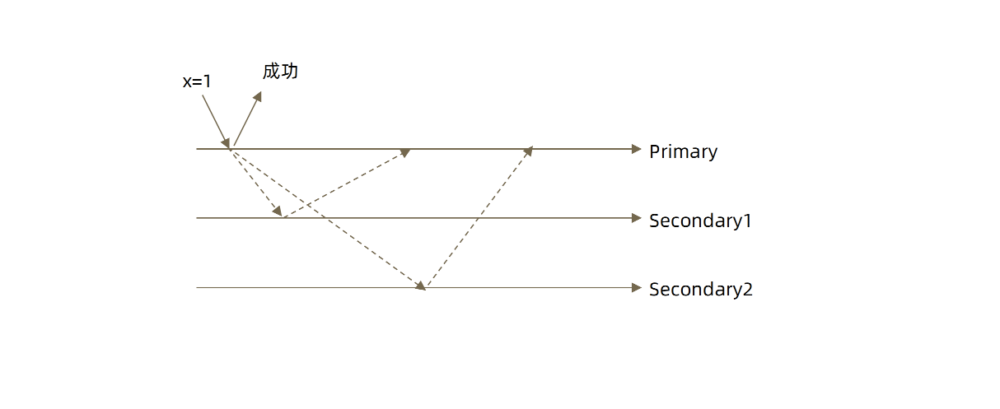
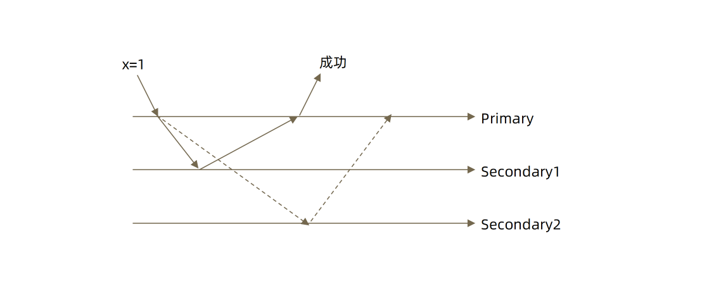
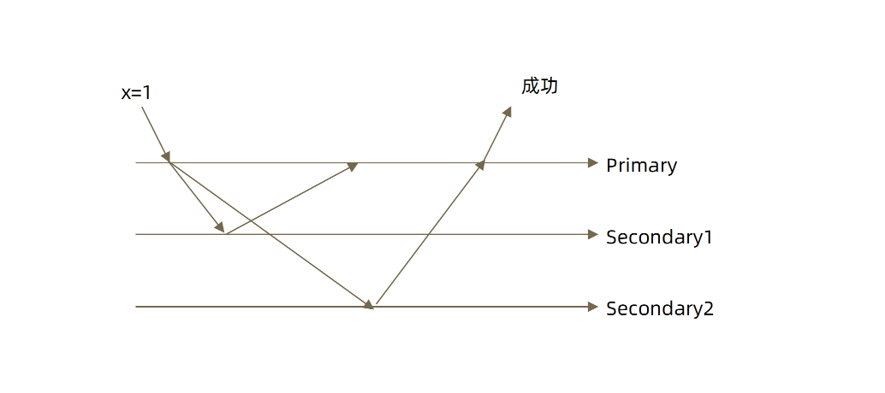

# MongoDB Write Concern

写入关注描述了 MongoDB 对独立 `mongod` 、副本集或分片集群的写入操作请求的确认级别。在分片集群中， `mongos` 实例会将写关注传递给分片。

writeConcern 决定一个写操作落到多少个节点上才算成功。writeConcern 的取值包括：

- 0：发起写操作，不关心是否成功
- 1~N：写操作需要被复制到指定节点数才算成功（默认值是1，代表写操作默认只保证写入Primary节点。如果是3，则代表保证写入一个Primary节点和2个Secondary节点）
- majority：写操作需要被复制到大多数节点上才算成功

发起写操作的程序将阻塞到写操作到达指定的节点数为止。

## 一. 默认行为

3 节点复制集不作任何特别设定（默认值）：

如上图所示，假设我们有三个节点的复制集，Primary、Secondary1、Secondary2，应用程序客户端试图写入一条数据 x=1，首先请求进入 MongoDB 的 Primary 节点，进入以后如果你没有做任何设置，它就取默认设置（只写一个节点），只要写到 Primary 节点上就马上响应成功（甚至都没有写到硬盘里只写到了内存中）。另外两条虚线表示异步的把刚才写入的 x=1 这条数据同步复制到其它两个节点，这个同步的过程是另一个线程后台执行的，这时就有可能会发生丢数据的情况，因为你请求写入 x=1，虽然响应给你成功，但这时主节点立即 Crash ，造成 Secondary1和Secondary2都没有时间把 x=1 这条数据给复制过来，这会导致在Secondary1和Secondary2之间选一个新的节点做为主节点来服务我们的客户端，在Secondary1和Secondary2是没有 x=1 这条数据的，这种情况下就会有**丢数据**的情况出现。

## 二. w: “majority” 行为

大多数节点确认模式：

如上图所示，应用程序客户端试图写入一条数据 x=1，首先请求进入 MongoDB 的 Primary 节点，这时并没有返回成功给客户端，写的进程在等待，它要等到数据复制到 Secondary1或Secondary2时（上图是Secondary1），某个 Secondary收到x=1这条数据时会响应一个 `acknowledgement`回复告诉说我已经拿到x=1这条数据了，只有拿到某个Secondary节点的响应成功后，这时主节点才会向客户端响应成功（告诉客户端我写入成功）。这时如果 Primary Crash，Secondary1就会成为主节点，但Secondary1已经有了x=1这条数据了，就能防止数据丢失。

我们有三个节点 `majority` 是大多数的意思，所以只要我有2个节点响应一个是 Primary，另一个是Secondary1和Secondary2其中一个节点，有两个响应后就可以响应给客户端成功。

所以如果我们要防止数据丢时，就使用`w: “majority”`，这也是推荐使用的方式。

## 三. w: “all”

全部节点确认模式：

如上图所示，请求写入一条数据 x=1，它要等待 Primary、Secondary1和Secondary2节点都响应成功之后，才响应给客户端成功。

`all`的意思是代表我请求的数据要全部写入到所有的节点之后才响应给客户端成功。

这是一种最安全的做法，缺点就是当某一个 Secondary 节点出现故障时它就会一直等待。

## 四. j:true

writeConcern 另一个属性是 `journal`（即日志），它的作用是当一个 MongoDB 节点发生故障时能够快速恢复刚才的写操作。一般情况下数据都会先写到 journal 再写到数据文件中，MongoDB 中默认情况下当我们的一个写操作进入到 Primary 节点内存的时候它不会等待数据写到 journal 再返回，但你可以强制告诉 MongoDB 说我这个写操作非常重要必须要落盘之后再返回，这种情况下也可以通过 writeConcern 机制来完成，做法就是增加一个 `j:true`参数。

`journal`参数能够进一步在事务中增加我们数据的安全和持久性。

writeConcern 可以决定写操作到达多少个节点才算成功，journal 则定义如何才算成功。取值包括：

- true: 写操作落到 journal 文件中才算成功。
- false: 写操作到达内存即算作成功。
