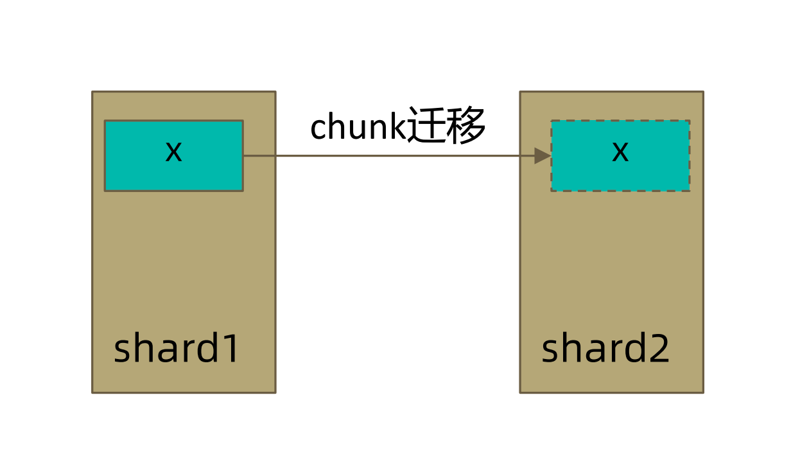
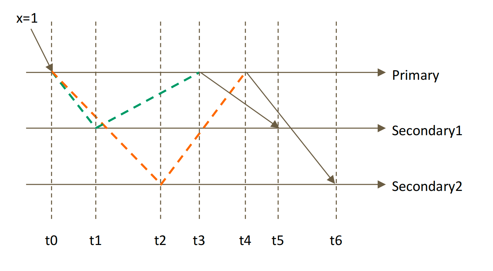

# MongoDB 读操作事务之

MongoDB 是一个分布式架构，在最小部署的情况下，它必须是一主两从3个节点的架构，如果涉及到分片的话还有 [mongos](https://www.mongodb.com/docs/v4.2/reference/program/mongos/#bin.mongos) 加在一起可能会有10多个节点，我们的数据就会分布在这些节点上，我们在读取数据的过程中我们需要关注以下两个问题：

- 从哪里读？
- 什么样的数据可以读？

第一个问题是是由 `readPreference` 来解决

第二个问题则是由 `readConcern` 来解决

## 一. Read Preference（读偏好）

### 1.1 什么是 Read Preference

`readPreference` 决定使用哪一个节点来满足正在发起的读请求。可选值包括：

- primary: 只选择主节点
- primaryPreferred：优先选择主节点，如果不可用则选择从节点
- secondary：只选择从节点
- secondaryPreferred：优先选择从节点，如果从节点不可用则选择主节点
- nearest：选择最近的节点

`readPreference` 场景举例：

- 用户下订单后马上将用户转到订单详情页 `primary/primaryPreferred`。因为此时从节点可能还没复制到新订单。
- 用户查询自己下过的订单`secondary/secondaryPreferred`。查询历史订单对时效性通常没有太高要求
- 生成报表`secondary`。报表对时效性要求不高，但资源需求大，可以在从节点单独处理，避免对线上用户造成影响
- 将用户上传的图片分发到全世界，让各地用户能够就近读取`nearest`。每个地区的应用选择最近的节点读取数据

### 1.2 readPreference 与 Tag

`readPreference` 只能控制使用一类节点，`Tag` 则可以将节点选择控制到一个或几个节点。考虑以下场景：

一个 5 个节点的复制集，3 个节点硬件较好，专用于服务线上客户，2 个节点硬件较差，专用于生成报表。

可以使用 Tag 来达到这样的控制目的：

- 为 3 个较好的节点打上 `{purpose: "online"}`
- 为 2 个较差的节点打上 `{purpose: "analyse"}`
- 在线应用读取时指定 online，报表读取时指定 reporting。

更多信息请参考文档：[readPreference](https://www.mongodb.com/docs/v4.2/core/read-preference-tags/)

### 1.3 readPreference 配置

- 通过 MongoDB 的连接串参数：

  ```shell
  mongodb://host1:27107,host2:27107,host3:27017/?replicaSet=rs&readPreference=secondary
  ```

- 通过 MongoDB 驱动程序 API：

  ```shell
  MongoCollection.withReadPreference(ReadPreference readPref)
  ```

- Mongo Shell：

  ```shell
  db.collection.find({}).readPref(“secondary”)
  ```

## 二. Read Concern（读关注）

### 2.1 什么是 readConcern？

在 `readPreference` 选择了指定的节点后，`readConcern`决定这个节点上的数据哪些是可读的，类似于关系数据库的隔离级别。可选值包括：

- `available`：读取所有可用的数据
- `local`：读取所有可用且属于当前分片的数据，默认设置
- `majority`：读取在大多数节点上提交完成的数据，**数据读一致性的充分保证，可能你最需要关注的**
- `linearizable`：可线性化读取文档，增强处理 majority 情况下主节点失联时候的例外情况
- `snapshot`：读取最近快照中的数据，隔离性是最强的，类似关系型数据库中的 `可串行化` 级别

### 2.2 local 和 available

在复制集中 `local` 和 `available` 是没有区别的。两者的区别主要体现在分片集上。考虑以下场景：

- 一个 chunk x 正在从 shard1 向 shard2 迁移，一个数据从一个分片迁移到另一个分片
- 整个迁移过程中 chunk x 中的部分数据会在 shard1 和 shard2 中同时存在，但源分片 shard1仍然是chunk x 的负责方：
  - 所有对 chunk x 的读写操作仍然进入 shard1
  - config 中记录的信息 chunk x 仍然属于 shard1
- 此时如果读 shard2，则会体现出`local`和 `available` 的区别：
  - local：只取应该由 shard2 负责的数据（不包括 x）
  - available：shard2 上有什么就读什么（包括 x）



注意事项：

- 虽然看上去总是应该选择 local，但毕竟对结果集进行过滤会造成额外消耗。在一些无关紧要的场景（例如统计）下，也可以考虑 `available`
- MongoDB <=3.6 不支持对从节点使用`{readConcern: "local"}`
- 从主节点读取数据时默认 `readConcern` 是 `local`，从从节点读取数据时默认`readConcern` 是 `available`（向前兼容原因）

### 2.3 majority

只读取大多数据节点上都提交了的数据。考虑如下场景：

- 集合中原有文档 `{x: 0}`
- 将x值更新为 `1`



如上图所示，在 t0 时间点的时候我们发送请求将文档更新到 `x=1`，t1 时间点的时候这条数据复制到 Secondary1 节点，t2 时间点的时候这条数据复制到 Secondary2 节点，t3 时间点的时候 Secondary1 节点响应成功（告诉说是我已经拿到了该条数据），t4 时间点的时候 Secondary2 节点响应成功（告诉说是我已经拿到了该条数据），t5 时间点的时候主节点告诉 Secondary1 节点，这时 Secondary1 节点已经知道该条数据至少在我自己的节点上（Secondary1）和主节点上都存在了，t6 时间点的时候主节点告诉 Secondary2 节点，这时 Secondary2 节点已经知道该条数据在我自己的节点上（Secondary2）和主节点上都存在了，这时三个节点都知道了该条数据在三个节点上都已经写完。

在上面这种情况下，如果在各节点上应用`{readConcern: “majority”}` 来读取数据：

| 时间点 | 主节点 | 第一个从节点 | 第二个从节点 | 说明                                                         |
| :----- | :----- | :----------- | :----------- | :----------------------------------------------------------- |
| t0     | x=0    | x=0          | x=0          | 只有主节点是有该条数据（只有主节点确认已完了该条数据） 从节点还没有该条数据，达不到大多数 |
| t1     | x=0    | x=0          | x=0          | 只有主节点是有该条数据 从节点只知道自己有该条数据，达不到大多数 |
| t2     | x=0    | x=0          | x=0          | 只有主节点是有该条数据 从节点只知道自己有该条数据，达不到大多数 |
| t3     | x=1    | x=0          | x=0          | 主节点收到了 Secondary1节点的响应，这时主节点知道自己和Secondary1节点都有这条数据了 |
| t4     | x=1    | x=0          | x=0          | 主节点收到了 Secondary2节点的响应，这时主节点知道自己和Secondary1、Secondary2节点都有这条数据了 |
| t5     | x=1    | x=1          | x=0          | Secondary1节点从主节点那里获知到主节点有该条数据，自己有该条数据，加起来有两个节点有该条数据 |
| t6     | x=1    | x=1          | x=1          | Secondary2节点从主节点那里获知到主节点有该条数据，Secondary1有该条数据，自己有该条数据，这时加起来有三个节点有该条数据 |

### 2.4 linearizable

它和 `majority`有些类似：只读取大多数节点确认过的数据。和`majority` 最大差别是保证绝对的操作线性顺序：在写操作自然时间后面的发生的读，一定可以读到之前的写。

使用注意：

- 只对读取单个文档时有效
- 可能导致非常慢的读，因此总是建议配合使用 maxTimeMS

### 2.5 snapshot

只在多文档事务中生效。将一个事务的 `readConcern`设置为 `snapshot`，将保证在事务中的读满足：

- 不出现脏读
- 不出现不可重复读
- 不出现幻读

因为所有的读都将使用同一个快照，直到事务提交为止该快照才被释放。

> 转载至：[MongoDB 读操作事务之readConcern | 一代键客 (zhangquan.me)](https://zhangquan.me/2023/02/23/mongodb-du-cao-zuo-shi-wu-zhi-readconcern/#toc-heading-4)