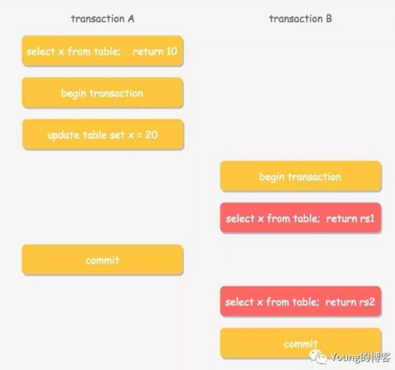
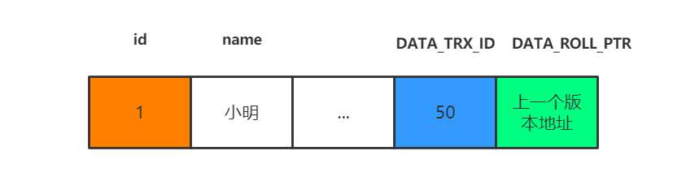
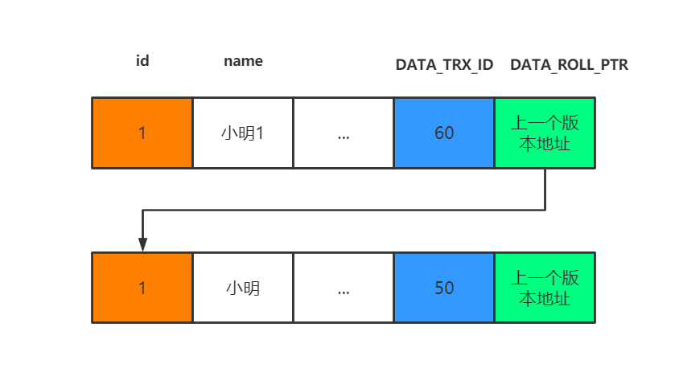
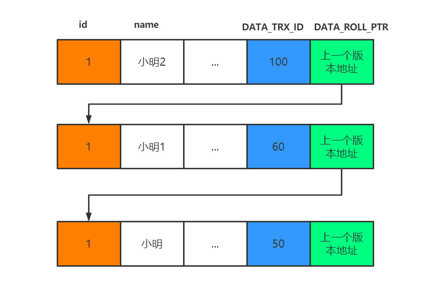
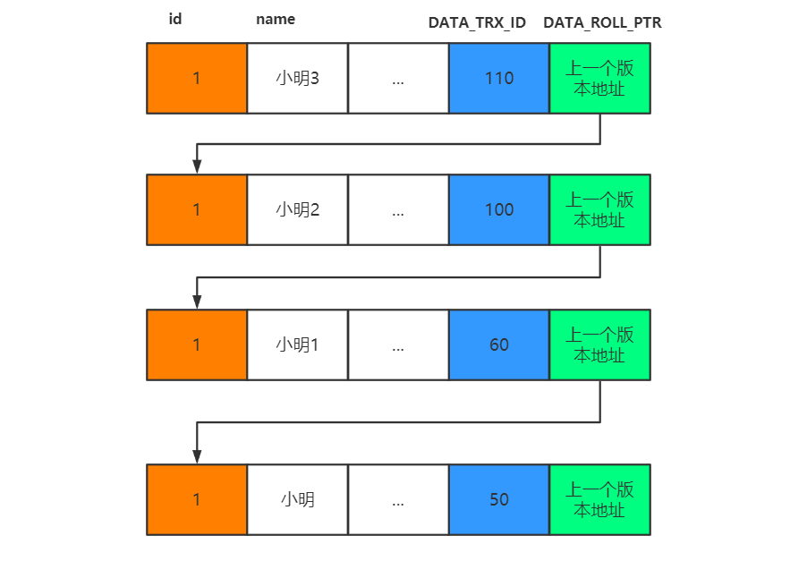

# 什么是MVCC机制

> 说明：本文参考至：<https://baijiahao.baidu.com/s?id=1629409989970483292&wfr=spider&for=pc>以及<https://www.codercto.com/a/88775.html>

`MVCC (Multiversion Concurrency Control)`  中文全称叫 多版本并发控制 ，是现代数据库（包括  `MySQL` 、 `Oracle` 、 `PostgreSQL`  等）引擎实现中常用的处理读写冲突的手段， 目的在于提高 [数据库](http://www.codercto.com/category/database.html) 高并发场景下的吞吐性能 。

如此一来不同的事务在并发过程中， `SELECT`  操作可以不加锁而是通过  `MVCC`  机制读取指定的版本历史记录，并通过一些手段保证保证读取的记录值符合事务所处的隔离级别，从而解决并发场景下的读写冲突。

下面举一个多版本读的例子，例如两个事务  `A`  和  `B`  按照如下顺序进行更新和读取操作



在事务  `A`  提交前后，事务  `B`  读取到的  `x`  的值是什么呢？答案是：事务  `B`  在不同的隔离级别下，读取到的值不一样。

1. 如果事务  `B`  的隔离级别是读未提交（RU），那么两次读取均读取到  `x`  的最新值，即  `20` 。
2. 如果事务  `B`  的隔离级别是读已提交（RC），那么第一次读取到旧值  `10` ，第二次因为事务  `A`  已经提交，则读取到新值 20。
3. 如果事务  `B`  的隔离级别是可重复读或者串行（RR，S），则两次均读到旧值  `10` ，不论事务  `A`  是否已经提交。

可见在不同的隔离级别下，数据库通过  `MVCC`  和隔离级别，让事务之间并行操作遵循了某种规则，来保证单个事务内前后数据的一致性。

## 一. 为什么需要MVCC机制

`InnoDB`  相比  `MyISAM`  有两大特点，一是支持事务而是支持行级锁，事务的引入带来了一些新的挑战。相对于串行处理来说，并发事务处理能大大增加数据库资源的利用率，提高数据库系统的事务吞吐量，从而可以支持可以支持更多的用户。但并发事务处理也会带来一些问题，主要包括以下几种情况：

1. 更新丢失（ `Lost Update` ）：当两个或多个事务选择同一行，然后基于最初选定的值更新该行时，由于每个事务都不知道其他事务的存在，就会发生丢失更新问题 —— 最后的更新覆盖了其他事务所做的更新。如何避免这个问题呢，最好在一个事务对数据进行更改但还未提交时，其他事务不能访问修改同一个数据。
2. 脏读（ `Dirty Reads` ）：一个事务正在对一条记录做修改，在这个事务并提交前，这条记录的数据就处于不一致状态；这时，另一个事务也来读取同一条记录，如果不加控制，第二个事务读取了这些尚未提交的脏数据，并据此做进一步的处理，就会产生未提交的数据依赖关系。这种现象被形象地叫做  “脏读” 。
3. 不可重复读（ `Non-Repeatable Reads` ）：一个事务在读取某些数据已经发生了改变、或某些记录已经被删除了！这种现象叫做“不可重复读”。
4. 幻读（ `Phantom Reads` ）：一个事务按相同的查询条件重新读取以前检索过的数据，却发现其他事务插入了满足其查询条件的新数据，这种现象就称为  “幻读” 。

以上是并发事务过程中会存在的问题，解决更新丢失可以交给应用，但是后三者需要数据库提供事务间的隔离机制来解决。 **实现隔离机制的方法主要有两种** ：

1. 加读写锁
2. 一致性快照读，即  `MVCC`

但本质上，隔离级别是一种在并发性能和并发产生的副作用间的妥协，通常数据库均倾向于采用  `Weak Isolation` 。

## 二. InnoDB MVCC实现原理

我们先来理解一下版本链的概念。在InnoDB引擎表中，它的聚簇索引记录中有两个必要的隐藏列：

- **DATA_DATA_TRX_ID**

记录最近更新这条行记录的 `事务 ID` ，大小为  `6`  个字节

- **DATA_ROLL_PTR**

每次对哪条聚簇索引记录有修改的时候，都会把老版本写入undo日志中。这个`DATA_ROLL_PTR`就是存了一个指针，它指向这条聚簇索引记录的上一个版本的位置，通过它来获得上一个版本的记录信息。(注意插入操作的undo日志没有这个属性，因为它没有老版本)

- **DB_ROW_ID**

行标识（隐藏单调自增  `ID` ），大小为  `6`  字节，如果表没有主键， `InnoDB`  会自动生成一个隐藏主键，因此会出现这个列。另外，每条记录的头信息（ `record header` ）里都有一个专门的  `bit` （ `deleted_flag` ）来表示当前记录是否已经被删除。

假如数据库中现在拥有这么一条数据：



比如现在有个事务id是60的执行的这条记录的修改语句:

```sql
update xxx set name = '小明1' where id = 1
```

此时在undo日志中就存在版本链：



事务ID为60的事务操作过程：

1. 对  `DB_ROW_ID = 1`  的这行记录加排他锁
2. 把该行原本的值拷贝到  `undo log`  中， `DB_DATA_TRX_ID`  和  `DB_ROLL_PTR`  都不动
3. 修改该行的值这时产生一个新版本，更新  `DATA_DATA_TRX_ID`  为修改记录的事务  `ID` ，将  `DATA_ROLL_PTR`  指向刚刚拷贝到  `undo log`  链中的旧版本记录，这样就能通过  `DB_ROLL_PTR`  找到这条记录的历史版本。如果对同一行记录执行连续的  `UPDATE` ， `Undo Log`  会组成一个链表，遍历这个链表可以看到这条记录的变迁
4. 记录  `redo log` ，包括  `undo log`  中的修改

## 三. ReadView

说了版本链我们再来看看ReadView。**已提交读和可重复读的区别就在于它们生成ReadView的策略不同**。

ReadView中主要就是有个列表来**存储我们系统中当前活跃着的读写事务**，也就是begin了还未提交的事务。通过这个列表来判断记录的某个版本是否对当前事务可见。假设当前列表里的事务id为[80,100]。

- 如果你要访问的记录版本的事务id为50，比当前列表最小的id80小，那说明这个事务在之前就提交了，所以对当前活动的事务来说是可访问的。
- 如果你要访问的记录版本的事务id为70,发现此事务在列表id最大值和最小值之间，那就再判断一下是否在列表内，如果在那就说明此事务还未提交，所以版本不能被访问。如果不在那说明事务已经提交，所以版本可以被访问。
- 如果你要访问的记录版本的事务id为110，那比事务列表最大id100都大，那说明这个版本是在ReadView生成之后才发生的，所以不能被访问。

这些记录都是去版本链里面找的，先找最近记录，如果最近这一条记录事务id不符合条件，不可见的话，再去找上一个版本再比较当前事务的id和这个版本事务id看能不能访问，以此类推直到返回可见的版本或者结束。

**举个例子** ，在**已提交读隔离级别**下：

比如此时有一个事务id为100的事务，修改了name,使得的name等于小明2，但是事务还没提交。则此时的版本链是:



那此时另一个事务发起了select 语句要查询id为1的记录，那此时生成的ReadView 列表只有[100]。那就去版本链去找了，首先肯定找最近的一条，发现`DATA_TRX_ID`是100,也就是name为小明2的那条记录，发现在列表内，所以不能访问。

这时候就通过指针继续找下一条，name为小明1的记录，发现`DATA_TRX_ID`是60，小于列表中的最小id,所以可以访问，直接访问结果为小明1。

那这时候我们把事务id为100的事务提交了，并且新建了一个事务id为110也修改id为1的记录，并且不提交事务。

```sql
update table set name = '小明3' where id = 1
```

这时候版本链就是：



这时候之前那个select事务又执行了一次查询,要查询id为1的记录。

**关键的地方来了**

如果你是**已提交读隔离级别，这时候你会重新生成一个ReadView**，那你的活动事务列表中的值就变了，变成了[110]。

按照上的说法，你去版本链通过`DATA_TRX_ID`对比查找到合适的结果就是小明2。

如果你是**可重复读隔离级别，这时候你的ReadView还是第一次select时候生成的ReadView,**也就是列表的值还是[100]。所以select的结果是小明1。所以第二次select结果和第一次一样，所以叫可重复读！

**也就是说已提交读隔离级别下的事务在每次查询的开始都会生成一个独立的ReadView,而可重复读隔离级别则在第一次读的时候生成一个ReadView，之后的读都复用之前的ReadView。**

这就是MySQL的MVCC，通过版本链，实现多版本，可并发读-写，写-读。通过ReadView生成策略的不同实现不同的隔离级别。

## 四. MVCC为何无法解决幻读的问题

todo