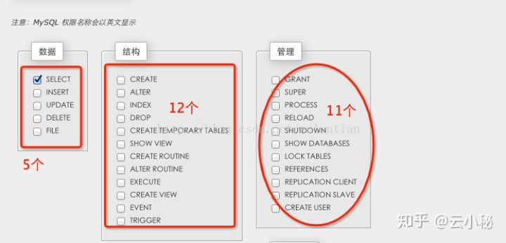
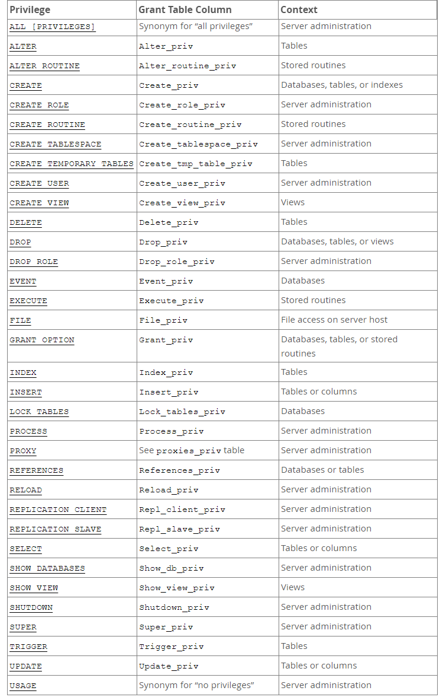
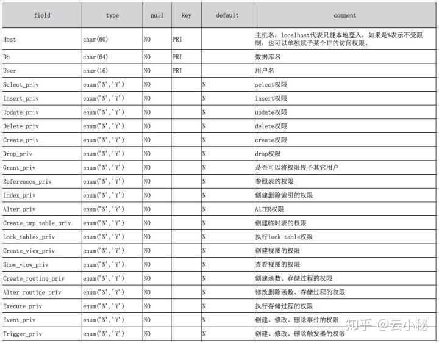
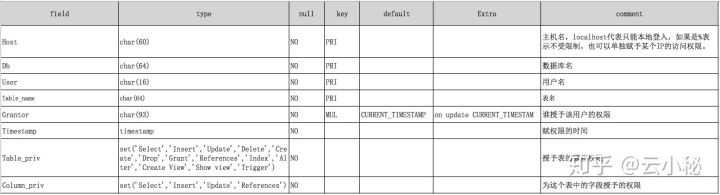
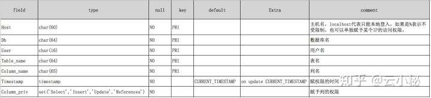
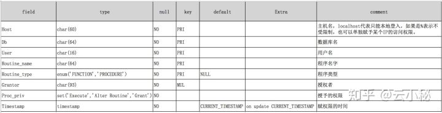

# MySQL用户及权限

- [引言](#0)
- [一. MySQL用创建与授权](#1)
  - [1.1 MySQL 8.0 之前版本创建用户与授权](#1.1)
  - [1.2 MySQL 8.0 创建用户与授权](#1.2)
  - [1.3 修改密码](#1.3)
- [二. MySQL权限原理](#2)
  - [2.1 用户认证](#2.1)
  - [2.2 MySQL用户权限层级](#2.2)
  - [2.3 MySQL权限简单分类](#2.3)
  - [2.4 MySQL权限详情](#2.4)
- [三. MySQL访问控制](#3)
  - [3.1 用户连接时的检查](#3.1)
  - [3.2 执行SQL语句时的检查](#3.2)
- [四. 权限表字段详解](#4)
  - [4.1 user表](#4.1)
  - [4.2 db表](#4.2)
  - [4.3 tables_priv表](#4.3)
  - [4.4 columns_priv表](#4.4)
  - [4.5 procs_priv表](#4.5)
- [五. MySQL 用户和权限管理经验](#5)
  - [5.1 用户管理经验](#5.1)
  - [5.2 权限管理经验](#5.2)

## **引言**<a name="0"></a>

数据库保存着应用程序日积夜累记录下来的数据资产，安全级别特别高，所以只能让授权的用户可以访问，其他用户需一律拒绝。MySQL是一个多用户数据库，拥有功能强大的访问控制系统，可以为不同的用户指定不同的权限。 小编一直对MySQL的用户及权限管理都是一知半解，存有疑问，具体疑问如下:

**1.MySQL如何认证一个用户？**

小编认为"用户认证"就是为了解决一个问题:你是谁？在国内，中国公民要证明他是谁，只要拿出身份证就可以，因为身份证上的照片，姓名，家庭住址，性别，出生年月，身份证号码等信息，是中国政府为了说明你就是中国大地上某个地方的某某某而制定的。那么在MySQL Server中，一个用户是如何认证的？

**2.MySQL的权限分哪几种及存储在什么地方？**

小编认为"MySQL权限"是为了解决一个问题: 你能在MySQL Server内干哪些事情？就好比图书馆一样，只有办了卡的人才允许进入，不同的卡可以进入不同的图书馆区域，可以做不同的事情，即拥有不一样的权限，那么MySQL的权限有哪些？并且这些权限存储在哪里？

**3. MySQL是如何控制用户访问的？**

继续使用图书馆的栗子，当你要进图书馆的时候，需要刷卡或者与管理员沟通，如果无效，那么将会出现谢绝参阅的礼貌回复；假如你有权限进入图书馆，但是你没有借书的权利，那么在你借书的时候，会借书失败。在MySQL Server中， 一个用户想要对MySQL Server进行操作，MySQL Server是如何控制用户行为的？

## 一. MySQL用创建与授权<a name="1"></a>

MySQL 8.0 的用户创建与授权语句和之前版本有所区别，老版本的常用授权语句在 MySQL 8.0 版本中 已不能使用，如使用旧版本授权语句会报错。

### 1.1 MySQL 8.0 之前版本创建用户与授权<a name="1.1"></a>

```shell
mysql> GRANT ALL PRIVILEGES ON *.* TO `mike`@`%` IDENTIFIED BY '000000' WITH GRANT OPTION;
ERROR 1064 (42000): You have an error in your SQL syntax; check the manual that corresponds to your MySQL server version for the right syntax to use near 'IDENTIFIED BY '000000' WITH GRANT OPTION' at line 1
```

  GRANT命令说明：

- ALL 表示所有权限，你也可以使用select、update等权限。

- ON 用来指定权限针对哪些库和表。

- `.` 中前面的`*`号用来指定数据库名，后面的`*`号用来指定表名。

- TO 表示将权限赋予某个用户。`‘mike'@'%'`表示jack用户，@后面接限制的主机，可以是IP、IP段、域名以及%，%表示任何地方。注意：这里%有的版本不包括本地，以前碰到过给某个用户设置了%允许任何地方登录，但是在本地登录不了，这个和版本有关系，遇到这个问题再加一个localhost的用户就可以了。

- IDENTIFIED BY 指定用户的登录密码。

- WITH GRANT OPTION 这个选项表示该用户可以将自己拥有的权限授权给别人。注意：经常有人在创建操作用户的时候不指定WITH GRANT OPTION选项导致后来该用户不能使用GRANT命令创建用户或者给其它用户授权。

备注：可以使用GRANT重复给用户添加权限，权限叠加，比如你先给用户添加一个select权限，然后又给用户添加一个insert权限，那么该用户就同时拥有了select和insert权限。

### 1.2 MySQL 8.0 创建用户与授权<a name="1.2"></a>

```shell
mysql> CREATE USER 'mike'@'%' IDENTIFIED BY '000000';
mysql> GRANT ALL ON *.* TO 'mike'@'%' WITH GRANT OPTION;
```

### 1.3 修改密码<a name="1.3"></a>

```shell
  ALTER USER 'root'@'localhost' IDENTIFIED BY '你的密码';  
```


## 二. MySQL权限原理<a name="2"></a>

### 2.1 用户认证<a name="2.1"></a>

MySQL的用户认证形式是: 用户名+主机。比如test@127.0.0.1和test@192.168.10.10是不一样的用户。就好比现实中的牛家村的张三和马家村的张三是分别两个人一样。MySQL中的权限分配都是分配到用户+主机的实体上。MySQL的主机信息可以是本地(localhost)，某个IP，某个IP段，以及任何地方等，即用户的地址可以限制到某个具体的IP，或者某个IP范围，或者任意地方。MySQL用户分为普通用户和root用户。root用户是超级管理员，拥有所有权限，普通用户只拥有被授予的各种权限。

### 2.2 MySQL用户权限层级<a name="2.2"></a>

- 全局层级：全局权限适用于一个给定MySQL Server中的所有数据库，这些权限存储在`mysql.user`表中。

```text
GRANT ALL ON *.* TO 'user'@'host'; 
```

`*.* `表示数据库库的所有库和表，对应权限存储在`mysql.user`表中

- 数据库层级：数据库权限适用于一个给定数据库中的所有目标，这些权限存储在mysql.db表中。

```text
GRANT ALL ON mydb.* TO 'user'@'host';
```

`mydb.*` 表示`mysql`数据库下的所有表，对应权限存储在`mysql.db`表中

- 表层级：表权限适用于一个给定表中的所有列，这些权限存储在`mysql.tables_priv`表中。

```text
GRANT ALL ON mydb.mytable TO 'user'@'host';
```

`mydb.mytable` 表示`mysql`数据库下的`mytable`表，对应权限存储在`mysql.tables_priv`表

- 列层级：列权限使用于一个给定表中的单一列，这些权限存储在`mysql.columns_priv`表中。

```text
GRANT ALL (col1， col2， col3)  ON mydb.mytable TO 'user'@'host';
```

`mydb.mytable` 表示`mysql`数据库下的`mytable`表， col1, col2,  col3表示`mytable`表中的列名

- 子程序层级：CREATE ROUTINE、ALTER ROUTINE、EXECUTE和GRANT权限适用于已存储的子程序。这些权限可以被授予为全局层级和数据库层级。而且，除了CREATE ROUTINE外，这些权限可以被授予子程序层级，并存储在`mysql.procs_priv`表中。

```text
GRANT EXECUTE ON PROCEDURE mydb.myproc TO 'user'@'host';
```

`mydb.mytable` 表示`mysql`数据库下的`mytable`表，PROCEDUR表示存储过程

### 2.3 MySQL权限简单分类<a name="2.3"></a>

- **数据权限**分为：库、表和字段三种级别
- **管理权限**主要是管理员要使用到的权限，包括：数据库创建，临时表创建、主从部署、进程管理等
- **程序权限**主要是触发器、存储过程、函数等权限。



### 2.4 MySQL权限详情<a name="2.4"></a>



> 第一列表示可以在grant命令中制定的权限，第二列对应着几张权限表(user，tables_priv， columns_priv，rocs_priv)中的列，第三列表示权限的作用范围，其中Global（Server administration）对应 mysql.user 表，Database 对应 mysql.db 表，Tables 对应 mysql.tables_priv 表，Columns 对应 mysql.columns_priv 表，Stored routines 对应 mysql.procs_priv 表。

MYSQL的权限如何分布，就是针对表可以设置什么权限，针对列可以设置什么权限等等，这个可以从官方文档中的一个表来说明：

**权限分布可能设置的权限**

表权限：Select, Insert, Update, Delete, Create, Drop, Grant, References, Index, Alter

列权限：Select, Insert, Update, References

程序权限：Execute, Alter Routine, Grant

## 三. MySQL访问控制<a name="3"></a>

MySQL访问控制分为两个阶段:

1. 用户连接检查阶段
2. 执行SQL语句时检查阶段

### 3.1 用户连接时的检查<a name="3.1"></a>

1. 当用户连接时，MySQL服务器首先从user表里匹配host, user, password，匹配不到则拒绝该连接
2. 接着检查user表的max_connections和max_user_connections，如果超过上限则拒绝连接
3. 检查user表的SSL安全连接，如果有配置SSL，则需确认用户提供的证书是否合法只有上面3个检查都通过后，服务器才建立连接，连接建立后，当用户执行SQL语句时，需要做SQL语句执行检查。

### 3.2 执行SQL语句时的检查<a name="3.2"></a>

1. 从user表里检查max_questions和max_updates，如果超过上限则拒绝执行SQL下面几步是进行权限检查：
2. 首先检查user表，看是否具有相应的全局性权限，如果有，则执行，没有则继续下一步检查
3. 接着到db表，看是否具有数据库级别的权限，如果有，则执行，没有则继续下一步检查
4. 最后到tables_priv, columns_priv, procs_priv表里查看是否具有相应对象的权限从以上的过程我们可以知道，MySQL检查权限是一个比较复杂的过程，所以为了提高性能，MySQL的启动时就会把这5张权限表加载到内存。

## 四. 权限表字段详解<a name="4"></a>

### 4.1 user表<a name="4.1"></a>

user表的权限是基于服务器范围的所有权限，比如用户拥有服务器中所有数据库的select权限那么在user表中的Select_priv列为Y,如果用户单单只拥有某个一数据库的select权限那么user表中的Select_priv为N,会在DB表中记录一条信息在DB表中的select_priv为Y。

```text
desc mysql.user;
```


### 4.2 db表<a name="4.2"></a>

如果授予一个用户单独某个数据库的权限，就会在db表中记录一条相关信息。

```text
desc mysql.db;
```



### 4.3 tables_priv表<a name="4.3"></a>

```text
desc mysql.tables_priv;
```



> 上面的Column_priv比较奇怪，因为照理说tables_priv只显示表级别的权限，列级别的权限应该在columns_priv里显示才对。后来查了资料才知道，原来这是为了提高权限检查时的性能，试想一下，权限检查时，如果发现tables_priv.Column_priv为空，就不需要再检查columns_priv表了，这种情况在现实中往往占大多数。

### 4.4 columns_priv表<a name="4.4"></a>

```text
desc mysql.columns_priv;
```



### 4.5 procs_priv表<a name="4.5"></a>

```text
desc mysql.procs_priv;
```



## 五. MySQL 用户和权限管理经验<a name="5"></a>

### 5.1 用户管理经验<a name="5.1"></a>

1. 尽量使用create user, grant等语句，而不要直接修改权限表。

虽然create user, grant等语句底层也是修改权限表，和直接修改权限表的效果是一样的，但是，对于非高手来说，采用封装好的语句肯定不会出错，而如果直接修改权限表，难免会漏掉某些表。而且，修改完权限表之后，还需要执行flush privileges重新加载到内存，否则不会生效。

2. 把匿名用户删除掉。

匿名用户没有密码，不但不安全，还会产生一些莫名其妙的问题，强烈建议删除。

### 5.2 权限管理经验<a name="5.2"></a>

1. 只授予能满足需要的最小权限，防止用户干坏事。比如用户只是需要查询，那就只给select权限就可以了，不要给用户赋予update、insert或者delete权限。

2. 创建用户的时候限制用户的登录主机，一般是限制成指定IP或者内网IP段。

3. 初始化数据库的时候删除没有密码的用户。安装完数据库的时候会自动创建一些用户，这些用户默认没有密码。

4. 为每个用户设置满足密码复杂度的密码。

5. 定期清理不需要的用户，回收权限或者删除用户。


本文参考至：

https://zhuanlan.zhihu.com/p/55798418

[MySQL 8.0用户和角色管理 (juejin.cn)](https://juejin.cn/post/6844903655200538638)

[MySQL之权限管理 - I’m Me! - 博客园 (cnblogs.com)](https://www.cnblogs.com/richardzhu/p/3318595.html)