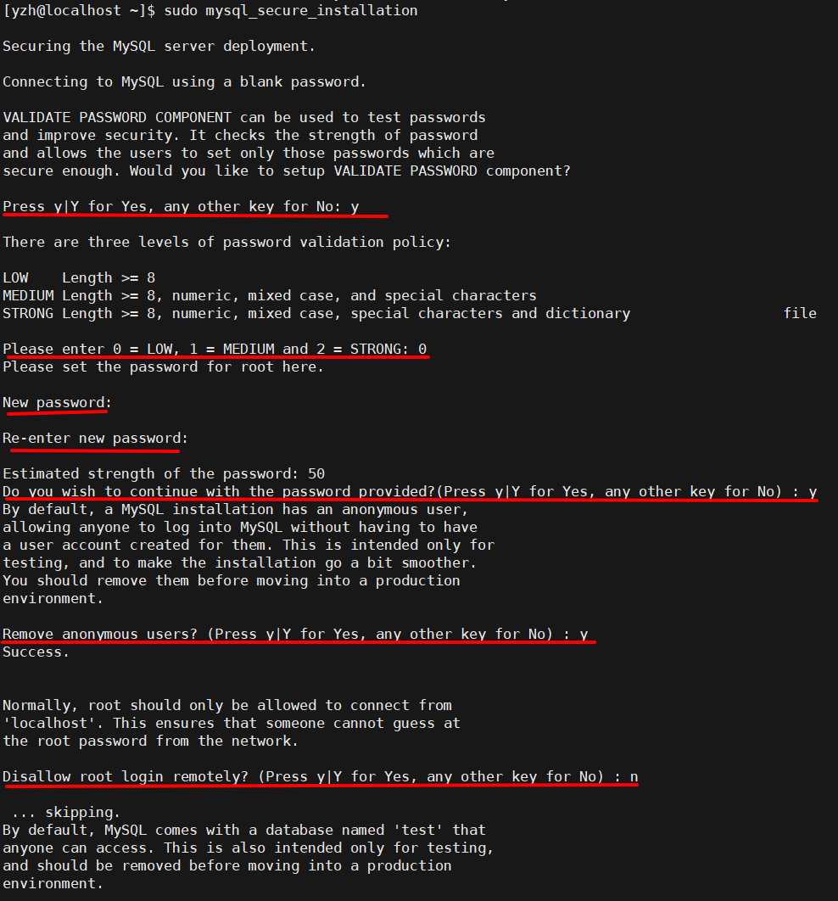
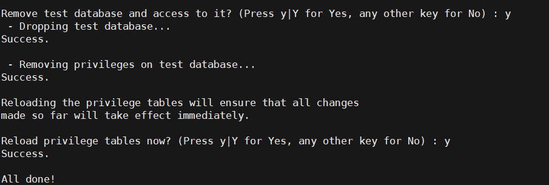
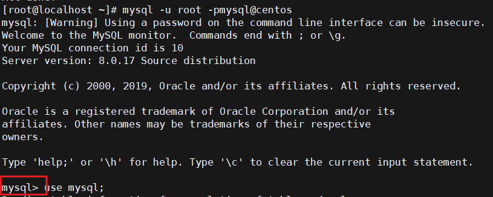

# CentOS8安装MySQL

> 本文转载至：[CentOS 8 安装MySQL 8.0 - kasnti - 博客园 (cnblogs.com)](https://www.cnblogs.com/kasnti/p/11929030.html)

### 安装MySQL8.0

使用最新的包管理器安装MySQL

```shell
sudo dnf install @mysql
```

### 开启启动

安装完成后，运行以下命令来启动MySQL服务并使它在启动时自动启动：

```shell
sudo systemctl enable --now mysqld
```

要检查MySQL服务器是否正在运行，请输入：

```shell
sudo systemctl status mysqld
```

### 添加密码及安全设置

运行mysql_secure_installation脚本，该脚本执行一些与安全性相关的操作并设置MySQL根密码：

```shell
sudo mysql_secure_installation
```

步骤如下：

1. 要求你配置VALIDATE PASSWORD component（验证密码组件）： 输入y ，回车进入该配置
   - 选择密码验证策略等级， 我这里选择0 （low），回车
   - 输入新密码两次
   - 确认是否继续使用提供的密码？输入y ，回车
   - 移除匿名用户？ 输入y ，回车
   - 不允许root远程登陆？ 我这里需要远程登陆，所以输入n ，回车



1. 移除test数据库？ 输入y ，回车
2. 重新载入权限表？ 输入y ，回车



## 配置远程登陆[#](https://www.cnblogs.com/kasnti/p/11929030.html#配置远程登陆)

如果需要设置root账户远程登陆，上一步骤中，`不允许root远程登陆？`这一步需要设为n。

接下来本机登录MySQL，将root用户的host字段设为'%'，意为接受root所有IP地址的登录请求：

本机登录MySQL:

```shell
mysql -u root -p <上面步骤中设置的密码>
```

回车后即可登录，接下来终端变成了`mysql>`开头:



接着继续执行mysql语句，将将root用户的host字段设为'%'：

```shell
use mysql;
update user set host='%' where user='root';
flush privileges;
```

设置完成后输入exit退出mysql，回到终端shell界面，接着开启系统防火墙的3306端口：

```shell
sudo firewall-cmd --add-port=3306/tcp --permanent
sudo firewall-cmd --reload
```

### 关闭MySQL主机查询

MySQL会反向解析远程连接地址的dns记录，如果MySQL主机无法连接外网，则dns可能无法解析成功，导致第一次连接MySQL速度很慢，所以在配置中可以关闭该功能。
[参考文档](https://www.cnblogs.com/liruning/p/7111015.html)
打开`/etc/my.cnf`文件，添加以下配置：

```shell
[mysqld]
skip-name-resolve
```

### 重启服务

```
sudo systemctl restart mysqld
```

本机测试安装后，MySQL8.0默认已经是utf8mb4字符集，所以字符集不再修改