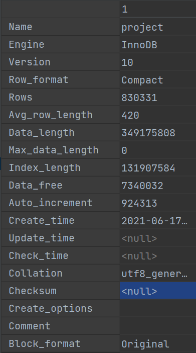
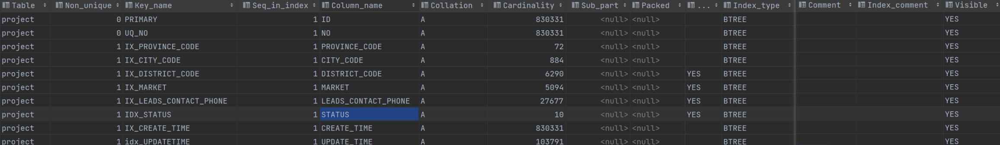

# 查看表的统计数据

## 一. 表

```sql
show table status from [数据库名];
```

例如，我们执行下列语句查询`project`表中的统计数据：

```sql
show table status from cms where Name='project';
```

执行完成后会看到下图数据：



- Name：表名称
- Engine：表的存储引擎
- Version：版本
- Row_format：行格式。对于MyISAM引擎，这可能是Dynamic，Fixed或Compressed。动态行的行长度可变，例如Varchar或Blob类型字段。固定行是指行长度不变，例如Char和Integer类型字段。
- Rows：表中的行数。对于非事务性表，这个值是精确的，对于事务性引擎，这个值通常是估算的。
- Avg_row_length：平均每行包括的字节数 
- Data_length：整个表的数据量(单位：字节)
- Max_data_length：表可以容纳的最大数据量
- Index_length：索引占用磁盘的空间大小 
- Data_free：对于MyISAM引擎，标识已分配，但现在未使用的空间，并且包含了已被删除行的空间。
- Auto_increment：下一个Auto_increment的值
- Create_time：表的创建时间
- Update_time：表的最近更新时间
- Check_time：使用 check table 或myisamchk工具检查表的最近时间
- Collation：表的默认字符集和字符排序规则
- Checksum：如果启用，则对整个表的内容计算时的校验和
- Create_options：指表创建时的其他所有选项
- Comment：包含了其他额外信息，对于MyISAM引擎，包含了注释徐标新，如果表使用的是innodb引擎 ，将现实表的剩余空间。如果是一个视图，注释里面包含了VIEW字样。

## 二. 索引

```sql
show index from [数据库名];
```

例如，我们执行下列命令查看`project`表索引统计信息：

```sql
show index from project;
```

执行完成后会看到下图数据：



- Table: 表名

- Non_unique：如果索引不能包括重复值则为0（也就是平时所说的唯一索引）如果可以则为1。

- Key_name：索引名称，如果名字相同则表明是同一个索引（联合索引），而并不是重复，比如上图中的第四、五条数据，索引名称都是**name**，其实是一个联合索引。

- Seq_in_index：联合索引中的序列号，联合索引`Key_name`完全相同，此时通过当前字段判断是第几个索引。

- Column_name 索引的列名。

- Collation指的是列以什么方式存储在索引中，大概意思就是字符序。

- Cardinality：是基数的意思，表示索引中唯一值的数目的估计值。我们知道某个字段的重复值越少越适合建索引，所以我们一般都是根据**Cardinality**来判断索引是否具有高选择性，如果这个值非常小，那就需要重新评估这个字段是否适合建立索引。

- Sub_part：前置索引的意思（通常用于字符串类型），如果列只是被部分地编入索引，则为被编入索引的字符的数目。如果整列被编入索引，则为NULL。

- Packed：指示关键字如何被压缩。如果没有被压缩，则为NULL。压缩一般包括压缩传输协议、压缩列解决方案和压缩表解决方案。

- Null：如果列含有NULL，则含有YES。

- Index_type：表示索引类型，MySQL目前主要有以下几种索引类型：FULLTEXT，HASH，BTREE，RTREE。

- Comment：Index_comment 注释的意思。