# Explain查看执行计划

> 本文转载参考至：《MySQL是怎样运行的》

一条查询语句在经过MySQL查询优化器的各种基于成本和规则的优化会后生成一个所谓的执行计划，这个执行计划展示了接下来具体执行查询的方式，比如多表连接的顺序是什么，对于每个表采用什么访问方法来具体执行查询等等。设计MySQL的大叔贴心的为我们提供了EXPLAIN语句来帮助我们查看某个查询语句的具体执行计划，本章的内容就是为了帮助大家看懂EXPLAIN语句的各个输出项都是干嘛使 的，从而可以有针对性的提升我们查询语句的性能。

如果我们想看看某个查询的执行计划的话，可以在具体的查询语句前边加一个EXPLAIN，就像这样：

```sql
explain select 1;
```

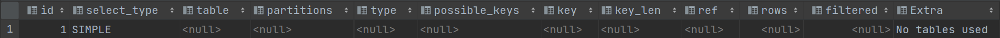

然后这输出的一大坨东西就是所谓的执行计划，我的任务就是带领大家看懂这一大坨东西里边的每个列都是干啥用的，以及在这个执行计划的辅助下，我们应该怎样改进自己的查询语句以使查询执行起来更 高效。其实除了以SELECT开头的查询语句，其余的DELETE、INSERT、REPLACE以及UPDATE语句前边都可以加上EXPLAIN这个词儿，用来查看这些语句的执行计划，不过我们这里对SELECT语句更感兴趣，所 以后边只会以SELECT语句为例来描述EXPLAIN语句的用法。为了让大家先有一个感性的认识，我们把EXPLAIN语句输出的各个列的作用先大致罗列一下： 

| 列名          | 描述                                                         |
| ------------- | ------------------------------------------------------------ |
| id            | 在一个大的查询语句中每个SELECT关键字都对应一个唯一的id       |
| select_type   | SELECT关键字对应的那个查询的类型                             |
| table         | 表名                                                         |
| partitions    | 匹配的分区信息                                               |
| type          | 针对单表的访问方法                                           |
| possible_keys | 可能用到的索引                                               |
| key           | 实际上使用的索引                                             |
| key_len       | 实际使用到的索引长度（用于在联合索引查询时判断命中几个字段） |
| ref           | 当使用索引列等值查询时，与索引列进行等值匹配的对象信息       |
| rows          | 预估的需要读取的记录条数                                     |
| filtered      | 某个表经过搜索条件过滤后剩余记录条数的百分比                 |
| Extra         | 一些额外的信息                                               |

需要注意的是，大家如果看不懂上边输出列含义，那是正常的，千万不要纠结～。我在这里把它们都列出来只是为了描述一个轮廓，让大家有一个大致的印象，下边会细细道来，等会儿说完了不信你不会～ 为了故事的顺利发展，我们还是要请出我们前边已经用了n遍的single_table表，为了防止大家忘了，再把它的结构描述一遍：

```sql
CREATE TABLE single_table
(
    id           INT NOT NULL AUTO_INCREMENT,
    key1         VARCHAR(100),
    key2         INT,
    key3         VARCHAR(100),
    key_part1    VARCHAR(100),
    key_part2    VARCHAR(100),
    key_part3    VARCHAR(100),
    common_field VARCHAR(100),
    PRIMARY KEY (id),
    KEY idx_key1 (key1),
    UNIQUE KEY idx_key2 (key2),
    KEY idx_key3 (key3),
    KEY idx_key_part (key_part1, key_part2, key_part3)
) Engine = InnoDB
  CHARSET = utf8;
```

我们仍然假设有两个和single_table表构造一模一样的s1、s2表，而且这两个表里边儿有10000条记录，除id列外其余的列都插入随机值。为了让大家有比较好的阅读体验，我们下边并不准备严格按照EXPLAIN输出列的顺序来介绍这些列分别是干嘛的，大家注意一下就好了。

## 一. table

**不论我们的查询语句有多复杂，里边儿包含了多少个表，到最后也是需要对每个表进行单表访问的**，所以设计MySQL的大叔规定EXPLAIN语句输出的每条记录都对应着某个单表的访问方法，该条记录的table列代表着该表的表名。

如果是多表连接查询，此时就会出现条记录，**出现在前面的表称为驱动表，出现在后的表称为被驱动表**。

## 二. id

一般情况下，一条SQL语句只会出现一个`SELECT`关键字，但是如果是子查询或者union查询就会出现多个`SELECT`。**查询语句中每出现一个SELECT关键字，设计MySQL的大叔就会为它分配一个唯一的id值**。

对于连接查询来说，一个SELECT关键字后边的FROM子句中可以跟随多个表，所以在连接查询的执行计划中，每个表都会对应一条记录，但是这些记录的id值都是相同的。

对于包含子查询的查询语句来说，就可能涉及多个SELECT关键字，所以在包含子查询的查询语句的执行计划中，每个SELECT关键字都会对应一个唯一的id值：

```sql
EXPLAIN SELECT * FROM s1 WHERE key1 IN (SELECT key1 FROM s2) OR key3 = 'a';
```

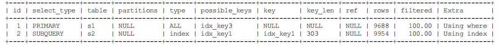

但是这里大家需要特别注意，**查询优化器可能对涉及子查询的查询语句进行重写，从而转换为连接查询**。所以如果我们想知道查询优化器对某个包含子查询的语句是否进行了重写，直接查看执行计划就好了，比如说： 

```sql
EXPLAIN SELECT * FROM s1 WHERE key1 IN (SELECT key3 FROM s2 WHERE common_field = 'a');
```


## 三. select_type

设计MySQL的大叔为每一个SELECT关键字代表的小查询都定义了一个称之为select_type的属性，意思是我们只要知道了某个小查询的select_type属性，就知道了这个小查询在整个大查询中扮演了一个什 么角色，口说无凭，我们还是先来见识见识这个select_type都能取哪些值：

- SIMPLE：查询语句中不包含UNION或者子查询的查询都算作是SIMPLE类型
- PRIMARY：对于包含UNION、UNION ALL或者子查询的大查询来说，它是由几个小查询组成的，其中最左边的那个查询的select_type值就是PRIMARY，比方说：

```sql
EXPLAIN SELECT * FROM s1 UNION SELECT * FROM s2;
```

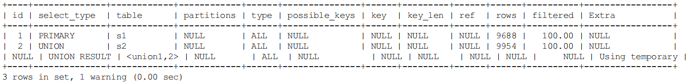

- UNION：对于包含UNION或者UNION ALL的大查询来说，它是由几个小查询组成的，其中除了最左边的那个小查询以外，其余的小查询的select_type值就是UNION，可以对比上一个例子的效果，这就不多举例 子了。
- UNION RESULT：MySQL选择使用临时表来完成UNION查询的去重工作，针对该临时表的查询的select_type就是UNION RESULT，例子上边有，就不赘述了。

- SUBQUERY：如果包含子查询的查询语句不能够转为对应的semi-join的形式，并且该子查询是不相关子查询，并且查询优化器决定采用将该子查询物化的方案来执行该子查询时，该子查询的第一个SELECT关键字代表的那个查询的select_type就是SUBQUERY，比如下边这个查询： 

```sql
EXPLAIN SELECT * FROM s1 WHERE key1 IN (SELECT key1 FROM s2) OR key3 = 'a';
```

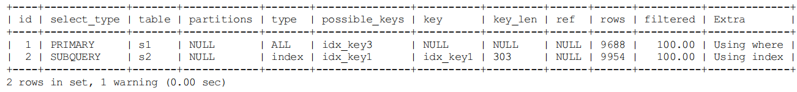

可以看到，外层查询的select_type就是PRIMARY，子查询的select_type就是SUBQUERY。需要大家注意的是，**由于select_type为SUBQUERY的子查询由于会被物化，所以只需要执行一遍**。

## 四. type

前边说过执行计划的一条记录就代表着MySQL对某个表的执行查询时的访问方法，其中的type列就表明了这个访问方法是个啥。

- system：当**表中只有一条记录**并且该表使用的存储引擎的统计数据是精确的，比如MyISAM、Memory，那么对该表的访问方法就是system。比方说我们新建一个MyISAM表。
- const：当我们**根据主键或者唯一二级索引列与常数进行等值匹配**时，对单表的访问方法就是const
- eq_ref：在**连接查询**时，如果**被驱动表是通过主键或者唯一二级索引列等值匹配**的方式进行访问的（如果该主键或者唯一二级索引是联合索引的话，所有的索引列都必须进行等值比较），则对该被驱动表的 访问方法就是eq_ref。

```sql
EXPLAIN SELECT * FROM s1 INNER JOIN s2 ON s1.id = s2.id;
```

- ref：当通过普通的二级索引列与常量进行等值匹配时来查询某个表，那么对该表的访问方法就可能是ref。对于联合索引来说，只要最左边连续的列是与常数进行等值比较，就可以采用ref访问方法。
- ref_or_null：当对普通二级索引进行等值匹配查询，该索引列的值也可以是NULL值时，那么对该表的访问方法就**可能**是ref_or_null

```sql
EXPLAIN SELECT * FROM s1 WHERE key1 = 'a' OR key1 IS NULL;
```

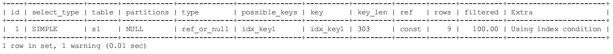

- index_merge：一般情况下对于某个表的查询只能使用到一个索引，但我们唠叨单表访问方法时特意强调了在某些场景下可以使用Intersection、Union、Sort-Union这三种索引合并的方式来执行查询（P173）

```sql
EXPLAIN SELECT * FROM s1 WHERE key1 = 'a' OR key3 = 'a';
```

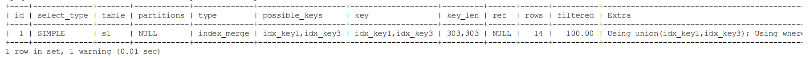

- unique_subquery：类似于两表连接中被驱动表的eq_ref访问方法，unique_subquery是针对在一些包含IN子查询的查询语句中，如果查询优化器决定将IN子查询转换为EXISTS子查询，而且子查询可以使用到主键进行等值匹配的话，那么该子查询执行计划的type列的值就是unique_subquery，比如下边的这个查询语句：

```sql
EXPLAIN SELECT * FROM s1 WHERE key2 IN (SELECT id FROM s2 where s1.key1 = s2.key1) OR key3 = 'a';
```

- index_subquery：index_subquery与unique_subquery类似，只不过访问子查询中的表时使用的是普通的索引，比如这样：

```sql
EXPLAIN SELECT * FROM s1 WHERE common_field IN (SELECT key3 FROM s2 where s1.key1 = s2.key1) OR key3 = 'a';
```

- range：如果**使用索引获取某些范围区间的记录**，那么就可能使用到range访问方法，比如下边的这个查询：

```sql
EXPLAIN SELECT * FROM s1 WHERE key1 IN ('a', 'b', 'c');
EXPLAIN SELECT * FROM s1 WHERE key1 > 'a' AND key1 < 'b';
```

- index：当我们**可以使用索引覆盖，但需要扫描全部的索引记录时**，该表的访问方法就是index，比如这样：

```sql
EXPLAIN SELECT key_part2 FROM s1 WHERE key_part3 = 'a';
```

上述查询中的搜索列表中只有key_part2一个列，而且搜索条件中也只有key_part3一个列，这两个列又恰好包含在idx_key_part这个索引中，可是搜索条件key_part3不能直接使用该索引进行ref或 者range方式的访问，只能扫描整个idx_key_part索引的记录，所以查询计划的type列的值就是index。

- all：全表扫描

## 五. possible_keys和key

在EXPLAIN语句输出的执行计划中，possible_keys列表示在某个查询语句中，对某个表执行单表查询时可能用到的索引有哪些，key列表示实际用到的索引有哪些，比方说下边这个查询：

```sql
EXPLAIN SELECT * FROM s1 WHERE key1 > 'z' AND key3 = 'a';
```

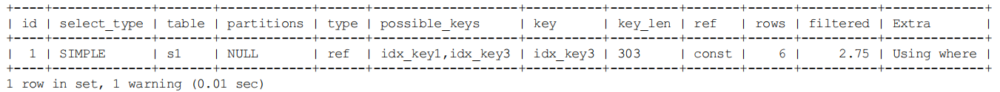

上述执行计划的possible_keys列的值是idx_key1,idx_key3，表示该查询可能使用到idx_key1,idx_key3两个索引，然后key列的值是idx_key3，表示经过查询优化器计算使用不同索引的成本后，最后决定使用idx_key3来执行查询比较划算。 

不过有一点比较特别，就是在使用index访问方法来查询某个表时，possible_keys列是空的，而key列展示的是实际使用到的索引，比如这样： 

```sql
SELECT key_part2 FROM s1 WHERE key_part3 = 'a';
```

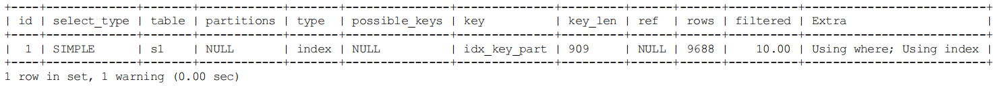

另外需要注意的一点是，**possible_keys列中的值并不是越多越好，可能使用的索引越多，查询优化器计算查询成本时就得花费更长时间，所以如果可以的话，尽量删除那些用不到的索引**。 

## 六. key_len

key_len列表示当优化器决定使用某个索引执行查询时，该索引记录的最大长度，它是由这三个部分构成的： 

- 对于使用固定长度类型的索引列来说，它实际占用的存储空间的最大长度就是该固定值，对于指定字符集的变长类型的索引列来说，比如某个索引列的类型是VARCHAR(100)，使用的字符集是utf8， 那么该列实际占用的最大存储空间就是100 × 3 = 300个字节。
- 如果该索引列可以存储NULL值，则key_len比不可以存储NULL值时多1个字节。
- 对于变长字段来说，都会有2个字节的空间来存储该变长列的实际长度。 

比如下面这个查询：

```sql
EXPLAIN SELECT * FROM s1 WHERE id = 5;
```

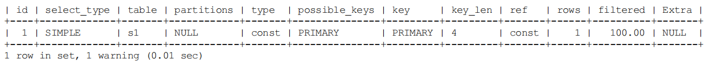

由于id列的类型是INT，并且不可以存储NULL值，所以在使用该列的索引时key_len大小就是4。当索引列可以存储NULL值时，比如： 

```sql
EXPLAIN SELECT * FROM s1 WHERE key2 = 5;
```

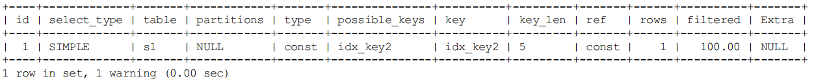

可以看到key_len列就变成了5，比使用id列的索引时多了1。

对于可变长度的索引列来说，比如下边这个查询：

```sql
EXPLAIN SELECT * FROM s1 WHERE key1 = 'a';
```

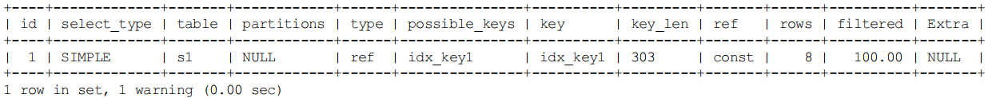

由于key1列的类型是VARCHAR(100)，所以该列实际最多占用的存储空间就是300字节，又因为该列允许存储NULL值，所以key_len需要加1，又因为该列是可变长度列，所以key_len需要加2，所以最 后ken_len的值就是303。

**ley_len主要用于在使用联合索引查询时判断使用了几个索引列**，比如下面这个查询：

```sql
EXPLAIN SELECT * FROM s1 WHERE key_part1 = 'a' AND key_part2 = 'b';
```

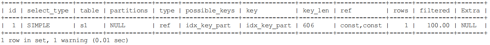

这个查询的执行计划的ken_len列的值是606，说明执行这个查询的时候可以用到联合索引idx_key_part的两个索引列。

## 七. ref

当使用索引列等值匹配的条件去执行查询时，也就是在访问方法是const、eq_ref、ref、ref_or_null、unique_subquery、index_subquery其中之一时，**ref列展示的就是与索引列作等值匹配的东东是个啥**，比如只是一个常数或者是某个列。大家看下边这个查询： 

```sql
EXPLAIN SELECT * FROM s1 WHERE key1 = 'a';
```

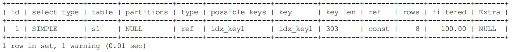

可以看到ref列的值是const，表明在使用idx_key1索引执行查询时，与key1列作等值匹配的对象是一个常数，当然有时候更复杂一点：

```sql
EXPLAIN SELECT * FROM s1 INNER JOIN s2 ON s1.id = s2.id;
```

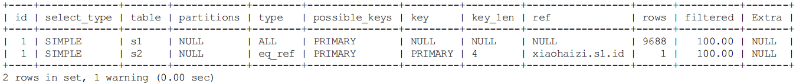

可以看到对被驱动表s2的访问方法是eq_ref，而对应的ref列的值是xiaohaizi.s1.id，这说明在对被驱动表进行访问时会用到PRIMARY索引，也就是聚簇索引与一个列进行等值匹配的条件，于s2表的id作 等值匹配的对象就是xiaohaizi.s1.id列（注意这里把数据库名也写出来了）。

有的时候与索引列进行等值匹配的对象是一个函数，比方说下边这个查询： 

```sql
EXPLAIN SELECT * FROM s1 INNER JOIN s2 ON s2.key1 = UPPER(s1.key1);
```

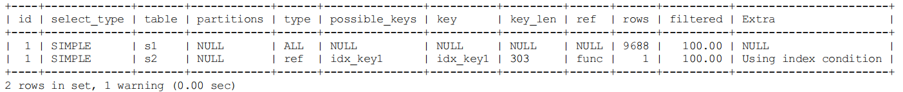

我们看执行计划的第二条记录，可以看到对s2表采用ref访问方法执行查询，然后在查询计划的ref列里输出的是func，说明与s2表的key1列进行等值匹配的对象是一个函数。 

## 八. rows

**如果查询优化器决定使用全表扫描的方式对某个表执行查询时，执行计划的rows列就代表预计需要扫描的行数，如果使用索引来执行查询时，执行计划的rows列就代表预计扫描的索引记录行数**。比如下边这个查询：

```sql
EXPLAIN SELECT * FROM s1 WHERE key1 > 'z';
```

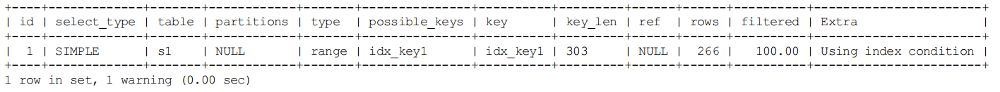

我们看到执行计划的rows列的值是266，这意味着查询优化器在经过分析使用idx_key1进行查询的成本之后，觉得满足key1 > 'z'这个条件的记录只有266条。 

## 九. filtered 

之前在分析连接查询的成本时提出过一个condition filtering的概念，就是MySQL在计算驱动表扇出时采用的一个策略：

- 如果使用的是全表扫描的方式执行的单表查询，那么计算驱动表扇出时需要估计出满足搜索条件的记录到底有多少条。
- 如果使用的是索引执行的单表扫描，那么计算驱动表扇出的时候需要估计出满足除使用到对应索引的搜索条件外的其他搜索条件的记录有多少条。 

比方说下边这个查询：

```sql
EXPLAIN SELECT * FROM s1 WHERE key1 > 'z' AND common_field = 'a';
```

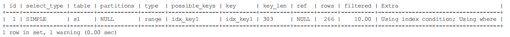

从执行计划的key列中可以看出来，该查询使用idx_key1索引来执行查询，从rows列可以看出满足key1 > 'z'的记录有266条。执行计划的filtered列就代表查询优化器预测在这266条记录中，有多少条记录满足其余的搜索条件，也就是common_field = 'a'这个条件的百分比。此处filtered列的值是10.00，说明查询优化器预测在266条记录中有10.00%的记录满足common_field = 'a'这个条件。

对于单表查询来说，这个filtered列的值没什么意义，我们更关注在连接查询中驱动表对应的执行计划记录的filtered值，比方说下边这个查询： 

```sql
EXPLAIN SELECT * FROM s1 INNER JOIN s2 ON s1.key1 = s2.key1 WHERE s1.common_field = 'a';
```

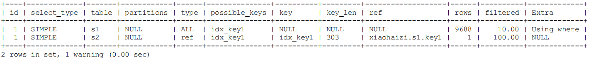

从执行计划中可以看出来，查询优化器打算把s1当作驱动表，s2当作被驱动表。我们可以看到驱动表s1表的执行计划的rows列为9688， filtered列为10.00，这意味着驱动表s1的扇出值就是9688 × 10.00% = 968.8，这说明还要对被驱动表执行大约968次查询。

## 十. Extra

顾名思义，Extra列是用来说明一些额外信息的，我们可以通过这些额外信息来更准确的理解MySQL到底将如何执行给定的查询语句。MySQL提供的额外信息有好几十个，我们就不一个一个介绍了（都介绍了感觉我们的文章就跟文档差不多了～），所以我们只挑一些平时常见的或者比较重要的额外信息介绍给大家哈。

- No tables used：

当查询语句的没有FROM子句时将会提示该额外信息

```sql
EXPLAIN SELECT 1;
```

- Impossible WHERE：

查询语句的WHERE子句永远为FALSE时将会提示该额外信息

```sql
EXPLAIN SELECT * FROM s1 WHERE 1 != 1;
```

- No matching min/max row：

当查询列表处有MIN或者MAX聚集函数，但是并没有符合WHERE子句中的搜索条件的记录时，将会提示该额外信息

```sql
EXPLAIN SELECT MIN(key1) FROM s1 WHERE key1 = 'abcdefg';
```

- **Using index**：

当我们的查询列表以及搜索条件中只包含属于某个索引的列，也就是**在可以使用索引覆盖的情况下，在Extra列将会提示该额外信息**。比方说下边这个查询中只需要用到idx_key1而不需要回表操作

- Using index condition：

**当使用到索引下推时，Extra会显示该额外信息**。比如下边这个查询： 

```sql
EXPLAIN SELECT * FROM s1 WHERE key1 > 'z' AND key1 LIKE '%a'; 
```

其中的key1 > 'z'可以使用到索引，但是key1 LIKE '%a'却无法使用到索引，在以前版本的MySQL中，是按照下边步骤来执行这个查询的： 

 - 先根据key1 > 'z'这个条件，从二级索引idx_key1中获取到对应的二级索引记录。 
 - 根据上一步骤得到的二级索引记录中的主键值进行回表，找到完整的用户记录再检测该记录是否符合key1 LIKE '%a'这个条件，将符合条件的记录加入到最后的结果集。 

 但是虽然key1 LIKE '%a'不能组成范围区间参与range访问方法的执行，但这个条件毕竟只涉及到了key1列，所以设计MySQL的大叔把上边的步骤改进了一下：

 - 先根据key1 > 'z'这个条件，定位到二级索引idx_key1中对应的二级索引记录。 
 - 对于指定的二级索引记录，先不着急回表，而是先检测一下该记录是否满足key1 LIKE '%a'这个条件，如果这个条件不满足，则该二级索引记录压根儿就没必要回表。
 - 对于满足key1 LIKE '%a'这个条件的二级索引记录执行回表操作。

我们说回表操作其实是一个随机IO，比较耗时，所以上述修改虽然只改进了一点点，但是可以省去好多回表操作的成本。设计MySQL的大叔们把他们的这个改进称之为索引条件下推（英文名：Index Condition Pushdown）。 

- Using where：

**当我们使用全表扫描来执行对某个表的查询，并且该语句的WHERE子句中有针对该表的搜索条件时**，在Extra列中会提示上述额外信息。当使用索引访问来执行对某个表的查询，并且该语句的WHERE子句中有除了该索引包含的列之外的其他搜索条件时，在Extra列中也会提示上述额外信息。比如下边这个查询虽然使用idx_key1索引执行查询，但是搜索条件中除了包含key1的搜索条件key1 = 'a'，还有包含common_field的搜索条件，所以Extra列会显示Using where的提示：

```sql
 EXPLAIN SELECT * FROM s1 WHERE key1 = 'a' AND common_field = 'a';
```

- Using filesort ：

有一些情况下对结果集中的记录进行排序是可以使用到索引的，比如下边这个查询：

```sql
EXPLAIN SELECT * FROM s1 ORDER BY key1 LIMIT 10;
```

这个查询语句可以利用idx_key1索引直接取出key1列的10条记录，然后再进行回表操作就好了。但是很多情况下排序操作无法使用到索引，只能在内存中（记录较少的时候）或者磁盘中（记录较多的时候）进行排序，设计MySQL的大叔把这种在内存中或者磁盘上进行排序的方式统称为文件排序（英文名：filesort）。**如果某个查询需要使用文件排序的方式执行查询**，就会在执行计划的Extra列中显示Using filesort提示，比如这样：

```sql
EXPLAIN SELECT * FROM s1 ORDER BY common_field LIMIT 10;
```

需要注意的是，如果查询中需要使用filesort的方式进行排序的记录非常多，那么这个过程是很耗费性能的，我们最好想办法将使用文件排序的执行方式改为使用索引进行排序。

- Using temporary：

在许多查询的执行过程中，MySQL可能会借助临时表来完成一些功能，比如去重、排序之类的，比如我们在执行许多包含DISTINCT、GROUP BY、UNION等子句的查询过程中，如果不能有效利用索引来完成查询，MySQL很有可能寻求通过建立内部的临时表来执行查询。如果查询中使用到了内部的临时表，在执行计划的Extra列将会显示Using temporary提示。
