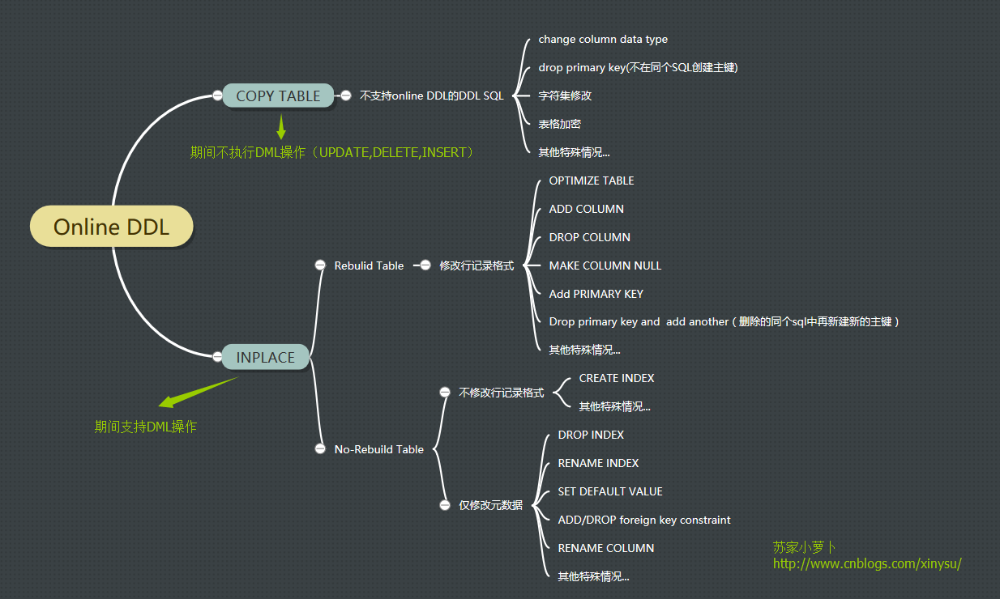
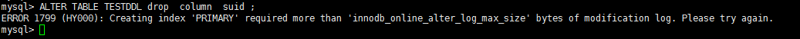
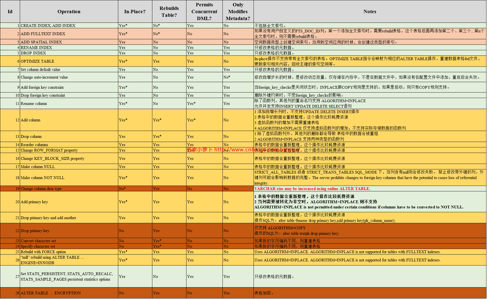
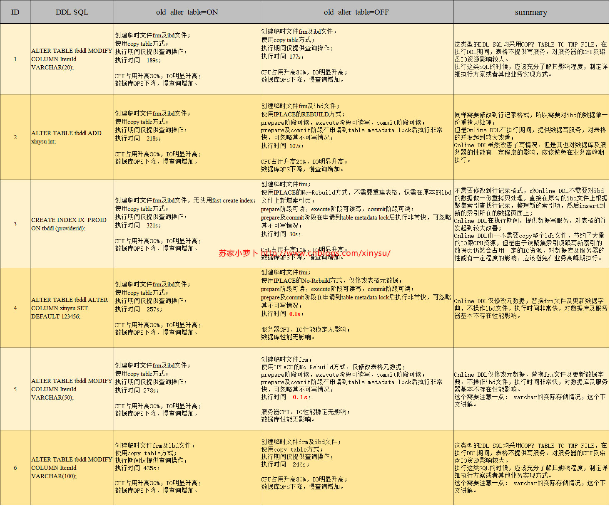
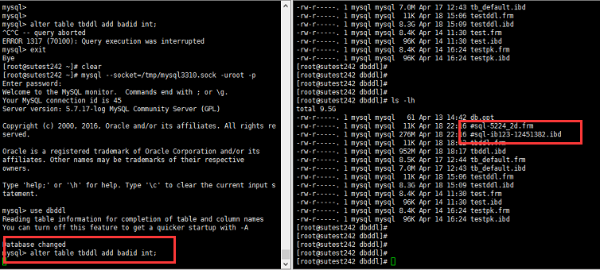
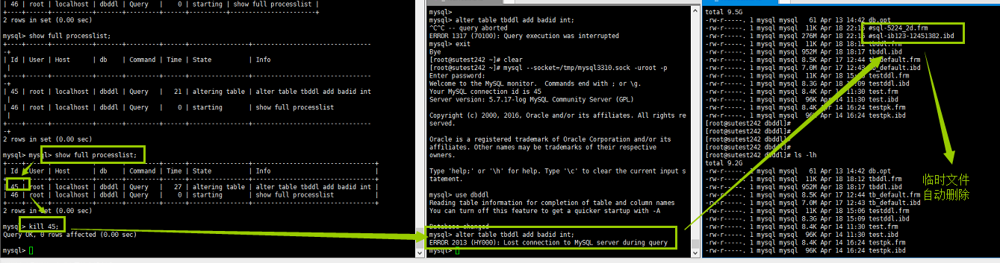

# 创建索引会锁表吗

>  直接抛出结论，>=5.6版本的MySQL InnoDB存储引擎不会锁表。

详情参考：

[如何安全的大数据量表在线进行DML操作 - 香吧香 - 博客园 (cnblogs.com)](https://www.cnblogs.com/zjdxr-up/p/12141852.html)

[MySQL :: MySQL 5.6 Reference Manual :: 14.13.1 Online DDL Operations](https://dev.mysql.com/doc/refman/5.6/en/innodb-online-ddl-operations.html)

## 一. 早期DDL实现原理（5.6.7之前）

 Innodb早期支持通过copy table跟inplace的方式来执行DDL语句，其原理如下：

- copy table方式
  - 新建跟原表格一致的**临时表**，并在该临时表上执行DDL语句
  - 锁原表，不允许DML，允许查询
  - 逐行数据从原表拷贝到临时表中**（这个过程是没有排序的）**
  - 拷贝结束后，原表禁止读操作，也就是原表此时不提供读写服务
  - 进行rename操作，完成DDL过程
- inplace方式（fast index creation，仅针对索引的创建跟删除）
  - **新建frm临时文件**
  - 锁原表，不允许DML，允许查询
  - **按照聚集索引的顺序，查询数据，找到需要的索引列数据，排序后插入到新的索引页中**
  - 原表禁止读操作，也就是原表此时不提供读写服务
  - 进行rename操作，**替换frm文件**，完成DDL过程

inplace在copy table的基础上做了一个较大的改进，则是不需要copy整个表格，只需要在原来的ibd文件上，新建所需要的索引页，这个过程比copy table节约极大的IO资源占用 且 DDL SQL执行速度大大提高，减少了该表格不提供写服务的时长。但是inplace仅支持索引的创建于删除，不支持其他的DDL操作，其他的DDL操作，仍然是copy table方式执行。

对于一个线上业务数据库，无论是copy table方式还是inplace方式，这里仍然有一个明显的弊端：操作期间涉及表格不提供写服务！无法对涉及到表格至下INSERT,UPDATE,DELETE操作，仅支持SELECT。

## 二. Online DDL原理

当表格发生DDL操作，可能会出现该表格数分钟甚至数小时不可访问，性能及响应异常，为了有效改善这个情况，MySQL 在5.6.7版本推出了Online DDL。（本文参考官网5.7版本的文档整理及测试）。

在online DDL中，也包含了copy跟inplace两种方式，对于不支持Online DDL的DDL SQL，则采用COPY方式；对于支持Online DDL的DDL SQL，则采用Inplace方式，这里的Inplace又区分为2类：是否需要rebuild表格，判断标准为：是否修改行记录格式。如果修改了行记录格式，则需要rebuild表格，比如修改列类型、增减列等；如果没有修改行记录格式，仅修改表的元数据，则不需要rebuild表格，仅修改元数据 metadata，比如删除索引、设置默认值及重命名列名等。详细可见下图，具体语法情况见`第4部分`。

 

 那么，新增的Online DDL内部是怎样一个实现原理呢？（此处参考：http://blog.itpub.net/22664653/viewspace-2056953/）

  有3个阶段：prepare、execute、commit。

- PREPARE
  - 创建新的临时frm文件
  - 持有EXCLUSIVE_MDL锁，禁止读写
  - 根据alter类型，确定执行方式（copy，rebuild，no-rebuild）
  - 更新数据字典的内存对象
  - 若是需要rebuild，分配row_log对象记录的增量
  - 若是需要rebuild， 生成新的临时ibd文件
- EXECUTE
  - 如果是仅修改元数据：
    - 这部分无操作
  - 其他，则是：
    - 降低EXCLUSIVE-MDL锁，允许读写（copy 不允许写）
    - 记录ddl执行过程中产生的增量row-log（仅rebuild类型需要）
    - 扫描old_table的聚集索引每一条记录record
    - 遍历新表的聚集索引和二级索引，逐一处理
    - 根据record构造对应的索引项
    - 将构造索引项插入sort_buffer块
    - 将sort_buffer块插入新的索引
    - 把row-log中的操作应用到新临时表中，应用到最后一个Block
- COMMIT
  - 升级到EXECLUSIVE-MDL锁，禁止读写
  - 重做最后一部分的row_log增量
  - 更新innodb的数据字典表
  - 提交事务，写redo日志
  - 修改统计信息
  - rename 临时的ibd文件、frm文件
  - DDL完成

这里注意下row-log，它是记录 DDL在执行过程中表格发生数据变更的操作，这样就可以保证执行DDL表格的并发性，在EXCUTE阶段可以正常提供写服务，不发生堵塞，最后把row-log应用到新的表格上即可。

在5.7.17版本上测试的时候，发现，支持inplace且需要rebuild的DDL，在DDL期间，如果数据发生修改，都是直接刷新到原来的ibd文件上，在测试环境中，给大表testddl删除一个字段，这个过程中INSERT 100w行记录，可以看到原有ibd文件增长了1G左右。

**这里有个疑问，未确定：row-log应该不是记录行记录的修改格式，因为这样效率过慢，初步推测应该是仅记录主键，然后根据主键查找应用到新表上。**

  Online DDL可以有效改善DDL期间对数据库的影响：

- Online DDL期间，查询和DML操作在多数情况下可以正常执行，对表格的锁时间也会大大减少，尽可能的保证数据库的可扩展性；
- 允许 in-place 操作的 DDL，避免重建表格占用过多磁盘IO及CPU资源，减少对数据库的整体负荷，使得在DDL期间，能够维持数据库的高性能及高吞吐量；
- 允许 in-place 操作的 DDL，比需要COPY到临时文件的操作要更少占用buffer pool，避免以往DDL过程中性能的临时下降，因为以前需要拷贝数据到临时表，这个过程会占用到buffer pool ，导致内存中的部分频繁访问的数据会被清理出去。

## 三. Online DDL涉及参数及选项

### 3.1 innodb_online_alter_log_max_size

  online ddl过程中发生DML时，会把数据修改情况记录到row-log中，而row-log的大小，则由 innodb_online_alter_log_max_size设定，默认为128M，当表格较大且操作频繁时，做DDL过程，可调大该参数，避免出现1799错误：



### 3.2 Online DDL语法

```sql
Alter table …. , ALGORITHM [=] {DEFAULT|INPLACE|COPY}, LOCK [=] { DEFAULT| NONE| SHARED| EXCLUSIVE }
```

### 3.3 lock 选项

  该选项用于调整DDL加锁的方式，一共有4个选项。

- ```
  LOCK=EXCLUSIVE
  ```

  - 对整个表格添加独占锁（x锁），不允许查询跟修改操作

- ```
  LOCK=SHARED
  ```

  - 对整个表格添加（s锁），允许查询操作，但是不支持数据变更操作

- ```
  LOCK=NONE
  ```

  - 不添加锁，既允许查询操作，也支持数据库变更操作，该模式下并发最好

- ```
  LOCK=DEFAULT
  ```

  - 没有指定LOCK的时候，则是默认为这个选项
  - 根据DDL的操作类型，最小程度的加锁，尽可能支持查询及0DML操作
  - 首先判断当前操作是否可以使用NONE模式，如果不能，判断是否可以使用SHARED模式，如果不能，判断是否可以使用`EXCLUSIVE模式`

### 3.4 ALGORITHM选项

DDL对数据库性能的影响，很大程度受操作方式影响，比如是否是允许in-place，是否请求COPY操作，是否重建整个表格。比如**某个表格**，修改或者添加默认值，并不会影响到表格内部的数据，所以1s内就可以完成；添加1个索引，需要几十秒，应为需要新增索引数据页跟修改frm文件，但是不用rebuild表格数据；而修改列的数据类型是，可能需要几分钟甚至更多时间，因为其需要重新Rebuild整个表格，执行期间对CPU，IO及buffer pool大量申请资源。

由DDL引起的INPLACE,COPY,REBUILD，可以通过指定ALGORITHM来选择（注意并非所有DDL都支持in-place，详见第4部分）

- `ALGORITHM=INPLACE`
- `ALGORITHM=COPY`

这两个选项中，INPLACE要比COPY性能好，因为INPLACE既不会记录UNDO LOG，也不写REDO LOG，同时执行期间提供DML操作。

## 四. Online DDL支持的语法

Online DDL对不同的DDL语句具有不同的执行规则，下面的表格将详细描述各个语法对Online DDL的支持情况。

列说明：

- In-Place? 
  - 说明： 是否支持 `ALGORITHM=INPLACE `
- Rebuilds Table?
  - 说明：是否会重建表格
  - 重建表格分为两种方式：INPLACE跟COPY （原地修改或者复制到临时文件修改）
  - 如果支持 `ALGORITHM=INPLACE`，那么则是原地修改 INPLACE**（淡黄色标记）**
  - 如果不支持 `ALGORITHM=INPLACE`，那么则是COPY，拷贝到临时文件修改，并且不支持UPDATE DELETE INSERT操作**（深褐色标记）**
- Permits Concurrent DM
  - 说明： 是否支持在DDL期间并发对该表格操作DML SQL
  - 新增空间索引及全文索引时，不支持DML操作
  - 当允许时，可以通过LOCK选项来控制是否要提供查询或者修改操作
  - LOCK=NONE，支持查询跟UPDATE INSERT DELETE操作
  - LOCK=SHARED，仅支持查询
  - Only Modifies Metadata? 
  - 是否只修改元数据



## 五. 测试记录

### 5.1 四个典型DDL操作分析

针对是否支持INPLACE、是否需要REBUILD及是否仅修改metadata来分类，选取每类一个DDL SQL来测试，见下图：


考虑到varchar变化长度的问题，这里加测多这一项。

#### 5.1.1 DDL测试内容

- 测试DB环境：表格名 tbddl，表格大小：1G ，500W行记录
- 测试流程：开启事务查询，不提交 => 执行DDL => 提交查询事务 => 执行DML =>开启事务，执行DML不提交 =>提交DML
- 测试DDL SQL
  - ALTER TABLE tbddl MODIFY COLUMN ItemId VARCHAR(20); 
  - ALTER TABLE tbddl ADD xinysu int;
  - CREATE INDEX IX_PROID ON tbddl (providerid);
  - ALTER TABLE tbddl ALTER COLUMN xinysu SET DEFAULT 123456;
  - ALTER TABLE tbddl ALTER COLUMN ItemId VARCHAR(50); #UTF8字符集,3个字节一个字符，50个字符则是150个字节，小于256bytes  
  - ALTER TABLE tbddl ALTER COLUMN ItemId VARCHAR(100);  #UTF8字符集,3个字节一个字符，100个字符则是300个字节，大于256bytes
- 测试关注点
  - 启动与关闭 old_alter_table
  - prepare，commit阶段的锁是怎么样的
  - excute阶段的锁是怎么样的
  - 执行期间服务器的性能情况（zabbix监控）
  - 执行期间数据库的并发情况（sysbench压测）

#### 5.1.2 DDL测试结论

测试过程中的截图，不在此描述，直接粘贴测试结果，感兴趣的筒子们，可以自行测试。

VARCHAR按字符存储，每个字符按照字符集来计算字节，UTF8是3个字节一个字符，当VARCHAR的字节数<256byte时，只需要1个byte来存储实际长度，当VARCHAR字节数>=256时，则需要2个byte来存储实际长度。举例，UTF8字符集下的VARCHAR(10)，假设存储 N （0<=N<=10），则其占用的字节数为：N*3+1；UTF8字符集下的VARCHAR(100)，假设存储 N （0<=N<=100），则其占用的字节数为：N*3+2。

理解了这一点后，就可以理解 增长或缩短列的长度这列DDL的处理方式，假设列 VARCHAR(M)需要增大或缩小到VARCHAR(N)，字符集是UTF8：

- 当 3M<256，3N<256，存储长度的字节不需要变化，都为1，则不需要变动行记录，仅需要修改元数据；
- 当 3M>256，3N>256，存储长度的字节不需要变化，都为2， 则不需要变动行记录，仅需要修改元数据；
- 当 3M<256，3N>256，存储长度的字节需要变化，由1变2， 则需要变动行记录，Online DDL使用COPY TABLE方式；
- 当 3M>256，3N>256，存储长度的字节需要变化，由2变1，则需要变动行记录，Online DDL使用COPY TABLE方式



### 5.2 同表格多个DDL处理

在Online DDL之前，都会习惯性的把同个表格的所有DDL语句合并为一个SQL语句，避免重复Rebuild、多次加锁导致不提供DML时长增加等弊端。

但是，引入Online DDL后，需要有2点改观：

- 除了个别不支持inplace的DDL语句，其他DDL语句在执行期间是不会加X锁的，也就是表格仍然提供DML操作
- 锁的粒度，同个DDL语句中，按照最高级别的锁处理
- 维护的方便性

这里建议按照3类来处理（**测试后的个人建议，仅供参考**），见下图。

- 为啥copy table单独出来呢？
  - 因为这一类操作过程中是不允许DML操作的，建议把这一类的合成单独一条DDL SQL执行，不与IPLACE的DDL SQL合并；
- 为啥iplace的要分为2类呢？
  - 方便维护
  - 仅元数据修改的DDL较快执行结束，为了方便管理维护，不至于所有SQL贴一堆，仅元数据修改的DDL语句归一类
  - 需要REBUILD的归一类，避免重复rebuild，浪费磁盘IO跟CPU资源。


举个例子，现在上线项目，需要对表格tbddl，1个字段由INT修改为VARCHAR，新增3个字段，2个索引，2个默认值，2个列增长长度，单独的SQL 为：

```sql
ALTER TABLE tbddl alter column ItemId varchar(20);

 

ALTER TABLE tbddl ADD  su int;

ALTER TABLE tbddl ADD  xin varchar(40);

ALTER TABLE tbddl ADD  yu int;

 

CREATE INDEX IX_SU ON tbddl(SU);

CREATE INDEX IX_yu ON tbddl(yu);

 

ALTER TABLE tbddl ALTER COLUMN CreatedById SET DEFAULT 123456;

ALTER TABLE tbddl ALTER COLUMN ItemID SET DEFAULT 654321;

 

ALTER TABLE tbddl ALTER COLUMN CreatedByName VARCHAR(70);

ALTER TABLE tbddl ALTER COLUMN ModifiedByName VARCHAR(100);
```

测试建议以下执行方式：

```sql
ALTER TABLE tbddl alter column ItemId varchar(20);

ALTER TABLE tbddl ADD su int ,ADD xin varchar(40) ,ADD yu int,ALTER COLUMN ModifiedByName VARCHAR(100),add index ix_su(SU), add index ix_yu(yu);

ALTER TABLE tbddl ALTER COLUMN CreatedById SET DEFAULT 123456,ALTER COLUMN ItemID SET DEFAULT 654321,ALTER COLUMN CreatedByName VARCHAR(70);
```

###  5.3 DDL执行期间数据库性能异常处理

 执行DDL期间，需要密切留意数据库服务器的CPU及IO情况，查看数据库的连接池、慢查询情况，如果期间发生了异常，应该如何处理呢？

 假设现在给大表tbddl新增一列，新增的过程中，发现影响到线上业务，需要紧急停止，可以通过以下步骤操作：

- show processlist;
- kill 进程id;





### 5.4 DDL执行期间数据库宕机

DDL期间，如果发生宕机情况，会对数据库的恢复启动造成什么影响呢？临时文件还存在吗？ 恢复过程中会自动执行未完成的DDL操作吗？如果会，是怎么处理？如果不会，再次手动创建会有影响吗？

在5.7.17版本上，测试了4类DDL SQL，当DDL执行过程中，数据库发生宕机，该DDL不会影响到数据库的恢复启动，同时，这个未完成的DDL语句不回自动执行，由于宕机过程中来不及清理临时文件，所以数据库恢复后，临时文件依旧存在。DDL没有commit，也就以为这数据库的数据字典和表格的元数据没有发生修改，再次手动执行DDL语句，并不会报冲突。（这点跟部分博文的分析有些出入，本次测试版本是5.7.17版本）

测试过程，这里不做过多描述，直接贴上结论，感兴趣的筒子们可以自行测试，欢迎讨论。

### 5.5 DDL对主从的影响

DDL期间，假设该SQL执行的时间需要10h，除去waitting metadata lock的时间，rebuild或者inplace的时间需要5小时，那么在从库是单线程SQL THREAD应用relay log的情况，需要考虑从库滞后的影响。

DDL在主库执行情况，由于DDL语句没有提交，所以不会同步到从库上，从库可以正常同步其他数据修改操作，这个环节没有问题，但是当DDL在主库提交后，该binlog日志通过IO_THREAD传送到从库的RELAY LOG上，从库的SQL_Thread是单线程工作，应用RELAY log的时候，至少需要5个小时，也就是这5个小时都用来执行RELAY LOG，无法同步主库几个小时内产生的BIN LOG，那么，从库就会发生严重的滞后情况，这个问题是否在可接受范围内，需要纳入到DDL执行造成的影响范围内。

如果不能接受从库这么大的滞后，有什么法子可以处理呢？

可以通过这个思路来，从库启动并行复制。启动并行复制，需要注意这几个问题：

- 使用注意
  - 在从库严重落后主库的情况下，可以开启该参数实现多线程并行执行
  - 在业务量低的数据库，不建议开启，从库同步性能反而会比拖累
- 配置注意
  - 注意 master_info_repository  relay_log_info_repository 设置为 table，默认是写入mater_info.log 及 relay_info.log ，刷下这两个文件的频率带来的性能影响比较大，据 姜承骁姜老师 压测，性能相差 20-50%间
  - slave_parallel_workers 建议设置为从库 核心 数
  - slave_parallel_type
    - database，不同库的事务，触发从库并行回放
    - logical_clock，组提交事务，按照组提交设置，从库并行回放，如果是为了改善DDL的滞后情况，应使用这个配置。

## 六. Online DDL注意事项

- 磁盘空间
  - rebuild 的时候，datadir空间是否足够
    - 因为会拷贝ibd文件，所以要确保空间足够
  - rebuild 的时候，innodb_online_alter_log_max_size是否足够
    - rebuild过程中，产生的DML涉及到行记录变更日志，是否足够存储
  - inplace的时候，考虑tmpdir空间是否足够
- ddl对从库延迟的影响是否可以接受
  - 主库online DDL的过程中，由于没有commit，所以其他并发操作可以正常同步到从库
  - 主库commit后，DDL同步到从库
  - 由于从库是单线程执行SQL_THREAD，假设DDL执行过程需要1个小时，那么从库将会滞后1小时+
  - 是否允许从库的滞后，如果不允许，可以通过并行复制来优化处理
- row-log会检查重复值或者修改冲突吗？
  - 会根据主键及唯一约束来检查
- copy table ，inplace下如何暂停DDL操作
  - show full processlist;
  - kill id; #( DDL SQL的id号)
  - 这里kill完后，仍然可以再次正常执行DDL，不会存在冲突，其创建的临时ibd及frm文件会自动删除
- copy table ，inplace下宕机
  - 这两种情况下宕机后，没有完成的DDL语句不会继续执行
  - 但是，其生成的frm跟 ibd 临时文件不会被删除，可以手动删除，也可以不手动删除，即使不删除，也不会影响再次执行DDL
  - 但建议mysql服务后，删除无用的临时文件
- 同个表格多个DDL语句，不要一个个执行
  - 请按照是否支持inplace及是否需要rebuild分类合并执行
- **如何查看ddl进度（未解决）**
  - 如果有rebuild，则是通过ibd文件的增长来评估；但是如果是inplace，如何查看呢？有没有什么比较好的方式查看？performance_schema是否有提供相应的查询方式？