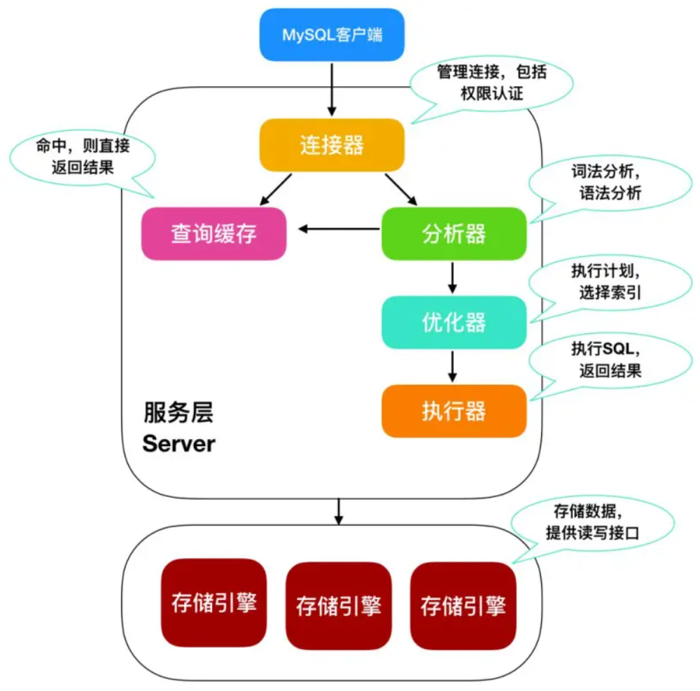

# MySQL逻辑架构



MySQL从整体上可以分为Server层和存储引擎层。

## 一. Server层

大多数的MySQL的核心服务功能都是在Server层，它包括连接器、查询缓存、解析器、优化器、执行器。

Server层涵盖了MySQL的大部分功能，包括查询解析、分析、优化、缓存以及所有的内置函数(例如：日期、时间、数学和加密函数)，所有跨存储引擎的功能都在这一层实现：存储过程、触发器、视图等。

### 1.1 连接器

每个客户端连接都会在服务器进程中拥有一个线程，这个连接的查询只会在这个单独的线程中执行。

当客户端应用连接到MySQL服务器时，首先接待它的就是连接器。连接器负责跟客户端建立连接、获取权限、维持和管理连接。

连接MySQL服务器的命令：

```shell
mysql -h$ip -P$port -u$user -p 
```

输完命令之后，会提示我们输入密码，也可以将密码写在-p后面，但是这样会存在密码泄漏的风险。

如果根据我们输入的用户名和密码无法连接到服务器，我们能看到如下的报错

```java
[root@codegirl ~]# mysql -hlocalhost -P3306 -uroot -p 
Enter password:  
ERROR 1045 (28000): Access denied for user 'root'@'localhost' (using password: YES) 
```

 这个报错信息就是连接器返回的。

所以当我们通过客户端命令mysql与服务器建立连接时，连接器做了两件事情：

- 认证用户名和密码，如果认证失败，我们就收到了上述1045的异常，客户端程序就结束了执行。如果认证成功，客户端就与服务器建立了连接。
- 连接成功之后，连接器会继续验证用户的权限，比如我们有哪些表的查询权限，哪些表的修改权限，或者是授权权限。之后这个连接中的权限判断逻辑，都是基于此时读到的权限。所以如果修改了权限，一定要记得重新连接!

连接器的连接又分为长连接和短连接。

**长连接：**连接成功后，如果客户端持续有请求，则一直使用通过一个连接。

**短连接：**每次执行完很少的几次查询就断开连接，下次查询再重新建立一个连接。

建立连接的过程比较复杂，现在绝大部分的服务都是使用的长连接。

如果建立连接之后，客户端一直没有请求，这个时候连接就会断开。这个时间由参数wait_timeout控制，默认为8小时。

查看MySQL的连接时间设置：

```shell
mysql> show variables like 'wait_timeout%'; 
```

### 1.2 查询缓存

建立连接之后，我们就可以执行sql语句了。

select查询语句：

```sql
mysql> select * from user where id = 1; 
```

它不是直接去查询表里的数据，而是先查询缓存，如果缓存中存在则直接返回缓存中的数据，缓存中不存在再去表里查询数据，然后将查询到的结果添加到缓存里。

这个逻辑就像是我们为了减轻数据库的压力加了Redis缓存一样。如果缓存存在，就不需要后面的解析和执行步骤，效率会大大提高。

MySQL缓存的数据是以key-value的形式存在的，key就是我们的查询sql语句，value就是这个sql语句对应的查询结果。

那这个时候我们不禁会想，数据库的数据如果经常变更是不是缓存需要及时失效，这样在下次查询的时候我们就可以获取到最新的数据了。

是的，MySQL只要表的数据或者表结构有变化，这张表的所有缓存都会失效。所以如果是一张经常涉及到增删改的表，缓存并没有太多实际的意义，可能刚加了缓存接下来就更新了，费了老大劲加的缓存又失效了。但是如果我们的表是系统配置这类的静态表，缓存就能起到作用。

在开发中，如果我们测试某个sql的执行时间，首先要确定缓存是否可用。查询缓存是否可用的命令：

```java
mysql> show variables like '%have_query_cache%'; 
```

修改缓存的配置，我们可以修改MySQL的配置文件：`/etc/my.cnf`，添加配置：`query_cache_type=0`;

其中可选项为：0、1、2;0代表不使用缓存，1代表使用缓存，2代表根据需要使用。

也可以使用命令：

```shell
mysql> set global query_cache_type = 0; 
```

查看缓存是否开启：

```shell
mysql> select @@query_cache_type; 
```

> 尽管MySQL Query Cache旨在提高性能，但它存在严重的可伸缩性问题，并且很容易成为严重的瓶颈。
> 自MySQL 5.6（2013）以来，默认情况下已禁用查询缓存，因为众所周知，它不能与多核计算机上在高吞吐量工作负载情况下进行扩展。
>
> **MySQL8.0版本已经完全把缓存删除了，对于缓存这一组件我们只需了解。在使用不同版本的MySQL时需要注意缓存对性能的影响**。

### 1.3 解析器

开始真正执行sql语句时，解析器会先分析我们输入的sql语句，MySQL解析器将sql语句解析成内部数据结构(解析树)，然后优化器就可以对其优化。

我们给解析器的sql语句是字符串和空格组成的，解析器第一步是解析出来字符串，识别出里面的每个字符串代表的意思。

解析器会识别sql关键字，从而知道我们是在查询还是更新。解析器将字符串'user'识别为表名字，把字符串'id'识别为列。解析器识别了字符串之后，就开始校验我们给的字符串是否符合语法规范。

解析器会验证语法，还会根据解析到的表和列验证表和列是否存在。

如果表或者列不存在，或者语法有问题，我们可以收到错误信息。

```shell
mysql> select * from aa where id =1; 
ERROR 1146 (42S02): Table 'test.aa' doesn't exist 

mysql> select * fromuser where id=1; 
ERROR 1064 (42000): You have an error in your SQL syntax; check the manual that corresponds to your MySQL server version for the right syntax to use near 'fromuser where id=1' at line 1 
```

### 1.4 优化器

经过解析器处理，得到了解析树。这个时候MySQL已经明确知道自己要做什么了，但是在开始执行之前还会对sql进行优化。

优化器对sql语句的优化包括：重写查询、决定表的读写顺序、选择合适的索引等。

优化器涉及的内容比较多，我们先对它有个初步印象，后续我们再详细了解它。

经过优化器之后，sql语句的执行方案就已经确定了，解析来就进入执行器开始执行了。

### 1.5 执行器

执行器执行sql语句的时候，会先验证是否有对这个表的权限，如果没有权限就会返回没有权限的错误信息。如果有权限，则会打开表继续执行。打开表的时候，执行器就会根据表的执行引擎，去使用执行引擎提供的接口。

## 二. 存储引擎

存储引擎层负责数据的存储和提取。存储引擎是插件式的，支持InnoDB、MyISAM、Memory等多种存储引擎，MySQL也提供了一些第三方的存储引擎，这种插件式的结构设计，使得不同的公司可以根据自己的需求选择不同的引擎。

现在最常用的存储引擎是InnoDB，它是MySQL5.5.5版本之后默认的存储引擎，如果我们在建表时不指定存储引擎类型，默认使用的就是InnoDB。

不同的存储引擎是公用Server层的，区分Server层和引擎层的功能对于后面我们学习锁和事务比较重要。

不同的引擎保存数据和索引的方式是不相同的，但是表的定义是MySQL服务层负责的，这个是一致的。

今天我们只分析两种常见的存储引擎InnoDB和MyISAM，其他的引擎小伙伴感兴趣可以查看相关文档。

## 三. Server层和存储引擎层所支持的功能

首先需要明确的是所有跨存储引擎的功能都是在Server层实现的。

### 3.1 Server层

- 查询解析、分析、优化、缓存以及所有的内置函数
- 存储过程、触发器、视图

### 3.2 存储引擎层

- 事务
- 行级锁
- 索引