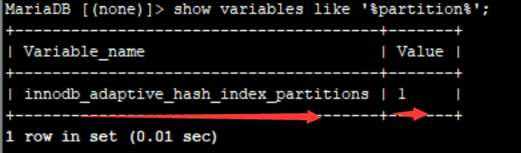
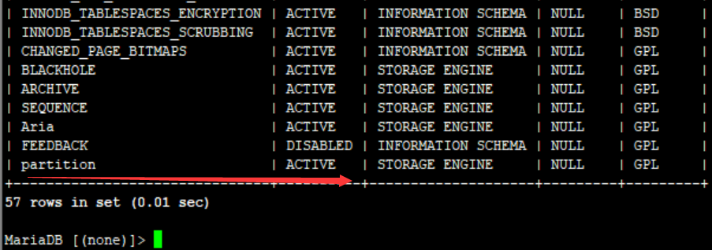

# MySQL分区表详解

## 一. 什么是分区表

分区是一种表的设计模式，正确的分区可以极大地提升数据库的查询效率，完成更高质量的SQL编程。但是如果错误地使用分区，那么分区可能带来毁灭性的的结果。

分区功能并不是在存储引擎层完成的，常见的存储引擎**InnoDB、MyISAM、NDB等都支持分区**。但是并不是所有的存储引擎都支持，如CSV、FEDORATED、MERGE等就不支持分区。在使用此分区功能前，应该对选择的存储引擎对分区的支持有所了解。

MySQL数据库在**5.1版本及以上**时添加了对分区的支持，分区的过程是将一个表或索引分解为多个更小、更可管理的部分。就访问数据库的应用而言，从逻辑上讲，只有一个表或一个索引，但是在物理上这个表或索引可能由数十个物理分区组成。每个分区都是独立的对象，可以独自处理，也可以作为一个更大对象的一部分进行处理。

MySQL数据库支持的**分区类型为水平分区**（指将同一个表中不同行的记录分配到不同的物理文件中），并不支持垂直分区（指将同一表中不同列的记录分配到不同的物理文件中）。此外，MySQL数据库的分区是局部分区索引，一个分区中既存放了数据又存放了索引。而全局分区是指，数据存放在各个分区中，但是所有数据的索引放在一个对象中。目前，MySQL数据库还不支持全局分区。

## 二. 分区表的好处

分区的**好处**是：

- 可以让单表存储更多的数据
- 分区表的数据更容易维护，可以通过清楚整个分区批量删除大量数据，也可以增加新的分区来支持新插入的数据。另外，还可以对一个独立分区进行优化、检查、修复等操作。参考：[MySQL使用分区快速归档数据 - abce - 博客园 (cnblogs.com)](https://www.cnblogs.com/abclife/p/17031719.html)
- 部分查询能够从查询条件确定只落在少数分区上，速度会很快（查询条件尽量扫描少的分区）
- 分区表的数据还可以分布在不同的物理设备上，从而高效利用多个硬件设备
- 可以使用分区表来避免某些特殊瓶颈，例如InnoDB单个索引的互斥访问、ext3文件系统的inode锁竞争
- 可以备份和恢复单个分区。

分区的**限制和缺点**：

- 一个表最多只能有1024个分区
- 如果分区字段中有主键或者唯一索引的列，那么所有主键列和唯一索引列都必须包含进来
- 分区表无法使用外键约束
- NULL值会使分区过滤无效
- 所有分区必须使用相同的存储引擎

## 三. 表分区与分表的区别

分表：指的是通过一定规则，将一张表分解成多张不同的表。比如将用户订单记录根据时间成多个表。 

分表与分区的区别在于：分区从逻辑上来讲只有一张表，而分表则是将一张表分解成多张表。

## 四. 如何判断是否支持分区

### 4.1 MySQL5.6以及之前版本

```shell
show variables like ‘%partition%’;
```



### 4.2 MySQL5.7

```shell
show plugins;
```



## 五. 分区表的分类与限制

### 5.1 分区表分类

- **RANGE分区**：基于属于一个给定连续区间的列值，把多行分配给分区。

- **LIST分区**：类似于按RANGE分区，区别在于LIST分区是基于列值匹配一个离散值集合中的某个值来进行选择。

- **HASH分区**：基于用户定义的表达式的返回值来进行选择的分区，该表达式使用将要插入到表中的这些行的列值进行计算。这个函数可以包含MySQL 中有效的、产生非负整数值的任何表达式。

- **KEY分区**：类似于按HASH分区，区别在于KEY分区只支持计算一列或多列，且MySQL服务器提供其自身的哈希函数。必须有一列或多列包含整数值。

- **复合分区**：在MySQL 5.6版本中，只支持RANGE和LIST的子分区，且子分区的类型只能为HASH和KEY。

### 5.2 分区表限制

1. 分区键必须包含在表的所有主键、唯一键中。

2. MYSQL只能在使用分区函数的列本身进行比较时才能过滤分区，而不能根据表达式的值去过滤分区，即使这个表达式就是分区函数也不行。

3. 最大分区数： 不使用NDB存储引擎的给定表的最大可能分区数为8192（包括子分区）。如果当分区数很大，但是未达到8192时提示 Got error … from storage engine: Out of resources when opening file,可以通过增加open_files_limit系统变量的值来解决问题，当然同时打开文件的数量也可能由操作系统限制。

4. 不支持查询缓存： 分区表不支持查询缓存，对于涉及分区表的查询，它自动禁用。 查询缓存无法启用此类查询。

5. 分区的innodb表不支持外键。

6. 服务器SQL_mode影响分区表的同步复制。 主机和从机上的不同SQL_mode可能会导致sql语句; 这可能导致分区之间的数据分配给定主从位置不同，甚至可能导致插入主机上成功的分区表在从库上失败。 为了获得最佳效果，您应该始终在主机和从机上使用相同的服务器SQL模式。

7. ALTER TABLE … ORDER BY： 对分区表运行的ALTER TABLE … ORDER BY列语句只会导致每个分区中的行排序。

8. 全文索引。 分区表不支持全文索引，即使是使用InnoDB或MyISAM存储引擎的分区表。
9. 分区表无法使用外键约束。
10. Spatial columns： 具有空间数据类型（如POINT或GEOMETRY）的列不能在分区表中使用。
11. 临时表： 临时表不能分区。
12. subpartition问题： subpartition必须使用HASH或KEY分区。 只有RANGE和LIST分区可能被分区; HASH和KEY分区不能被子分区。
13. 分区表不支持mysqlcheck，myisamchk和myisampack。

## 六. 创建分区表

### 6.1 range分区

1）行数据基于一个给定的连续区间的列值放入分区。

```sql
CREATE TABLE `test_11` (
  `id` int(11) NOT NULL,
  `t` date NOT NULL,
  PRIMARY KEY (`id`,`t`)
) ENGINE=InnoDB DEFAULT CHARSET=utf8
 PARTITION BY RANGE (to_days(t))
(PARTITION p20170801 VALUES LESS THAN (736907) ENGINE = InnoDB,
 PARTITION p20170901 VALUES LESS THAN (736938) ENGINE = InnoDB,
 PARTITION pmax VALUES LESS THAN maxvalue ENGINE = InnoDB);123456789
```

2）然后插入4条数据：

```sql
insert into test_11 values (1,"20170722"),(2,"20170822"),(3,"20170823"),(4,"20170824");
```

3）然后查看information下partitions对分区别信息的统计：

```sql
select PARTITION_NAME as "分区",TABLE_ROWS as "行数" from information_schema.partitions where table_schema="mysql_test" and table_name="test_11";
+-----------+--------+
| 分区      | 行数   |
+-----------+--------+
| p20170801 |      1 |
| p20170901 |      3 |
+-----------+--------+
2 rows in set (0.00 sec)12345678
```

可以看出分区p20170801插入1行数据，p20170901插入的3行数据。 可以是用year、to_days、unix_timestamp等函数对相应的时间字段进行转换，然后分区。

### 6.2 list分区

和range分区一样，只是list分区面向的是离散的值

```sql
mysql> CREATE TABLE h2 (
    ->   c1 INT,
    ->   c2 INT
    -> )
    -> PARTITION BY LIST(c1) (
    ->   PARTITION p0 VALUES IN (1, 4, 7),
    ->   PARTITION p1 VALUES IN (2, 5, 8)
    -> );
Query OK, 0 rows affected (0.11 sec)123456789
```

与RANGE分区的情况不同，没有“catch-all”，如MAXVALUE; 分区表达式的所有预期值应在PARTITION … VALUES IN（…）子句中涵盖。 包含不匹配的分区列值的INSERT语句失败并显示错误，如此示例所示：

```sql
smysql> INSERT INTO h2 VALUES (3, 5);
ERROR 1525 (HY000): Table has no partition for value 312
```

### 6.2 hash分区

根据用户自定义表达式的返回值来进行分区，返回值不能为负数

```sql
CREATE TABLE t1 (col1 INT, col2 CHAR(5), col3 DATE)
    PARTITION BY HASH( YEAR(col3) )
    PARTITIONS 4;123
```

如果你插入col3的数值为’2005-09-15’，那么根据以下计算来选择插入的分区：

```sql
MOD(YEAR('2005-09-01'),4)
    =  MOD(2005,4)
    =  1123
```

### 6.4 key分区

根据MySQL数据库提供的散列函数进行分区

```sql
CREATE TABLE k1 (
    id INT NOT NULL,
    name VARCHAR(20),
    UNIQUE KEY (id)
)
PARTITION BY KEY()
PARTITIONS 2;1234567
```

KEY仅列出零个或多个列名称。 用作分区键的任何列必须包含表的主键的一部分或全部，如果该表具有一个。 如果没有列名称作为分区键，则使用表的主键（如果有）。如果没有主键，但是有一个唯一的键，那么唯一键用于分区键。但是，如果唯一键列未定义为NOT NULL，则上一条语句将失败。 与其他分区类型不同，KEY使用的分区不限于整数或空值。 例如，以下CREATE TABLE语句是有效的：

```sql
CREATE TABLE tm1 (
    s1 CHAR(32) PRIMARY KEY
)
PARTITION BY KEY(s1)
PARTITIONS 10;12345
```

注意：对于key分区表，不能执行ALTER TABLE DROP PRIMARY KEY，因为这样做会生成错误 ERROR 1466 (HY000): Field in list of fields for partition function not found in table.

### 6.5 column分区

COLUMN分区是5.5开始引入的分区功能，只有RANGE COLUMN和LIST COLUMN这两种分区；支持整形、日期、字符串；RANGE和LIST的分区方式非常的相似。

COLUMNS和RANGE和LIST分区的区别: 

1）针对日期字段的分区就不需要再使用函数进行转换了，例如针对date字段进行分区不需要再使用YEAR()表达式进行转换。
2）COLUMN分区支持多个字段作为分区键但是不支持表达式作为分区键。

column支持的数据类型：

1）所有的整型，float和decimal不支持
2）日期类型：date和datetime，其他不支持
3）字符类型：CHAR, VARCHAR, BINARY和VARBINARY，blob和text不支持
单列的column range分区mysql> show create table list_c;

```sql
 CREATE TABLE `list_c` (
  `c1` int(11) DEFAULT NULL,
  `c2` int(11) DEFAULT NULL
) ENGINE=InnoDB DEFAULT CHARSET=latin1
/*!50500 PARTITION BY RANGE  COLUMNS(c1)
(PARTITION p0 VALUES LESS THAN (5) ENGINE = InnoDB,
 PARTITION p1 VALUES LESS THAN (10) ENGINE = InnoDB) */
```

多列的column range分区mysql> show create table list_c;

```sql
 CREATE TABLE `list_c` (
  `c1` int(11) DEFAULT NULL,
  `c2` int(11) DEFAULT NULL,
  `c3` char(20) DEFAULT NULL
) ENGINE=InnoDB DEFAULT CHARSET=latin1
/*!50500 PARTITION BY RANGE  COLUMNS(c1,c3)
(PARTITION p0 VALUES LESS THAN (5,'aaa') ENGINE = InnoDB,
 PARTITION p1 VALUES LESS THAN (10,'bbb') ENGINE = InnoDB) */
单列的column list分区mysql> show create table list_c;
 CREATE TABLE `list_c` (
  `c1` int(11) DEFAULT NULL,
  `c2` int(11) DEFAULT NULL,
  `c3` char(20) DEFAULT NULL
) ENGINE=InnoDB DEFAULT CHARSET=latin1
/*!50500 PARTITION BY LIST  COLUMNS(c3)
(PARTITION p0 VALUES IN ('aaa') ENGINE = InnoDB,
 PARTITION p1 VALUES IN ('bbb') ENGINE = InnoDB) */
```

### 6.6 子分区

在分区的基础上再进一步分区，有时成为复合分区; MySQL数据库允许在range和list的分区上进行HASH和KEY的子分区。例如：

```sql
CREATE TABLE ts (id INT, purchased DATE)
    PARTITION BY RANGE( YEAR(purchased) )
    SUBPARTITION BY HASH( TO_DAYS(purchased) )
    SUBPARTITIONS 2 (
        PARTITION p0 VALUES LESS THAN (1990),
        PARTITION p1 VALUES LESS THAN (2000),
        PARTITION p2 VALUES LESS THAN MAXVALUE
    );
[root@mycat-3 ~]# ll /data/mysql_data_3306/mysql_test/ts*
-rw-r----- 1 mysql mysql  8596 Aug  8 13:54 /data/mysql_data_3306/mysql_test/ts.frm
-rw-r----- 1 mysql mysql 98304 Aug  8 13:54 /data/mysql_data_3306/mysql_test/ts#P#p0#SP#p0sp0.ibd
-rw-r----- 1 mysql mysql 98304 Aug  8 13:54 /data/mysql_data_3306/mysql_test/ts#P#p0#SP#p0sp1.ibd
-rw-r----- 1 mysql mysql 98304 Aug  8 13:54 /data/mysql_data_3306/mysql_test/ts#P#p1#SP#p1sp0.ibd
-rw-r----- 1 mysql mysql 98304 Aug  8 13:54 /data/mysql_data_3306/mysql_test/ts#P#p1#SP#p1sp1.ibd
-rw-r----- 1 mysql mysql 98304 Aug  8 13:54 /data/mysql_data_3306/mysql_test/ts#P#p2#SP#p2sp0.ibd
-rw-r----- 1 mysql mysql 98304 Aug  8 13:54 /data/mysql_data_3306/mysql_test/ts#P#p2#SP#p2sp1.ibd
1234567891011121314151617
```

ts表根据purchased进行range分区，然后又进行了一次hash分区，最后形成了3*2个分区，可以从物理文件证实此分区方式。可以通过subpartition语法来显示指定子分区名称。 注意：每个子分区的数量必须相同；如果一个分区表的任何子分区已经使用subpartition，那么必须表明所有的子分区名称；每个subpartition子句必须包括子分区的一个名字；子分区的名字必须是一致的 另外，对于MyISAM表可以使用index directory和data direactory来指定各个分区的数据和索引目录，但是对于innodb表来说，因为该存储引擎使用表空间自动的进行数据和索引的管理，因此会忽略指定index和data的语法。

## 七. 修改普通表为分区表

```sql
## 先修改主键，加入分区字段，如果存在唯一键，也需要
alter table `test` drop primary key, add primary key (`id`, `create_time`);
## 加上分区
alter table `test` PARTITION BY RANGE (`create_time`)(
 PARTITION p_202112 VALUES LESS THAN (1640966400),
 PARTITION p_max VALUES LESS THAN MAXVALUE
);
```

## 八. 分区表操作

```sql
CREATE TABLE t1 (
    id INT,
    year_col INT
)
PARTITION BY RANGE (year_col) (
    PARTITION p0 VALUES LESS THAN (1991),
    PARTITION p1 VALUES LESS THAN (1995),
    PARTITION p2 VALUES LESS THAN (1999),
    PARTITION p_max VALUES LESS THAN MAXVALUE
);
```

### 8.1 ADD PARTITION （新增分区）

```sql
ALTER TABLE t1 ADD PARTITION (PARTITION p3 VALUES LESS THAN (2002));
```

### 8.2 DROP PARTITION （删除分区）

```sql
ALTER TABLE t1 DROP PARTITION p0, p1;
```

### 8.3 TRUNCATE PARTITION（截取分区）

```sql
ALTER TABLE t1 TRUNCATE PARTITION p0;

ALTER TABLE t1 TRUNCATE PARTITION p1, p3;
```

### 8.4 COALESCE PARTITION（合并分区）

```sql
CREATE TABLE t2 (
    name VARCHAR (30),
    started DATE
)
PARTITION BY HASH( YEAR(started) )
PARTITIONS 6;

ALTER TABLE t2 COALESCE PARTITION 2;
```

### 8.5 REORGANIZE PARTITION（拆分/重组分区）

1）拆分分区

```sql
ALTER TABLE table ALGORITHM=INPLACE, REORGANIZE PARTITION;

ALTER TABLE employees ADD PARTITION (
    PARTITION p5 VALUES LESS THAN (2010),
    PARTITION p6 VALUES LESS THAN MAXVALUE
);
```

2）重组分区

```sql
ALTER TABLE members REORGANIZE PARTITION s0,s1 INTO (
    PARTITION p0 VALUES LESS THAN (1970)
);
ALTER TABLE tbl_name
    REORGANIZE PARTITION partition_list
    INTO (partition_definitions);
ALTER TABLE members REORGANIZE PARTITION p0,p1,p2,p3 INTO (
    PARTITION m0 VALUES LESS THAN (1980),
    PARTITION m1 VALUES LESS THAN (2000)
);
ALTER TABLE tt ADD PARTITION (PARTITION np VALUES IN (4, 8));
ALTER TABLE tt REORGANIZE PARTITION p1,np INTO (
    PARTITION p1 VALUES IN (6, 18),
    PARTITION np VALUES in (4, 8, 12)
);
```


> 本文参考至：
>
> [Mysql 分区表-分区操作 - JAVA 牛牛 (javaniuniu.com)](https://javaniuniu.com/mysql/partition)
>
> [mysql表分区详解 - 邓维-java - 博客园 (cnblogs.com)](https://www.cnblogs.com/dw3306/p/12620042.html)
>
> [MySQL使用分区快速归档数据 - abce - 博客园 (cnblogs.com)](https://www.cnblogs.com/abclife/p/17031719.html)
>
> [进来偷学一招，数据归档二三事儿 - 掘金 (juejin.cn)](https://juejin.cn/post/6983238388585332750)