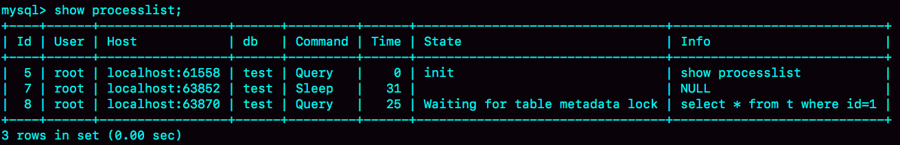
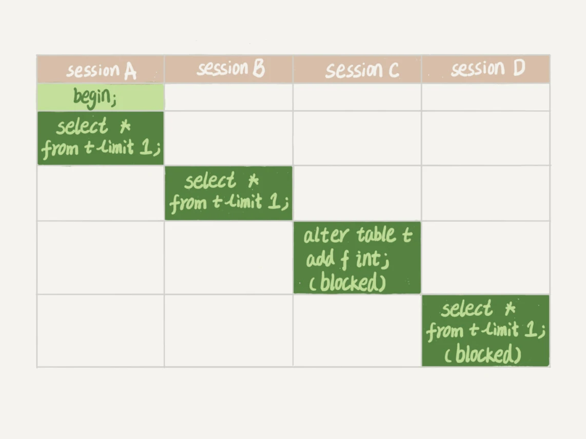
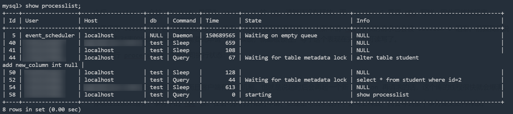
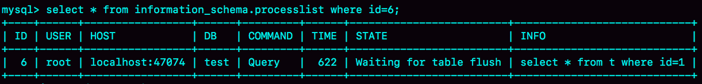
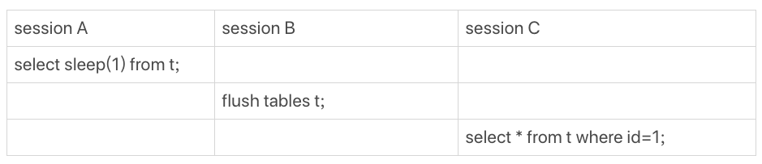
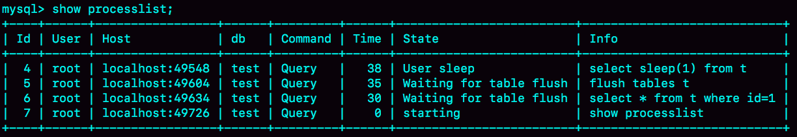
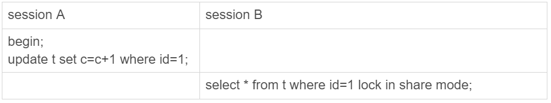
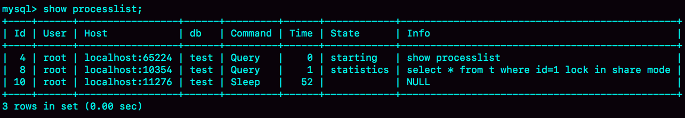
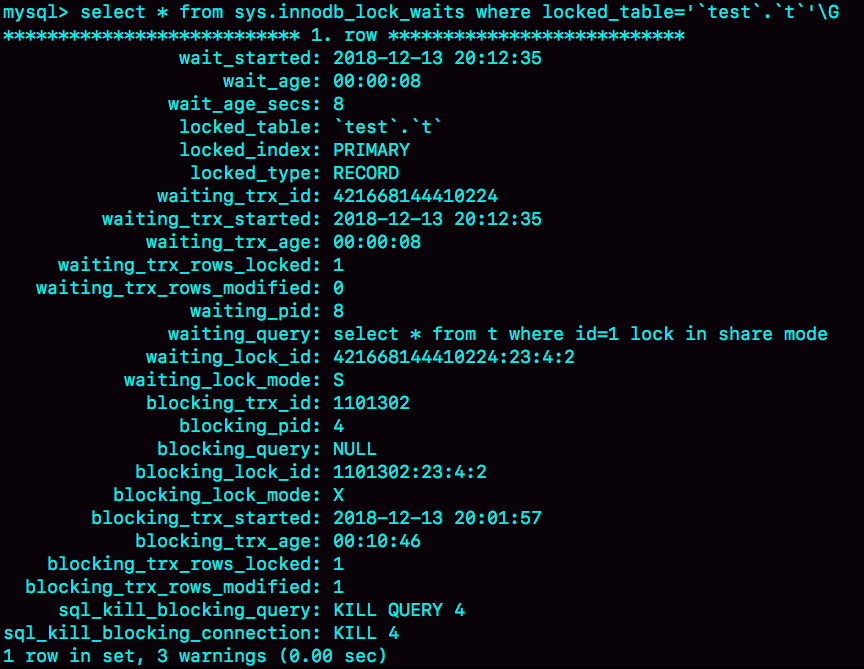
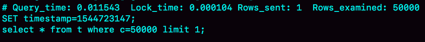

# 查询一条SQL为啥也这么慢

一般情况下，如果我跟你说查询性能优化，你首先会想到一些复杂的语句，想到查询需要返回大量的数据。但有些情况下，“查一行”，也会执行得特别慢。今天，我就跟你聊聊这个有趣的话题，看看什么情况下，会出现这个现象。

需要说明的是，如果 MySQL 数据库本身就有很大的压力，导致数据库服务器 CPU 占用率很高或 ioutil（IO 利用率）很高，这种情况下所有语句的执行都有可能变慢，不属于我们今天的讨论范围。

为了便于描述，我还是构造一个表，基于这个表来说明今天的问题。这个表有两个字段 id 和 c，并且我在里面插入了 10 万行记录。

```sql
mysql> CREATE TABLE `t` (
  `id` int(11) NOT NULL,
  `c` int(11) DEFAULT NULL,
  PRIMARY KEY (`id`)
) ENGINE=InnoDB;

delimiter ;;
create procedure idata()
begin
  declare i int;
  set i=1;
  while(i<=100000) do
    insert into t values(i,i);
    set i=i+1;
  end while;
end;;
delimiter ;

call idata();
```

接下来，我会用几个不同的场景来举例，有些是前面的文章中我们已经介绍过的知识点，你看看能不能一眼看穿，来检验一下吧。

## 一. 查询长时间不返回

如图 1 所示，在表 t 执行下面的 SQL 语句：

```sql
mysql> select * from t where id=1;
```

查询结果长时间不返回。


一般碰到这种情况的话，大概率是表 t 被锁住了。接下来分析原因的时候，一般都是首先执行一下 show processlist 命令，看看当前语句处于什么状态。

然后我们再针对每种状态，去分析它们产生的原因、如何复现，以及如何处理。

### 1.1 等 MDL 锁

如图 2 所示，就是使用 show processlist 命令查看 Waiting for table metadata lock 的示意图。



出现这个状态表示的是，现在有一个线程正在表 t 上请求或者持有 MDL 写锁，把 select 语句堵住了。

在 MySQL 5.5 版本中引入了 MDL（表级别锁），当对一个表做增删改查操作的时候，加 MDL 读锁；当要对表做结构变更操作的时候，加 MDL 写锁。

- 读锁之间不互斥，因此你可以有多个线程同时对一张表增删改查。
- 读写锁之间、写锁之间是互斥的，用来保证变更表结构操作的安全性。因此，如果有两个线程要同时给一个表加字段，其中一个要等另一个执行完才能开始执行。

虽然 MDL 锁是系统默认会加的，但却是你不能忽略的一个机制。比如下面这个例子，我经常看到有人掉到这个坑里：给一个小表加个字段，导致整个库挂了。

你肯定知道，给一个表加字段，或者修改字段，或者加索引，需要扫描全表的数据。在对大表操作的时候，你肯定会特别小心，以免对线上服务造成影响。而实际上，即使是小表，操作不慎也会出问题。我们来看一下下面的操作序列，假设表 t 是一个小表。



我们可以看到 session A 先启动，这时候会对表 t 加一个 MDL 读锁。由于 session B 需要的也是 MDL 读锁，因此可以正常执行。

之后 session C 会被 blocked，是因为 session A 的 MDL 读锁还没有释放，而 session C 需要 MDL 写锁，因此只能被阻塞。

如果只有 session C 自己被阻塞还没什么关系，但是之后所有要在表 t 上新申请 MDL 读锁的请求也会被 session C 阻塞。前面我们说了，所有对表的增删改查操作都需要先申请 MDL 读锁，就都被锁住，等于这个表现在完全不可读写了。

我们执行 processlist 查看语句执行状态：



如果某个表上的查询语句频繁，而且客户端有重试机制，也就是说超时后会再起一个新 session 再请求的话，这个库的线程很快就会爆满。

你现在应该知道了，事务中的 MDL 锁，在语句执行开始时申请，但是语句结束后并不会马上释放，而会等到整个事务提交后再释放。

> 备注：这里的实验环境是 MySQL 5.6。需要注意的是，MySQL 5.6.7 版本之后 MySQL 支持 Online DDL，MDL加锁过程做出了改进，Online DDL执行过程中会尽量减少 MDL互斥锁的占用时间，在Online DDL EXECUTE阶段会将MDL互斥锁降级为读锁，这样其它线程的DML语句就能恢复执行了，减少了不可用时间。
>
> 但是经过实验（实验过程和上例一样），在Online DDL支持的版本（8.0.21）中，如果有长事务一直占用MDL读锁，那么后进来的 DDL 语句会因为 MDL 读锁被占据而被阻塞，等待前面所有MDL读锁释放，从而获得MDL互斥锁；但是此时在DDL后面的DML语句由于需要等待DDL事务准备获取的MDL互斥锁释放后才会被执行（公平锁，后来的读锁不能插在互斥锁前面先拿到锁），所以也会被阻塞。

当遇此类问题时，我们需要找到谁持有 MDL 互斥锁，然后把它 kill 掉。

例如在上图中我们就需要执行 `kill 44`，将DDL语句线程占时kill掉，在业务低峰的时候再执行DDL语句。

### 1.2 等 flush

接下来，我给你举另外一种查询被堵住的情况。

我在表 t 上，执行下面的 SQL 语句：

```sql
mysql> select * from information_schema.processlist where id=1;
```

这里，我先卖个关子。

见下图。我查出来这个线程的状态是 Waiting for table flush，你可以设想一下这是什么原因。



这个状态表示的是，现在有一个线程正要对表 t 做 flush 操作。MySQL 里面对表做 flush 操作的用法，一般有以下两个：

```sql
flush tables t with read lock;

flush tables with read lock;
```

这两个 flush 语句，如果指定表 t 的话，代表的是只关闭表 t；如果没有指定具体的表名，则表示关闭 MySQL 里所有打开的表。

但是正常这两个语句执行起来都很快，除非它们也被别的线程堵住了。

所以，出现 Waiting for table flush 状态的可能情况是：有一个 flush tables 命令被别的语句堵住了，然后它又堵住了我们的 select 语句。

现在，我们一起来复现一下这种情况，复现步骤如图 6 所示：



在 session A 中，我故意每行都调用一次 sleep(1)，这样这个语句默认要执行 10 万秒，在这期间表 t 一直是被 session A“打开”着。然后，session B 的 flush tables t 命令再要去关闭表 t，就需要等 session A 的查询结束。这样，session C 要再次查询的话，就会被 flush 命令堵住了。

下图是这个复现步骤的 show processlist 结果。这个例子的排查也很简单，你看到这个 show processlist 的结果，肯定就知道应该怎么做了。



### 1.3 等行锁

现在，经过了表级锁的考验，我们的 select 语句终于来到引擎里了。

```sql
mysql> select * from t where id=1 lock in share mode; 
```

由于访问 id=1 这个记录时要加读锁，如果这时候已经有一个事务在这行记录上持有一个写锁，我们的 select 语句就会被堵住。

复现步骤和现场如下：



`show processlist;` 执行结果：



显然，session A 启动了事务，占有写锁，还不提交，是导致 session B 被堵住的原因。

这个问题并不难分析，但问题是怎么查出是谁占着这个写锁。如果你用的是 MySQL 5.7 版本，可以通过 sys.innodb_lock_waits 表查到。

查询方法是：

```sql
mysql> select * from t sys.innodb_lock_waits where locked_table='`test`.`t`'\G
```



可以看到，这个信息很全，4 号线程是造成堵塞的罪魁祸首。而干掉这个罪魁祸首的方式，就是 KILL QUERY 4 或 KILL 4。

> tips：lock in share mode 和 for update区别
>
> `SELECT ... LOCK IN SHARE MODE`和`SELECT ... FOR UPDATE`都是用于在读取数据时进行加锁的MySQL语句，但两者的加锁方式不同，所表示的含义也不同。
>
> `SELECT ... LOCK IN SHARE MODE`用于在读取数据时对数据进行共享锁，以确保读取的数据不会被其他事务修改。这种方式表示读操作只需要共享锁，而不需要排他锁。其他事务可以读取该数据行，但不能对该数据行进行修改。因此，`SELECT ... LOCK IN SHARE MODE`适用于多个事务需要读取同一份数据时，避免数据的不一致或修改。
>
> 而`SELECT ... FOR UPDATE`语句表示在读取数据时对数据进行排他锁，以确保读取的数据行不会被其他事务读取或修改。这种方式表示读操作需要排他锁，其他事务不能读取或修改该数据行，只有当前事务完成后才能释放锁。因此，`SELECT ... FOR UPDATE`适用于需要读取并修改数据的场景。
>
> 总的来说，`SELECT ... LOCK IN SHARE MODE`和`SELECT ... FOR UPDATE`都是在读取数据时进行加锁以确保数据的一致性和完整性，但两者的加锁方式不同，适用的场景也不同。

## 二. 查询慢

经过了重重封“锁”，我们再来看看一些查询慢的例子。

先来看一条你一定知道原因的 SQL 语句：

```sql
mysql> select * from t where c=50000 limit 1;
```

由于字段 c 上没有索引，这个语句只能走 id 主键顺序扫描，因此需要扫描 5 万行。

作为确认，你可以看一下慢查询日志。注意，这里为了把所有语句记录到 slow log 里，我在连接后先执行了 set long_query_time=0，将慢查询日志的时间阈值设置为 0。



Rows_examined 显示扫描了 50000 行。你可能会说，不是很慢呀，11.5 毫秒就返回了，我们线上一般都配置超过 1 秒才算慢查询。但你要记住：坏查询不一定是慢查询。我们这个例子里面只有 10 万行记录，数据量大起来的话，执行时间就线性涨上去了。

扫描行数多，所以执行慢，这个很好理解。

