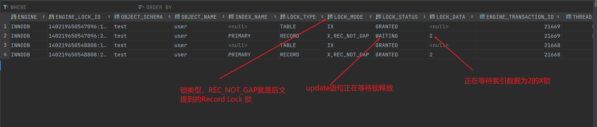

# InnoDB锁类型

MySQL 是支持ACID特性的数据库。我们都知道”C”代表Consistent，当不同事务操作同一行记录时，为了保证一致性，需要对记录加锁。在MySQL 中，不同的引擎下的锁行为也会不同，本文将重点介绍 MySQL InnoDB引擎中常见的锁。

## 一. 准备

```sql
CREATE TABLE `user` (
  `id` bigint(20) NOT NULL AUTO_INCREMENT,
  `name` varchar(32) DEFAULT NULL,
  `age` tinyint(4) DEFAULT '0',
  `phone` varchar(11) DEFAULT NULL,
  PRIMARY KEY (`id`),
  KEY `idx_age` (`age`)
) ENGINE=InnoDB AUTO_INCREMENT=6 DEFAULT CHARSET=utf8mb4;

create index test_age_index
    on user (age);

#插入基础数据
INSERT INTO `user` (`id`, `name`, `age`, `phone`)
VALUES
	(1, '张三', 18, '13800138000'),
	(2, '李四', 20, '13800138001'),
	(3, '王五', 22, '13800138002'),
	(4, '赵六', 26, '13800138003'),
	(5, '孙七', 30, '13800138004');
```

为了方便讲解，创建一张user表，设置age的字段为普通索引，并填充以下数据。本文所有的sql语句均基于这张表。

| id   | name | age  | phone       |
| ---- | ---- | ---- | ----------- |
| 1    | 张三 | 18   | 13800138000 |
| 2    | 李四 | 20   | 13800138001 |
| 3    | 王五 | 22   | 13800138002 |
| 4    | 赵六 | 26   | 13800138003 |
| 5    | 孙七 | 30   | 13800138004 |

## 二. 快照读和当前读

MySQL在REPEATABLE READ隔离级别下很大程度地避免了幻读现象（很大程度是个啥意思?意思是在某些情况下其实还是可能出现幻读现象的）。

怎么避免脏读、不可重复读、幻读这些现象呢？其实有两种可选的解决方案。

- 方案一：读操作使用多版本并发控制(MVCC)，写操作进行加锁。

  MVCC 在之前的文章有详细的描述，就是通过生成一个 ReadView，然后通过ReadView找到符合条件的记录版本(历史版本是由undo日志构建的)。其实就像是在生成ReadView的那个时刻，时间静止了(就像用相机拍了一个快照)，查询语句只能读到在生成ReadView之前已提交事务所做的更改，在生成ReadView之前未提交的事务或者之后才开启的事务所做的更改则是看不到的。写操作肯定针对的是最新版本的记录，读记录的历史版本和改动记录的最新版本这两者并不冲突，也就是采用MVCC时，读-写操作并不冲突。**我们通常把MVCC实现的并发读写称为“快照读”**。

  > MVCC无法完全避免快照读，参考：[《什么是MVCC机制》](./_10什么是MVCC机制.md)

- 方案二：读、写操作都采用加锁的方式。

  如果我们的一些业务场不允许读取记录的旧版本，而是每次都必须去读取记录的最新版本。比如在银行存款的事务中，我们需要先把账户的余额读出来，然后将其加上本次存款的数额，最后再写到数据库中。在将账户余额读取出来后，就不想让别的事务再访问该余额，直到本次存款事务执行完成后，其他事务才可以访问账户的余额。这样在读取记录的时候也就需要对其进行加锁操作，这也就意味着读操作和写操作也得像写写操作 那样排队执行。**我们通常将使用加锁的方式实现的并发读写称为“当前读”**。后文提到的`select ... for update` 和 `select ... lock in share mode` 就是典型的当前读。

很明显如果采用MVCC方式，读-写操作彼此并不冲突，性能更高；如果采用加锁方式，读-写操作彼此需要排队执行，从而影响性能。一般情况下，我们当然愿意采用MVCC来解决读-写操作并发执行的问题，但是在某些特殊业务场景中，要求必须采用加锁的方式执行，那也是没有办法的事情。

## 三. 锁的分类


### 3.1 行级锁和表级锁(Row-level and Table-level Locks)

按照锁的粒度划分，可分为行级锁和表级锁。表级锁作用于数据库表，不同的事务对同一个表加锁，根据实际情况，后加锁的事务可能会发生block，直到表锁被释放。表级锁的优点是资源占用低，可防止死锁等。缺点是锁的粒度太高，不利于高并发的场景。

行级锁行级锁作用于数据库行，它允许多个事务同时访问同一个数据库表。当多个事务操作同一行记录时，没获得锁的事务必须等持有锁的事务释放才能操作行数据。行级锁的优点能支持较高的并发。缺点是资源占用较高，且会出现死锁。

### 4.2 共享锁排它锁(Shared and Exclusive Locks)

InnoDB引擎的锁分为两类，分别是共享锁和排他锁。这些概念在很多领域都出现过，比如Java中的`ReadWriteLock`。

- 共享锁(shared lock) 允许多个事务同时持有同一个资源的共享锁，常用`S`表示。

  ```sql
  #mysql 8.0之前的版本通过 lock in share mode给数据行添加share lock
  select * from user where id = 1 lock in share mode;
    
  #mysql 8.0以后的版本通过for share给数据行添加share lock
  select * from user where id = 1 for share；
  ```

  在普通的 SELECT 语句后边加 `LOCK IN SHARE MODE`，如果当前事务执行了该语句，那么它会为读取到的记录加 S 锁 这样允许别的事务继续获取这些记录的 S 锁（比方说别的事务也使用 `SELECT ... LOCK IN SHARE MODE` 语句来读取这些记录），但是不能获取这些记录的 X 锁（比方说使用 `SELECT ... FOR UPDATE`语句来读取这些记录，或者直接修改这些记录）。如果别的事务想要获取这些记录的 X 锁，那么它们会阻塞，直到当前事务提交之后将这些记录上的 S 锁释放掉。

  > select默认情况下都是快照读，除非显式加锁，实现当前读。

- 排他锁(exclusive lock)只允许一个事务持有某个资源的锁，常用`X`表示。

  ```sql
  # 通过for update可以给数据行加exclusive lock
  select * from user where id = 1 for update;
    
  # 通过update或delete同样也可以
  update user set age = 16 where id = 1;
  ```

  也就是在普通的 SELECT 语句后面加上 `FOR UPDATE`。如果当前事务执行了该语句，那么它会为读取到的记录加X锁，这样既不允许别的事务获取这些记录的S锁(比如别的事务| 使用`SELECT .. LOCK IN SHARE MODE`语句来读取这些记录时)，也不允许获取这些记录的x锁(比如说使用SELECT .. FOR UPDATE语句来读取这些记录，或者直接改动这些记录时）如果别的事务想要获取这些记录的s锁或者X锁，那么它们会被阻塞，直到当物事务提交之后将这些记录上的X锁释放掉为止。
  
  > update、delete语句默认会加排他行锁

举个例子，假如事务T1持有了某一行(r)的共享锁(S)。当事务T2也想获得该行的锁，分为如下两种情况:

- 如果T2申请的是行r的共享锁(S)，会被立即允许，此时T1和T2同时持有行r的共享锁。
- 如果T2申请的是排他锁(X)，那么必须等T1释放才能成功获取。

反过来说，假如T1持有行`r`的排他锁，那不管T2申请的是共享锁还是排他锁，都必须等待T1释放才能成功。

总的来说，MySQL中的锁有很多种，不过我们需要重点关注的就上面两点，即锁的作用域和锁的类型。如上所述，**锁可以作用于行，也能作用于表，但不管他们的作用域是什么，锁的类型只有两种，即“共享”和“排他”**。

不管是行级还是表级锁，都遵循下列互斥关系：

|             | 排他锁（X） | 共享锁（S） |
| :---------- | :---------- | :---------- |
| 排他锁（X） | 互斥        | 互斥        |
| 共享锁（S） | 互斥        | 兼容        |

## 四. 数据库锁信息查看

如果我们需要查看MySQL目前的锁持有状态，我们可以使用下列语句查询：

```sql
# 获取 InnoDB 事务锁的情况，MySQL 8.0 之前
select * from information_schema.INNODB_LOCKS
# MySQL 8.0 之后使用：
select * from performance_schema.data_locks;
```

例如下列SQL，

| Transaction 1                         | Transaction 2                           | Transaction 3                                |
| ------------------------------------- | --------------------------------------- | -------------------------------------------- |
| select * from user where id=2 update; |                                         |                                              |
|                                       | update user set name=‘张三’ where id=2; |                                              |
|                                       |                                         | select * from performance_schema.data_locks; |

执行结果如下：



通过 `performance_schema.data_locks` 表的信息，我们可以轻松了解到系统目前的加锁情况。

## 五. 意向锁（Intention Locks）

### 5.1 意向锁分类

`InnoDB` 支持多粒度锁，允许行锁和表锁并存。例如， `LOCK TABLES ... WRITE` 之类的语句在指定的表上获取排它锁（`X` 锁）。为了使多粒度级别的锁定变得可行，`InnoDB` 使用了意向锁。

意向锁是一种特殊的**表级锁**，指示事务稍后对表中的行需要哪种类型的锁（共享或独占）。意向锁有两种类型：

- 意向共享锁（intention share lock）：简称 `IS`。**事务在给一个数据行加共享锁（S）前必须先取得该表的IS锁**，用于标记当前表有行级共享锁存在，代表有事务准备读取数据。
- 意向排他锁（intention exclusive lock）：简称 `IX`**。事务在给一个数据行加排他锁（X）前必须先取得该表的IX锁**，用于标记当前表有行级排他锁的存在，代表有事务准备写入数据。

需要注意的是，意向锁不会阻塞除全表请求（例如 `LOCK TABLES ... WRITE` ）之外的任何内容。意向锁的主要目的是表明有人正在锁定一行，或者将要锁定表中的一行。IS 和 IX两者之间并不互斥：

|                  | 意向排他锁（IX） | 意向共享锁（IS） |
| :--------------- | :--------------- | :--------------- |
| 意向排他锁（IX） | 兼容             | 兼容             |
| 意向共享锁（IS） | 兼容             | 兼容             |

也就是说，当 `IX` 被 T1事务获取，并不影响其他事务获取 `IX` 和 `IS`；同理当 `IS` 被 `T1`获取时，其他事务也能获取到 `IX` 和 `IS`。

只有当一个事务需要获得表级X或S锁时：

```sql
# 给user表加表级 S 锁
lock tables user read;
# 给user表加表级 X 锁
lock tables user write;
```

才会去判断当前表是否有人占用 `IX` 和 `IS` 锁，具体有两种情况：

1. 尝试获取表级S锁时，如果 IX 被占用，这表明当前表有行级X锁存在，会有事务写入新数据，则获取表级S锁事务被阻塞；如果 IX 未被占用，这表明现在没有行级X锁存在，没有事务写入新数据，则成功获取表级S锁，。
2. 尝试获取表级X锁时，如果 IX 或 IS 被占用，这表明当前表有事务准备写入或读取某行数据，则获取表级X锁事务被阻塞。

表级锁和意向锁的互斥关系如下表：

|                 | 意向共享锁（IS） | 意向排他锁（IX） |
| --------------- | ---------------- | ---------------- |
| **共享锁（S）** | 兼容             | 互斥             |
| **排他锁（X）** | 互斥             | 互斥             |

### 5.2 意向锁存在的意义

有人可能会有疑问，MySQL为什么需要设计意向锁呢？

那我们就需要来看看没有意向锁，MySQL该如何处理表级锁和行级锁共存。

假如事务 A 获取了某一行的排他锁，并未提交：

```sql
SELECT * FROM `user` WHERE id = 1 FOR UPDATE;
```

事务 B 想要获取 `users` 表的表锁：

```sql
LOCK TABLES `user` READ;
```

因为共享锁与排他锁`互斥`，所以事务 B 在试图对 `user` 表加共享锁的时候，必须保证：

- 当前没有其他事务持有 user 表的表级排他锁。
- 当前没有其他事务持有 user 表中任意一行的行级排他锁。

为了检测是否满足第二个条件，事务 B 必须在确保 `user` 表不存在任何排他锁的前提下，去检测表中的每一行是否存在排他锁。很明显这是一个效率很差的做法，但是有了**意向锁**之后，情况就不一样了：

因为行级锁加锁前，都会先获取意向锁，所以如果当前意向锁没有被占用，就代表当前表没有行锁占用，就不需要扫描整张表是否存在行级锁占用，大大提高了表级锁加锁效率。

## 六. 行锁算法

InnoDB引擎是MySQL非常重要的一部分，MySQL团队为它开发了很多种类型的锁，下面将逐一介绍。

### 6.1 记录锁（Record Locks）

Record Locks是作用于记录的**索引**，可以锁定单条或多条记录，比如下面SQL语句:

```sql
# 锁定id=1这条记录，阻止任何其他事务插入、更新或删除 user.id 值为 1 的行。
 SELECT * FROM user WHERE id = 1 FOR UPDATE;
```

上面的sql给id为1的行加了X锁。其他事务要对这行数据进行修改(update、insert、delete)都必须等待当前事务释放X锁(提交或回滚事务)。

**记录锁总是锁定索引记录**，即使表没有定义索引。对于这种情况， `InnoDB` 创建一个隐藏的聚簇索引并使用该索引进行记录锁定。

### 6.2 间隙锁（Gap Locks）

间隙锁（Gap Lock）是InnoDB为了解决在“可重复读”隔离级别下**“当前读”的幻读问题**引入的锁机制。

#### 6.2.1 什么是间隙锁

间隙就是是指**索引**两两之间的一个左开右开区间。

在user表中，由于age字段加了普通索引，age字段存在以下的间隙：

> (-∞,18), (18,20), (20,22), (22,26), (26,30), (30,+∞]

#### 6.2.2 间隙锁的行为

Record lock是作用于索引，而Gap locks 是作用于索引之间的间隙。比如下面的sql语句就会给(22,26)之间的索引间隙加锁。

```sql
select * from user where age between 22 and 26 for update;
```

上面的语句执行过后，其他事务就无法往[22,26]之间的间隙插入数据。这样做的目的是为了防止出现[幻读](https://dev.mysql.com/doc/refman/8.0/en/innodb-next-key-locking.html)。假如没有 Gap locks，下面sql会发生不同的行为：

| Transaction 1                                              | Transaction 2                                      |
| ---------------------------------------------------------- | -------------------------------------------------- |
| select * from user where age between 22 and 26 for update; |                                                    |
|                                                            | Insert into user (name,age) values (‘bigbyto’,23); |
| select * from user where age between 22 and 26;            |                                                    |

上面的sql可能会出现两种情况

- 有Gap locks：T1的第二次查询依然是查询出两个结果，即王五和赵六。 T2将会Block，直到T1事务结束。通过下面sql可以看到Gap lock阻止了T2插入内容。
- 没有Gap locks：由于没有 Gap locks，就只会给 id=3 和 id=4 加锁，而不会给没有的数据加锁，这样T2将会插入成功，数据库多了一条bigbyto，age为25的数据; T1第二次查询将会出现3条数据(幻读)。

Gap locks的目的就是为了**防止其他事务往索引的间隙插入数据**，以此来避免出现幻读。虽然gap锁有共享gap锁和排他gap锁这样的说法，但是他们起的作用都是相同的。而且如果对一条记录加了gap锁（无论是共享gap锁还是排他gap锁），并不会限制其它事务对这条记录加 `Record Lock` 或继续加 gap 锁。**再强调一遍，gap锁的作用仅仅是为了防止插入幻影记录而已**。

在 MySQL 的`REPEATABLE-READ`隔离级别下，Gap locks默认启用。禁用方式很简单，把隔离级别设置为`READ_COMMITTED`即可。

> 需要注意的是，如果age列上没有索引，SQL会走聚簇索引的全表扫描进行过滤，由于过滤是在MySQL Server层面进行的。因此每条记录（无论是否满足条件）都会被加上X锁。
>
> 也就是说如果 user 表没有 age 字段索引，T1 执行 `select * from user where age between 22 and 26 for update;` 后，T2是无法插入任何数据。

#### 6.2.3 锁降级

在`REPEATABLE-READ`隔离级别下，当查询一条记录时，根据实际情况，mysql会对记录加不同的锁。比如下面的sql:

```sql
select * from user where id = 3 for update;
```

上面sql中，会给id=3的行加Record lock。

当where字段满足唯一索引，主键其中之一时，mysql会使用Record lock给记录加锁。因为数据库约束数据唯一，不会出现幻读。如果字段是普通索引，情况会发生变化

```sql
select * from user where age = 22 for update;
```

上面的sql会使用Gap lock，(20,22)之间的间隙会被锁定，其他事务无法往这个区间插入数据。

### 6.3 Next-Key Locks

Next-Key Locks实际上就是Gap lock和Record Lock的组合。Gap lock中的索引间隙是一个左开右开的区间，在next-key lock中，变成左开右闭，比如:

> (-∞,18], (18,20], (20,22], (22,26], (26,30], (30,+∞)

Next-Key Locks同时给索引和索引之间的间隙加锁(即组合Record lock和Gap lock)，例如:

```sql
select * from user where age = 22 for update;
```

对于这条sql，锁定的范围变成了(18,22], (22,26)，即Next-Key lock会锁定索引前后的区间以及索引本身。同时，因为用到了Gap lock，这种锁自然而然也是只有在 `REPEATABLE-READ` 的隔离级别下才能用。

### 6.4 Insert Intention Locks

Insert Intention Lock是MySQL中一种锁类型，用于在多个事务同时向同一个表中插入新行时，保护对于同一索引键的插入操作。Insert Intention Lock的作用是在表级别上创建一个锁定，以指示其他事务正在尝试向表中插入新行。

当一个事务想要向表中插入新行时，它会先获得一个Insert Intention Lock。然后，如果该事务需要向表中插入新行，它会在需要插入的索引键上获得一个排他锁（Exclusive Lock）。如果该事务需要向表中插入新行但没有指定索引键，则会在表上获得一个排他锁。

Insert Intention Lock的作用是防止多个事务同时向同一索引键插入新行，从而保证数据的一致性和完整性。它只会在需要插入新行时才会被创建，不会对已经存在的行造成影响。需要注意的是，Insert Intention Lock只保护对于同一索引键的插入操作，对于不同索引键的插入操作没有任何保护作用。


> 参考文章：
>
> 《MySQL是怎样运行的-小孩子4919著》
>
> [MySQL :: MySQL 5.7 Reference Manual :: 14.7.1 InnoDB Locking](https://dev.mysql.com/doc/refman/5.7/en/innodb-locking.html)
>
> [MySQL详解－－锁.md (xuzhongcn.github.io)](https://xuzhongcn.github.io/mysql/03/mysql.html)
>
> [理解Mysql InnoDB引擎中的锁 | Bigbyto (wiyi.org)](https://wiyi.org/mysql-innodb-locking.html)
>
> [Innodb间隙锁实战 - 掘金 (juejin.cn)](https://juejin.cn/post/6999550724338090014)
>
> [一分钟了解Mysql的间隙锁——《深究Mysql锁》_mysql间隙锁_bug师姐的博客-CSDN博客](https://blog.csdn.net/zcl_love_wx/article/details/82382582)