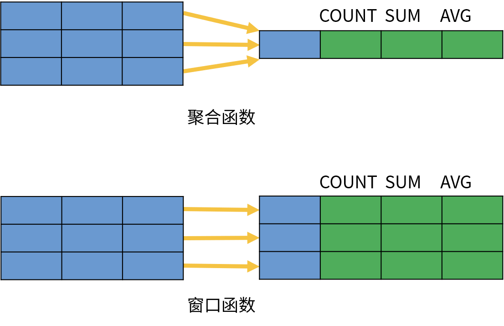
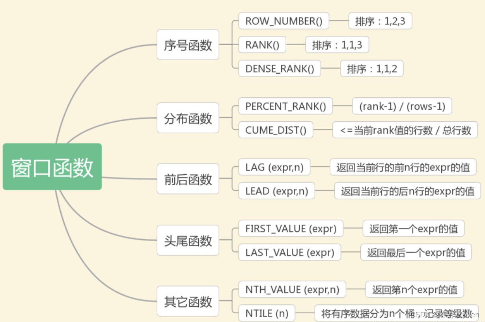
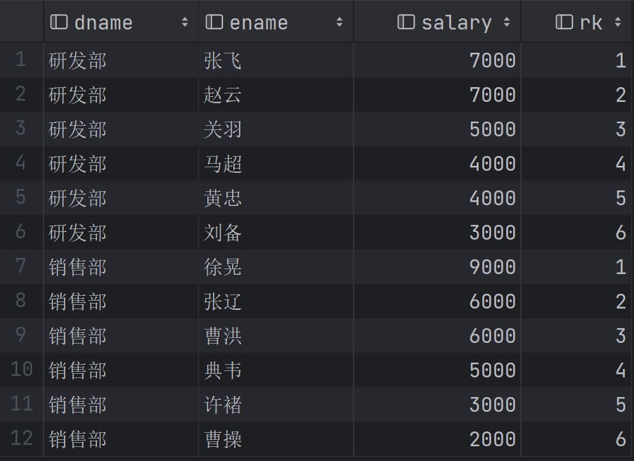
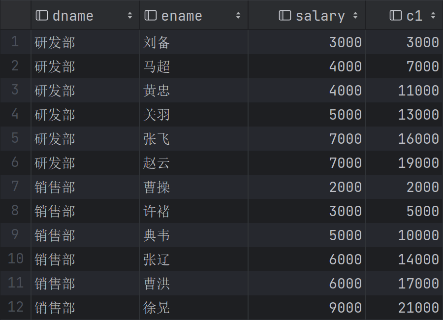
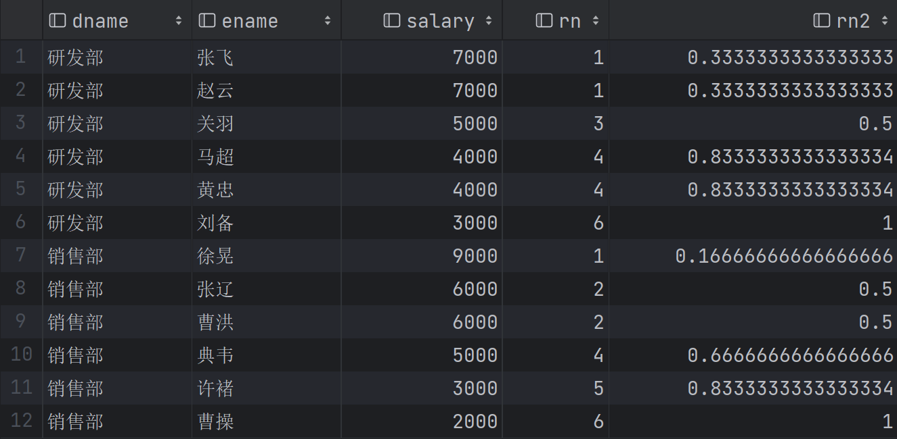
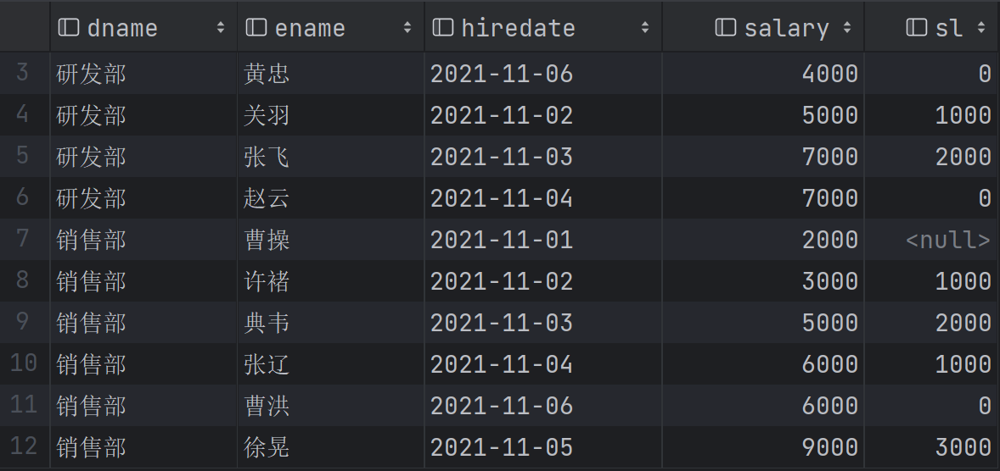
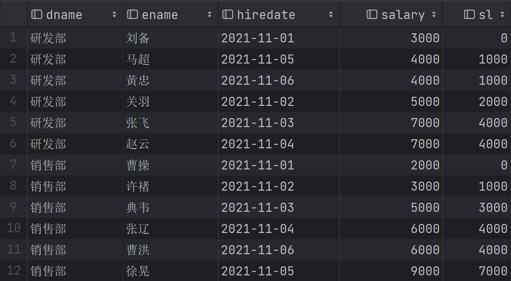
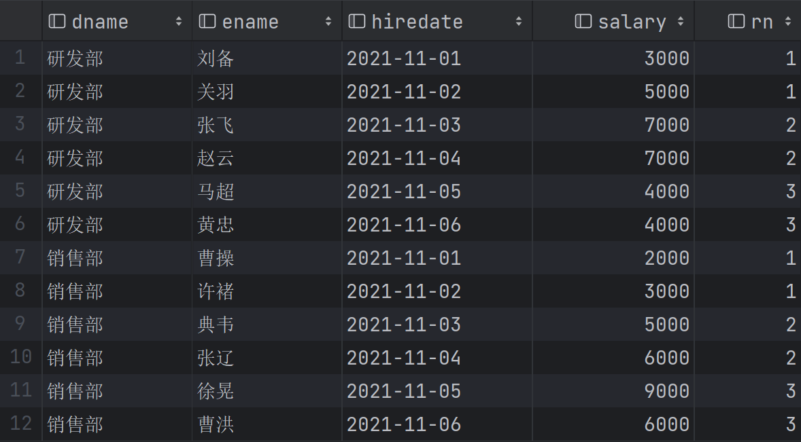

# 窗口函数

> 本文转载至：[MySQL六种窗口函数用法案例 - 白露~ - 博客园 (cnblogs.com)](https://www.cnblogs.com/shoshana-kong/p/16621254.html)

## 一. 前言

MySQL 8.0 新增窗口函数,窗口函数又被称为开窗函数，与Oracle 窗口函数类似，属于MySQL的一大特点。

非聚合窗口函数是相对于聚函数来说的。聚合函数是对一组数据计算后返回单个值（即分组），非聚合函数一次只会处理一行数据。窗口聚合函数在行记录上计算某个字段的结果时，可将窗口范围内的数据输入到聚合函数中，并不改变行数。





## 二. 创建一个案例表

```sql
# 创建表格
create table employee(
                         dname varchar(20), -- 部门名
                         eid varchar(20),
                         ename varchar(20),
                         hiredate date, -- 入职日期
                         salary double -- 薪资
);
# 插入数据
insert into employee values('研发部','1001','刘备','2021-11-01',3000);
insert into employee values('研发部','1002','关羽','2021-11-02',5000);
insert into employee values('研发部','1003','张飞','2021-11-03',7000);
insert into employee values('研发部','1004','赵云','2021-11-04',7000);
insert into employee values('研发部','1005','马超','2021-11-05',4000);
insert into employee values('研发部','1006','黄忠','2021-11-06',4000);
insert into employee values('销售部','1007','曹操','2021-11-01',2000);
insert into employee values('销售部','1008','许褚','2021-11-02',3000);
insert into employee values('销售部','1009','典韦','2021-11-03',5000);
insert into employee values('销售部','1010','张辽','2021-11-04',6000);
insert into employee values('销售部','1011','徐晃','2021-11-05',9000);
insert into employee values('销售部','1012','曹洪','2021-11-06',6000);
```

## 三. 序号函数- ROW_NUMBER、RANK、DENSE_RANK

需求：对每个部门的员工按照薪资排序，并给出排名

```sql
select dname,ename,salary,
       row_number() over (partition by dname order by salary desc ) as rk
from employee;

select dname,ename,salary,
       rank() over (partition by dname order by salary desc ) as rk
from employee;

select dname,ename,salary,
       dense_rank() over (partition by dname order by salary desc ) as rk
from employee;
```

可以看到row_number()输出的结果，rank()和dense_rank()差不太多。大家可以实际试一下看看区别。



## 四. 开窗聚合函数- SUM,AVG,MIN,MAX

在窗口中每条记录动态地应用聚合函数（SUM()、AVG()、MAX()、MIN()、COUNT()），可以动态计算在指定的窗口内的各种聚合函数值。

需求：对每个部门的员工按照薪资排序，并加上前面一位薪资，得到新的一列c1

```sql
select
    dname,
    ename,
    salary,
    sum(salary) over(partition by dname order by salary rows between 2 preceding and current row) as c1
from employee;
```



## 五. 分布函数- CUME_DIST

分组内小于、等于当前rank值的行数 / 分组内总行数

需求：查询小于等于当前薪资（salary）的比例

```sql
select
    dname,
    ename,
    salary,
    rank() over(partition by dname order by salary desc ) as rn,
    CUME_DIST() over(partition by dname order by salary desc ) as rn2
from employee;
```



## 六. 前后函数-LAG和LEAD

返回位于当前行的前n行（LAG(expr,n)）或后n行（LEAD(expr,n)）的expr的值

语法：

```sql
LAG(<expression>[,offset[, default_value]]) OVER (
    PARTITION BY expr,...
    ORDER BY expr [ASC|DESC],...
) 
```

- expression：`LAG()`函数返回`expression`当前行之前的行的值，其值为`offset` 其分区或结果集中的行数。
- offset：`offset`是从当前行返回的行数，以获取值。`offset`必须是零或非负字正整数。如果`offset`为零，则`LAG()`函数计算`expression`当前行的值。如果未指定`offset`，`offset` 默认值为1。
- default_value：如果没有前一行，则`LAG()`函数返回`default_value`。例如，如果offset为2，则第一行的返回值为`default_value`。如果省略`default_value`，则默认`LAG()`返回`NULL`。
- `PARTITION BY` 子句：`PARTITION BY`子句将结果集中的行划分`LAG()`为应用函数的分区。如果省略`PARTITION BY`子句，`LAG()`函数会将整个结果集视为单个分区。
- `ORDER BY` 子句：`ORDER BY`子句指定在`LAG()`应用函数之前每个分区中的行的顺序。

```sql
LEAD(<expression>[,offset[, default_value]]) OVER (
    PARTITION BY (expr)
    ORDER BY (expr)
) 
```

- expression：`LEAD()`函数返回的值`expression`从`offset-th`有序分区排。
- offset：`offset`是从当前行向前/后行的行数，以获取值。`offset`必须是一个非负整数。如果`offset`为零，则`LEAD()` 函数计算`expression`当前行的值。如果省略 `offset`，`offset` 默认值为1。
- default_value：如果没有后续行，则`LEAD()`函数返回`default_value`。例如，如果`offset`是1，则最后一行的返回值为`default_value`。如果您未指定`default_value`，则函数返回 `NULL` 。
- `PARTITION BY` 子句：`PARTITION BY`子句将结果集中的行划分`LEAD()`为应用函数的分区。如果`PARTITION BY`未指定子句，则结果集中的所有行都将被视为单个分区。
- `ORDER BY`子句：`ORDER BY`子句确定`LEAD()`应用函数之前分区中行的顺序。

需求：计算同部门按照薪资排名，自己比上一名多多少钱

```sql
select dname,
       ename,
       hiredate,
       salary,
       salary - lag(salary, 1) over (partition by dname order by salary) sl
from employee;
```



## 七. 头尾函数-FIRST_VALUE和LAST_VALUE

返回第一个（FIRST_VALUE(expr)）或最后一个（LAST_VALUE(expr)）expr的值

需求：计算部门内当前与工资最低员工的工资差值

```sql
select dname,
       ename,
       hiredate,
       salary,
       salary - first_value(salary) over (partition by dname order by salary) sl
from employee;
```



## 八. 其他函数-NTH_VALUE(expr, n)、NTILE(n)

将分区中的有序数据分为n个等级，记录等级数

需求：将每个部门员工按照入职日期分成3组

```sql
select
    dname,
    ename,
    hiredate,
    salary,
    nth_value(salary,2) over(partition by dname order by hiredate) as second_score,
    nth_value(salary,3) over(partition by dname order by hiredate) as third_score
from employee
```


