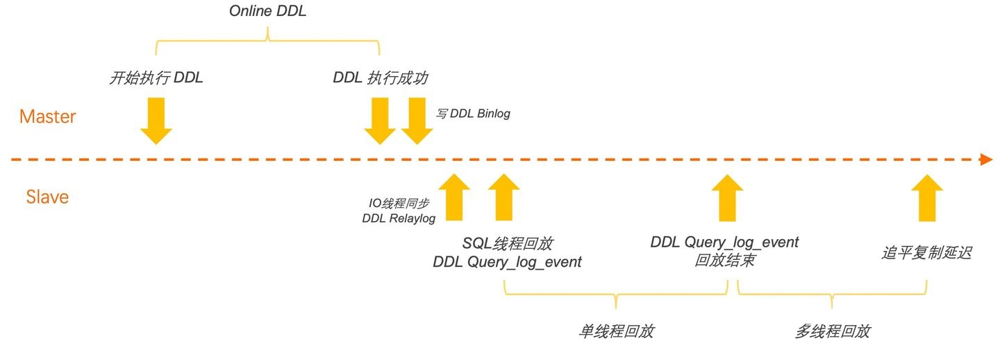

# 不要再使用MySQL OnlineDDL了

> 本文转载至：[不要再使用MySQL online DDL了 - 掘金 (juejin.cn)](https://juejin.cn/post/7126830511653126181)

随着业务系统的快速迭代，对应的记录相关数据的表的结构也在快速的变化。但是，对于数据库来说，很多的表结构变更都是要花费很大代价的，如增删字段、更改字段数据类型等操作。更需要注意的是，对于原生的 MySQL ONLINE DDL （MySQL 5.6开始支持）功能虽然已经很多操作不再阻塞 DML 操作，但是还会有很多重建表的情况，而且对于较大表的变更很可能导致长时间的主从延迟，导致集群节点状态不一致，这个时候若是遇见主节点出现故障需要切换时，则会导致无法切换。所以，pt-online-schema-change 和 gh-ost 这些在线更改表结构的工具也就应运而生，为 DBA 解决了很多改表时的痛点。

下面就 pt-online-schema-change、gh-ost 和 MySQL ONLINE DDL 进行一个简单的介绍和比较，以便我们在面对不同的操作和要求时选择更适合的工具。

## 一. Online DDL主从延迟

目前MySQL常用的DDL都支持Online模式，主库执行过程中是不干扰正常读写请求的。不过，这在备库是完全不一样的故事。主库DDL执行成功后会向Binlog写入一条Query_log_event，同步到备库的Relaylog后，备库会切换为单线程回放该DDL，执行结束后才再次恢复为多线程并行回放，继续应用DDL执行期间落下的DML日志。可以看出，一条DDL要经过至少2倍的执行时间，才能应用到各个备库。同时因为主库持续有DML写入，备库会积累数小时的复制延迟，因此还需要花费额外的时间去追平日志。最终导致两个问题，一是备库无法提供低延迟的读扩展，二是基于Binlog复制的高可用架构失效。



所以MySQL Online DDL 最大的缺点是在从库执行DDL时，会阻塞DML语句同步，造成主从延迟。

## 二. pt-online-schema-change

pt-online-schema-change（下面简称pt-osc） 是 Percona 公司提供的一种在线改表的工具，也是目前业界使用最普遍和熟知的一种工具。下面我们就从工作流程、使用限制和风险等方面做一个整体了解。

**说明：以下均以在表 t1 上添加一个列 c4 为例**。

### 2.1 主要工作流程

pt-osc 的主要工作流程如下：

1. **创建影子表：** 创建 t1 表的副本_t1_new。此时 _t1_new 里没有任何数据，表结构和 t1 完全相同；
2. **在影子表上执行变更：** 在 _t1_new 表上添加列 c4 ，执行语句为 ALTER 语句，因为此时 _t1_new 里没有数据，且业务上不会使用到该表，不会有阻塞发生，所以变更很快就能完成；
3. **创建触发器：** 在表 t1上创建触发器，分别对应 INSERT，DELETE 和 UPDATE 操作。创建触发的目的就是为了在变更期间发生在 t1 上的 DML 操作同步到 _t1_new 上，保证数据的一致性。
4. 重命名表：将影子表

#### 2.1.1 INSERT触发器

```sql
CREATE TRIGGER `pt_osc_test_t1_ins` 
AFTER INSERT ON `test`.`t1` FOR 
EACH ROW REPLACE INTO `test`.`_t1_new` (`id`, `col1`, `col2`, `col3`) 
VALUES (NEW.`id`, NEW.`col1`, NEW.`col2`, NEW.`col3`);
```

这段SQL语句创建了一个名为 `pt_osc_test_t1_ins` 的触发器。下面是对这个触发器的详细解析：

- `AFTER INSERT ON test.t1`: 这个触发器会在向数据表`test.t1`中插入记录之后执行。
- `FOR EACH ROW`: 表明这个触发器会对每一行新增加的数据执行定义在触发器内的操作。
- `REPLACE INTO test._t1_new (id, col1, col2, col3)`: 当触发器被激活时，它会尝试将数据“替换”到`test._t1_new`表中。这里使用的是`REPLACE INTO`语句，其功能类似于`INSERT`，但当遇到具有相同唯一索引或主键的记录时，旧记录会被新记录替换。
- `VALUES (NEW.id, NEW.col1, NEW.col2, NEW.col3)`: 插入的值来自于刚刚被插入`test.t1`表的新行。`NEW`关键字用于访问这个新行的列。

在原表中的插入操作，对于每一条新增的数据，在影子表中都会执行一条REPLACE INTO 操作。对于原表来说，若是能插入成功，那么在影子表中也能插入成功；在原表中插入不成功也就不会触发触发器的执行，也就是影子表不会有任何变化， 那么为什么原表的 INSERT 操作会触发影子表的 REPLACE 操作呢？这是因为在 MYSQL 中，REPLACE 操作也会触发 INSERT 触发器，所以这里触发器的动作若是改成 INSERT 操作，那么在原表上的 REPLACE 操作在触发 INSERT 操作上时就很可能会报错，导致影子表的数据没有变更，从而导致数据丢失。

#### 2.1.2 DELETE触发器

```sql
CREATE TRIGGER `pt_osc_test_t1_del` 
AFTER DELETE ON `test`.`t1` FOR
EACH ROW DELETE IGNORE FROM `test`.`_t1_new` 
WHERE `test`.`_t1_new`.`id` <=> OLD.`id`
```

这段SQL代码创建了一个名为 `pt_osc_test_t1_del` 的触发器。下面是对这个触发器的详细解析：

- `CREATE TRIGGER`: 这是创建新触发器的命令。
- `pt_osc_test_t1_del`: 触发器的名称。
- `AFTER DELETE ON test.t1`: 这个触发器会在从表 `test.t1` 中删除记录之后执行。
- `FOR EACH ROW`: 表明这个触发器会对每一行被删除的数据执行定义在触发器内的操作。
- `DELETE IGNORE FROM test._t1_new WHERE test._t1_new.id <=> OLD.id`: 当触发器被激活时，它会尝试删除 `test._t1_new` 表中与已删除行具有相同 `id` 值的记录。`<=>` 是空间安全比较运算符，即使两边的值有一个是NULL，它也可以进行比较，而 `OLD.id` 引用的是刚刚从 `test.t1` 表中被删除的行的 `id` 列的值。
- `IGNORE`: 这个关键字的使用意味着，如果删除操作遇到错误（比如外键约束问题），将会忽略错误继续执行，不会回滚。

DELETE 触发器相对比较简单，在原表的 DELETE 操作，每删除一行都会触发在影子表上的删除动作，只是注意触发器上的是 DELETE IGNORE ，因为在原表上删除的数据，在影子表上可能存在也可能不存在。

#### 2.1.3 UPDATE触发器

```sql
CREATE TRIGGER `pt_osc_test_t1_upd` 
AFTER UPDATE ON `test`.`oldmapping` FOR EACH ROW 
BEGIN 
DELETE IGNORE FROM `test`.`_t1_new` 
WHERE !(OLD.`id` <=> NEW.`id`) AND `test`.`_t1_new`.`id` <=> OLD.`id`;
REPLACE INTO `test`.`_t1_new` (`id`, `col1`, `col2`, `col3`) 
VALUES (NEW.`id`, NEW.`col1`, NEW.`col2`, NEW.`col3`);
END
```

这段 SQL 代码定义了一个名为 `pt_osc_test_t1_upd` 的触发器，下面是对其的详细解释：

- `CREATE TRIGGER pt_osc_test_t1_upd`: 开始创建一个叫做 `pt_osc_test_t1_upd` 的触发器。
- `AFTER UPDATE ON test.oldmapping`: 触发器将在每次 `test.oldmapping` 表中的记录被更新之后触发。
- `FOR EACH ROW BEGIN ... END`: 这个触发器将对更新操作影响的每一行数据执行 `BEGIN` 和 `END` 之间的语句块。所有在这两个关键字之间的语句都构成了触发器的主体。
- `DELETE IGNORE FROM test._t1_new WHERE !(OLD.id <=> NEW.id) AND test._t1_new.id <=> OLD.id`: 在更新操作后，首先执行的是一个条件删除。它检查 `oldmapping` 表的 `id` 字段在更新前 (`OLD.id`) 和更新后 (`NEW.id`) 是否不相等（即：是否更新了 `id` 字段的值）。如果 `id` 发生了变化，这条语句将从 `test._t1_new` 表中删除那些 `id` 与 `OLD.id` 匹配的行。这里使用了 `IGNORE` 关键字，意味着如果删除过程中遇到错误将会被忽略。
- `REPLACE INTO test._t1_new (id, col1, col2, col3) VALUES (NEW.id, NEW.col1, NEW.col2, NEW.col3)`: 然后，无论 `id` 是否有变化，都会执行一个 `REPLACE` 操作，该操作使用更新操作后的新数据 (`NEW.id`, `NEW.col1`, `NEW.col2`, `NEW.col3`) 向 `test._t1_new` 表中插入或更新一条记录。如果 `test._t1_new` 表中已经存在一个与新 `id` 值匹配的记录，那么原记录会被新数据所替换；如果不存在，则会插入一条新记录。

先看触发器中的 REPLACE INTO 语句，在原表更新数据的情况下，对于每一条发生更新的数据，都会触发在影子表上的REPLACE INTO操作。对于影子表，若存在被更新的数据就会更新相应数据，但是对于不存在的数据就会添加到影子表中，由于同步原表数据是使用的INSERT IGNORE INTO 这种语句，所以即便这里提前将数据添加到影子表也不影响。但是为什么这里还是REPLACE INTO 操作呢？因为在MySQL中，INSERT INTO ... ON DUPLICATE UPDATE 也会更新数据，触发的也是UPDATE触发器。

再看触发器中的DELETE IGNORE 语句，这个语句主要为了在原表上主键（或者唯一键）的值发生变更时，先删除影子表中的对应的数据，然后使用REPLACE INTO 在影子表中插入变更后的数据。若是没有DELETE 操作，那么执行REPLACE INTO 后影子表上就会多出一条更新前的数据，导致数据不一致。

#### 2.1.4 同步数据

循环将数据库从 T1 拷贝到 _t1_new，主要执行的就是 INSERT  ... SELECT ... LOCK IN SHARE MODE 。注意此时正在同步的数据是无法进行 DML 操作的；另外根据选项设置，每次循环时都会监控主从延迟情况或着数据库负载情况。

这里有一个有趣的事情，pt-osc 是怎么获取现有数据的上下边界的呢？换句话说若是需要变更的表的主键为自增列（ID），那么同步到 ID 的哪个值原始数据才算是同步完成呢？

第一步：在开始第一次数据同步前，会先获取整个原始数据的下边界，也是第一次循环的下边界：

```sql
SELECT /*!40001 SQL_NO_CACHE */ `id` FROM t1  FORCE INDEX(`PRIMARY`) ORDER BY `id` LIMIT 1 /*first lower boundary*/ 
// 假设返回数据是 1
```

第二步：然后获取本次循环的上边界和下次循环的上边界：

```sql
SELECT /*!40001 SQL_NO_CACHE */ `id` FROM t1  FORCE INDEX(`PRIMARY`) WHERE ((`id` >= '1')) ORDER BY `id` LIMIT 999, 2 /*next chunk boundary*/
# `id` >= '1' 中 1 是 在上一步骤获取的,也就是本次循环的下边界值
# LIMIT 999,2 中 999 和 --chunk-size 设置有关，--chunk-size 减 1；2是固定的。假如返回两条数据1000,10001，那么第一条数据1000就是本次循环的上边界，第二条数据10001是下次循环的下边界
```

第三步：同步数据

```sql
INSERT LOW_PRIORITY IGNORE INTO `_t1_new` (`id`, `c1`, `c2`, `c3`) SELECT `id`, `c1`, `c2`, `c3` 
FROM t1  FORCE INDEX(`PRIMARY`) WHERE ((`id` >= '1')) AND ((`id` <= '1000')) LOCK IN SHARE MODE /*pt-online-schema-change 11260 copy nibble*/ 
# 1000 是步骤b中获取的上边界值
```

第四步：循环获取上下边界

```sql
SELECT /*!40001 SQL_NO_CACHE */ `id` FROM t1  FORCE INDEX(`PRIMARY`) WHERE ((`id` >= '10001')) ORDER BY `id` LIMIT 999, 2 /*next chunk boundary*/
# 10001 是上次循环执行步骤b获取的下边界值
```

若上面能返回两条数据，那么本次循环还不能将 t1 中未同步的的数据全部同步；

- 若上面只返回一条数据，则本次循环刚好能将未同步的的数据全部同步，数据的上边界就是此次获取的 id 值；此次数据同步完，进入步骤 5 ；
- 若上面返回数据为空，则本次循环也能将未同步的的数据全部同步，且同步的数据量小于 --chunk-size 设置的数量，需要执行下面语句获取此次循环的上边界。

这里还要考虑一点，基于上面的方式，已经通过 INSERT 触发器插入到 _t1_new 表的数据，是不是会被重复插入？若是 t1 上的 INSERT 速度大于数据同步的速度，那是不是数据同步就会一直持续，表的变更也就一直不能完成呢？*第五步：循环第三步 同步数据*

#### 2.1.5 分析表

确认数据拷贝完成后执行ANALYZE TABLE 操作，这一步主要是为了防止执行完第六步以后，相关的SQL无法选择正确的执行计划；

#### 2.1.7 更改表名

```sql
RENAME TABLE t1 TO _t1_old, _t1_new TO t1;
```

#### 2.1.8 删除原始表

从上面步骤可以看出，pt-osc 是先在空的影子表上执行 DDL 变更，这样无论 MySQL 的版本是否支持 ONLINE DDL ，都不会影响原始表上的操作，并且对于空表的结构和属性变更是非常快的。

### 2.2 使用限制和风险

#### 2.2.1 使用限制

由于 pt-osc 需要使用触发器来同步表上的变更，所以在使用时也有一些相应的限制：

1. 原始表上必须有主键或者唯一键，因为创建的 DELETE 触发器依赖主键或者唯一键进行数据同步；不过，若原始表上没有主键或者唯一键，但是即将执行的变更包含创建主键或唯一键的操作也可以；
2. 原始表上不能存在触发器；
3. pt-online-schema-change 适用于 Percona XtraDB Cluster (PXC) 5.5.28-23.7 及更高版本，但有两个限制：只能更改 InnoDB 表，并且 wsrep_OSU_method 必须设置为 TOI。如果主机是集群节点并且表是 MyISAM 或正在转换为 MyISAM (ENGINE=MyISAM)，或者wsrep_OSU_method 不是 TOI，则该工具将退出并报错。

#### 2.2.2 使用风险

1. **更改列名**

情况一：用CHANGE方式更改非主键或者非唯一键的列名

例如语句如下：

```sql
ALTER TABLE `t1` CHANGE COLUMN `workorder_order` `workorder_number` int(10) NULL DEFAULT NULL COMMENT '工单'
```

该语句不会执行，而是会抛出警告并推迟，警告如下：

```sql
The tool should handle this correctly, but you should test it first because if it fails the renamed columns' data will be lost!  Specify --no-check-alter to disable this check and perform the --alter
```

大概意思就是该工具正常情况是能正确执行的，但是更改列名若是失败可能会导致数据丢失，所以这种操作我们可以先使用 --dry-run 选项打印一下相关操作的语句，确认是否有问题。若没有问题可以在上面的语句上加上 --no-check-alter 选项，语句就能正常执行了。

情况二：更改主键或者唯一键的列名

pt-osc 创建的DELETE触发器是依赖表的主键或者唯一键的，所以若表上只有唯一键或者主键（若两者都有，也一般会使用主键），那么请不要更改对应列名，这会导致在原始表上执行的删除操作报错，并且无法同步到影子表，导致最终数据不一致。

例如以下语句：

```sql
pt-online-schema-change -u user -ppasswd  -h127.0.0.1 -P3308 D=test,t=ptosc --alter "change id id_new int(10) unsigned NOT NULL AUTO_INCREMENT COMMENT 'primary key' "  --print --dry-run --check-alter
```

注意以下输出：

```sql
Using original table index PRIMARY for the DELETE trigger instead of new table index PRIMARY because the new table index uses column id_new which does not exist in the original table.
CREATE TRIGGER `pt_osc_test_ptosc_del` AFTER DELETE ON `test`.`ptosc` FOR EACH ROW DELETE IGNORE FROM `test`.`_ptosc_new` WHERE `test`.`_ptosc_new`.`id` <=> OLD.`id`
```

显而易见，由于原始表和影子表上的主键列列名不一致，导致触发器创建的是有问题的。

2. **更改有外键引用的表的结构或者属性**

更改有外键引用的表会让操作比较负载，目前 pt-osc 提供三种方式处理外键：

- rebuild_constraints：该方式会在第六步更改表名后，执行一个原子操作先删除外键再重新添加外键。
- drop_swap：该方式会在第六步更改表名前删除原始表，然后将影子表重命名。这会导致表短暂的不存在，若是对表的查询很频繁会导致错误。
- none：该方式执行的操作和处理无外键引用的表是相同的，但是外键实际上是引用了已经删除的表。

以上方式的具体解释请参看--alter-foreign-keys-method 的具体解释。

3. **创建唯一索引或者主键**

由于 pt-osc 使用 INSERT LOW_PRIORITY IGNORE 方式同步原始表和影子表之间的数据，所以若新建唯一索引的列上有重复数据将会导致数据的丢失。若是需要创建唯一索引或主键需要提前确认数据是否重复，是否允许缺失等，需要指定选项 --no-check-alter。

4. **锁争用问题**

另外还有一个需要注意的问题，由于表上创建有触发器，若表的更新此时比较频繁很可能遇见锁争用问题。之前在给线上表增加索引时就遇见过这种问题，应用端频繁的报死锁错误，在停止 pt-osc 并删除触发器后死锁问题解决。

### 2.3 丰富的监控功能

该工具除了提供更改表结构的功能外，还提供了其他非常丰富和友好的功能，如：

1. 该工具可以监控变更期间主从延迟情况，默认是监控所有的从库，若发现有其中一个从库延迟时间超过了 --max-lag 参数设置的数值，则该工具会停止新旧表表之间的数据同步，直到复制延迟低于 --max-lag 设置的数值 。由于生产环境很多时候是一主多从的架构，我们可能只关心某一（几）台从库的延迟情况，这个时候可以使用 --check-slave-lag参数指定需要关注的从库节点。

2. 该工具可以监控变更期间数据库的负载情况，其对应选项为 --max-load 或者 --critical-load。

   指定了--max-load 选项后，pt-osc 会在每次同步数据后执行 SHOW GLOBAL STATUS 查看选项定义的需要关注的状态参数，若状态变量高于阈值则会暂停数据同步。--max-load 可以执行单个或多个状态变量，如可以设置为 “Threads_connected:110” or “Threads_connected=110”，也就是 Threads_connected 超过 110 时会暂定数据同步。

   --critical-load 和--max-load 类似，只是当指定的状态变量超过阈值时 pt-online-schema-change 会退出，并删除创建的触发器等。这是为了防止由于添加触发器而导致数据库负载异常情况发生。

3. 该工具默认设置 innodb_lock_wait_timeout=1 and (for MySQL 5.5 and newer) lock_wait_timeout=60 ，以防在发生锁争用时阻塞其他正常业务的事务执行。若要更改或者设置其他参数，可以通过 --set-vars 参数设置。

## 三. gh-ost

gh-ost 也是一种在线的解决 DDL 的方案，不依赖于触发器，它是通过模拟从库，在row binlog中获取增量变更，再异步应用到 gh-ost 表中。目前 gh-ost 已经收获了将近一万的 star，并且在持续更新中。

### 3.1 gh-ost 工作流程如下

1. **创建影子表**和在影子表上执行变更这两步和 pt-osc 基本相同，只是创建的影子表名称不一样，这里是_t1_gho；

2. **创建 binlog streamer ：** 这一步的作用是为了同步 t1 表上的增量 DML 到 _t1_gho 上。gh-ost 会伪装成一个从库节点，读取数据库（可能是集群中的主节点或者从节点）的 binlog，然后解析 binlog，获取到对于 t1 的相应操作，然后转化成对 _t1_gho 表的操作；

3. **同步数据：** 这一步也是循环同步数据，每次循环也会监控数据库的负载等，只是在确定需要同步数据范围的上下边界和 ppt-osc 有所不同；

   - a：首先确定全部需要同步数据范围的上限边界

     ```sql
     select /* gh-ost `test`.`t1` */ `id` from `test`.`t1` order by  `id` asc limit 1
     # 确定全部需要同步数据范围的下边界MIN(id)
     select /* gh-ost `test`.`t1` */ `id` from `test`.`t1` order by  `id` desc limit 1
     # 确定全部需要同步数据范围的上边界MAX(id)
     ```

   - b：确认本次循环同步数据范围的上边界
   
     ```sql
     select  /* gh-ost `test`.`t1` */  `id`
     from `test`.`t1`
     where ((`id` > _binary'8991')) and ((`id` < _binary'10000') or ((`id` = _binary'10000')))
     order by  `id` asc
     limit 1
     offset 998
     # 其中 8991是上次循环的上边界值
     # 10000 是需要同步数据范围的上边界MAX(id)
     # offset 998 这个值和--chunk-size的设置有关，--chunk-size值减 1
     ```
   
   - c：执行数据同步
   
     ```sql
     insert /* gh-ost `test`.`t1` */ ignore into `test`.`_t1_gho` (`id`, `c1`, `c2`, `c3`)
     (select `id`, `c1`, `c2`, `c3` from `test`.`t1`  
     force index (`PRIMARY`) 
     where (((`id` > _binary'8991')) 
     and ((`id` < _binary'9990') or ((`id` = _binary'9990'))))  
     lock in share mode
     # 其中 8991 是上次循环的上边界值
     # 其中 9990 是步骤b中获取到的数据
     ```
   
4. **增量应用binlog**：这里说明一下，同步数据和增量应用binlog是同时进行的，没有确定的时间先后顺序，只要在binlog里发现有相应变更就会在影子表上重放。

5. **同步数据和应用增量binlog**：
      
      - 若循环执行3-b时，若获取到数据则正常进入步骤3-c；
      
      - 若循环执行3-b时未获取到数据，则说明剩余未同步的数据小于--chunk-size的值，执行以下SQL确认本次的上边界值；
      
        ```sql
        select /* gh-ost `test`.`t1` */ `id`
        from (
            select `id`  from   `test`.`t1`
            where ((`id` > _binary'9990'))
            and ((`id` < _binary'10000')
            or ((`id` = _binary'10000')))
            order by   `id` asc
            limit 999 ) select_osc_chunk
        order by  `id` desc
        limit 1
        ```
      
        若上面SQL获取到值，则循环执行步骤3-c同步数据；若未获取到值则数据已经完全同步。

6. **更改表名**： 在更改表名之前会先对表加写锁，这点需要注意。

   原始表和影子表 cut-over 切换是原子性切换，但是基本都是通过两个会话的操作来完成。大致流程如下：

   - 会话 Cn1（这里代表一个或者多个会话）: 对t1表正常执行DML操作。

   - 会话 gh1 : 创建_t1_del 防止提前RENAME表，导致数据丢失。

   - 会话 gh1 : 执行LOCK TABLES t1 WRITE，_t1_del WRITE。

   - 会话 Cn2 : LOCK TABLES之后进来的会话操作会被阻塞。

   - 会话 gh2 : 设置锁等待时间并执行RENAME

     ```sql
     set session lock_wait_timeout:=1
     rename /* gh-ost */ table `test`.`t1` to `test`.`_t1_del`, `test`.`_t1_gho` to `test`.`t1`;  
     # gh2 的操作因为 gh1 锁表而等待，后续有其他新发起的对表t1上的操作也会阻塞
     ```

   - 会话 gh1 会通过SQL 检查是否已经有会话在执行RENAME操作并且在等待MDL锁，此时会检测到gh2。

   - 会话gh1 : 基于上面执行的结果，执行DROP TABLE _t1_del。

   - 会话gh1 : 执行UNLOCK TABLES; 此时gh2的rename命令第一个被执行。而其他会话如Cn2的请求之后开始执行。

这里涉及到的原理是基于 MySQL 内部机制：被 LOCK TABLE 阻塞之后，执行 RENAME 的优先级高于 DML，也即先执行 RENAME TABLE ，然后执行 DML，即使DML发起的时间早于RENAME的时间。

另外要先在表上加写锁的根本原因其实还是为了保证数据的一致性。gh-ost 在同步原表上的变更操作是使用的拼接 binlog 的形式，和原表上发生的操作不属于同一个事务。所以在收尾 cut-over 时要先对表加上写锁，阻塞原表上的变更，待增量的binlog应用完成后再去更改表名，这样才能保证数据不丢失。而 pt-osc 不需要显式加锁是因为原表和影子表上的更新是在同一个事务里的，原表变更完成，影子表上的表更也就完成了，在做 RENAME 时会阻塞原表上的更新，RENAME 完成后变更就发生在了新表上了（之前的影子表）。

7. 停止binlog streamer，处理收尾工作，结束。

### 3.2 使用限制和风险

#### 3.2.1 使用要求和限制

1. 必须有一个从库的 binlog 是 row 模式，并且 binlog_row_image 设置成full 。主节点没有特殊要求；
2. 主备节点上，目标表的结构必须是相同的；
3. 不支持外键约束和触发器
4. 目标表上必须有主键或者唯一键，gh-ost 使用该键遍历表

- 主键或者唯一键不能包含为空的列。也就是说键中的列的属性应为 NOT NULL，或键中的列是可以为空 但是实际数据中没有 NULL 值。
- 默认情况下，若是唯一键中包含可为空的列，gh-ost 不会运行，用户可以使用 --allow-nullable-unique-key ，但是依然要确保实际数据没有NULL值，若是有 NULL 值，gh-ost 不能保证能将其完全迁移走。

5. 不允许迁移存在相同名称且大小写不同的表；

6. 不支持多源复制，不过可以尝试使用 --allow-on-master 选项连接到主库

7. 双主复制，只支持一台实例上有写请求的情况

8. 不支持表更名的操作 ：ALTER TABLE ... RENAME TO some_other_name

9. PXC 集群不能使用该工具。gh-ost 在更改表名阶段是使用不同的线程执行LOCK TABLE，RENME ，DROP TABLE 操作的，由于 PXC 的验证机制这会导致执行操作的 PXC 节点发生死锁。

#### 3.2.2 使用风险

**1. 更改列名**

*a：使用 change 方式更改非主键或者非唯一键的列名*

 更改列名 gh-ost 也会发出警告，并退出:

```ini
FATAL gh-ost believes the ALTER statement renames columns, as follows: map[id:id_new]; as precaution, you are asked to confirm gh-ost is correct, and provide with `--approve-renamed-columns`, and we're all happy. Or you can skip renamed columns via `--skip-renamed-columns`, in which case column data may be lost
```

修改列名也会有丢失数据的风险，所以需要自己先确认 gh-ost 的行为是否符合预期，同时提供了两个选项来告诉gh-ost如何处理重命名的列。

- --approve-renamed-columns：该选项是告诉gh-ost要同步重命名列的数据
- --skip-renamed-columns：跳过重命名的列，也就是对于重命名的列上的数据不进行同步

*b：更改主键或者唯一键的列名*

若表上只有主键或者唯一键，gh-ost 会直接退出，并抛出以下日志：

```sql
FATAL No shared unique key can be found after ALTER! Bailing out
```

若表上既有主键又有唯一键，更改其中一个的列名，gh-ost会选择另一个键做为 共享唯一键。

*c：先删除列然后添加改名后列*

该方式和 pt-online-schema-change 一样会导致数据丢失。

**2. 对于外键的处理**

默认 gh-ost 不支持有外键引用或者包含外键的表变更。但是提供了相应的选项；

- --skip-foreign-key-checks ：跳过外键的检查，这时不会对外键进行检查，最终会导致表上外键丢失或者外键引用的表不存在；
- -discard-foreign-keys ：该选项明确告诉gh-ost不在影子表上创建外键，最终变更后的表会丢失外键。

**3. 创建唯一键或者主键**

使用 gh-ost 创建唯一键或者主键不会有相关警告，由于使用 insert ignore into 的方式同步数据，所以有可能会造成数据丢失。

**4. 锁争用问题**

在更改表名前会对表加写锁，若表上操作频繁可能会导致锁等待。

**5. 在开启半同步复制情况下，** 若设置 rpl_semi_sync_master_wait_point = AFTER_SYNC，在获取同步数据的上下边界时，有可能获取不到的最新上下边界，导致数据丢失。 ***（github上已经有人提交相关bug，链接见文末注释1）***

### 3.3 丰富的监控功能

gh-ost 在运行期间也会监控数据库的负载，和 pt-osc 类似，只是参数不同。另外 gh-ost 也提供了一些交互功能，动态的修改需要监控的指标和阈值等，这里不再赘述。

## 四. MySQL Online DDL操作

MySQL 的 DDL 包含了 copy 和 inplace 方式，对于不支持 online 的 ddl 操作采用 copy 方式。对于 inplace 方式，mysql 内部以“是否修改记录格式”为基准也分为两类：一类需要重建表(重新组织记录)，比如 optimize table 、添加索引、添加/删除列、修改列 NULL / NOT NULL 属性等；另外一类是只需要修改表的元数据，比如删除索引、修改列名、修改列默认值、修改列自增值等。Mysql 将这两类方式分别称为 rebuild 方式和 no-rebuild 方式。

### 4.1 主要工作流程

MySQL ONLINE DDL 主要包括3个阶段：prepare阶段，ddl执行阶段，commit阶段。rebuild方式和no-rebuild方式相比实质多了一个ddl执行阶段，prepare阶段和commit阶段类似。

下面看下三个阶段所做的工作：

1. **Prepare阶段**

- 创建新的临时frm文件
- 持有EXCLUSIVE-MDL锁，禁止读写
- 根据alter类型，确定执行方式(copy,online-rebuild,online-norebuild)
- 更新数据字典的内存对象
- 分配row_log对象记录增量
- 生成新的临时ibd文件

**2. DDL执行阶段**

- 降级EXCLUSIVE-MDL锁，允许读写
- 扫描old_table的聚集索引每一条记录rec
- 遍历新表的聚集索引和二级索引，逐一处理
- 根据rec构造对应的索引项
- 将构造索引项插入sort_buffer块
- 将sort_buffer块插入新的索引
- 处理ddl执行过程中产生的增量(仅rebuild类型需要)

**3. commit阶段**

- 升级到EXCLUSIVE-MDL锁，禁止读写
- 重做最后row_log中最后一部分增量
- 更新innodb的数据字典表
- 提交事务(刷事务的redo日志)
- 修改统计信息
- rename临时idb文件，frm文件
- 变更完成

### 4.2 使用限制和风险

#### 4.2.1 使用限制

MySQL ONLINE DDL 是在mysql 5.6开始提供的功能，并且不是所有的DDL都是在线的。具体哪些操作支持ONLINE DDL 请参阅官方文档的Online DDL Operations相关章节，这里不再赘述。（官方文档链接见文末注释2 ）

#### 4.2.2 使用风险

1. 由于 MySQL 的 DDL 操作无法限制同步数据的速度，所以对于较大表的操作会造成主从同步的严重延迟，和数据库的负载升高；
2. 部分 DDL 会阻塞 DML 操作，导致对应操作堵塞；
3. DDL 操作期间会记录临时日志，该日志文件存储在 DDL 操作期间在表上的插入、更新或删除的数据。临时日志文件在需要时根据 innodb_sort_buffer_size 的值进行扩展，直到扩展到innodb_online_alter_log_max_size 指定的值大小。如果临时日志文件超过大小上限，则 ALTER TABLE 操作将失败，并且所有未提交的并发 DML 操作都将回滚；
4. DDL 操作无法直接监控数据库的负载，并且回滚DDL操作的代价更高，所以对于大表的 DDL 操作若不是采用 no-rebuild 方式，不建议直接操作；
5. 若 DDL 操作需要很长时间，并且并发 DML 对表的修改量很大，以至于临时在线日志的大小超过了 innodb_online_alter_log_max_size 配置选项的值， 这种情况会导致 DB_ONLINE_LOG_TOO_BIG 错误，导致操作失败。未提交的并发DML操作将回滚。较大的innodb_online_alter_log_max_size设置允许在线DDL操作期间使用更多的 DML ，但也会延长锁定表以应用日志DML时DDL操作结束的时间；若是使用 pt-osc 或者 gh-ost 是不需要记录这种日志的，所以不会存在这种风险；
6. 某些并发 DML 对原始表是允许更改的，但新表上可能不允许。而且这种操作仅在最后阶段发现失败。例如，可能会在创建唯一索引时将重复值插入到列中，或者可能会在列上创建主键索引时将 NULL 值插入到列中， 这些 DML 在原始表上能执行成功，但是在 DDL 应用日志阶段无法应用这些变更，这会导致 DDL 回滚。这种情况若是使用 pt-osc 或者 gh-ost 可能更早的发现问题，因为发生在原表的 DML 操作，会及时的在影子表上回放，若出现错误会立刻停止，不至于到最后阶段才发现；
7. DDL 操作在集群中的从节点回放时，不能和其他的 DDL 和 DML 并行回放，也就是说此时并行复制失效的。而 DDL 操作一般耗时都比较久，这时就会导致集群节点不一致，对于 PXC 或者 MGR 集群严重的可能会导致流控，影响线上服务。

## 四. 总结

1. 在使用 pt-online-schema-change、gh-ost 或者直接在 MySQL 做 DDL 操作，都要关注数据库主机的磁盘空间问题，对于 pt-online-schema-change、gh-ost 会创建表的副本并拷贝数据，所以需要主机空余表空间大于表的大小已经产生的 binlog 大小才相对安全；对于 rebuild 方式的DDL 同样额外需要表的大小以上的剩余空间；
2. 无论哪种方式对数据库都会产生一定的压力，都会将表上的 DML 操作重放到影子表上，所以在表频繁的 DML 时是不建议对表进行 DDL 操作；
3. 对于某些 DDL 操作，MySQL 采用的是 no-rebuild 的方式，只更改表的元数据信息即可，这类DDL操作建议直接在数据库上操作，所以在创建表伊始，可以创建一些冗余字段，在实际需要时更改列名就行了；
4. 对于表的 DDL 变更都会涉及 drop 旧表的操作，所以在使用 pt-online-schema-change、gh-ost 进行较大表的变更时，最好使用对应选项不自动删除旧表，而是自己选择合适的时间合适的方式再进行删除；
5. 对于主从集群，在需要对大表 DDL 操作时，不建议直接操作，因为这样会导致主从延迟很严重，若是在从库执行 DDL 操作时主库挂掉，会导致无法及时切换，甚至数据丢失；
6. 在 PXC 集群和 MGR 集群上不要直接执行 DDL 操作，因为很多 DDL 操作耗时都比较长可能会导致集群限流，从而导致集群无法进行对外服务。


> 参考文章：
>
> [不要再使用MySQL online DDL了 - 掘金 (juejin.cn)](https://juejin.cn/post/7126830511653126181)
>
> [pt-osc原理、限制、及与原生online-ddl比较 - 海东潮 - 博客园 (cnblogs.com)](https://www.cnblogs.com/DataArt/p/10094105.html)
>
> [基于 Docker 的 MySQL 主从复制搭建及原理（真正弄懂） | MySQL 技术论坛 (learnku.com)](https://learnku.com/articles/30439)