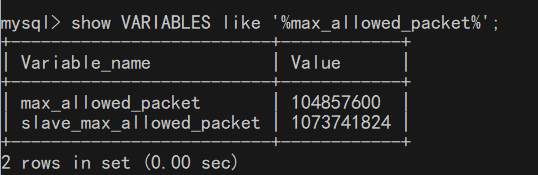
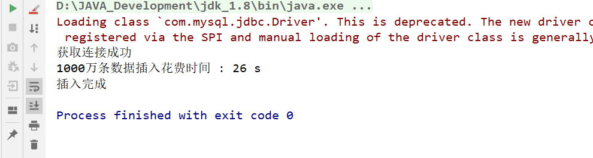

# 向数据库中插入千万级数据

## 1. 数据库环境

### 1.1 MySQL版本

我用到的是MySQL5.6.38版本。

### 1.2 数据表创建

```sql
CREATE TABLE `student` (
  `id` char(32) NOT NULL,
  `t_name` varchar(255) DEFAULT NULL,
  `t_password` varchar(255) DEFAULT NULL,
  `sex` char(2) DEFAULT NULL,
  `description` varchar(255) DEFAULT NULL,
  `pic_url` varchar(255) DEFAULT NULL,
  `school_name` varchar(255) DEFAULT NULL,
  `regist_date` datetime DEFAULT NULL,
  `remark` varchar(255) DEFAULT NULL,
  PRIMARY KEY (`id`)
) ENGINE=InnoDB DEFAULT CHARSET=utf8;
```

### 1.3 更改MySQL数据库`max_allowed_packet`属性大小

`max_allowed_packet`属性用于限制Server接受的数据包大小。有时候大的插入和更新会受 max_allowed_packet 参数限制，导致写入或者更新失败。 

**查看默认的`max_allowed_packet`大小（默认大小只有4M或1M，由版本决定）**：

```sql
show VARIABLES like '%max_allowed_packet%'
```

**修改`max_allowed_packet`大小**：

```sql
set global max_allowed_packet = 100*1024*1024;
```

修改参数大小后，一定要重新登录，才能看到属性值的改变。




## 2. 大数据量的生产

```java
package _13数据库超大数据量生成;

import java.sql.Connection;
import java.sql.DriverManager;
import java.sql.PreparedStatement;
import java.sql.SQLException;
import java.util.Date;
import java.util.UUID;

/**
 * @Auther: 田金东
 * @Date: 10/31/0031
 **/
public class InsertTest {
    private static final String URL = "jdbc:mysql://127.0.0.1:3306/test?serverTimezone=GMT%2B8&useUnicode=true&characterEncoding=utf-8";
    private static final String DRIVER = "com.mysql.jdbc.Driver";
    private static final String USERNAME = "root";
    private static final String PASSWORD = "sss";

    public static void main(String[] args) throws SQLException, ClassNotFoundException {
        Class.forName(DRIVER);
        Connection conn = DriverManager.getConnection(URL, USERNAME, PASSWORD);//获取连接
        if (conn != null) {
            System.out.println("获取连接成功");
            insert(conn);
        } else {
            System.out.println("获取连接失败");
        }
    }

    public static void insert(Connection conn) {
        // 开始时间
        Long begin = new Date().getTime();
        // sql前缀
        String prefix = "INSERT INTO student (id,t_name,t_password,sex,description,pic_url,school_name,regist_date,remark) VALUES ";
        try {
            // 保存sql后缀
            StringBuffer suffix = new StringBuffer();
            // 设置事务为非自动提交
            conn.setAutoCommit(false);
            // 比起st，pst会更好些
            PreparedStatement pst = (PreparedStatement) conn.prepareStatement(" ");//准备执行语句
            // 外层循环，总提交事务次数
            for (int i = 1; i <= 10; i++) {
                suffix = new StringBuffer();
                // 第j次提交步长
                for (int j = 1; j <= 100000; j++) {
                    String id = UUID.randomUUID().toString().replaceAll("-","");
                    // 构建SQL后缀
                    suffix.append("('" + id + "','" + i * j + "','123456'" + ",'男'" + ",'教师'" + ",'www.bbk.com'" + ",'XX大学'" + ",'" + "2016-08-12 14:43:26" + "','备注'" + "),");
                }
                // 构建完整SQL
                String sql = prefix + suffix.substring(0, suffix.length() - 1);
                // 添加执行SQL
                pst.addBatch(sql);
                // 执行操作
                pst.executeBatch();
                // 提交事务
                conn.commit();
                // 清空上一次添加的数据
                suffix = new StringBuffer();
            }
            // 头等连接
            pst.close();
            conn.close();
        } catch (SQLException e) {
            e.printStackTrace();
        }
        // 结束时间
        Long end = new Date().getTime();
        // 耗时
        System.out.println("1000万条数据插入花费时间 : " + (end - begin) / 1000 + " s");
        System.out.println("插入完成");
    }

}

```

哈哈，1000万条数据288秒完成，是不是感觉超级牛逼，我每次插入10万条数据就提交一次事务，如果是一条一条差的话估计要好几个小时，网上有人试过时间浪费在数据库的连接上了，后来我想测试插入100万条数据时候数据库引擎的差别首先把代码中最外层的循环i=100改为i=10;1.数据库引擎为MyISAM时：27s,这个我忘了截图了。因为我后来测试InnoDB的时候我换了一个表来测试，因为我发现改不了数据库表的引擎。。。。所以只能换一个表来测试。

