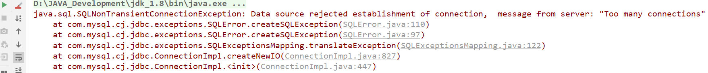
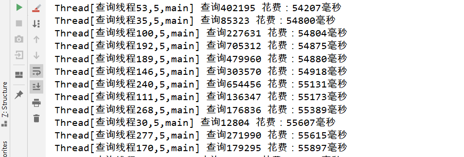
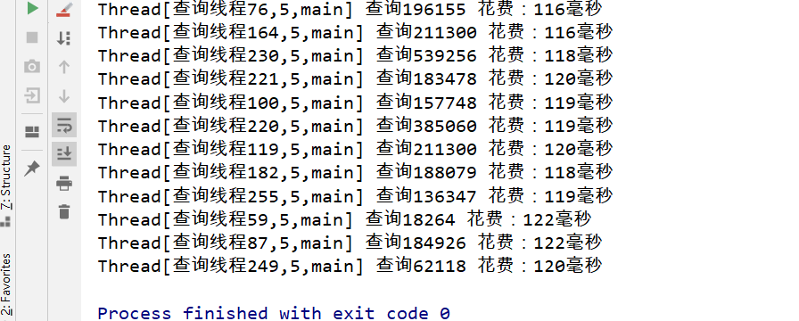

# 数据库索引对高并发环境下查询时间的提升

## 1. 环境准备

### 1.1 数据准备

在对查询速度进行研究之前，我们需要较大数据量进行支撑。详见 [《向数据库中插入千万级数据》](./_7向数据库中插入千万级数据.md)

### 1.2 更改`max_connections`属性

默认情况下MySQL对最大连接数的限制为151（具体值视版本情况而定），但是这样在进行并发测试时显然是不够用的，如果超出连接数就会抛出异常：



我们需要执行下列命令，更改`max_connections`属性值：

```SQL
set global max_connections = 500 #具体值自己指定
```

查看变量值：

```sql
show variables like '%max_connections%'
```


## 2. 测试

```java
package _12MySQL并发连接数;

import java.sql.*;
import java.util.Random;
import java.util.concurrent.CyclicBarrier;

/**
 * @Auther: 田金东
 * @Date: 11/1/0001
 **/
public class ConcurentQueryTime {

    /**
     * 数据库连接
     */
    private static final String URL = "jdbc:mysql://127.0.0.1:3306/test?serverTimezone=GMT%2B8&useUnicode=true&characterEncoding=utf-8";
    private static final String DRIVER = "com.mysql.cj.jdbc.Driver";
    private static final String USERNAME = "root";
    private static final String PASSWORD = "xxx";

    /**
     * 查询所用到的t_name池
     */
    private static final String[] T_NAME_POOL = {"744460", "479960", "539256", "196155", "504987", "889640", "252627", "208560", "278120", "32388", "203583", "249630", "39767", "53060", "376608", "62040", "385060", "227631", "591619", "188079", "705312", "68761", "228510", "593838", "181786", "211380", "403476", "64577", "656117", "654456", "89890", "441651", "282324", "179295", "152577", "85323", "574407", "224772", "58662", "489405", "299512", "299091", "29585", "84459", "107260", "347106", "567816", "47550", "18264", "423468", "281601", "375444", "36644", "59967", "422936", "983740", "238441", "136347", "143572", "127017", "465960", "661024", "283401", "306348", "571140", "447228", "21745", "104208", "15090", "276424", "527177", "157748", "865340", "585837", "193218", "38818", "295764", "123162", "249520", "211300", "761840", "97056", "423262", "110", "67838", "62118", "58459", "271990", "11081", "402195", "183478", "184926", "166744", "26804", "401312", "515898", "176836", "12804", "728992", "303570"};

    /**
     * 并发查询数
     */
    private static final int MAX_QUERY = 300;

    /**
     * 并发测试线程
     */
    private static class Query implements Runnable {


        private CyclicBarrier cyclicBarrier;

        public Query(CyclicBarrier cyclicBarrier) {
            this.cyclicBarrier = cyclicBarrier;
        }

        @Override
        public void run() {
            try {
                Connection connection = ConcurentQueryTime.getConnection();
                cyclicBarrier.await();//设置屏障
                long start = System.currentTimeMillis();//获取开始时间
                int index = randomIndex();
                String tname = T_NAME_POOL[index];
                PreparedStatement preparedStatement = connection.prepareStatement("select id,t_name,t_password,sex,description,pic_url,school_name,regist_date,remark from student where t_name=?");
                preparedStatement.setString(1, tname);
                ResultSet resultSet = preparedStatement.executeQuery();
                long end = System.currentTimeMillis();//获取结束时间
                System.out.println(Thread.currentThread() + " 查询" + tname + " 花费：" + (end - start) + "毫秒");
            } catch (Exception e) {
                e.printStackTrace();
            }
        }
    }


    public static void main(String[] args) {
        CyclicBarrier cyclicBarrier = new CyclicBarrier(MAX_QUERY);
        for (int i = 0; i < MAX_QUERY; i++) {
            new Thread(new Query(cyclicBarrier), "查询线程" + i).start();
        }
    }


    /**
     * 获取数据库连接
     *
     * @return
     * @throws Exception
     */
    private static Connection getConnection() throws Exception {
        Class.forName(DRIVER);
        Connection connection = DriverManager.getConnection(URL, USERNAME, PASSWORD);
        return connection;
    }

    /**
     * 随机获取查询t_name池的索引
     *
     * @return
     */
    private static int randomIndex() {
        Random random = new Random();
        int i = random.nextInt(T_NAME_POOL.length);
        return i;
    }

}
```

我们在创建索引之前，我们执行测试代码查看查询时间：



可以在没有索引的情况下，我们根据t_name字段查询数据库，可以发现查询速度非常之慢，部分查询时间达到了分钟级别。

执行下列语句，为t_name字段创建数据库索引：

```sql
alter table student add index t_name_index (t_name) ; #创建普通索引
```

索引建立后我们再次执行测试代码，可以发现查询效率有质的飞跃：

