# Redis源码调试

> 本文参考至：[曹工说Redis源码（1）-- redis debug环境搭建，使用clion，达到和调试java一样的效果 - 三国梦回 - 博客园 (cnblogs.com)](https://www.cnblogs.com/grey-wolf/p/12637730.html)

大家记得在linux上，怎么安装redis那些的吧，是不是有个configure，make，make install啥的，为啥java程序不需要这么弄呢？因为java有jvm，我们的java文件是编译成class，在jvm上运行的，而c语言程序，是直接依赖于操作系统的，同样的c语言程序，比如你要实现网络功能，在windows上和在linux上，要调用的api，是不一样的，总之呢，就是c语言程序，是严重依赖于底层的操作系统。

切回正题，在linux下我们是用`gcc`来编译c语言程序的，比如，针对以下这个简单的helloWorld:

```c
#include <stdio.h>

int main(void) {
    printf("hahha");
    return 0;

}
```

要像下面这样，用`gcc`编译为二进制，才能继续执行：

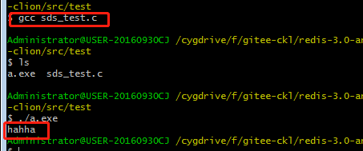

gcc、make这些都是linux下的工具，在windows下怎么办呢？这个不用担心，早有人帮我们弄好了，前辈们将这些linux下的工具，移植到了windows下，现在有两种主流方案，一种是MinGW，另一种是cygwin。

我们只需要安装这两种软件中的一种，就可以在windows下使用本来在linux下才能使用的工具了，上面那个图，就是我在windows下截的。

至于MinGW和cygwin的差别，大家自行去查询，因为我找了些答案，感觉都有些冲突。我们的需求比较简单，两种都可以满足，我这边选择了cygwin，建议大家和我这边保持一致。

cygwin呢，在安装过程中，会让我们选择要安装的工具，比如gcc、g++（c++时候使用）、make、cmake等，我们可以按需选择。

## 一. 什么是make和cmake

大家参考这个链接：[CMake与Make最简单直接的区别](https://blog.csdn.net/weixin_42491857/article/details/80741060)

看完这个之后，我再简单说说，我的理解是，一个程序，在linux下运行，你要写一份makefile；如果要弄到其他平台，这个makefile就用不了了，要再写一份。

所以，为了跨平台，出现了cmake，cmake是让程序员用统一的语法来写cmake文件，然后cmake会帮助我们生成对应的平台下的makefile。

果然是，没有什么是加一个中间层不能解决的。

对于java的同学，可理解为：cmake就像jvm一样，帮助我们跨平台。

cmake呢，也是通过前面的cygwin来安装的。

## 二. 安装c语言开发的IDE

这个呢，我咨询了两位朋友，做c的，然后他们都是用的visual studio，我一开始也是下载这个，但是比较大，我下载的visual studio 2012（应该是比较老的版本了），都要1.5g，下载花了就比较久，安装又是半个小时，然后装完还不怎么会用；

在上面的vs下载的过程中，我在网上找了下，也有很多使用jetbrains公司出的 `clion`。这个呢，我目前就是用的这款，最大的好处是，它和idea、pycharm这些一样，同一个公司出的，所以，操作界面、操作习惯、包括快捷键，几乎都是差不多的，可以无缝切换。

一开始，我安装的是clion 2018.3 版本，然后遇到个问题，也不知道怎么解决，就又下了clion 2019.1版本，问题还是没解决，最后换了clion 2019.3版本，问题还是在，不过虽然问题一直在，但其实也无关大局，就忍一忍算了。

期间,visual studio 2012终于下载完了，装了半个小时多，发现用着还是不太习惯，而且，好像不太支持导入cmake工程，干脆就卸了，结果，卸载又花了半天，因为它给我的电脑，装了近20个软件。。。我他么。。。

## 三. 具体安装步骤

### 3.1 cygwin安装

clion为啥要依赖cygwin，因为clion只是个IDE，具体的代码编译之类的，还是要gcc、cmake这些来做的，我给大家看下，我一开始下载的版本，配置了我的cygwin之后，提示如下：

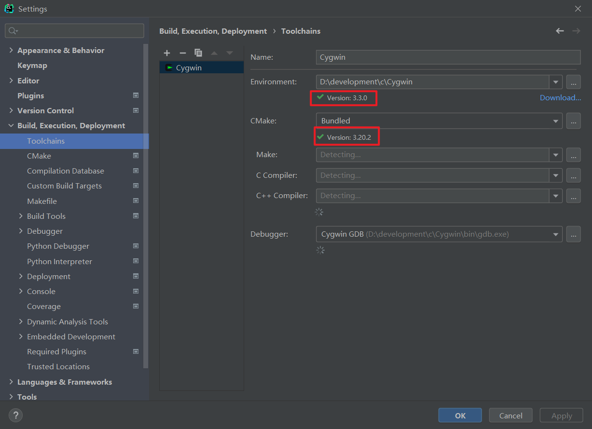

安装前，先下载，下载链接：[cygwin官网](https://cygwin.com/install.html)

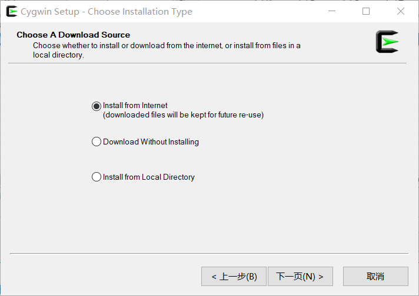

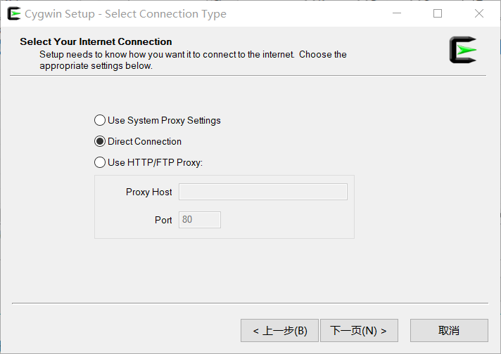

然后，在设置镜像网站时，我是用的阿里云：http://mirrors.aliyun.com/cygwin/

接下来，就是让我们选择要安装的东西，网上一般给的就是如下几个：

gcc-core、gcc-g++、make、gdb、binutils ，我建议大家把vim也装上，方便操作。

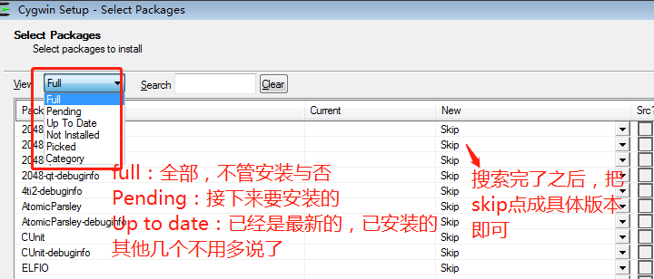

然后就是等它安装完成，完成后，桌面上会有如下图标：

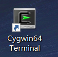

然后，双击打开，可以依次执行以下命令：

- cygcheck -c cygwin ,查看安装的cygwin版本信息
- gcc --version ,查看安装的gcc版本信息，这个是编译c的
- g++ --version,查看安装的g++版本信息，这个是编译c++的
- gdb --version,查看gdb版本信息，这个是debug用的，非常出名

如果都没啥问题的话，那基本就安装好了。

然后，大家还记得前面安装时，选择的路径吗？把那个路径的bin目录，加到path这个环境变量，然后我们就可以在cmd里用上面那些命令了。

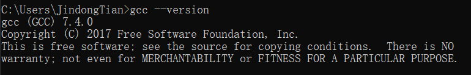

### 3.2 clion及插件安装

这个的安装，和idea的安装，没啥差别，不过大家不要选太多插件，很多毕竟用不上，按需选择吧。比如什么cvs、svn那些，装了干啥呢，对吧。

然后我自己直接用的试用30天，等到后续真需要破解再说。

安装过程中，可能就会让大家配置tool chains，直接输入前面的cygwin的目录即可。


从上面可以看到，我们这里，用的cmake，就是cygwin下的，gdb也是的。

然后，我们可以再安装两个插件（Cmake Sinple highlighter 和 CMake Plus），如下：

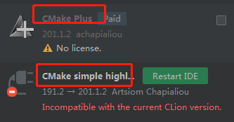

## 四. 导入源码

地址：[bigcoder84/redis-3.0-annotated-cmake-in-clion (github.com)](https://github.com/bigcoder84/redis-3.0-annotated-cmake-in-clion)

我这里基于他的博客，对cmake 文件，做了少许的修改。

大家把代码克隆到本地后，然后在clion中，打开工程即可。

打开工程后，大家要注意上面的CMakeList.txt，其中，已经默认给我们配置了几个target：

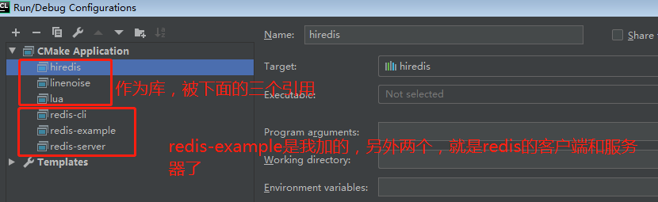

其中，库应该是不能独立运行的，我们可以运行下面的三个，其中：

- redis-cli，redis客户端
- redis-server，服务端
- redis-example，这个是我自己加的，主要是希望：可以像在java中那样，启动一个main方法，去测试一些工具类啊或者啥的，不然的话，就得写到redis-server的代码中，然后用redis-cli去访问，去触发我们的测试代码。主要是类似于一个测试用的入口。

redis-example，我还多说一点，仔细看CmakeList.txt，可能就理解了：

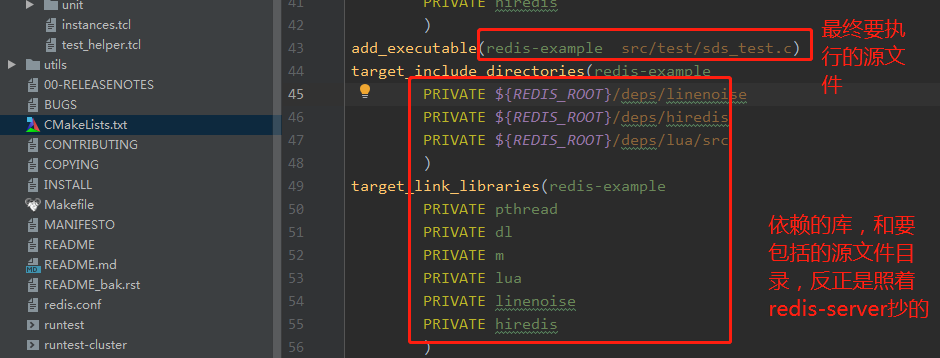

## 五. 如何调试

### 5.1 调试redis-example

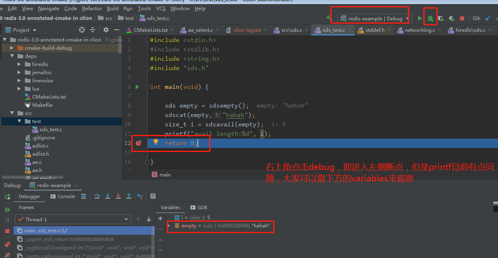

不过这里的debug，有一点问题，就是会开一个单独的cmd窗口，而不是直接在Console中输出；printf也有点问题。

但是，使用run方式运行，则没有任何问题。

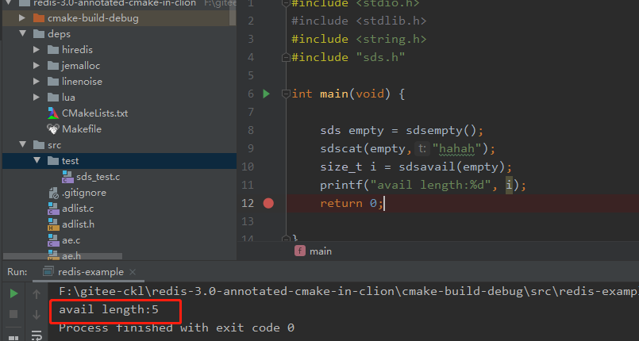

### 5.2 调试redis-server

方法和上面一样，其实大家更关心断点打在哪儿吧，可以打在下面这个地方：

`redis.c`文件的`processCommand`，这里我还加了一行注释给大家：

```c
int processCommand(redisClient *c) {
    /* The QUIT command is handled separately. Normal command procs will
     * go through checking for replication and QUIT will cause trouble
     * when FORCE_REPLICATION is enabled and would be implemented in
     * a regular command proc. */
    // 特别处理 quit 命令
    void *commandName = c->argv[0]->ptr;
    redisLog(REDIS_NOTICE, "The server is now processing %s", commandName);
```

调试如下：

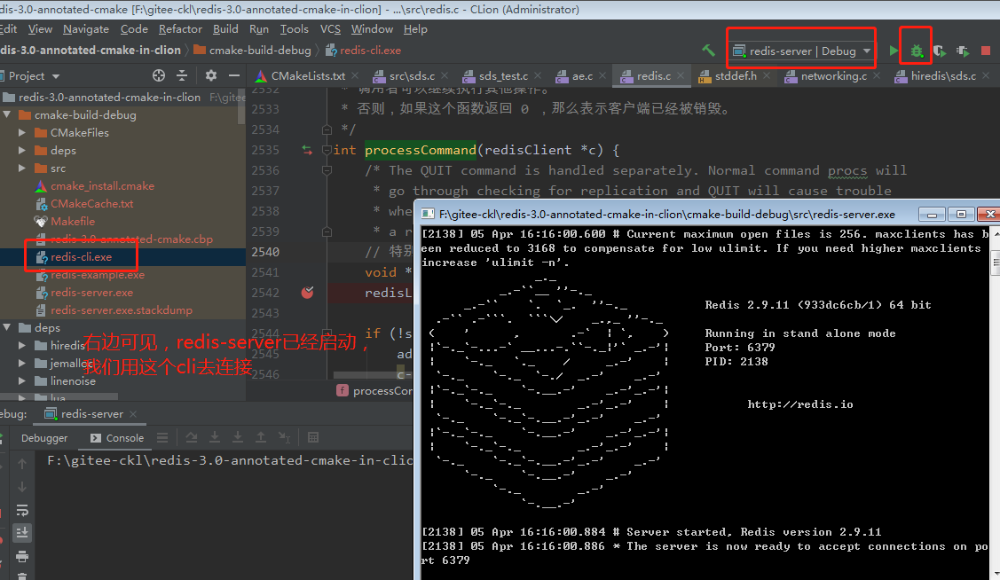

### 5.3 调试redis-cli

redis-cli，我们可以就用工程给我们生成的那个，版本是配套的：

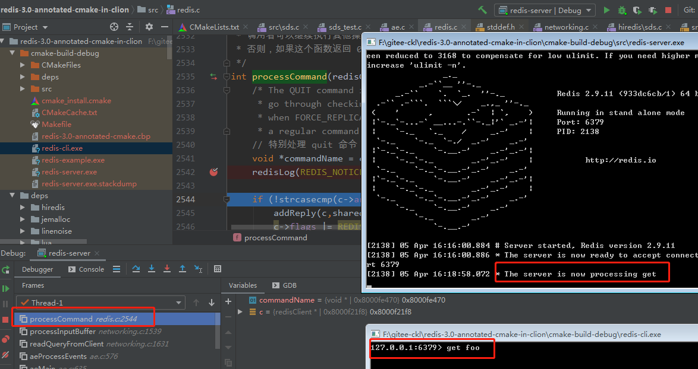

可以看到，断点已经生效了，且，客户端的请求已经到达。
