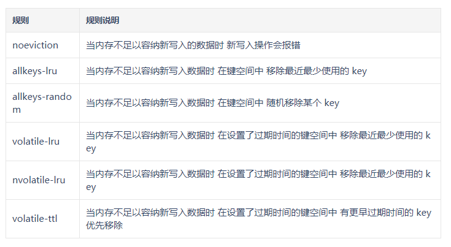

# Redis缓存淘汰策略

Redis 使用的时内存空间来存储数据的，避免业务应用从后端数据库中读取数据，可以提升应用的响应速度。但是内存空间毕竟有限，随着我们存储数据的不断增长，要缓存的数据量越来越大，当超过了我们的内存大小时，该怎么办呢？

解决方法有两种：增加物理内存、搭建 Redis 集群和缓存数据的淘汰机制。增加物理内存简单粗暴，价格十分昂贵，1TB 内存的价格大约是 4 万元左右。所以我们选择缓存数据的淘汰机制。使用简单来说，数据淘汰机制包括两步：第一，根据一定的策略，筛选出对应用访问来说"不重要"的数据；第二，将这些数据从缓存中删除，为新来的数据腾出空间。

在 Redis 的配置文件`redis.conf`文件中，配置`maxmemory`的大小参数如下所示：

```properties
#maxmemory 100mb
maxmemory 4gb
# 使用以下命令配置 maxmemory
CONFIG SET maxmemory 4gb

# 缓存淘汰策略
maxmemory-policy noeviction
```

倘若实际的存储中超出了 Redis 的配置参数的大小时，Redis 中有**淘汰策略**，把**需要淘汰的 key 给淘汰掉，整理出干净的一块内存给新的 key 值使用**。

Redis 4.0 之前一共实现了 6 种内存淘汰策略，在 4.0 之后，又增加了 2 种策略。我们可以按照是否会进行数据淘汰把它们分成两类：

- 不进行数据淘汰的策略，只有 noeviction 这一种。

- 会进行淘汰的 7 种其他策略。会进行淘汰的 7 种策略，我们可以再进一步根据淘汰候选数据集的范围把它们分成两类：

- - 在设置了过期时间的数据中进行淘汰，包括 volatile-random、volatile-ttl、volatile-lru、volatile-lfu（Redis 4.0 后新增）四种。
  - 在所有数据范围内进行淘汰，包括 allkeys-lru、allkeys-random、allkeys-lfu（Redis 4.0 后新增）三种。



默认情况下，Redis 使用 noeviction 策略，当内存空间超过 maxmemory 值时，并不会淘汰数据。