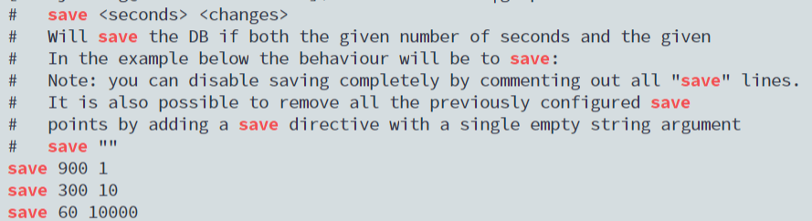
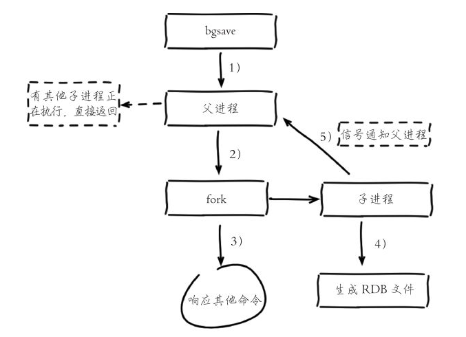
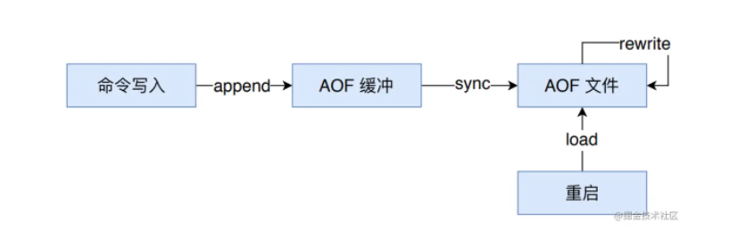
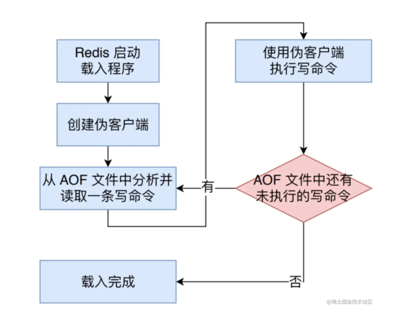

# Redis持久化

Redis支持RDB和AOF两种持久化机制，持久化功能有效地避免因进程退出造成的数据丢失问题，当下次重启时利用之前持久化的文件即可实现数据恢复。

## 一. RDB

RDB持久化是将当前进程数据生成快照保存在硬盘中的过程，触发RDB持久化过程分为手动粗发和自动触发。

### 1.1 触发时机

#### 1.1.1 手动触发

手动触发分别对应`save`和`bgsave`命令：

- `save`命令：阻塞当前Redis服务器，直到RDB过程完成为止，对于内存比较大的实例会造成长时间的阻塞，线上环境不建议使用。运行save命令对应的Redis日志如下：

  ```shell
  * DB saved on disk
  ```

- `bgsave`命令：Redis进程执行fork操作创建子进程，RDB持久化过程由子进程负责，完成后自动结束。阻塞只发生在fork阶段，一般时间比较短。执行`bgsave`命令对应的Redis日志如下：

  ```shell
  * Backgroud saving started by pid 2131
  * DB saved on disk
  * RDB: 0 MB of memory used by copy-on-write
  * Backgroud saving terminated with success
  ```

显然`bgsave`是对`save`阻塞问题做的优化。因此Redis内部所有的涉及RDB操作都采用`bgsave`的方式，而`save`命令已经废弃。

#### 1.1.2 自动触发

除了手动触发以外，Redis内部还存在自动触发RDB持久化的机制：

自动触发最常见的情况是在配置文件中通过`save m n`，指定当 m 秒内发生 n 次变化时，会自动触发`bgsave`。



#### 1.1.3 其他触发时机

除了`save m n`以外，还有一些其他情况会自动触发`bgsave`：

1. 如果从节点执行全量复制操作，主节点自动执行`bgsave`生成RDB文件并发送给从节点。
2. 执行debug reload命令重新加载Redis时，也会自动触发save操作。
3. 默认情况下执行shutdown命令时，如果没有开启AOF持久化功能则自动执行`bgsave`

### 1.2 RDB流程说明

bgsave是主流的触发RDB持久化方式，下图是运作流程：



1) 执行`bgsave`命令，Redis父进程判断当前是否存在正在执行的子进程，如RDB/AOF子进程，如果存在`bgsave`命令直接返回。

2) 父进程执行fork操作创建子进程，fork操作过程中父进程会阻塞，通过`info stats`命令查看`latest_fork_usec`选项，可以获取最近一个fork以操作的耗时，单位为微秒。

3) 父进程仍fork完成后，bgsave命令返回“Background saving started”信息并不再阻塞父进程，可以继续响应其他命令。

4) 子进程创建RDB文件，根据父进程内存生成临时快照文件，完成后对原有文件进行原子替换。执行`lastsave`命令可以获取最后一次生成尺RDB的时间，对应info统计的`rdb_last_save_time`选项。

5) 进程发送信号给父进程衣示完成，父进程更新统计信息，具体见info Persistence下的rdb_*相关选项。

### 1.3 RDB文件处理

#### 1.3.1 保存

RDB文件保存在`dir`配置指定的目录下，文件名通过`dbfilename`配置指定。可以通过执行`config set dir {newDir}`和`config set dbfilename {newFileName}`运行期动态执行，当下次运行时RDB文件会保存到新目录。

#### 1.3.2 压缩

Redis默认采用LZF算法对生成的RDB文件做压缩处理，压缩后的文件远远小于内存大小，默认开启，可以通过参数`config set rdbcompression {yes|no}`动态修改。

> 虽然压缩RDB会消耗额外的CPU资源，但是可以大幅降低文件体积，方便保存在磁盘上或通过网络发送给从节点，因此线上建议开启。

#### 1.3.3 校验

如果Redis加载到损坏的RDB文件时会拒绝启动，并打印日志：

```shell
# Short read or OOM loading DB. Unrecoverable error, aborting now.
```

这时可以使用Redis提供的`redis-check-dump`工具检测RDB文件并获取对应的错误报告。

### 1.4 RDB的优缺点

RDB的优点:

- RDB是一个紧凑压缩的二进制文件，代表Redis在某一个时间点上的数据快照。非常适合用于备份，全量复制等场景。比如每6小时执行bgsave备份，并把RDB文件拷贝到远程机器或者文件系统中（如hdfs），用于灾难恢复。
- Redis加载RDB恢复数据远远快于AOF方式。

RDB的缺点

- RDB方式数据没办法做到实时持久化/秒级持久化。因为bgsave每次运行都要执行fork操作创建子进程，属于重量级操作，频繁执行成本过高。
- RDB文件使用特定二进制格式保存，**Redis版本演进过程中有多个格式的RDB版本，存在老版本Redis服务无法兼容新版RDB格式的问题**。

## 二. AOF

AOF(append only file)持久化以独立日志的方式记录每次写命令，并在 Redis 重启时在重新执行 AOF 文件中的命令以达到恢复数据的目的。AOF 的主要作用是解决数据持久化的实时性。

### 2.1 AOF持久化的实现



如上图所示，AOF 持久化功能的实现可以分为命令追加(append)、文件写入(write)、文件同步(sync)、文件重写(rewrite)和重启加载(load)。其流程如下：

- 所有的写命令会追加到AOF缓冲中。
- AOF 缓冲区根据对应的策略向硬盘进行同步操作。
- 随着 AOF 文件越来越大，需要定期对AOF文件进行重写，达到压缩的目的。
- 当 Redis 重启时，可以加载 AOF 文件进行数据恢复。

#### 2.1.1 命令追加

当 AOF 持久化功能处于打开状态时，Redis 在执行完一个写命令之后，会以协议格式(也就是RESP，即 Redis 客户端和服务器交互的通信协议 )将被执行的写命令追加到 Redis 服务端维护的 AOF 缓冲区末尾。

比如说 SET mykey myvalue 这条命令就以如下格式记录到 AOF 缓冲中。

```
"*3\r\n$3\r\nSET\r\n$5\r\nmykey\r\n$7\r\nmyvalue\r\n"
```

Redis 协议格式本文不再赘述，AOF之所以直接采用文本协议格式，是因为所有写入命令都要进行追加操作，直接采用协议格式，避免了二次处理开销。

#### 2.1.2 文件写入和同步

Redis 每次结束一个事件循环之前，它都会调用 `flushAppendOnlyFile` 函数，判断是否需要将AOF缓存区中的内容写入和同步到 AOF 文件中。

`flushAppendOnlyFile` 函数的行为由redis.conf配置中的 `appendfsync` 选项的值来决定。该选项有三个可选值，分别是 `always`、`everysec` 和 `no`：

- `always`：命令写入`aof_buf`后调用系统`fsync`操作同步到AOF文件。`fsync`完成后线程立即返回。
- `everysec`（默认）：命令写入aof_buf后调用系统的write操作，write完成后线程返回。fsync同步文件操作由专门线程每秒调用一次。
- `no`：命令写入aof_buf后调用系统write操作，不对AOF文件做`fsync`同步，同步硬盘操作由操作系统负责，同步周期最长30s。

系统调用`write`和`fsync`说明：

- Linux 系统下 `write` 操作会触发延迟写( delayed write )机制。Linux 在内核提供页缓存区用来提供硬盘 IO 性能。`write` 操作在写入系统缓冲区之后直接返回。同步硬盘操作依赖于系统调度机制，例如：缓冲区页空间写满或者达到特定时间周期。同步文件之前，如果此时系统故障宕机，缓冲区内数据将丢失。
- `fsync` 针对单个文件操作，对其进行强制硬盘同步，`fsync` 将阻塞直到写入磁盘完成后返回，保证了数据持久化。

`appendfsync`的三个值代表着三种不同的调用 `fsync`的策略。调用`fsync`周期越频繁，读写效率就越差，但是相应的安全性越高，发生宕机时丢失的数据越少。

- 配置为always时，每次写入都要同步AOF文件，在一般的SATA硬盘上，Redis只能支持大于几百TPS写入，显然跟Redis高性能背道而驰，不建议配置。
- 配置为no，由于操作系统每次同步AOF文件的周期并不可控，而且会加大每次同步硬盘的数据量，虽然提升了性能，但是数据安全性无法保证。
- 配置为everysec，是建议的同步策略，也是默认配置，在性能和安全性两方面取得了平衡。理论上只有在操作系统突然宕机的情况下会丢失1秒的数据。（严格意义上讲，最多丢失1秒的数据是不正确的，后面我们会具体提到）

有关 Linux 的I/O和各个系统调用的作用如下图所示。具体内容可以查看[《聊聊 Linux I/O》](https://link.juejin.cn?target=https%3A%2F%2Fmp.weixin.qq.com%2Fs%2F3mKxTH2pfXFpDvvJnDtgEQ)一文。

### 2.2 AOF数据恢复

AOF 文件里边包含了重建 Redis 数据所需的所有写命令，所以 Redis 只要读入并重新执行一遍 AOF 文件里边保存的写命令，就可以还原 Redis 关闭之前的状态。



Redis 读取 AOF 文件并且还原数据库状态的详细步骤如下：

- 创建一个不带网络连接的的伪客户端(fake client)，因为 Redis 的命令只能在客户端上下文中执行，而载入 AOF 文件时所使用的的命令直接来源于 AOF 文件而不是网络连接，所以服务器使用了一个没有网络连接的伪客户端来执行 AOF 文件保存的写命令，伪客户端执行命令的效果和带网络连接的客户端执行命令的效果完全一样的。
- 从 AOF 文件中分析并取出一条写命令。
- 使用伪客户端执行被读出的写命令。
- 一直执行步骤 2 和步骤3，直到 AOF 文件中的所有写命令都被处理完毕为止。

当完成以上步骤之后，AOF 文件所保存的数据库状态就会被完整还原出来。

### 2.3 AOF重写

因为 AOF 持久化是通过保存被执行的写命令来记录 Redis 状态的，所以随着 Redis 长时间运行，AOF 文件中的内容会越来越多，文件的体积也会越来越大，如果不加以控制的话，体积过大的 AOF 文件很可能对 Redis 甚至宿主计算机造成影响。

为了解决 AOF 文件体积膨胀的问题，Redis 提供了 AOF 文件重写(rewrite) 功能。通过该功能，Redis 可以创建一个新的 AOF 文件来替代现有的 AOF 文件。新旧两个 AOF 文件所保存的 Redis 状态相同，但是新的 AOF 文件不会包含任何浪费空间的冗余命令，所以新 AOF 文件的体积通常比旧 AOF 文件的体积要小得很多。

重写后的AOF为什么可以变小？有如下原因：

1. 进程内已经超时的数据不再写入文件。
2. 旧的AOF文件含有无效命令，如del key1、hdel key2、srem keys、set a 111、set a 222。重写时使用进程内数据直接生成，这样新的AOF文件只保留最终数据的写入命令
3. 多条写入命令可以合并成一个，如：lpush list a、lpush list b、lpush list c可以转化为：lpush list a b c。为了防止单条命令过大造成客户端缓冲区溢出，对于list、set、hash、zset等类型操作，以64个元素为界拆分为多条。

AOF 文件重写并不需要对现有的 AOF 文件进行任何读取、分析或者写入操作，而是通过读取服务器当前的数据库状态来实现的。首先从数据库中读取键现在的值，然后用一条命令去记录键值对，代替之前记录这个键值对的多条命令，这就是 AOF 重写功能的实现原理。

AOF重写过程可以手动触发也可以自动触发：

- 手动触发：手动调用 bgrewriteaof 命令，如果当前有正在运行的 rewrite 子进程，则本次rewrite 会推迟执行，否则，直接触发一次 rewrite。

- 自动触发：根据`auto-aof-rewrite-min-size`和`auto-aof-rewrite-percentage`参数确定自动触发时机。

  - `auto-aof-rewrite-min-size`：表示允许AOF重写时文件最小体积，默认为64MB。
  - `auto-aof-rewrite-percentage`：代表当前AOF文件空间（`aof_current_size`）和上一次重写后AOF文件空间（`aof_base_size`）的比值。

  自动触发的时机：aof_current_size > auto-aof-rewrite-min-size && (aof_current_size - aof_base_size) / aof_base_size >= auto-aof-rewrite-percentage。

  

