# Redis事务

> 本文参考至：[深入理解Redis事务 - 知乎 (zhihu.com)](https://zhuanlan.zhihu.com/p/146865185)

## 一. Redis中的事务处理

我们对数据库中事务处理的相关理论有了一个基本的认识，或许这个世界上的数据库系统千差万别，但我相信在事务处理这个问题上它们最终会殊途同归，就像我们解决并发过程中的冲突问题，常规的做法依然是加锁一样，这是我之所以要花费精力去理解和解释这些理论知识的原因，技术可谓是日新月异，如果我们总是一味地为新技术而疲于奔命，那么或许我们会渐渐地失去对这个行业的热爱，我相信原理永远比框架更为重要。

redis事务提供了一种“将多个命令打包， 然后一次性、按顺序地执行”的机制， 并且事务在执行的期间不会主动中断 —— 服务器在执行完事务中的所有命令之后， 才会继续处理其他客户端的其他命令。

Redis中的事务是可以视为一个队列，即我们可以通过MULTI开始一个事务，这相当于我们声明了一个命令队列。接下来，我们向Redis中提交的每条命令，都会被排入这个命令队列。当我们输入EXEC命令时，将触发当前事务，这相当于我们从命令队列中取出命令并执行，所以Redis中一个事务从开始到执行会经历 **开始事务** 、 **命令入队** 和 **执行事务** 三个阶段。下面是一个在Redis中使用事务的简单示例：

```shell
127.0.0.1:6379> MULTI 
OK 
127.0.0.1:6379> SET Book_Name "GIt Pro" 
QUEUED 
127.0.0.1:6379> SADD Program_Language "C++" "C#" "Jave" "Python"  
QUEUED 
127.0.0.1:6379> GET Book_Name 
QUEUED 
127.0.0.1:6379> EXEC 
1) OK 
2) (integer) 4 
3) "GIt Pro" 
```

我们可以注意到Redis中的事务和通常意义上的事务基本上是一致的，即

- 事务是由一系列操作组成的单个逻辑工作执行单元。特别地，因为在Redis中命令是存储在一个队列中，所以，事务中的所有命令都会按顺序执行，并且在执行事务的过程中不会被客户端发送的其它命令中断。
- 事务是一个原子操作，事物中的命令只有两种执行结果，即全部执行或者全部不执行。如果客户端在使用MULTI命令开启事务后因为意外而没有执行EXEC命令，则事务中的所有命令都不会执行。同理，如果客户端在使用MULTI命令开启事务后执行EXEC命令，则事务中的所有命令都会执行。
- Redis中的事务可以使用DISCARD命令来清空一个命令队列，并放弃对事务的执行。如果命令在入队时发生错误，Redis将在客户端调用EXEC命令时拒绝执行并取消事务，但是在EXEC命令执行后发生的错误，Redis将选择自动忽略。

## 二. Redis事务执行过程

一个事务从开始到执行会经历以下三个阶段：

- 1）开始事务。
- 2）命令入队。
- 3）执行事务。

下面将分别介绍事务的这三个阶段。

**1）开始事务**

MULTI命令的执行标记着事务的开始：

```shell
redis> MULTI
OK
```

这个命令唯一做的就是， 将客户端的 `REDIS_MULTI` 选项打开， 让客户端从非事务状态切换到事务状态。

**2）命令入队**

当客户端处于非事务状态下时， 所有发送给服务器端的命令都会立即被服务器执行：

```text
redis> SET msg "hello moto"
OK

redis> GET msg
"hello moto"
```

但是， 当客户端进入事务状态之后， 服务器在收到来自客户端的命令时， 不会立即执行命令， 而是将这些命令全部放进一个事务队列里， 然后返回`QUEUED`， 表示命令已入队：

```text
redis> MULTI
OK

redis> SET msg "hello moto"
QUEUED

redis> GET msg
QUEUED
```

其原理如图2所示

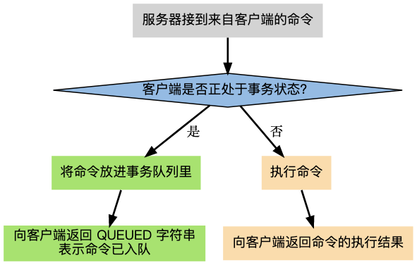

**3）执行事务**

前面说到， 当客户端进入事务状态之后， 客户端发送的命令就会被放进事务队列里。

但其实并不是所有的命令都会被放进事务队列， 其中的例外就是 [EXEC](https://link.zhihu.com/?target=http%3A//redis.readthedocs.org/en/latest/transaction/exec.html%23exec) 、 [DISCARD](https://link.zhihu.com/?target=http%3A//redis.readthedocs.org/en/latest/transaction/discard.html%23discard) 、 [MULTI](https://link.zhihu.com/?target=http%3A//redis.readthedocs.org/en/latest/transaction/multi.html%23multi) 和 [WATCH](https://link.zhihu.com/?target=http%3A//redis.readthedocs.org/en/latest/transaction/watch.html%23watch) 这四个命令 —— 当这四个命令从客户端发送到服务器时， 它们会像客户端处于非事务状态一样， 直接被服务器执行：

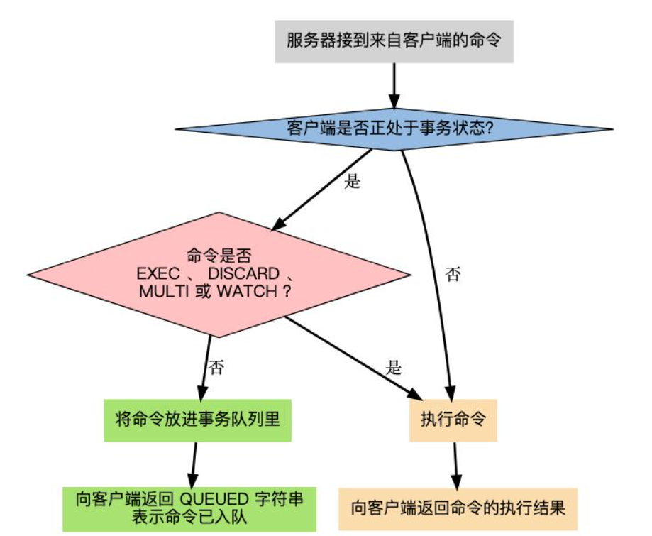

如果客户端正处于事务状态， 那么当[EXEC](https://link.zhihu.com/?target=http%3A//redis.readthedocs.org/en/latest/transaction/exec.html%23exec)命令执行时， 服务器根据客户端所保存的事务队列， 以先进先出（FIFO）的方式执行事务队列中的命令： 最先入队的命令最先执行， 而最后入队的命令最后执行。

执行事务中的命令所得的结果会以 FIFO 的顺序保存到一个回复队列中。

当事务队列里的所有命令被执行完之后，[EXEC](https://link.zhihu.com/?target=http%3A//redis.readthedocs.org/en/latest/transaction/exec.html%23exec)命令会将回复队列作为自己的执行结果返回给客户端， 客户端从事务状态返回到非事务状态， 至此， 事务执行完毕。

## 三. Redis事务命令

redis事务使用了multi、exec、discard、watch、unwatch命令，命令的作用如图4所示：


使用案例：

- **正常执行**

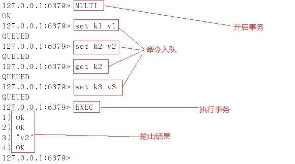

- **放弃事务**

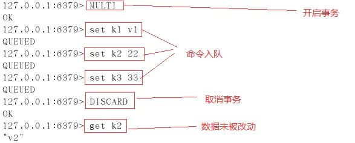

- **若在事务队列中存在命令性错误，则执行EXEC命令时，所有命令都不会执行**

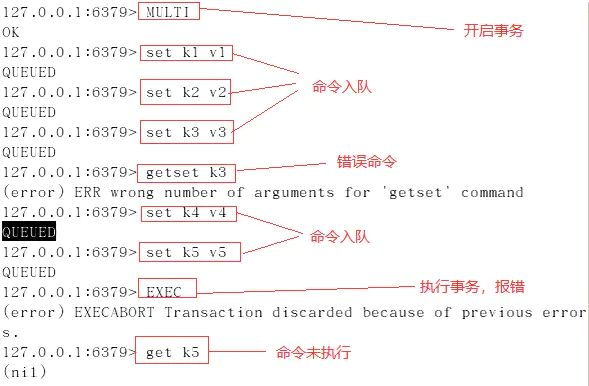

- **若在事务队列中存在语法性错误，则执行EXEC命令时，其他正确命令会被执行，错误命令抛出异常。**

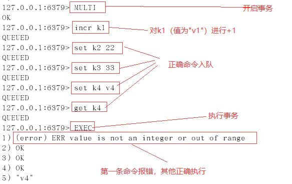

- **使用watch**

使用watch检测balance，事务期间balance数据未变动，事务执行成功

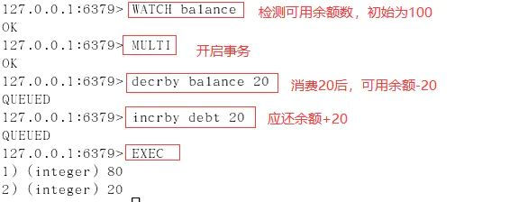

[WATCH](https://link.zhihu.com/?target=http%3A//redis.readthedocs.org/en/latest/transaction/watch.html%23watch)命令用于在事务开始之前监视任意数量的键： 当调用[EXEC](https://link.zhihu.com/?target=http%3A//redis.readthedocs.org/en/latest/transaction/exec.html%23exec)命令执行事务时， 如果任意一个被监视的键已经被其他客户端修改了， 那么整个事务不再执行， 直接返回失败。

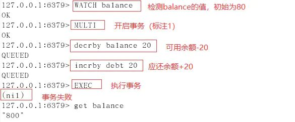

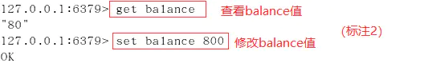

#### 3.1 watch命令的实现

在每个代表数据库的 `redis.h/redisDb` 结构类型中， 都保存了一个 `watched_keys` 字典， 字典的键是这个数据库被监视的键， 而字典的值则是一个链表， 链表中保存了所有监视这个键的客户端。

比如说，以下字典就展示了一个 `watched_keys` 字典的例子：

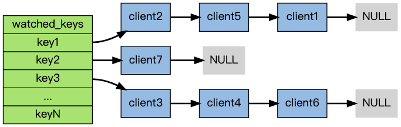

其中， 键 `key1` 正在被 `client2` 、 `client5` 和 `client1` 三个客户端监视， 其他一些键也分别被其他别的客户端监视着。

[WATCH](https://link.zhihu.com/?target=http%3A//redis.readthedocs.org/en/latest/transaction/watch.html%23watch) 命令的作用， 就是将当前客户端和要监视的键在 `watched_keys` 中进行关联。

举个例子， 如果当前客户端为 `client10086` ， 那么当客户端执行 `WATCH` `key1` `key2` 时， 前面展示的 `watched_keys` 将被修改成这个样子：

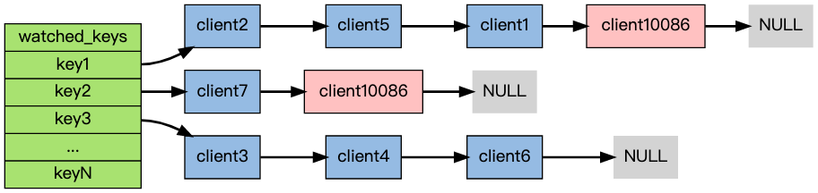

通过`watched_keys`字典， 如果程序想检查某个键是否被监视， 那么它只要检查字典中是否存在这个键即可； 如果程序要获取监视某个键的所有客户端， 那么只要取出键的值（一个链表）， 然后对链表进行遍历即可。

**watch的触发**
在任何对数据库键空间（key space）进行修改的命令成功执行之后 （比如[FLUSHDB](https://link.zhihu.com/?target=http%3A//redis.readthedocs.org/en/latest/server/flushdb.html%23flushdb)、[SET](https://link.zhihu.com/?target=http%3A//redis.readthedocs.org/en/latest/string/set.html%23set)、[DEL](https://link.zhihu.com/?target=http%3A//redis.readthedocs.org/en/latest/key/del.html%23del)、[LPUSH](https://link.zhihu.com/?target=http%3A//redis.readthedocs.org/en/latest/list/lpush.html%23lpush)、[SADD](https://link.zhihu.com/?target=http%3A//redis.readthedocs.org/en/latest/set/sadd.html%23sadd)、[ZREM](https://link.zhihu.com/?target=http%3A//redis.readthedocs.org/en/latest/sorted_set/zrem.html%23zrem)，诸如此类），`multi.c/touchWatchedKey`函数都会被调用 —— 它检查数据库的`watched_keys`字典， 看是否有客户端在监视已经被命令修改的键， 如果有的话， 程序将所有监视这个/这些被修改键的客户端的`REDIS_DIRTY_CAS`选项打开：

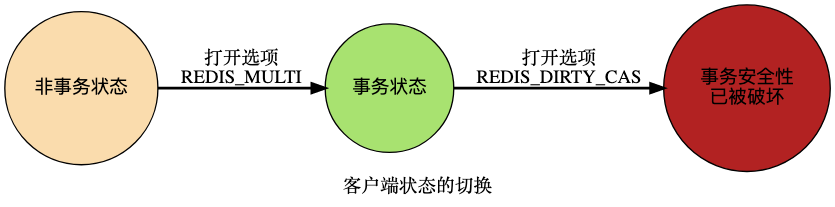

当客户端发送 [EXEC](https://link.zhihu.com/?target=http%3A//redis.readthedocs.org/en/latest/transaction/exec.html%23exec) 命令、触发事务执行时， 服务器会对客户端的状态进行检查：

- 如果客户端的 `REDIS_DIRTY_CAS` 选项已经被打开，那么说明被客户端监视的键至少有一个已经被修改了，事务的安全性已经被破坏。服务器会放弃执行这个事务，直接向客户端返回空回复，表示事务执行失败。
- 如果 `REDIS_DIRTY_CAS` 选项没有被打开，那么说明所有监视键都安全，服务器正式执行事务。