# Redis主从复制

`Redis` 的高可用方案包括：持久化、主从复制、哨兵和集群。其中持久化侧重解决的是 `Redis` 数据的单机备份问题；而主从复制则侧重解决数据的多机热备，此外，主从复制还可以实现负载均衡和故障恢复。**复制功能是高可用Redis的基础**，后面章节的哨兵和集群都是在复制的基础上实现高科用的。

目前很多中小企业都没有使用到 Redis 的集群，但是至少都做了主从。有了主从，当 master 挂掉的时候，运维让从库过来接管，服务就可以继续，否则 master 需要经过数据恢复和重启的过程，这就可能会拖很长的时间，影响线上业务的持续服务。

## 一. 主从复制配置

### 1.1 建立复制

参与复制的 Redis 实例划分为主节点（master）和从节点（slave），复制的数据流是单向的，只能由主节点复制到从节点。一般 master 以写为主，slave 以读为主。配置方式有以下三种（`slaveof` 配置都是在从节点发起的）：

- 在配置文件中添加 `slaveof masterHost masterPort`
- 在 `redis-server` 启动命令后面加上 `--slaveof masterHost masterPort`
- 直接使用命令 `slaveof masterHost masterPort`。`slaveof` 命令本身是异步命令，执行 `slaveof` 时，节点只保存主节点信息后返回，后序复制流程在节点内部异步执行。

每个节点都能使用 `info replication` 命令查看复制的相关状态:

- 主节点复制信息

```shell
127.0.0.1:7002> info replication
# Replication
role:master
connected_slaves:1
slave0:ip=127.0.0.1,port=7013,state=online,offset=1092,lag=1
master_replid:631d13d04648f33f5ef30fed0a128dc4e7b9ff21
master_replid2:0000000000000000000000000000000000000000
master_repl_offset:1092
second_repl_offset:-1
repl_backlog_active:1
repl_backlog_size:1048576
repl_backlog_first_byte_offset:1
repl_backlog_histlen:1092
```

- 从节点复制信息

```shell
127.0.0.1:7013> info replication
# Replication
role:slave
master_host:127.0.0.1
master_port:7002
master_link_status:up
master_last_io_seconds_ago:9
master_sync_in_progress:0
slave_repl_offset:1050
slave_priority:100
slave_read_only:1
connected_slaves:0
master_replid:631d13d04648f33f5ef30fed0a128dc4e7b9ff21
master_replid2:0000000000000000000000000000000000000000
master_repl_offset:1050
second_repl_offset:-1
repl_backlog_active:1
repl_backlog_size:1048576
repl_backlog_first_byte_offset:1
repl_backlog_histlen:1050
```

### 1.2 断开复制

```shell
slaveof no one
```

slave 断开复制后**不会删除原有数据**，只是无法再获取原来 master 上的数据变化

### 1.3 切换主Redis

```shell
slaveof newMasterHost newMasterPort
```

slave 切换 master 后，**会删除原有数据**。具体流程：

1. 断开与旧主节点复制关系
2. 与新主节点建立复制关系
3. 删除从节点数据
4. 对新主节点进行复制操作

### 1.4 安全性

对于数据安全比较重要的节点，主节点会通过设置 `requirepass` 参数进行密码验证，这时所有的客户端访问必须使用 `auth` 命令试行校验。从节点与主节点复制连接是通过一个特殊标识的客户端来完成，因此需要配置从节点 `masterauth` 参数与主节点密码保持一致，这样从节点才可以正确地连接到主节点发起复制流程。

### 1.5 只读

默认情况下，从节点使用 `slave-read-only=yes` 配置为只读模式。由于复制只能从主节点到从节点，对于从节点的任何修改，主节点的任何修改主节点都无法感知，修改从节点数据会导致主从数据不一致的情况。

### 1.6 传输延迟

主从节点一般部署在不同机器上，复制时的网络延迟就成为了需要考虑的问题，Redis为我们提供了`repl-disable-tcp-nodelay`参数用于控制是否关闭`TCP_NODELAY`，默认为no，即开启`tcp-nodelay`功能，说明如下：

- 当关闭时，主节点产生的命令数据无论大小都会及时地发送给从节点，这样主从之间延迟会比较小，但是增加了网络带宽的消耗。适合于同机架或同机房这类网络环境较好的场景。
- 当开启时，主节点会合并比较小的TCP数据包，从而节省带宽。默认发送间隔取决于Linux内核，一般默认为40ms。这种配置节省了带宽但增加了主从间的延迟。适合于异地机房这类网络环境复杂，带宽比较紧张的场景。

## 二. 拓扑结构

一主一从


一主多从

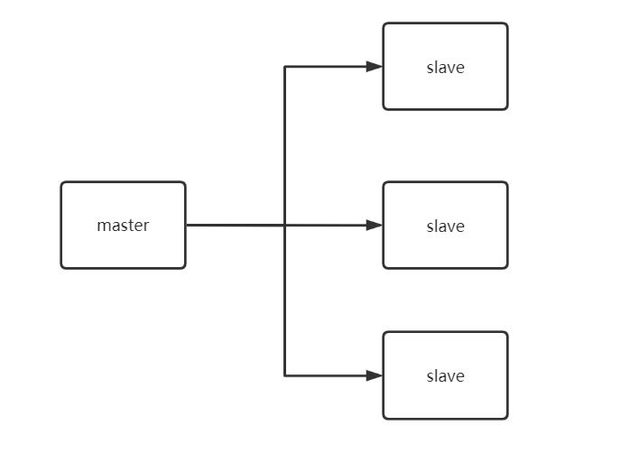

树状主从结构

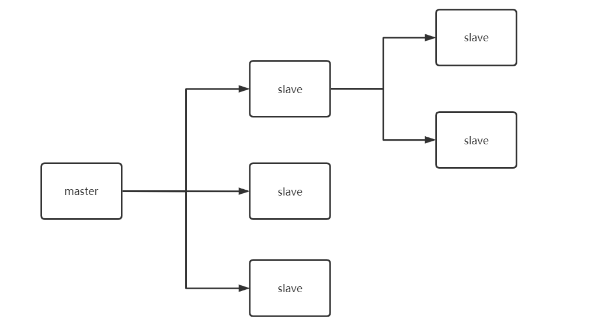

树状主从结构使得从节点不但可以复制主节点数据，同时还可以作为其他从节点的主节点继续向下层复制。通过引入复制中间层，可以有效降低主节点负载和需要传输给从节点的数据量。

## 三. 复制原理

### 3.1 复制过程

从节点执行slaveof后，复制过程便开始运作，复制过程大致分为6个过程：

1. **保存主节点信息**

执行slaveof后从节点只保存主节点的地址便直接返回，这是建立复制流程还没开始，从节点执行`info replication`可以看到一下信息：

```shell
role:slave
master_host:192.168.0.10
master_port:7002
master_link_status:down #状态显示未连接
...
```

执行slaveof后，Redis会打印如下日志：

```shell
 * REPLICAOF 127.0.0.1:7002 enabled (user request from 'id=4 addr=127.0.0.1:60708 fd=8 name= age=213 idle=0 flags=N db=0 sub=0 psub=0 multi=-1 qbuf=42 qbuf-free=32726 obl=0 oll=0 omem=0 events=r cmd=slaveof user=default')
```

通过该日志可以帮助运维人员定位发送`slaveof`命令的客户端，方便追踪和发现问题。

2. **建立Socket连接**

从节点内部通过每秒运行的定时任务维护复制相关逻辑，当定时任务发现存在新的主节点后，会尝试与该节点建立网络连接。从节点连接成功后会打印：

```shell
* Connecting to MASTER 127.0.0.1:7002
* MASTER <-> REPLICA sync started
```

如果从节点无法建立连接，定时任务会无限重试，直到连接成功或者执行 `slaveof no one`取消复制。

关于连接失败，可以在从节点执行`info replication`查看`master_link_down_since_seconds`指标，它会记录与主节点连接失败的系统时间。从节点连接主节点失败时，也会打印如下日志，方便运维人员排查问题：

```shell
todo todotodotodo
```

3. **发送ping**

连接建立成功后，从节点会发送ping命令请求进行首次通信，ping请求的主要目的：

- 检测主从之间网络套接字是否可用
- 检测主节点当前是否可以接收处理命令

如果发送ping命令后，从节点没有收到主节点pong回复，或者超时，比如网络超时或者主节点发生阻塞，无法响应命令，从节点会断开连接，下次定时任务会发起重连。

从节点发送ping命令成功返回，Redis打印如下日志，并继续后序复制流程：

```shell
* Master replied to PING, replication can continue...
```

4. **权限验证**

如果主节点设置了`requirepass`参数，则需要密码验证，从节点必须配置`masterauth`参数保证与主节点相同的密码才能通过验证；如果验证失败复制将终止，从节点重新发起复制流程。

5. **同步数据集**

对于首次建立复制的场景，主节点会把持有的所有数据全部发送给从节点，这部分操作是耗时最长的步骤。

6. **命令持续复制**

当主节点把当前的数据同步给从节点后，便完成了复制的建立流程。接下来主节点会持续地把写命令发送给从节点，保证主从一致性。

### 3.2 数据同步

Redis在2.8及以上版本使用psync命令完成主从数据同步，同步过程分为：全量复制和部分复制。 

- 全量复制：一般用于初次复制场景，Redis早期支持的复制功能只有全 量复制，它会把主节点全部数据一次性发送给从节点，当数据量较大时，会对主从节点和网络造成很大的开销。 
- 部分复制：用于处理在主从复制中因网络闪断等原因造成的数据丢失场景，当从节点再次连上主节点后，如果条件允许，主节点会补发丢失数据 给从节点。因为补发的数据远远小于全量数据，可以有效避免全量复制的过高开销。

#### 3.2.1 复制偏移量

参与复制的主从节点都会维护自身复制偏移量。主节点（master）在处理完写入命令后，会把命令的字节长度做累加记录，统计信息在`info  relication`中的`master_repl_offset`指标中：

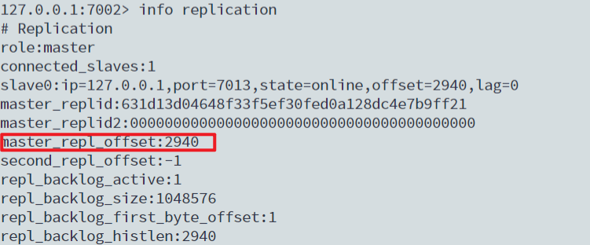

从节点（slave）每秒钟上报自身的复制偏移量给主节点，因此主节点也会保存从节点的复制偏移量，统计指标如下： 

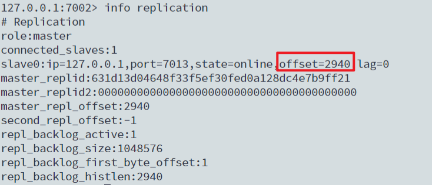

从节点在接收到主节点发送的命令后，也会累加记录自身的偏移量。统计信息在`info relication`中的`slave_repl_offset`指标中：

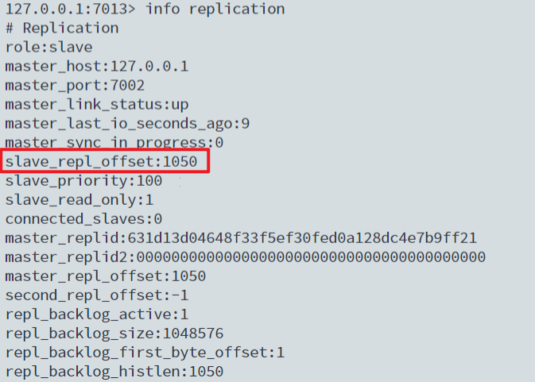

可以通过主节点的统计信息，计算出`master_repl_offset - slave_offset`字节量，判断主从节点复制相差的数据量，根据这个差值判定当前复制的健康度。如果主从之间复制偏移量相差较大，则可能是网络延迟或命令阻塞等原因引起。

#### 3.2.2 复制积压缓冲区

复制积压缓冲区是**保存在主节点上**的一个固定长度的队列，默认大小为 1MB，当主节点有连接的从节点（slave）时被创建，这时主节点响应写命令时，不但会把命令发送给从节点，还会写入复制积压缓冲区：

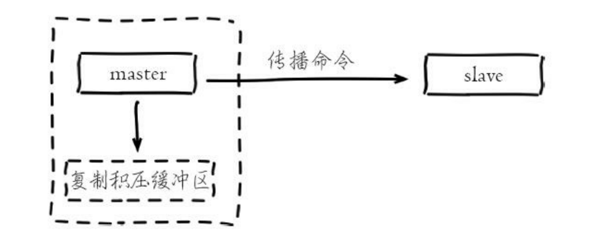

由于缓冲区本质上是先进先出的定长队列，所以能实现保存最近已复制数据的功能，用于部分复制和复制命令丢失的数据补救。复制缓冲区相关统计信息保存在主节点的info replication中： 

```shell
127.0.0.1:6379> info replication 
# Replication role:master 
... 
repl_backlog_active:1 // 开启复制缓冲区 
repl_backlog_size:1048576 // 缓冲区最大长度 
repl_backlog_first_byte_offset:1 // 起始偏移量，计算当前缓冲区可用范围 
repl_backlog_histlen:2940 // 已保存数据的有效长度。
```

#### 3.2.3 主节点运行ID

每个Redis节点启动后都会动态分配一个40位的十六进制字符串作为运行ID。运行ID的主要作用是用来唯一识别Redis节点，比如从节点保存主节点的运行ID识别自己正在复制的是哪个主节点。如果只使用ip+port的方式识别主节点，那么主节点重启变更了整体数据集（如替换RDB/AOF文件），从节点再基于偏移量复制数据将是不安全的，因此当运行ID变化后从节点将做全量复制。可以运行info server命令查看当前节点的运行ID： 

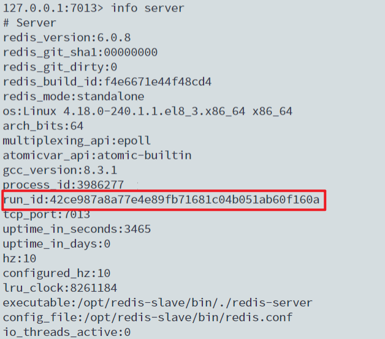

如何在不改变运行ID的情况下重启呢？ 

当运维需要调优一些内存相关配置，例如：hash-max-ziplist-value等，这些配 置需要Redis重新加载才能优化已存在的数据，这时可以使用debug reload命 令重新加载RDB并保持运行ID不变，从而有效避免不必要的全量复制。

debug reload命令会阻塞当前Redis节点主线程，阻塞期间会生成本地 RDB快照并清空数据之后再加载RDB文件。因此**对于大数据量的主节点和无法容忍阻塞的应用场景，谨慎使用**。 

#### 3.2.4 psync命令

从节点使用psync命令完成部分复制和全量复制功能，命令格式： `psync {runId} {offset}`，参数含义如下

- runId：从节点所复制主节点的运行id。 

- offset：当前从节点已复制的数据偏移量。 

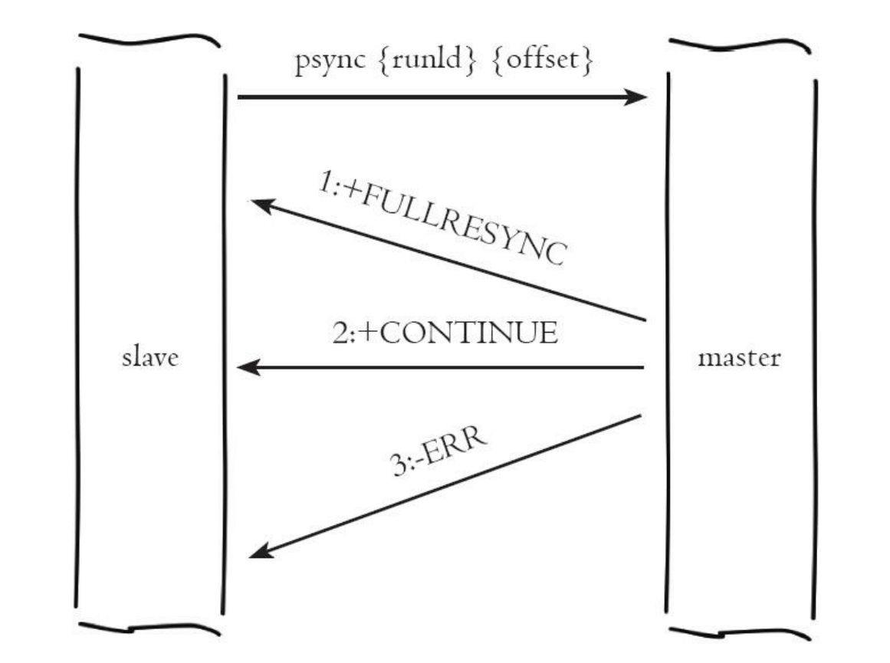

流程说明：

1. 从节点（slave）发送psync命令给主节点，参数runId是当前从节点保存的主节点运行ID，如果没有则默认值为，参数offset是当前从节点保存的复制偏移量，如果是第一次参与复制则默认值为-1。 
2. 主节点（master）根据psync参数和自身数据情况决定响应结果：
   - 如果回复`+FULLRESYNC {runId} {offset}`，那么从节点将触发全量复制流程。
   - 如果回复`+CONTINUE`，从节点将触发部分复制流程。 
   - 如果回复`+ERR`，说明主节点版本低于Redis2.8，无法识别psync命令，从节点将发送旧版的sync命令触发全量复制流程。 

### 3.3 全量复制

全量复制是Redis最早支持的复制方式，也是主从第一次建立复制时必须经历的阶段。触发全量复制的命令是`sync`和`psync`，Redis版本小于2.8时使用sync命令进行全量复制，而大于等于2.8的版本使用`psync`进行全量复制。由于`sync`和`psync`复制机制基本一致，下文主要介绍`psync`机制：

1. 发送`psync`命令进行数据同步，由于是第一次进行复制，从节点没有复制偏移量和主节点的运行ID，所以发送`psync ? -1`。

2. 主节点根据`psync ? -1`解析出当前为全量复制，回复`+FULLRESYNC`响应。
3. 从节点接收主节点的响应数据保存运行ID和偏移量offset，执行到当前步骤时从节点打印如下日志： 

```shell
* Trying a partial resynchronization (request 29551bbedb090f1bac8775219f45f93a020ffaee:1).
* Full resync from master: 631d13d04648f33f5ef30fed0a128dc4e7b9ff21:0
```

4. 主节点执行bgsave保存RDB文件到本地。主节点bgsave相关日志如下： 

```shell
* Replica 127.0.0.1:7013 asks for synchronization
3986599:M 31 Oct 2021 10:41:33.528 * Partial resynchronization not accepted: Replication ID mismatch (Replica asked for '29551bbedb090f1bac8775219f45f93a020ffaee', my replication IDs are '2bb4ceda0d3592f70a567363b06ba2a4025ed1a6' and '0000000000000000000000000000000000000000')
3986599:M 31 Oct 2021 10:41:33.528 * Replication backlog created, my new replication IDs are '631d13d04648f33f5ef30fed0a128dc4e7b9ff21' and '0000000000000000000000000000000000000000'
3986599:M 31 Oct 2021 10:41:33.528 * Starting BGSAVE for SYNC with target: disk
3986599:M 31 Oct 2021 10:41:33.529 * Background saving started by pid 3987354
3987354:C 31 Oct 2021 10:41:33.531 * DB saved on disk
3987354:C 31 Oct 2021 10:41:33.531 * RDB: 2 MB of memory used by copy-on-write
3986599:M 31 Oct 2021 10:41:33.628 * Background saving terminated with success
3986599:M 31 Oct 2021 10:41:33.629 * Synchronization with replica 127.0.0.1:7013 succeeded
```

5. 主节点发送RDB文件给从节点，从节点把接收的RDB文件保存在本地并直接作为从节点的数据文件，接收完RDB后从节点打印相关日志，可以 在日志中查看主节点发送的数据量：

```shell
* MASTER <-> REPLICA sync: receiving 175 bytes from master to disk
```

需要注意，对于数据量较大的主节点，比如生成的RDB文件超过6GB以上时要格外小心。传输文件这一步操作非常耗时，速度取决于主从节点之间 网络带宽，通过细致分析Full resync和MASTER<->SLAVE这两行日志的时间差，可以算出RDB文件从创建到传输完毕消耗的总时间。如果总时间超过`repl-timeout`所配置的值（默认60秒），从节点将放弃接受RDB文件并清理已经下载的临时文件，导致全量复制失败，此时从节点打印如下日志： 

```shell
Timeout receiving bulk data from MASTER... If the problem persists try to set the 'repl-timeout' parameter in redis.conf to a larger value
```

针对数据量较大的节点，建议调大repl-timeout参数防止出现全量同步数据超时。例如对于千兆网卡的机器，网卡带宽理论峰值大约每秒传输 

100MB，在不考虑其他进程消耗带宽的情况下，6GB的RDB文件至少需要60秒传输时间，默认配置下，极易出现主从数据同步超时。 

6. 对于从节点开始接收RDB快照到接收完成期间，主节点仍然响应读写命令，因此主节点会把这期间写命令数据保存在复制客户端缓冲区内，当从节点加载完RDB文件后，主节点再把缓冲区内的数据发送给从节点，保证主从之间数据一致性。如果主节点创建和传输RDB的时间过长，对于高流量写入场景非常容易造成主节点复制客户端缓冲区溢出。默认配置为`client-output-buffer-limit slave 256MB 64MB 60`，如果60秒内缓冲区消耗持续大于64MB或者直接超过256MB时，主节点将直接关闭复制客户端连接，造成全量同步失败。对应日志如下：

```shell
Client id=2 addr=127.0.0.1:24555 age=1 idle=1 flags=S qbuf=0 qbuf-free=0 obl=18824 oll=21382 omem=268442640 events=r cmd=psync scheduled to be closed ASAP for overcoming of output buffer limits.
```

因此，运维人员需要根据主节点数据量和写命令并发量调整`client-output-buffer-limit slave`配置，避免全量复制期间客户端缓冲区溢出。 

对于主节点，当发送完所有的数据后就认为全量复制完成，打印成功日志：`Synchronization with replica 127.0.0.1:7013 succeeded`，但是对于从节点全量复制依然没有完成，还有后续步骤需要处理。

7. 从节点接收完主节点传送来的全部数据后会清空自身旧数据，该步骤对应如下日志：

```shell
* MASTER <-> REPLICA sync: Flushing old data
```

8. 从节点清空数据后开始加载RDB文件，对于较大的RDB文件，这一步操作依然比较耗时，可以通过计算日志之间的时间差来判断加载RDB的总 耗时，对应如下日志： 

```shell
* MASTER <-> REPLICA sync: Loading DB in memory
* Loading RDB produced by version 6.0.8
* RDB age 0 seconds
* RDB memory usage when created 1.85 Mb
* MASTER <-> REPLICA sync: Finished with success
```

对于线上做读写分离的场景，从节点也负责响应读命令。如果此时从节点正出于全量复制阶段或者复制中断，那么从节点在响应读命令可能拿到过期或错误的数据。对于这种场景，Redis复制提供了`slave-serve-stale-data`参数，默认开启状态。如果开启则从节点依然响应所有命令。对于无法容忍不一致的应用场景可以设置no来关闭命令执行，此时从节点除了info和slaveof命令之外所有的命令只返回“SYNC with master in progress”信息。 

9. 从节点成功加载完RDB后，如果当前节点开启了AOF持久化功能，它会立刻做bgrewriteaof操作，为了保证全量复制后AOF持久化文件立刻可用。 

通过分析全量复制的所有流程，读者会发现全量复制是一个非常耗时费力的操作。它的时间开销主要包括： 

- 主节点bgsave时间
- RDB文件网络传输时间
- 从节点清空数据时间
- 从节点加载RDB的时间
- 可能的AOF重写时间

### 3.4 部分复制

部分复制主要是Redis针对全量复制的过高开销做出的一种优化措施，使用`psync {runId} {offset}`命令实现。当从节点（slave）正在复制主节点 （master）时，如果出现网络闪断或者命令丢失等异常情况时，从节点会向主节点要求补发丢失的命令数据，如果主节点的复制积压缓冲区内存在这部 分数据则直接发送给从节点，这样就可以保持主从节点复制的一致性。补发的这部分数据一般远远小于全量数据，所以开销很小。

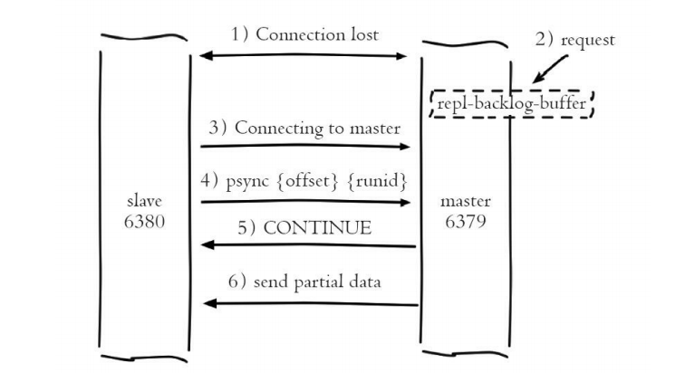

流程说明： 

1. 当主从节点之间网络出现中断时，如果超过`repl-timeout`时间，主节点会认为从节点故障并中断复制连接，打印如下日志： 

```shell
M # Disconnecting timedout slave: 127.0.0.1:6380 
M # Connection with slave 127.0.0.1:6380 lost.
```

如果此时从节点没有宕机，也会打印与主节点连接丢失日志： 

```shell
S # Connection with master lost. 
S * Caching the disconnected master state.
```

2. 主从连接中断期间主节点依然响应命令，但因复制连接中断命令无法发送给从节点，不过主节点内部存在的复制积压缓冲区，依然可以保存最近一段时间的写命令数据，默认最大缓存1MB。

3. 当主从节点网络恢复后，从节点会再次连上主节点，打印如下日志：

```shell
S * Connecting to MASTER 127.0.0.1:6379 
S * MASTER <-> SLAVE sync started 
S * Non blocking connect for SYNC fired the event. 
S * Master replied to PING, replication can continue..
```

4. 当主从连接恢复后，由于从节点之前保存了自身已复制的偏移量和主节点的运行ID。因此会把它们当作psync参数发送给主节点，要求进行部分复制操作。该行为对应从节点日志如下： 

```shell
S * Trying a partial resynchronization (request 2b2ec5f49f752f35c2b2da4d05775b5 b3aaa57ca:49768480).
```

5. 主节点接到`psync`命令后首先核对参数runId是否与自身一致，如果一致，说明之前复制的是当前主节点；之后根据参数offset在自身复制积压缓冲区查找，如果偏移量之后的数据存在缓冲区中，则对从节点发送`+CONTINUE`响应，表示可以进行部分复制。从节点接到回复后打印如下日志：

```shell
S * Successful partial resynchronization with master. 
S * MASTER <-> SLAVE sync: Master accepted a Partial Resynchronization.
```

6. 主节点根据偏移量把复制积压缓冲区里的数据发送给从节点，保证主从复制进入正常状态。发送的数据量可以在主节点的日志获取，如下所 

   示

```shell
M * Slave 127.0.0.1:6380 asks for synchronization 
M * Partial resynchronization request from 127.0.0.1:6380 accepted. Sending 78 bytes of backlog starting from offset 49769216.
```

从日志中可以发现这次部分复制只同步了78字节，传递的数据远远小于全量数据。

### 3.5 心跳检查

主从节点在建立复制后，它们之间维护着长连接并彼此发送心跳命令

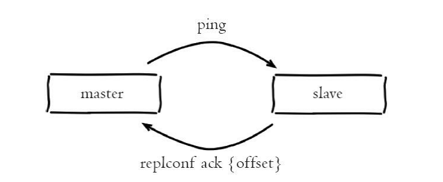

主从心跳判断机制：

- 主从节点彼此都有心跳检测机制，各自模拟成对方的客户端进行通信，通过client list命令查看复制相关客户端信息，主节点的连接状态为flags=M，从节点连接状态为flags=S。

- 主节点默认每隔10秒对从节点发送ping命令，判断从节点的存活性和连接状态。可通过参数`repl-ping-slave-period`控制发送频率。

- 从节点在主线程中每隔1秒发送`replconf ack {offset}`命令，给主节点上报自身当前的复制偏移量。replconf命令主要作用如下：
  - 实时监测主从节点网络状态
  - 上报自身复制偏移量，检查复制数据是否丢失，如果从节点数据丢失，再从主节点的复制缓冲区中拉取丢失数据
  - 实现保证从节点的数量和延迟性功能，通过`min-slaves-to-write`、`min-slaves-max-lag`参数配置定义

主节点根据replconf命令判断从节点超时时间，体现在info replication统计中的lag信息中，lag表示与从节点最后一次通信延迟的秒数，正常延迟应该在0和1之间。如果超过repl-timeout配置的值（默认60秒），则判定从节点下线并断开复制客户端连接。即使主节点判定从节点下线后，如果从节点重新恢复，心跳检测会继续进行

### 3.6 异步复制

主节点不但负责数据读写，还负责把写命令同步给从节点。写命令的发送过程是异步完成，也就是说主节点自身处理完写命令后直接返回给客户 端，并不等待从节点复制完成

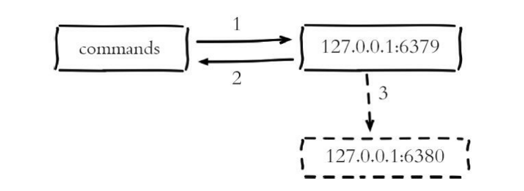

主节点复制流程： 

1. 主节点6379接收处理命令
2. 命令处理完之后返回响应结果
3. 对于修改命令异步发送给6380从节点，从节点在主线程中执行复制的命令

由于主从复制过程是异步的，就会造成从节点的数据相对主节点存在延迟。具体延迟多少字节，我们可以在主节点执行`info replication`命令查看相关指标获得

```shell
slave0:ip=127.0.0.1,port=6380,state=online,offset=841,lag=1 master_repl_offset:841
```

在统计信息中可以看到从节点slave0信息，分别记录了从节点的ip和port，从节点的状态，offset表示当前从节点的复制偏移量， `master_repl_offset`表示当前主节点的复制偏移量，两者的差值就是当前从节点复制延迟量。Redis的复制速度取决于主从之间网络环境，`repl-disable-tcp-nodelay`，命令处理速度等。正常情况下，延迟在1秒以内。 