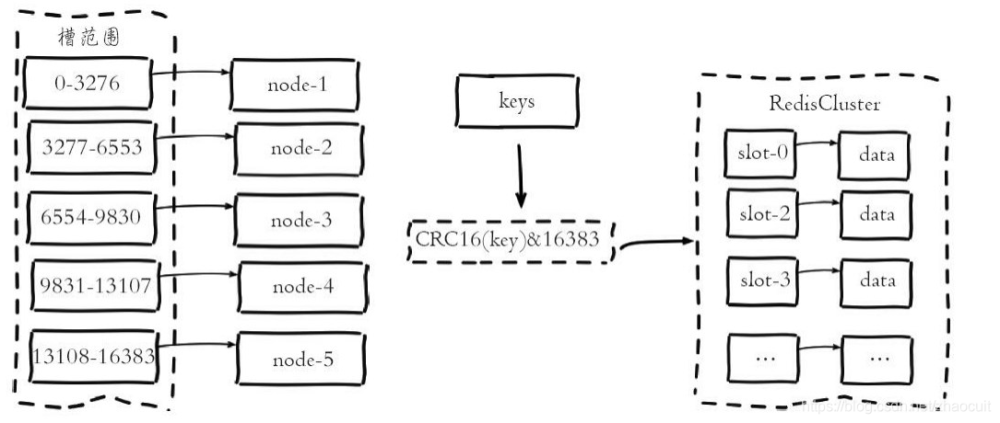
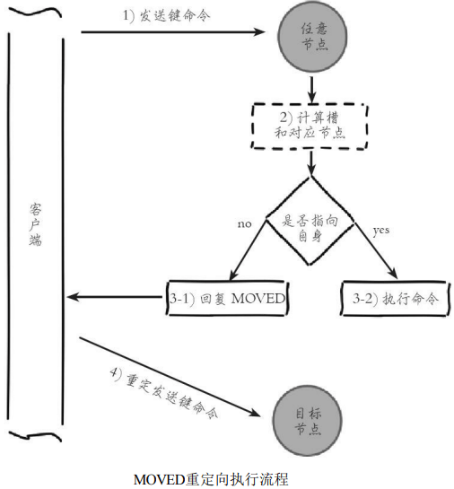
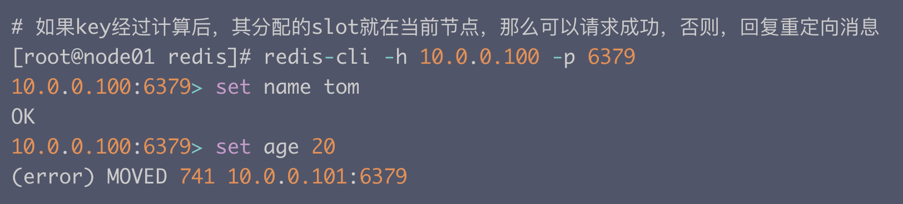
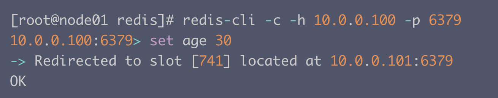
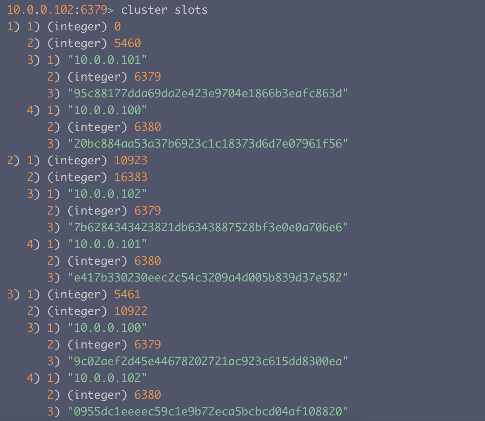

# Redis Cluster

> 本文参考至：[Redis开发与运维读书笔记-第十章-集群_enjoycoding悦码-CSDN博客](https://blog.csdn.net/u010408502/article/details/82759604)

Redis Cluster是Redis的分布式解决方案，在3.0版本正式推出，有效地解决了Redis分布式方面的需求。当遇到单机内存、并发、流量等瓶颈时，可以采用Cluster架构方案达到负载均衡的目的。

## 一. 数据分布

分布式数据库首先要解决把整个数据集按照分区规则映射到多个节点的问题，即把数据集划分到多个节点上，每个节点负责整体数据的一个子集。 需要重点关注的是数据分区规则，**常见的分区规则有哈希分区和顺序分区两种**。

由于Redis Cluster采用哈希分区规则，这里我们重点讨论哈希分区，常见的哈希分区规则有几种，下面分别介绍。

### 1.1 节点取余

使用特定的数据，如Redis的键或用户ID，再根据节点数量N使用公式： hash（key）%N计算出哈希值，用来决定数据映射到哪一个节点上。这种方案存在一个问题：当节点数量变化时，如扩容或收缩节点，数据节点映射关系需要重新计算，会导致数据的重新迁移。

这种方式的突出优点是简单性，常用于数据库的分库分表规则，一般采 用预分区的方式，提前根据数据量规划好分区数，比如划分为512或1024张表，保证可支撑未来一段时间的数据量，再根据负载情况将表迁移到其他数据库中。扩容时通常采用翻倍扩容，避免数据映射全部被打乱导致全量迁移的情况.

### 1.2 一致性Hash

一致性哈希分区（Distributed Hash Table）实现思路是为系统中每个节点分配一个token，范围一般在0~2^32，这些token构成一个哈希环。数据读写 执行节点查找操作时，先根据key计算hash值，然后顺时针找到第一个大于 等于该哈希值的token节点，如下图所示。关于一致性哈希分区可以查找更多资源了解:


这种方式相比节点取余最大的好处在于加入和删除节点只影响哈希环中相邻的节点，对其他节点无影响。但一致性哈希分区存在几个问题：

1. 加减节点会造成哈希环中部分数据无法命中，需要手动处理或者忽略这部分数据，因此一致性哈希常用于缓存场景。
2. 当使用少量节点时，节点变化将大范围影响哈希环中数据映射，因此这种方式不适合少量数据节点的分布式方案。
3. 普通的一致性哈希分区在增减节点时需要增加一倍或减去一半节点才能保证数据和负载的均衡。

正因为一致性哈希分区的这些缺点，一些分布式系统采用虚拟槽对一致性哈希进行改进，比如Dynamo系统。

### 1.3 虚拟槽分区

虚拟槽分区巧妙地使用了哈希空间，使用分散度良好的哈希函数把所有 数据映射到一个固定范围的整数集合中，整数定义为槽（slot）。这个范围一般远远大于节点数，比如**Redis Cluster槽范围是0~16383**。槽是集群内数据管理和迁移的基本单位。采用大范围槽的主要目的是为了方便数据拆分和集 群扩展。每个节点会负责一定数量的槽，如下图所示。

当前集群有5个节点，每个节点平均大约负责3276个槽。由于采用高质 量的哈希算法，每个槽所映射的数据通常比较均匀，将数据平均划分到5个 节点进行数据分区。Redis Cluster就是采用虚拟槽分区，下面就介绍Redis数据分区方法。



Redis虚拟槽分区的特点：

1. 解耦数据和节点之间的关系，简化了节点扩容和收缩难度。
2. 节点自身维护槽的映射关系，不需要客户端或者代理服务维护槽分区元数据。
3. 支持节点、槽、键之间的映射查询，用于数据路由、在线伸缩等场景。

数据分区是分布式存储的核心，理解和灵活运用数据分区规则对于掌握 Redis Cluster非常有帮助。Redis集群相对单机在功能上存在一些限制，需要开发人员提前了解，在使用时做好规避。限制如下：

1. key批量操作支持有限。如mset、mget，目前只支持具有相同slot值的 key执行批量操作。对于映射为不同slot值的key由于执行mget、mget等操作可能存在于多个节点上因此不被支持。
2. key事务操作支持有限。同理只支持多key在同一节点上的事务操 作，当多个key分布在不同的节点上时无法使用事务功能。
3. key作为数据分区的最小粒度，因此不能将一个大的键值对象如 hash、list等映射到不同的节点。
4. 不支持多数据库空间。单机下的Redis可以支持16个数据库，集群模 式下只能使用一个数据库空间，即db0。
5. 复制结构只支持一层，从节点只能复制主节点，不支持嵌套树状复制结构。

## 二. 节点通信

Redis Cluster采用虚拟槽的数据分片方式，只有当16384个槽全部分配给集群节点后，集群才进入在线状态。

而分布式存储中需要提供维护节点元数据信息的机制，所谓元数据是指：节点负责哪些数据，是否出现故障等状态信息。常见的元数据维护方式分为：集中式和P2P方式。Redis Cluster采用的是P2P的Gossip（流言）协议，Gossip协议工作原理就是节点之间不断通信交换自己掌握的节点信息，这样在一段时间后集群中的所有节点都将掌握集群的完整拓扑结构。

> Codis（豌豆荚开源的Redis数据分片解决方案）采用的是集中式存储时方式，数据节点不掌握节点的拓扑结构以及状态信息，这些信息被保存至Zookeeper或etcd等中间件中。

通信过程说明：

1. 集群中每个节点都会单独开辟一个TCP通道，用于节点之间彼此通信，通信端口在基础端口上加`10000`。
2. 每个节点在固定周期内通过特定规则选择几个节点发送ping消息。
3. 接收到ping消息的节点用pong消息作为响应。

集群中每个节点通过一定规则挑选要通信的节点，每个节点可能知道全部节点，也可能只知道部分节点，只要这些节点彼此可以正常通信，最终他们会达到一致的状态。当节点处故障、新节点加入、主从角色变化、槽信息变更等事件发生时，通过不断地ping/pong消息通信，经过一段时间后所有节点都会知道整个集群节点的最新状态，从而达到集群状态的同步。

## 三. 请求路由

Redis Cluster对客户端通信协议做了比较大的修改，为了追求性能的最大化，并没有采用代理的方式而是采用客户端直连的方式。因此对于希望从单机切换到集群环境的应用需要修改客户端代码。

### 3.1 请求重定向

在集群模式下，Redis接收任何相关命令时首先计算键对应的槽，再根据槽找出所对应的节点，如果节点是自身，则处理命令；否则回复`MOVED`重定向错误，通知客户端请求正确的节点。这个过程称为`MOVED`重定向:





重定向信息包含了键所对应的槽以及负责该槽的节点地址，根据这些信息客户端就可以向正确的节点发起请求。

使用 `redis-cli` 命令时，可以加入 `-c` 参数支持自动重定向，简化了手动发起重定向操作。



节点对于不属于它的键命令只回复重定向响应，不负责转发请求。正因为集群模式下把解析发起重定向的过程完全放到客户端完成，所以集群客户端协议相对于单机有了很大变化。

键命令执行主要分两步：

1. 计算槽

Redis首先需要计算键所对应的槽。根据键的有效部分使用 `CRC16` 函数计算出散列值，再取16384的余数（实际上是 hash&16383）

```c
def key_hash_slot(key):
	int keyLen = key.length();
	for (s = 0; s < keyLen; s++):
		if (key[s] == '{'):
			break;
	if (s == keyLen) return crc16(key, keyLen) & 16383;
	for (e = s+1; e < keyLen; e++):
		if (key[e] == '}'):
            break;
	if (e == keyLen || e == s+1):
        return crc16(key, keyLen) & 16383;
	return crc16(key+s+1, e-s-1) & 16383;
```

根据伪代码，如果键内包含`{}`字符，则计算槽的有效部分就是括号内的内容；这一特性称为`hash tag`

> Pipleline可以受益于hash tag，由于Pipeline只能向一个节点批量发送执行命令，而相同slot必然会对应唯一的节点，降低集群使用Pipeline的门槛。同理在集群模式下 Lua脚本、Redis事务都依赖于hash tag才能正常使用。

2. 槽节点查找

根据MOVED重定向机制，Redis客户端可以随机连接集群内任一redis节点获取其slot所在的node，这种客户端又叫Dummy（傀儡）客户端，他优点是代码实现简单，对客户端协议影响小，只需要根据重定向信息再次发送请求即可。

但他的弊端也很明显，就是需要重定向才能找到要执行命令的节点，额外增加了IO，这不是高效的方式，所以Redis Cluster通常采用Smart客户端。

### 3.2 Smart客户端

Smart客户端通过内部维护slot–>node的映射关系，本地就可以根据key找到node，从而避免额外IO，而MOVED重定向负责协助Smart客户端更新slot–>node映射。

首先JedisCluster初始化时，会选择一个正在运行的node, 初始化slot和node的映射关系，使用cluster slots命令完成：



Jedis解析Cluster slots结果，并缓存到本地，并为每个节点创建唯一的JedisPool连接池。映射关系在JedisClusterInfoCache类中


JedisCluster执行命令的过程：

```java
public abstract class JedisClusterCommand<T> {

  // 集群节点连接处理器
  private JedisClusterConnectionHandler connectionHandler;
  // 重试次数，默认5次
  private int redirections;
  private ThreadLocal<Jedis> askConnection = new ThreadLocal<Jedis>();

  // 模板回调方法
  public abstract T execute(Jedis connection);

  // 利用重试机制运行命令
  private T runWithRetries(byte[] key, int redirections, boolean tryRandomNode, boolean asking) {
    if (redirections <= 0) {
      throw new JedisClusterMaxRedirectionsException("Too many Cluster redirections?");
    }

    Jedis connection = null;
    try {

      if (asking) {
        // TODO: Pipeline asking with the original command to make it
        // faster....
        connection = askConnection.get();
        connection.asking();

        // if asking success, reset asking flag
        asking = false;
      } else {
        if (tryRandomNode) {
          // 随机获取活跃节点连接
          connection = connectionHandler.getConnection();
        } else {
          // 使用 slot 缓存获取目标节点连接
          connection = connectionHandler.getConnectionFromSlot(JedisClusterCRC16.getSlot(key));
        }
      }

      return execute(connection);
    } catch (JedisConnectionException jce) {
      if (tryRandomNode) {
        // maybe all connection is down
        throw jce;
      }

      // release current connection before recursion
      releaseConnection(connection);
      connection = null;

      // retry with random connection
      // 出现连接错误使用随机连接重试
      return runWithRetries(key, redirections - 1, true, asking);
    } catch (JedisRedirectionException jre) {
      // if MOVED redirection occurred,
      if (jre instanceof JedisMovedDataException) {
        // it rebuilds cluster's slot cache
        // recommended by Redis cluster specification
        // 如果出现 MOVED 重定向错误 , 在连接上执行 cluster slots 命令重新初始化 slot 缓存
        this.connectionHandler.renewSlotCache(connection);
      }

      // release current connection before recursion or renewing
      releaseConnection(connection);
      connection = null;

      if (jre instanceof JedisAskDataException) {
        asking = true;
        askConnection.set(this.connectionHandler.getConnectionFromNode(jre.getTargetNode()));
      } else if (jre instanceof JedisMovedDataException) {
      } else {
        throw new JedisClusterException(jre);
      }

      // slot 初始化后重试执行命令
      // 每次命令重试对redirections参数减1
      return runWithRetries(key, redirections - 1, false, asking);
    } finally {
      releaseConnection(connection);
    }
  }

  private void releaseConnection(Jedis connection) {
    if (connection != null) {
      connection.close();
    }
  }

}
```

整个流程为：

1. 根据key计算出slot, 并根据slot找到node建立连接，执行命令
2. 如果连接出现错误，则使用随机连接重新执行命令，每次命令重试对redirections参数减1
3. 捕获到MOVED重定向错误，使用cluster slots命令更新slots缓存
4. 重复执行前3步，知道命令执行成功，或者当redirections<=0 时抛出异常。

## 四. ASK重定向

当slot中的数据从源节点到目标节点迁移过程中，客户端需要保证key的命令可正常执行。

例如，当一个slot数据从源节点迁移到目标节点时，期间可能出现一部分key在源节点，而另一部分key在目标节点，这时，客户端key命令的执行流程为：

1. 客户端根据本地slot与node的映射关系，发送请求到node上，如果该node上存在key对象，则直接执行并给客户端返回结果
2. 如果该node上key不存在，则可能存在于目标节点，这时源节点会回复ASK重定向异常，格式如下：

```shell
(error) ASK {slot} {targetIP}:{targetPort}
```

3. 客户端收到ASK重定向指令后，先去目标节点执行一个不带参数的 asking 命令，然后在目标节点执行原理的操作请求指令。
   说明：
   - 客户端先执行一个 asking 指令的原因是，在迁移完成之前，按道理来说，这个slot还是不属于目标节点的，于是目标节点会跟客户端返回 -MOVED 指令，让客户端去源节点执行操作，这样就会形成“互相推脱”的重定向循环。
   - asking 指令就是告诉目标节点，我的指令必须你处理，请求slot就当成是你的吧
4. 如果目标节点存在这个key，就执行命令，不存在则返回不存在信息。
5. 迁移会影响指令执行的效率，在正常情况下，一次请求就可以完成操作，而迁移过程中，客户端需要做3次请求（发送给源节点，asking指令到目标节点，发送给目标节点真正的处理请求）

ASK与MOVED虽然都是客户端重定向指令，但有着本质的区别：

- ASK重定向：说明集群正在进行slot数据迁移，客户端无法知道什么时候迁移完成，因此只是临时性重定向，客户端不会更新slots缓存。
- MOVED重定向：说明key对应的slot已经明确到了新的节点，因此需要更新slots缓存。
