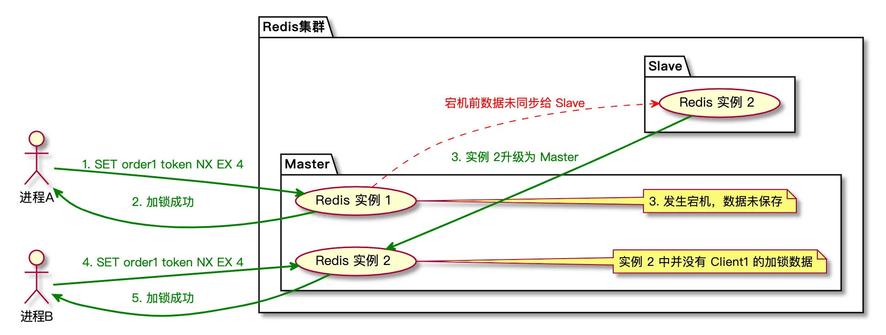
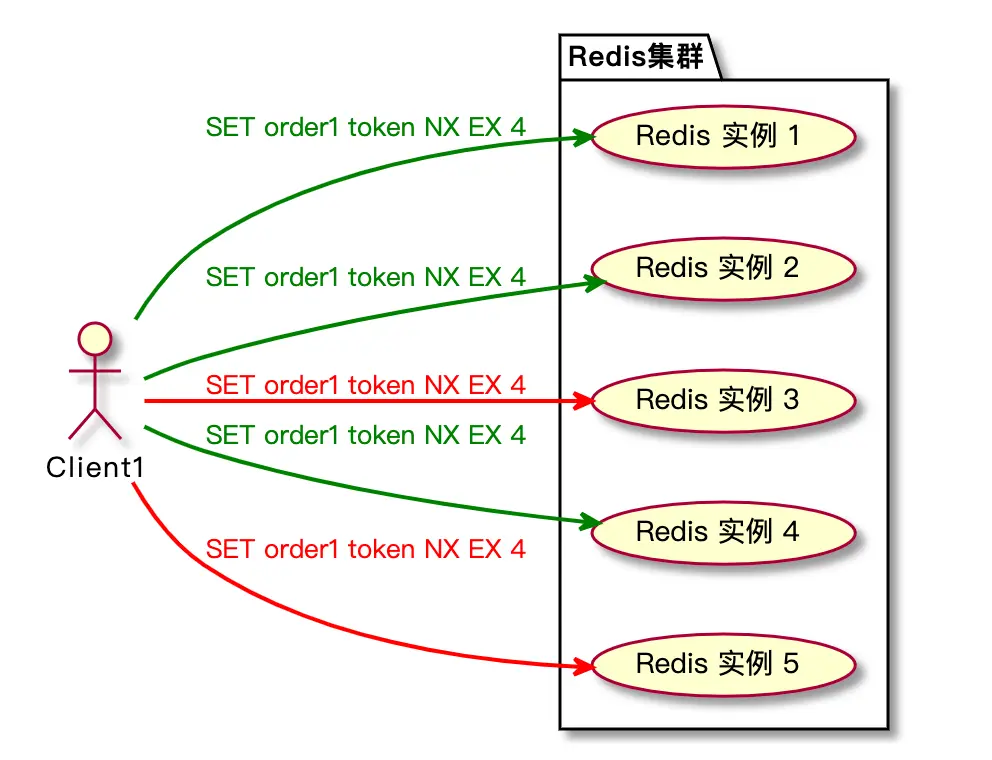
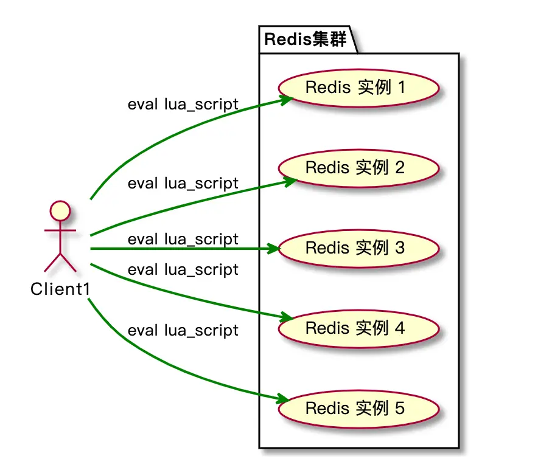

> 本文转载至：[浅析 Redlock 分布式锁实现原理 - 她和她的猫 (her-cat.com)](https://her-cat.com/posts/2022/05/08/redlock-distributed-lock/)

[Redis的官网](https://redis.io/docs/reference/patterns/distributed-locks/) 上对使用分布式锁提出至少需要满足如下三个要求：

1. **互斥**（属于安全性）：在任何给定时刻，只有一个客户端可以持有锁。
2. **无死锁**（属于有效性）：即使锁定资源的客户端崩溃或被分区，也总是可以获得锁；通常通过超时机制实现。
3. **容错性**（属于有效性）：只要大多数 Redis 节点都启动，客户端就可以获取和释放锁。

除此之外，分布式锁的设计中还可以/需要考虑：

1. 加锁解锁的**同源性**：A加的锁，不能被B解锁
2. 获取锁是**非阻塞**的：如果获取不到锁，不能无限期等待；
3. **高性能**：加锁解锁是高性能的

在介绍 Redlock 前，我们先来看看在项目中是怎么使用 Redis 实现锁的。

## 一. 基于单实例 Redis 分布式锁

我们平时使用的 Redis 锁大部分都是单实例的，只有一个 Redis 实例。

为什么叫它分布式锁？因为这里的分布式是指分布式的应用，即多个调用方，而不是说锁本身。

Redis 加锁的操作非常简单，只需要使用 SET 命令并带上相关的选项即可。

```shell
SET key value NX EX 60
```

- key: 需要锁定的资源，比如对某个订单加锁，那么 key 就可以是订单号。
- value: 在平时使用的时候，value 通常是一个无意义的值。
- NX: 只有当 key 不存在的时候才能设置成功，，作用等同于 SETNX 命令。
- EX: 60 秒后过期，作用等同于 EXPIRE 命令。

NX 选项的作用是，当有多个客户端同时申请对一个资源进行加锁时候，保证了只会有一个客户端能够加锁成功，其它客户端在锁被释放前都无法获得锁。

EX 选项主要是为了防止出现死锁问题，使用 EX 选项对锁设定了有效时间，当客户端持有锁的时间超过有效时间后，锁会自动被释放（过期）。

避免某个客户端获得锁后突然挂掉或其它原因一直持有锁，导致其它客户端永远无法获得锁。

最后，业务逻辑处理完之后，直接使用 DEL 命令删除指定的 key，就完成了释放锁的操作。

## 二. 可能出现的问题及解决办法

假设客户端 A 获得锁后开始处理业务，这时候客户端 B 也想要获得锁，但是发现锁已经被客户端 A 占有了。然后为了让自己获得锁，不管三七二十一就使用 DEL 命令把锁给释放了。

导致客户端 A 的正在执行的业务逻辑处于不安全的状态，因为创建的锁被别的客户端释放了。

怎么能避免这个问题呢？

我们可以在 SET 命令中将 value 设置成一个随机字符串，作为持有这个锁的令牌（token）。

客户端在释放锁的时候，需要传入自己的令牌，只有令牌与 value 匹配时才能删除 key，这样就保证了锁只能由持有锁的人才能释放。

```lua
if redis.call("get", KEYS[1])==ARGV[1] then
	return redis.call("del", KEYS[1])
else
	return 0
end
```

使用 lua 脚本实现分布式锁是为了保证整个解锁过程是原子操作，这样就不会存在并发问题。

上面说的这些都是以 Redis 服务正常为前提，如果 Redis 服务宕机，就会导致加不了锁，后续的业务逻辑也就无法正常的运行。

虽然可以使用 Redis 的集群提升 Redis 服务的可用性，但是在一些情况下还是会导致我们的锁失去作用。



进程 A 发送 SET 命令对 order1 进行加锁操作后，Master 实例宕机了，但是数据还没来得及同步给 Slave 实例，所以 Slave 也就没有这条数据。进行主从切换后，Slave 升级为 Master 提供服务，然后进程 B 对 order1 也能够加锁成功，这时候就有两个进程同时对同一个资源进行操作，所以锁也就失去了作用。

## 三. RedLock 分布式锁

Redlock（Redis lock）是 Redis 作者设计的一种分布式锁，Redlock 直译过来就是红锁。

Redlock 需要部署 N （N >= 2n+1）个独立的 Redis 实例，且实例之间没有任何的联系。也就是说，只要一半以上的 Redis 实例加锁成功，那么 Redlock 依然可以正常运行。

> 使用独立实例是为了避免 Redis 异步复制导致锁丢失。

### 3.1 RedLock 加锁过程

假设我们有 5 个 Redis 实例，当我们对 order1 这个订单加锁时，先记录当前时间用于统计加锁过程花费的时间，然后依次让 5 个 Redis 实例执行 `SET order1 token NX EX 60` 命令，最后统计加锁成功的实例数量以及加锁过程耗费的时间。



当加锁成功的实例数量超过半数（>= 3）并且加锁耗费的时间小于锁的有效时间，我们就认为加锁成功了。

为什么需要计算加锁过程耗费的时间呢？

因为当某些 Redis 实例由于网络延迟或其它原因，导致执行 SET 命令花费的时间比较久，这些 Redis 实例执行命令的时间加起来甚至超过了锁的有效时间。

比如锁的有效时间是 4 秒，但是 5 个 Redis 实例执行命令一共花费了 5 秒，对于这种情况，即使加锁成功的实例数量超过了半数，也是算作是加锁失败的。

所以 Redlock 加锁失败有两种情况：

- 加锁成功的实例数量未超过半数。
- 加锁过程花费时间超过锁的有效时间。

### 3.2 RedLock 解锁过程

无论是加锁成功还是加锁失败后都需要去释放锁，及时让出相关资源给其它调用者。

解锁的过程实际上就是让 5 个 Redis 实例依次执行 DEL 命令删除加锁时的 key，为了确保只释放自己的锁，需要用前面提到的 Lua 脚本来代替直接使用 DEL 命令进行解锁操作。



### 3.3 RedLock 存在的问题

RedLock算法自推出以来就存在争议，特别是在分布式系统的可靠性和安全性方面。主要的争论点集中在以下几个方面：

时钟偏移问题：RedLock算法的一个关键前提是分布式系统中各个Redis实例的时间必须保持同步。然而，在现实中，系统时钟可能会发生偏移（即使有NTP等网络时间协议）。如果发生偏移，可能导致锁被过早释放，从而违反了互斥性的原则。

多数节点响应：RedLock依赖于超过一半的节点正常工作才能正确地获取或释放锁。但是在网络分区（network partition）的情况下，这一假设可能不成立，

## 四. 总结

在本文中，先介绍了单实例 Redis 锁的一些问题以及解决方法，然后又介绍了基于多实例的 Redlock 分布式锁的实现，RedLock 在解决了单实例以及集群可能会出现的一些问题。

但是 RedLock 本身还是存在一些问题，比如：

- 加锁/解锁的效率会随着实例数量增加而降低。
- 客户端无法感知锁失效：客户端获取到锁后，处理业务逻辑时锁失效了，客户端是无法感知的，可能会被其它客户端再次获取到。
- 过期时间依赖系统时钟：如果系统发生时钟漂移，那么会影响到 Redis 计算过期时间，导致锁提前失效或持有时间比原来更久。
- …

所以在业务选型的过程中，我们需要结合实际业务情况使用合适的分布式锁组件。

- 业务比较简单或者对锁的可靠性要求不高时，可以直接使用单实例的 Redis 锁。
- 对于锁的可靠性有一定要求，又不想引入其它组件时，可以使用 RedLock 。
- 对于锁的可靠性要求比较高时，可以使用 ZooKeeper、Etcd 等组件。

如果你想要更深入的了解 Redlock 或上面提到的问题，推荐你阅读下面这些资料：

- [Distributed Locks with Redis](https://redis.io/docs/reference/patterns/distributed-locks/)
- [基于Redis的分布式锁到底安全吗（上）？](http://zhangtielei.com/posts/blog-redlock-reasoning.html)
- [基于Redis的分布式锁到底安全吗（下）？](http://zhangtielei.com/posts/blog-redlock-reasoning-part2.html)