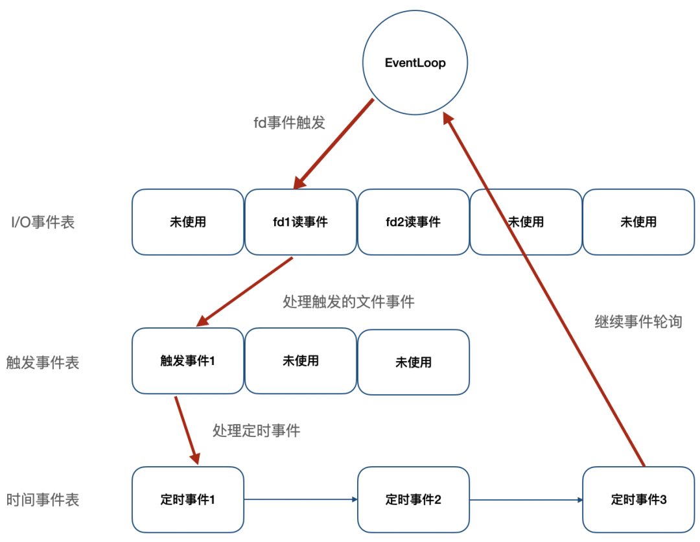
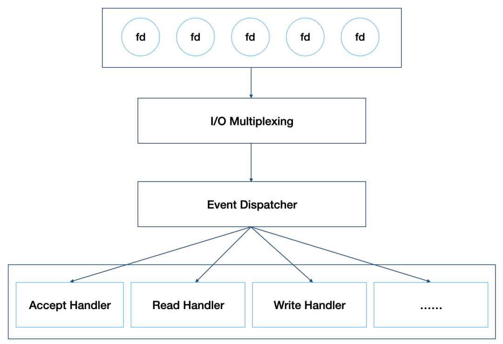
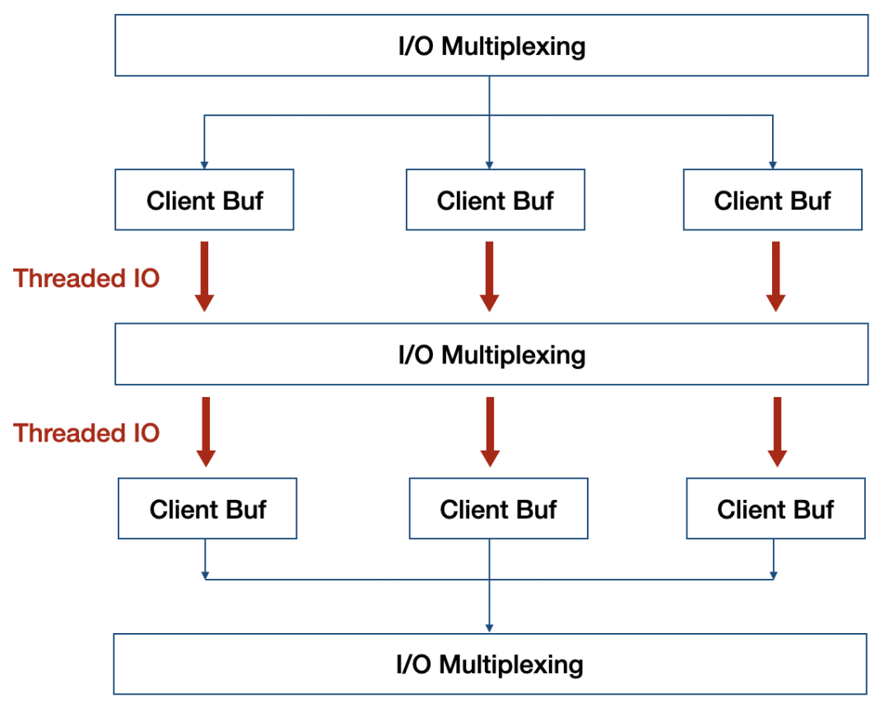
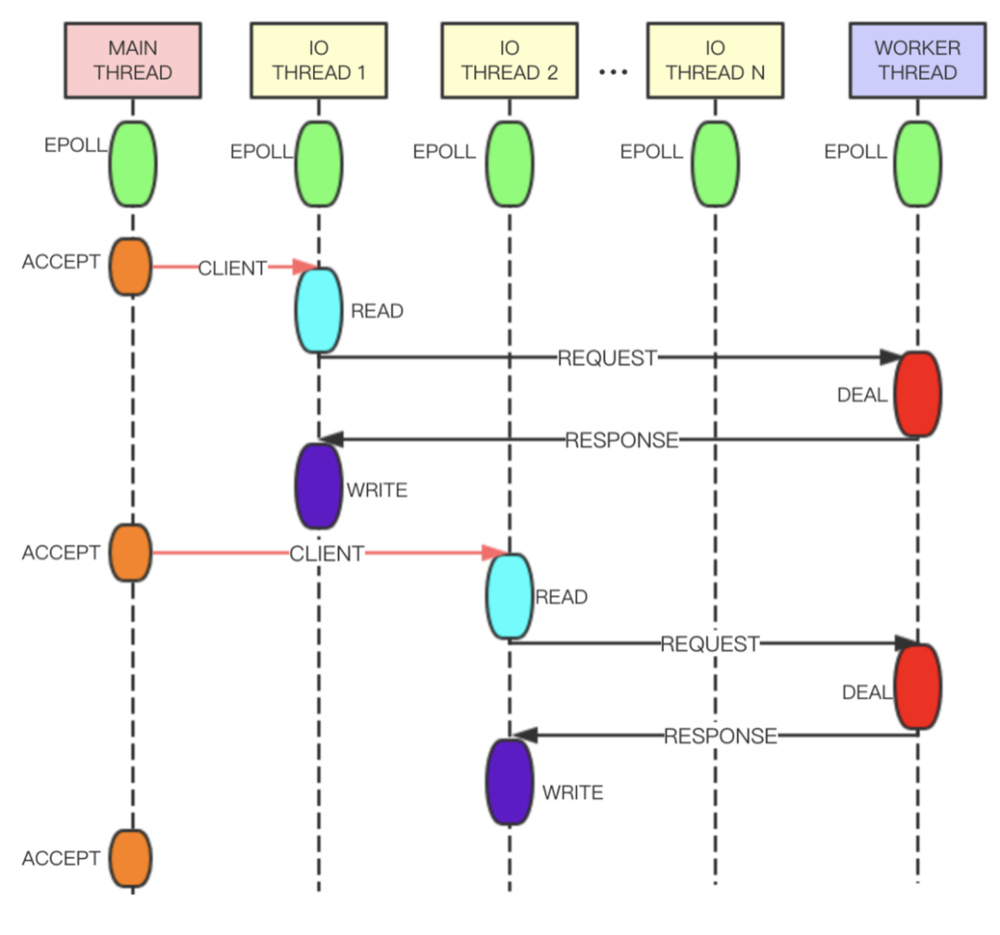

# Redis新版本开始引入多线程

> 本文转载至：[面试官：Redis新版本开始引入多线程，谈谈你的看法？ (qq.com)](https://mp.weixin.qq.com/s/KB0MQWq6ECGh32tOD3SJiQ)

Redis作为一个基于内存的缓存系统，一直以高性能著称，因没有上下文切换以及无锁操作，即使在单线程处理情况下，读速度仍可达到11万次/s，写速度达到8.1万次/s。但是，单线程的设计也给Redis带来一些问题：

- 只能使用CPU一个核；
- 如果删除的键过大（比如Set类型中有上百万个对象），会导致服务端阻塞好几秒；
- QPS难再提高。

针对上面问题，Redis在4.0版本以及6.0版本分别引入了`Lazy Free`以及`多线程IO`，逐步向多线程过渡，下面将会做详细介绍。

## 一. 单线程原理

都说Redis是单线程的，那么单线程是如何体现的？如何支持客户端并发请求的？为了搞清这些问题，首先来了解下Redis是如何工作的。

Redis服务器是一个事件驱动程序，服务器需要处理以下两类事件：

- `文件事件`：Redis服务器通过套接字与客户端（或者其他Redis服务器）进行连接，而文件事件就是服务器对套接字操作的抽象；服务器与客户端的通信会产生相应的文件事件，而服务器则通过监听并处理这些事件来完成一系列网络通信操作，比如连接`accept`，`read`，`write`，`close`等；
- `时间事件`：Redis服务器中的一些操作（比如serverCron函数）需要在给定的时间点执行，而时间事件就是服务器对这类定时操作的抽象，比如过期键清理，服务状态统计等。



如上图，Redis将文件事件和时间事件进行抽象，时间轮训器会监听I/O事件表，一旦有文件事件就绪，Redis就会优先处理文件事件，接着处理时间事件。在上述所有事件处理上，Redis都是以`单线程`形式处理，所以说Redis是单线程的。此外，如下图，Redis基于Reactor模式开发了自己的I/O事件处理器，也就是文件事件处理器，Redis在I/O事件处理上，采用了I/O多路复用技术，同时监听多个套接字，并为套接字关联不同的事件处理函数，通过一个线程实现了多客户端并发处理。



正因为这样的设计，在数据处理上避免了加锁操作，既使得实现上足够简洁，也保证了其高性能。当然，Redis单线程只是指其在事件处理上，实际上，Redis也并不是单线程的，比如生成RDB文件，就会fork一个子进程来实现，当然，这不是本文要讨论的内容。

## 二. Redis4.0 引入 Lazy Free 机制

如上所知，Redis在处理客户端命令时是以单线程形式运行，而且处理速度很快，期间不会响应其他客户端请求，但若客户端向Redis发送一条耗时较长的命令，比如删除一个含有上百万对象的Set键，或者执行flushdb，flushall操作，Redis服务器需要回收大量的内存空间，导致服务器卡住好几秒，对负载较高的缓存系统而言将会是个灾难。为了解决这个问题，在Redis 4.0版本引入了`Lazy Free`，将`慢操作`异步化，这也是在事件处理上向多线程迈进了一步。

如作者在其博客中所述，要解决`慢操作`，可以采用渐进式处理，即增加一个时间事件，比如在删除一个具有上百万个对象的Set键时，每次只删除大键中的一部分数据，最终实现大键的删除。但是，该方案可能会导致回收速度赶不上创建速度，最终导致内存耗尽。因此，Redis最终实现上是将大键的删除操作异步化，采用非阻塞删除（对应命令`UNLINK`），大键的空间回收交由单独线程实现，主线程只做关系解除，可以快速返回，继续处理其他事件，避免服务器长时间阻塞。

以删除（`DEL`命令）为例，看看Redis是如何实现的，下面就是删除函数的入口，其中，`lazyfree_lazy_user_del`是是否修改`DEL`命令的默认行为，一旦开启，执行`DEL`时将会以`UNLINK`形式执行。

```c
void delCommand(client *c) {
    delGenericCommand(c,server.lazyfree_lazy_user_del);
}

/* This command implements DEL and LAZYDEL. */
void delGenericCommand(client *c, int lazy) {
    int numdel = 0, j;

    for (j = 1; j < c->argc; j++) {
        expireIfNeeded(c->db,c->argv[j]);
        // 根据配置确定DEL在执行时是否以lazy形式执行
        int deleted  = lazy ? dbAsyncDelete(c->db,c->argv[j]) :
                              dbSyncDelete(c->db,c->argv[j]);
        if (deleted) {
            signalModifiedKey(c,c->db,c->argv[j]);
            notifyKeyspaceEvent(NOTIFY_GENERIC,
                "del",c->argv[j],c->db->id);
            server.dirty++;
            numdel++;
        }
    }
    addReplyLongLong(c,numdel);
}
```

同步删除很简单，只要把key和value删除，如果有内层引用，则进行递归删除，这里不做介绍。下面看下异步删除，Redis在回收对象时，会先计算回收收益，只有回收收益在超过一定值时，采用封装成Job加入到异步处理队列中，否则直接同步回收，这样效率更高。回收收益计算也很简单，比如`String`类型，回收收益值就是1，而`Set`类型，回收收益就是集合中元素个数。

```c
/* Delete a key, value, and associated expiration entry if any, from the DB.
 * If there are enough allocations to free the value object may be put into
 * a lazy free list instead of being freed synchronously. The lazy free list
 * will be reclaimed in a different bio.c thread. */
#define LAZYFREE_THRESHOLD 64
int dbAsyncDelete(redisDb *db, robj *key) {
    /* Deleting an entry from the expires dict will not free the sds of
     * the key, because it is shared with the main dictionary. */
    if (dictSize(db->expires) > 0) dictDelete(db->expires,key->ptr);

    /* If the value is composed of a few allocations, to free in a lazy way
     * is actually just slower... So under a certain limit we just free
     * the object synchronously. */
    dictEntry *de = dictUnlink(db->dict,key->ptr);
    if (de) {
        robj *val = dictGetVal(de);
        // 计算value的回收收益
        size_t free_effort = lazyfreeGetFreeEffort(val);

        /* If releasing the object is too much work, do it in the background
         * by adding the object to the lazy free list.
         * Note that if the object is shared, to reclaim it now it is not
         * possible. This rarely happens, however sometimes the implementation
         * of parts of the Redis core may call incrRefCount() to protect
         * objects, and then call dbDelete(). In this case we'll fall
         * through and reach the dictFreeUnlinkedEntry() call, that will be
         * equivalent to just calling decrRefCount(). */
        // 只有回收收益超过一定值，才会执行异步删除，否则还是会退化到同步删除
        if (free_effort > LAZYFREE_THRESHOLD && val->refcount == 1) {
            atomicIncr(lazyfree_objects,1);
            bioCreateBackgroundJob(BIO_LAZY_FREE,val,NULL,NULL);
            dictSetVal(db->dict,de,NULL);
        }
    }

    /* Release the key-val pair, or just the key if we set the val
     * field to NULL in order to lazy free it later. */
    if (de) {
        dictFreeUnlinkedEntry(db->dict,de);
        if (server.cluster_enabled) slotToKeyDel(key->ptr);
        return 1;
    } else {
        return 0;
    }
}
```

通过引入`a threaded lazy free`，Redis实现了对于`Slow Operation`的`Lazy`操作，避免了在大键删除，`FLUSHALL`，`FLUSHDB`时导致服务器阻塞。当然，在实现该功能时，不仅引入了`lazy free`线程，也对Redis聚合类型在存储结构上进行改进。因为Redis内部使用了很多共享对象，比如客户端输出缓存。当然，Redis并未使用加锁来避免线程冲突，锁竞争会导致性能下降，而是去掉了共享对象，直接采用数据拷贝，如下，在3.x和6.x中`ZSet`节点value的不同实现。

```c
// 3.2.5版本ZSet节点实现，value定义robj *obj
/* ZSETs use a specialized version of Skiplists */
typedef struct zskiplistNode {
    robj *obj;
    double score;
    struct zskiplistNode *backward;
    struct zskiplistLevel {
        struct zskiplistNode *forward;
        unsigned int span;
    } level[];
} zskiplistNode;

// 6.0.10版本ZSet节点实现，value定义为sds ele
/* ZSETs use a specialized version of Skiplists */
typedef struct zskiplistNode {
    sds ele;
    double score;
    struct zskiplistNode *backward;
    struct zskiplistLevel {
        struct zskiplistNode *forward;
        unsigned long span;
    } level[];
} zskiplistNode;
```

去掉共享对象，不但实现了`lazy free`功能，也为Redis向多线程跨进带来了可能，正如作者所述：

> Now that values of aggregated data types are fully unshared, and client output buffers don’t contain shared objects as well, there is a lot to exploit. For example it is finally possible to implement threaded I/O in Redis, so that different clients are served by different threads. This means that we’ll have a global lock only when accessing the database, but the clients read/write syscalls and even the parsing of the command the client is sending, can happen in different threads.

## 三. 多线程I/O及其局限性

Redis在4.0版本引入了`Lazy Free`，自此Redis有了一个`Lazy Free`线程专门用于大键的回收，同时，也去掉了聚合类型的共享对象，这为多线程带来可能，Redis也不负众望，在6.0版本实现了`多线程I/O`。

### 3.1 实现原理

正如官方以前的回复，Redis的性能瓶颈并不在CPU上，而是在内存和网络上。因此6.0发布的多线程并未将事件处理改成多线程，而是在I/O上，此外，如果把事件处理改成多线程，不但会导致锁竞争，而且会有频繁的上下文切换，即使用分段锁来减少竞争，对Redis内核也会有较大改动，性能也不一定有明显提升。



以读事件处理为例，看下`事件处理线程`任务分配流程：

```c
int handleClientsWithPendingReadsUsingThreads(void) {
    ...

    /* Distribute the clients across N different lists. */
    listIter li;
    listNode *ln;
    listRewind(server.clients_pending_read,&li);
    int item_id = 0;
    // 将等待处理的客户端分配给I/O线程
    while((ln = listNext(&li))) {
        client *c = listNodeValue(ln);
        int target_id = item_id % server.io_threads_num;
        listAddNodeTail(io_threads_list[target_id],c);
        item_id++;
    }

    ...

    /* Wait for all the other threads to end their work. */
    // 轮训等待所有I/O线程处理完
    while(1) {
        unsigned long pending = 0;
        for (int j = 1; j < server.io_threads_num; j++)
            pending += io_threads_pending[j];
        if (pending == 0) break;
    }

    ...

    return processed;
}
```

`I/O线程`处理流程：

```c
void *IOThreadMain(void *myid) {
    ...

    while(1) {
        ...

        // I/O线程执行读写操作
        while((ln = listNext(&li))) {
            client *c = listNodeValue(ln);
            // io_threads_op判断是读还是写事件
            if (io_threads_op == IO_THREADS_OP_WRITE) {
                writeToClient(c,0);
            } else if (io_threads_op == IO_THREADS_OP_READ) {
                readQueryFromClient(c->conn);
            } else {
                serverPanic("io_threads_op value is unknown");
            }
        }
        listEmpty(io_threads_list[id]);
        io_threads_pending[id] = 0;

        if (tio_debug) printf("[%ld] Done\n", id);
    }
}
```

从上面实现上看，6.0版本的多线程并非彻底的多线程，`I/O线程`只能同时执行读或者同时执行写操作，期间`事件处理线程`一直处于等待状态，并非流水线模型，有很多轮训等待开销。

### 3.2 Tair多线程实现原理

相较于6.0版本的多线程，Tair的多线程实现更加优雅。如下图，Tair的`Main Thread`负责客户端连接建立等，`IO Thread`负责请求读取、响应发送、命令解析等，`Worker Thread`线程专门用于事件处理。`IO Thread`读取用户的请求并进行解析，之后将解析结果以命令的形式放在队列中发送给`Worker Thread`处理。`Worker Thread`将命令处理完成后生成响应，通过另一条队列发送给`IO Thread`。为了提高线程的并行度，`IO Thread`和`Worker Thread`之间采用**无锁队列** 和**管道** 进行数据交换，整体性能会更好。



## 四. 小结

Redis 4.0引入`Lazy Free`线程，解决了诸如大键删除导致服务器阻塞问题，在6.0版本引入了`I/O Thread`线程，正式实现了多线程，但相较于Tair，并不太优雅，而且性能提升上并不多，压测看，多线程版本性能是单线程版本的2倍，Tair多线程版本则是单线程版本的3倍。在作者看来，Redis多线程无非两种思路，`I/O threading`和`Slow commands threading`，正如作者在其博客中所说：

> I/O threading is not going to happen in Redis AFAIK, because after much consideration I think it’s a lot of complexity without a good reason. Many Redis setups are network or memory bound actually. Additionally I really believe in a share-nothing setup, so the way I want to scale Redis is by improving the support for multiple Redis instances to be executed in the same host, especially via Redis Cluster.
>
> What instead I really want a lot is slow operations threading, and with the Redis modules system we already are in the right direction. However in the future (not sure if in Redis 6 or 7) we’ll get key-level locking in the module system so that threads can completely acquire control of a key to process slow operations. Now modules can implement commands and can create a reply for the client in a completely separated way, but still to access the shared data set a global lock is needed: this will go away.

Redis作者更倾向于采用集群方式来解决`I/O threading`，尤其是在6.0版本发布的原生Redis Cluster Proxy背景下，使得集群更加易用。此外，作者更倾向于`slow operations threading`（比如4.0版本发布的`Lazy Free`）来解决多线程问题。后续版本，是否会将`IO Thread`实现的更加完善，采用Module实现对慢操作的优化，着实值得期待。