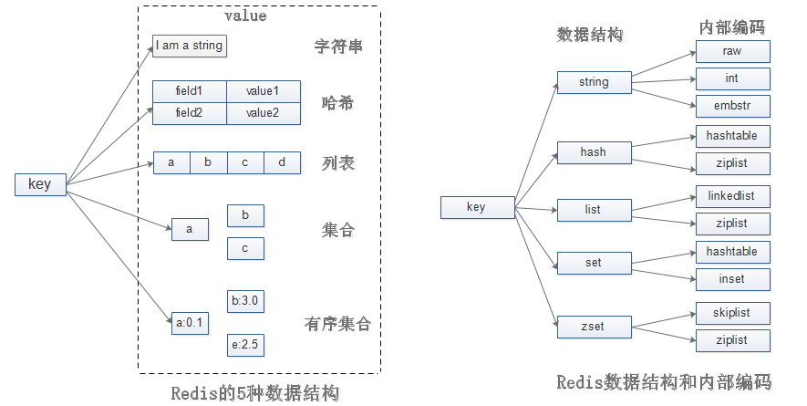
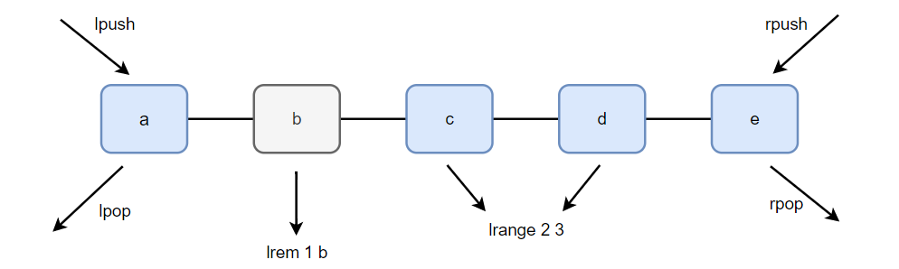

# API的理解和使用

## 一. 全局命令

### 1.1 查看所有键

```shell
keys *
```

`keys`命令会遍历所有的键，所以它的时间复杂度是O(n)，线上环境禁止使用该命令。

### 1.2 键总数

```shell
dbsize
```

dbsize命令会返回当前数据库中键的总数。该命令不会遍历所有键，而是直接获取Redis内置的键总数遍历，所以dbsize的时间复杂度是O(1)。

### 1.3 检查键是否存在

```shell
exists key
```

如果键存在则返回1，如果不存在则返回0。

### 1.4 删除键

```shell
#删除单个键
del key
#删除多个键
del key1 key2 ...
```

del是一个通用命令，不管是什么数据类型，del都能将其删除。

返回结果为成功删除的键的个数，如果删除一个不存在的键，就会返回0。

### 1.5 键过期

#### 1.5.1 设置键过期时间

```shell
expire key seconds
```

例如为hello键设置了10s的过期时间

```shell
set hello world
expire hello 10
```

#### 1.5.2 查看键的过期时间

```shell
ttl key
```

ttl命令会返回键的剩余过期时间，它会有三种返回值：

- 大于等于0的整数：键剩余的过期时间
- -1：键没设置过期时间
- -2：键不存在

### 1.6 键的数据结构

```shell
type key
```

type命令会返回key对应value的数据结构类型，如果key不存在则返回`none`。

type命令的返回值有：

- string（字符串）
- hash（哈希）
- list（列表）
- set（集合）
- zset（有序集合）

## 二. 数据结构和内部编码

type命令可以查看Key的数据结构，但是这些都是Redis对外的数据结构，实际上每种数据结构都有自己底层的内部编码实现，而且是多种实现，这样Redis会在合适的场景选择合适的内部编码。



可以看到每种数据结构都有两种以上的内部实现，例如list数据结构包含了linkedlist和ziplist两种内部编码。同时有些内部编码，例如ziplist，可以作为多种外部数据结构的内部实现，可以通过下列命令，查看一个key的底层编码是什么：

```shell
object encoding key
```

Redis这样设计有两个好处：

第一，可以改进内部编码，而对外的数据结构和命令没有影响，这样一旦开发出更优秀的内部编码，无修改动外部数据结构和命令。例如Redis 3.2提供了quicklist，结合了ziplist和linkedlist两者的优势，为列表提供了更为优秀的内部编码实现，而对外部用户来说基本感知不到。

第二，多种内部编码实现可以在不同场景下发挥各自的优势，例如ziplist比较节省内存，但是在列表元素比较多的情况下，性能会有所下降，这时候Redis会根据配置选项将列表类型的内部实现由ziplist转换为linkedlist。

## 三. 字符串

### 3.1 设置值

```shell
set key value [ex seconds] [px milliseconds] [nx|xx]
```

选项：

- ex seconds：为键设置秒级过期时间
- px milliseconds：为键设置毫秒级过期时间
- nx：键必须不存在才能设置成功
- xx：键必须存在才能设置成功

nx插入模式可以作为分布式锁的一种实现方案，Redis还提供了setex和setnx两个命令，它们的作用与ex和nx选项是一样的。

```shell
127.0.0.1:7002> exists nxkey
(integer) 0 #nxkey不存在
127.0.0.1:7002> setnx nxkey nxvalue
(integer) 1 #设置成功
127.0.0.1:7002> exists nxkey
(integer) 1 #nxkey存在
127.0.0.1:7002> setnx nxkey nxvalue
(integer) 0 #设置不成功
```

### 3.2 获取值

```shell
get key
```

### 3.3 批量设置值

```shell
mset key value [key value ...]
```

### 3.4 批量获取值

```shell
mget key [key ...]
```

### 3.5 计数

```shell
incr key	
```

incr命令用于对值做自增操作，返回结果分为三种情况：

- 值不是整数，返回错误
- 值是整数，返回自增后的结果
- 键不存在，按照值为0进行自增，返回结果为1

除了incr命令，Redis还提供了decr（自减）、incrby（自增指定数字）、decrby（自减指定数字）、incrbyfloat（自增浮点数）命令：

```shell
decr key
incrby key increment
decrby key decrement
incrbyfloat key increment
```

很多存储系统和编程语言内部使用CAS机制实现计数器功能，会有一定的CPU开销，但在Redis中完全不存在这个问题，因为Redis是单线程架构，任何命令到了Redis服务端都要顺序执行。

### 3.6 追加值

```shell
append key value
```

append可以向字符串尾部追加值，例如：

```shell
127.0.0.1:7002> get key
"test"
127.0.0.1:7002> append key 123
(integer) 7
127.0.0.1:7002> get key
"test123"
```

### 3.7 字符串长度

```shell
strlen key
```

注意该命令返回的是字节数，如果是中文，则每个字符占3个字节。

### 3.8 设置并返回原值

```shell
getset key value
```

getset命令和set一样会设置值，但是不同的是，它同时会返回键原来的值。

```shell
127.0.0.1:7002> getset hello world
(nil)
127.0.0.1:7002> getset hello redis
"world"
```

### 3.9 设置指定位置的字符串

```shell
setrange key offeset value
```

下面操作将pest编程best：

```shell
127.0.0.1:7002> set redis pest
OK
127.0.0.1:7002> setrange redis 0 b
(integer) 4
127.0.0.1:7002> get redis
"best"
127.0.0.1:7002> setrange redis 0 qwe
(integer) 4
127.0.0.1:7002> get redis
"qwet"
```

### 3.10 获取部分字符串

```shell
getrange key start end
```

start和end分别是开始和结束的偏移量，偏移量从0开始计算

### 3.11 内部编码

字符串类型的内部编码有3种：

- int：8个字节的长整型
- embstr：小于定于39个字节的字符串
- raw：大于39个字节的字符串

Redis会根据当前值的类型和长度决定使用哪种内部编码实现。

```shell
127.0.0.1:7002> set key 123456
OK
127.0.0.1:7002> object encoding key
"int"
127.0.0.1:7002> set key a12345678912345678901234567890123456789
OK
127.0.0.1:7002> object encoding key
"embstr" 
```

## 四. 哈希

### 4.1 设置值

```shell
hset key field value
```

### 4.2 获取值

```shell
hget key field
```

如果field不存在，返回nil：

### 4.3 删除field

```shell
hdel key field [field ...]
```

hdel会删除一个或多个field，返回结果为成功删除field的个数

### 4.4 计算field的个数

```shell
hlen key
```

### 4.5 批量设置或获取field-value

```shell
hmset key field value [field value ...]
hmget key field [field ...]
```

### 4.6 判断field是否存在

```shell
hexists key field
```

### 4.7 获取所有field

```shell
hkeys key
```

### 4.8 获取所有value

```shell
hvals key
```

### 4.9 获取所有field-value

```shell
hgetall key
```

例如：

```shell
127.0.0.1:7002> hset user:1 name tianjindong
(integer) 1
127.0.0.1:7002> hgetall user:1
1) "name"
2) "tianjindong"
```

在使用hgetall时，如果hash元素个数比较多，会存在阻塞Redis的可能。如果开发人员只需要获取部分field，可以使用hmget，如果一定要获取全部field-value，可以使用hscan命令，该命令会渐进式遍历哈希类型。

### 4.10 计算value的字符串长度（需要Redis 3.2以上）

```shell
hstrlen key field
```

### 4.11 自增

```shell
hincrby key field increment
hincrbyfloat key field
```

例如：

```shell
127.0.0.1:7002> hincrby user:1 age 2
(integer) 2
127.0.0.1:7002> hget user:1 name
"tianjindong"
127.0.0.1:7002> hget user:1 age
"2"
127.0.0.1:7002> hget user:1 age
"2"
127.0.0.1:7002> hincrbyfloat user:1 age 1.5
"3.5"
127.0.0.1:7002> hget user:1 age
"3.5"
```

### 4.12 内部编码

哈希类型的内部编码有两种：

- ziplist（压缩列表）：当哈希类型元素个数小于hash-max-ziplist-entries配置（默认512个），同时所有值都小于hash-max-ziplist-value配置（默认是64）字节时，Redis会使用ziplist作为hash内部实现，ziplist使用了更加紧凑的结构实现多个元素的连续存储，所以在节省内存方面比hashtable更加优秀。
- hashtable（哈希表）：当哈希类型无法满足ziplist的条件时，Redis会使用hashtable作为哈希的内部实现，因为此时ziplist的读写效率会下降，而hashtable的读写时间复杂度为O(1)

## 五. 列表

列表（list）类型用来存储多个有序字符串，列表中的每个字符串成为元素（element），一个列表最多可以存储2^32-1个元素。在Redis中，可以对列表两端插入（push）和弹出（pop），还可以获得指定范围的元素列表、获取指定索引下标的元素等。




### 5.1 添加操作

```shell
rpush key value [value ...] #从右边插入元素
lpush key value [value ..] #从左边插入元素
linsert key before|after pivot value #linsert命令会从列表中找到等于pivot的元素，在其前(before)或者后(after)插入一个新元素value 
```

例如下面这个示例：

```shell
127.0.0.1:7002> rpush list a b 
(integer) 2
127.0.0.1:7002> lrange list 0 -1
1) "a"
2) "b"
127.0.0.1:7002> lpush list c d
(integer) 4
127.0.0.1:7002> lrange list 0 -1
1) "d"
2) "c"
3) "a"
4) "b"
127.0.0.1:7002> linsert list before b c
(integer) 6
127.0.0.1:7002> lrange list 0 -1
1) "d"
2) "c"
3) "a"
4) "c"
5) "b"
127.0.0.1:7002> linsert list before c 1
(integer) 7
127.0.0.1:7002> lrange list 0 -1
1) "d"
2) "1"
3) "c"
4) "a"
5) "c"
6) "b"
```

### 5.2 查找操作

**获取指定范围内的元素列表**

```shell
lrange key start end 
```

lrange操作会获取列表指定范围所有元素。索引下标有两个特点：

- 索引下标从左到右分别是0到N-1，但是从右到左分别是-1到-N。
- lrange中的end选项包含自身，这和很多编程语言不包含end不太相同。

**获取列表指定索引下标的元素**

```shell
lindex key index
```

**获取列表长度**

```shell
llen key
```

### 5.3 删除操作

**弹出列表左端元素**

```shell
lpop key
```

**弹出列表右端元素**

```shell
rpop key
```

**删除指定元素**

```shell
lrem key count value 
```

lrem命令从列表中找到等于value的元素进行删除，根据count的不同分为三种情况：

- count>0，从左到右，删除最多count个元素。
- count<0，从右到左，删除最多个count绝对值个元素。
- count=0，删除所有元素

**按照索引范围修剪列表**

```shell
ltrim key start end
```

ltrim命令将只保留start-end范围内的元素，其它元素全部删除。

### 5.4 修改操作

```shell
lset key index value
```

修改指定下标的元素

### 5.5 阻塞操作

```shell
blpop key [key ...] timeout
brpop key [key ...] timeout
```

blpop和brpop是lpop和rpop的阻塞版本，timeout用于指定阻塞时间（单位：秒）。

- 如果指定了多个键，那么brpop会从左至右遍历键，一旦有一个键能弹出元素，客户端立即返回
- 如果客户端对同一个键执行brpop并阻塞了，那么先执行brpop命令的客户端可以优先获取到其它客户端新放入列表中的值

### 5.6 内部编码

ziplist（压缩列表）：当列表元素小于list-max-ziplist-entries配置（默认512个），同时列表中每个元素的值都小于list-max-ziplist-value配置时（默认64字节），Redis会选用ziplist来作为列表的内部实现来减少内存的使用。

linkedlist：当列表类型无法满足ziplist的条件时，Redis会使用linkedlist作为列表的内部实现。

> Redis 3.2版本提供了quicklist内部编码，简单地说它是以一个ziplist为节点linkedlist，它结合了ziplist和linkedlist两者的优势，为列表类型提供了一种更为优秀的内部编码实现。

## 六. 集合

集合与列表类型不一样的是，集合中不允许有重复元素，并且集合中的元素是无序的，不能通过索引访问元素。一个集合最多可以存储2^32-1个元素。Redis除了支持集合内的增删查改，同时还支持多个集合取交集、并集、差集，合理的使用好集合能在开发中解决很多问题。

### 6.1 集合内操作

**添加元素**

```shell
sadd key element [element ...]
```

返回为添加成功的元素个数

**删除元素**

```shell
srem key element [element ...]
```

**计算元素个数**

```shell
scard key
```

scard时间复杂度为O(1)，它不会遍历集合元素，而是使用Redis内部的变量。

**判断元素是否在集合中**

```shell
sismember key element
```

如果给定元素在集合中，返回1，反之返回0。

**随机从集合中返回指定个数元素**

```shell
srandmember key [count]
```

count是可选参数，如果不写则默认为1

**从集合中随机弹出元素**

```shell
spop key
```

需要注意的是，Redis从3.2版本开始，spop也支持count参数。srandmember和spop都是随机从集合中选取元素，两者不同的是spop命令执行后，元素会从集合中删除，而srandmember不会。

**获取所有元素**

```shell
smembers key
```

### 6.2 集合间的操作

**求多个集合的交集**

```shell
sinter key [key ...]
```

**求多个集合的并集**

```shell
sunion key [key ...]
```

**求多个集合的差集**

```shell
sdiff key [key ...]
```

示例：

```shell
127.0.0.1:7002> smembers set1
1) "c"
2) "b"
3) "a"
127.0.0.1:7002> smembers set2
1) "d"
2) "c"
3) "b"

#交集
127.0.0.1:7002> sinter set1 set2
1) "c"
2) "b"
#并集
127.0.0.1:7002> sunion set1 set2
1) "c"
2) "b"
3) "a"
4) "d"
#差集
127.0.0.1:7002> sdiff set1 set2
1) "a"
127.0.0.1:7002> sdiff set2 set1
1) "d"
```

**将交集、并集、差集结果保存**

```shell
sinterstore destination key [key ...]
sunionstore destination key [key ...]
sdiffstore destination key [key ...]
```

集合间运算在元素较多的情况下会比较耗时，所以Redis提供了上面三个命令（原名令+store）将集合间交集、并集、差集的结果保存在destination key中。

例如，将set1和set2取交集结果存入set_1_2中：

```shell
127.0.0.1:7002> sinterstore set_1_2 set1 set2
(integer) 2
127.0.0.1:7002> smembers set_1_2
1) "b"
2) "c"
```

### 6.3 内部编码

集合类型的内部编码有两种：

- intset（整数集合）：当集合中的元素都是整数且元素个数小于set-max-intset-entries配置（默认是512个）时，Redis会选用intset来作为集合的内部实现，从而减少内存的使用。
- hashtable（哈希表）：当集合中的元素无法满足intset的条件时，Redis会使用hashtable作为集合的内部实现。

## 七. 有序集合

有序集合保留了集合不能有重复元素的特性，但不同的是，有序集合中的元素可以排序。但是它和列表使用索引下标作为排序依据不同的是，它给每个元素设置一个分数（score）作为排序的依据。

### 7.1 集合内操作

**添加成员**

```shell
zadd key score member [score member ...]
```

下面操作向有序集合user:ranking添加用户tom和他的分数251：

```shell
127.0.0.1:7002> zadd user:ranking 251 tom
(integer) 1
```

返回结果代表成功添加的个数。

> Redis 3.2为zadd命令添加了nx、xx、ch、incr四个选项：
>
> - nx：member必须不存在，才可以设置成功。
> - xx：member必须存在，才可以设置成功
> - ch：返回此次操作后，有序集合元素和分数发生变化的个数
> - incr：对score做增加，相当于后面介绍的zincrby

有序集合相比集合提供了排序字段，但是也产生了代价，zadd的时间复杂度为O(log(n))，sadd的时间复杂度为O(1)。

**计算成员个数**

```shell
zcard key
```

**获取某个成员的分数**

```shell
zscore key member
```

如果member不存在则返回nil。

**计算成员排名**

```shell
zrank key member
zrevrank key member
```

zrank是从分数从低到高返回排名，zrevrank反之，第一名返回0，依次类推。

**删除成员**

```shell
zrem key member [member ...]
```

**增加成员分数**

```shell
zincrby key increment member
```

给tom加9分变成160分：

```shell
127.0.0.1:7002> zscore user:ranking tom
"251"
127.0.0.1:7002> zincrby user:ranking 9 tom
"260"
```

**返回指定排名范围的成员**

```shell
zrange key start end [withscores]
zrevrange key start end [withscores]
```

有序集合是按照分值排名的，zrange是从低到高返回，zrevrange反之。withscores参数表名返回时带上成员的分数。

**返回指定分数范围的成员**

```shell
zrangebyscore key min max [withscores] [limit offset count]
zrevrangebyscore key min max [withscores] [limit offset count]
```

其中zrangebyscore按照分数从低到高返回，zrevrangebyscore反之。withscores参数会同时返回每个成员的分数。limit offset count参数可以限制输出的起始位和个数（类似于MySQL中的limit）。

同时min和max还支持开区间（小括号）和闭区间（中括号），-inf和+inf分别代表无限小和无限大：

```shell
127.0.0.1:7002> zrangebyscore user:ranking 260 +inf limit 0 1
1) "tom"
127.0.0.1:7002> zrangebyscore user:ranking (260 +inf limit 0 1
(empty array)
```

**返回指定分数范围的成员个数**

```shell
zcount key min max
```

**删除指定排名内的升序元素**

```shell
zremrangebyrank key start end
```

**删除指定分数范围的成员**

```shell
zremrangebyscore key min max
```

下面是将分数250分以上的成员全部删除：

```shell
zremrangebyscore user:ranking (250 +inf
```

### 7.2 集合间的操作

**交集**

```shell
zinterstore destination numkeys key [key ...] [weights weight [weight ...]] [aggregate sum|min|max]
```

- destination：交集计算结果保存至这个键
- numkeys：需要做交集计算键的个数
- key [key …]：需要做交集计算的键
- weights weight [weight …]：每个键的权重，在做交集计算时，每个键中的每个member会将自己的分数乘以这个权重，每个键的权重默认是1。
- aggregate sum|min|max：计算成员交集后，分值可以按照sum（和）、min（最小值）、max（最大值）做汇总，默认值是sum。

```shell
# 测试数据
127.0.0.1:7002> zadd zset:1 1 a 2 b 3 c
(integer) 3
127.0.0.1:7002> zadd zset:2 1 b 4 c 5 e
(integer) 3
127.0.0.1:7002> zinterstore zset_inter_1_2 2 zset:1 zset:2 weights 1 2
(integer) 2
127.0.0.1:7002> zrange zset_inter_1_2 0 -1 WITHSCORES
1) "b"
2) "4"
3) "c"
4) "11"
```

**并集**

```shell
zunionstore destination numkeys key [key ...] [weights weight [weight ...]] [aggregate sum|min|max]
```

zunionstore和zinterstore参数保持一致

### 7.3 内部编码

有序集合类型的内部编码有两种：

- ziplist（压缩列表）：当有序集合元素个数小于zset-max-ziplist-entries配置（默认是128个），同时每个元素的值都小于zset-max-ziplist-value配置（默认64字节）时，Redis会使用ziplist来作为有序集合的内部实现，ziplist可以有效减少内存的使用。
- skiplist（跳跃表）：当ziplist条件不满足时，有序集合会使用skiplist作为内部实现，因为此时ziplist的读写效率会下降。

## 八. 键管理

### 8.1 单个键管理

**键重命名**

```shell
rename key newkey
renamenx key newkey
```

如果在rename之前，键”newkey“已经存在，那么它的值也将被覆盖。为了防止被强行rename，Redis提供了renamenx命令，确保只有在newkey不存在时才会被重命名。

由于重命名期间会执行del命令删除旧的键，如果键对应的值比较大，会存在阻塞Redis的可能性，这点不要忽视。

**随机返回一个键**

```shell
randomkey
```

**键过期**

```shell
```

