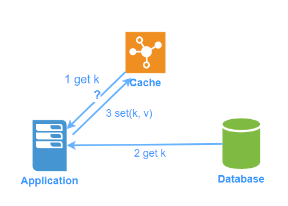
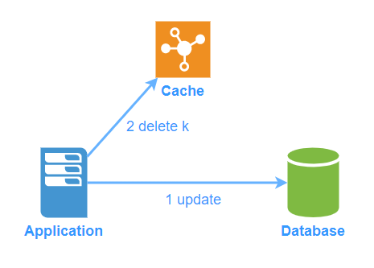
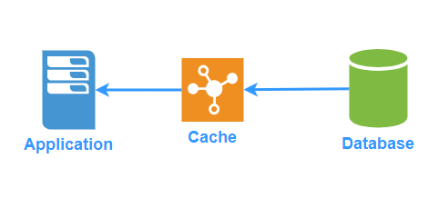
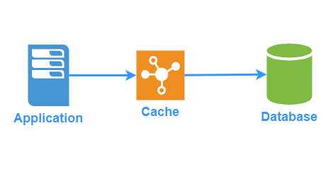
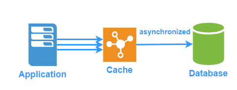
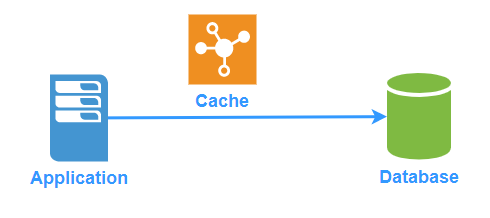

# 缓存模式以及缓存的数据一致性

缓存由于其高性能，支持高并发的特性，在高并发的项目中不可或缺。被大家广泛使用的有Redis，Memcached等。本文主要探讨几种常见的缓存的读写模式，以及如何来保证缓存和数据库的数据一致性。

## 一. Cache-Aside

Cache-Aside可能是项目中最常见的一种模式。它是一种控制逻辑都实现在应用程序中的模式。缓存不和数据库直接进行交互，而是由应用程序来同时和缓存以及数据库打交道。Cache-Aside的名字正体现了这个模式，Cache在应用的一旁(aside)。

读数据时

1. 程序需要判断缓存中是否已经存在数据。
2. 当缓存中已经存在数据(也就是缓存命中，cache hit)，则直接从缓存中返回数据
3. 当缓存中不存在数据(也就是缓存未命中，cache miss)，则先从数据库里读取数据，并且存入缓存，然后返回数据

写数据时，有两种常见的策略：

第一种策略：

1. 更新数据库
2. 更新缓存

但这种策略有线程安全的问题，可能出现缓存和数据库不一致。

|       线程A       |       线程B       |
| :---------------: | :---------------: |
| A更新数据库并提交 |                   |
|                   | B更新数据库并提交 |
|                   |     B更新缓存     |
|     A更新缓存     |                   |

第二种策略：

1. 更新数据库
2. 删除缓存中对应的数据

这种策略也可能发生缓存不一致的情况：

| 线程A                     | 线程B       |
| ------------------------- | ----------- |
| A读缓存未命中，继续读取DB |             |
|                           | B更新数据库 |
|                           | B删除缓存   |
| A将数据写入缓存           |             |

又或者

| 线程A     | 线程B                     | 线程C       |
| --------- | ------------------------- | ----------- |
| A更新DB   |                           |             |
| A删除缓存 |                           |             |
|           | B读缓存未命中，继续读取DB |             |
|           |                           | C更新数据库 |
|           |                           | C删除缓存   |
|           | B将数据写入缓存           |             |

写后删策略相对于写后更新策略数据一致性会更好，因为触发条件更为苛刻，所以一般情况下Cache-Aside模式的缓存Key需要设置TTL过期时间。

## 二. Read-Through/Write-Through

这种模式中，应用程序将缓存作为主要的数据源，而数据库对于应用程序是透明的，更新数据库和从数据库的读取的任务都交给缓存来代理了，所以对于应用程序来说，简单很多。

### 2.1 Read-Through

由缓存配置一个读模块，它知道如何将数据库中的数据写入缓存。在数据被请求的时候，如果未命中，则将数据从数据库载入缓存。

Guava的LoadingCache就是该模式一种实现。

### 2.2 Write-Through

缓存配置一个写模块，它知道如何将数据写入数据库。当应用要写入数据时，缓存会先存储数据，并调用写模块将数据写入数据库。

### 2.3 应用场景

Read Through/Write Through适用于写入之后经常被读取的应用。

#### 优点

- 缓存不存在脏数据
- 相比较Cache-Aside懒加载模式，读取速度更高，因为较少因为缓存未命中而从数据库中查找(存在的key不会删除)
- 应用程序的逻辑相对简单

#### 缺点

- 对于总是写入却很少被读取的应用，那么Write-Through会非常浪费性能，因为数据可能更改了很多次，却没有被读取，白白的每次都写入缓存造成写入延迟。

除了Write-Through以外，我们还有另外的两种写模式可以和Read-Through一起来配合使用，分别是Write-Back和Write-Around。

## 三. Write-Behind

和Write-Through写入的时机不同，Write-Behind将缓存作为可靠的数据源，每次都只写入缓存，而写入数据库则采用异步的方式，比如当数据要被移除出缓存的时候再存储到数据库或者一段时间之后批量更新数据库。

#### 应用场景

读写效率都非常好，写的时候因为异步存储到数据库，提升了写的效率，适用于读写密集的应用。

#### 优点

- 写入和读取数据都非常的快，因为都是从缓存中直接读取和写入。
- 对于数据库不可用的情况有一定的容忍度，即使数据库暂时不可用，系统也整体可用，当数据库之后恢复的时候，再将数据写入数据库。

#### 缺点

- 有数据丢失的风险，如果缓存挂掉而数据没有及时写到数据库中，那么缓存中的有些数据将永久的丢失了

## 四. Write-Around

和Write-Through不同，更新的时候只写入数据库，不写入缓存，结合Read-Through或者Cache-Aside使用，只在缓存未命中的情况下写缓存。

#### 应用场景

适合于只写入一次而很少被读取的应用。

#### 优点

- 相比较Write-Through写入的时候的效率较高，如果数据写入后很少被读取，缓存也不会被没用到的数据占满。

#### 缺点

- 如果数据会写入多次，那么可能存在缓存和数据库不一致