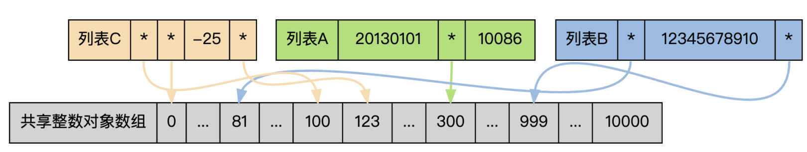
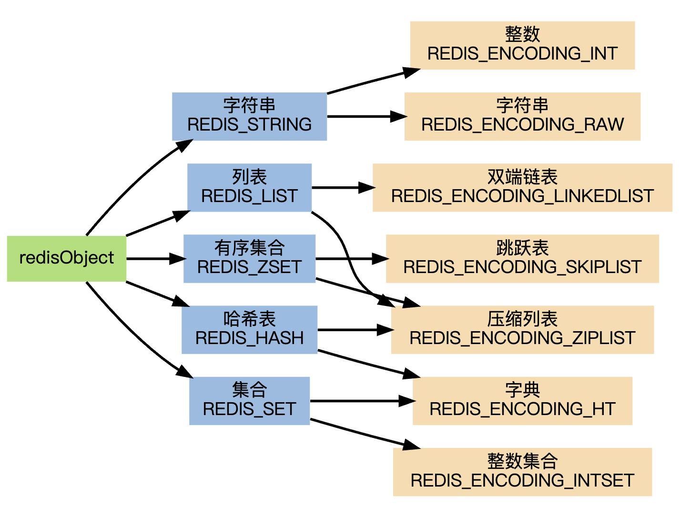
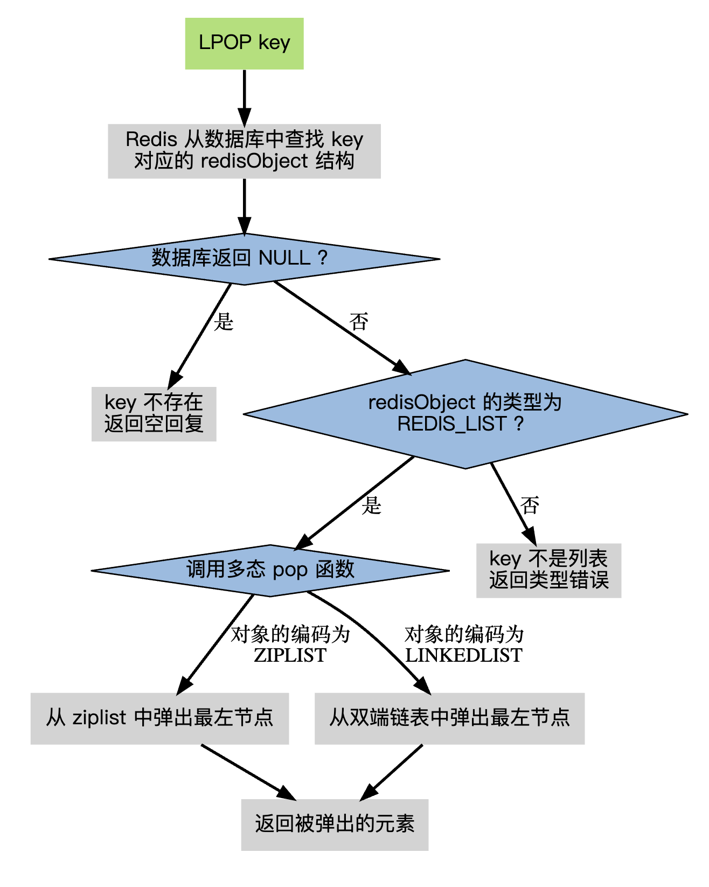

# Redis底层数据结构

## 一. RedisDB结构

Redis中存在“数据库”的概念，该结构由redis.h中的redisDb定义。当redis服务器初始化时，会预先分配16个数据库所有数据库保存到结构 redisServer的一个成员 redisServer.db 数组中

redisClient中存在一个名叫db的指针指向当前使用的数据库

RedisDB结构体源码：

```c
/* Redis数据库结构体 */
typedef struct redisDb {
    // 数据库ID标识
    int id;
    // 数据库内所有键的平均TTL（生存时间）
    long long avg_ttl;  
    // 数据库键空间，存放着所有的键值对（键为key，值为相应的类型对象）
    dict *dict;                 
    // 键的过期时间
    dict *expires;              
    // 处于阻塞状态的键和相应的client（主要用于List类型的阻塞操作）
    dict *blocking_keys;       
    // 准备好数据可以解除阻塞状态的键和相应的client
    dict *ready_keys;           
    // 被watch命令监控的key和相应client
    dict *watched_keys;                
} redisDb;
```

- id：数据库序号，为0-15（默认Redis有16个数据库）
- dict：存储数据库所有的key-value，value是具体的Redis-Object
- expires：存储key的过期时间，后面要详细讲解

## 二. RedisObject

redisObject是Redis类型系统的核心，数据库中的每个键、值，以及Redis本身处理的参数，都表示为这种数据类型。

```c
/*
 * Redis 对象
 */
typedef struct redisObject {
    // 类型
    unsigned type:4;
    // 对齐位
    unsigned notused:2;
    // 编码方式
    unsigned encoding:4;
    // LRU 时间（相对于 server.lruclock）
    unsigned lru:22;
    // 引用计数
    int refcount;
    // 指向对象的值
    void *ptr;
} robj;
```

### 2.1 type

type 字段表示对象的类型，占 4 位。它记录了对象所保存的值的类型，它的值可能是以下常量的其中一个（定义位于 redis.h）：

```c
/*
 * 对象类型
 */
#define REDIS_STRING 0  // 字符串
#define REDIS_LIST 1    // 列表
#define REDIS_SET 2     // 集合
#define REDIS_ZSET 3    // 有序集
#define REDIS_HASH 4    // 哈希表
```

当我们执行 type 命令时，便是通过读取 RedisObject 的 type 字段获得对象的类型：

```shell
127.0.0.1:6379> type a1 
string
```

### 2.2 encoding 

encoding记录了对象所保存的值的编码，占4位。每个对象有不同的实现编码，Redis可以根据不同的使用场景来为对象设置不同的编码，大大提高了 Redis的灵活性和效率。

它的值可能是以下常量的其中一个（定义位于 redis.h）：

```c
/*
 * 对象编码
 */
#define REDIS_ENCODING_RAW 0            // 编码为字符串
#define REDIS_ENCODING_INT 1            // 编码为整数
#define REDIS_ENCODING_HT 2             // 编码为哈希表
#define REDIS_ENCODING_ZIPMAP 3         // 编码为 zipmap
#define REDIS_ENCODING_LINKEDLIST 4     // 编码为双端链表
#define REDIS_ENCODING_ZIPLIST 5        // 编码为压缩列表
#define REDIS_ENCODING_INTSET 6         // 编码为整数集合
#define REDIS_ENCODING_SKIPLIST 7       // 编码为跳跃表
```

通过 object encoding 命令，可以查看对象采用的编码方式：

```shell
127.0.0.1:6379> object encoding a1
"int"
```

### 2.3 lru

lru 记录的是对象最后一次被命令程序访问的时间，（ 4.0 版本占 24 位，2.6 版本占 22 位）。

高16位存储一个分钟数级别的时间戳，低8位存储访问计数（lfu ： 最近访问次数）

lru----> 高16位: 最后被访问的时间

lfu----->低8位：最近访问次数

### 2.4 refcount

refcount 记录的是该对象被引用的次数，类型为整型。

有一些对象在 Redis 中非常常见， 比如命令的返回值 OK 、 ERROR 、 WRONGTYPE 等字符， 另外，一些小范围的整数，比如个位、十位、百位的整数都非常常见。

为了利用这种常见情况， Redis 在内部使用了一个 Flyweight 模式 ： 通过预分配一些常见的值对象， 并在多个数据结构之间共享这些对象， 程序避免了重复分配的麻烦， 也节约了一些 CPU 时间。

Redis 预分配的值对象有如下这些：

- 各种命令的返回值，比如执行成功时返回的 OK ，执行错误时返回的 ERROR ，类型错误时返回的 WRONGTYPE ，命令入队事务时返回的 QUEUED ，等等。
- 包括 0 在内，小于 redis.h/REDIS_SHARED_INTEGERS 的所有整数（REDIS_SHARED_INTEGERS 的默认值为 10000） 包括 0 在内，小于 redis.h/REDIS_SHARED_INTEGERS 的所有整数（REDIS_SHARED_INTEGERS 的默认值为 10000）
- 因为命令的回复值直接返回给客户端，所以它们的值无须进行共享；另一方面，如果某个命令的输入值是一个小于 REDIS_SHARED_INTEGERS的整数对象，那么当这个对象要被保存进数据库时，Redis就会释放原来的值，并将值的指针指向共享对象。

作为例子，下图展示了三个列表，它们都带有指向共享对象数组中某个值对象的指针：



三个列表的值分别为：

```shell
列表 A ： [20130101, 300, 10086] ，
列表 B ： [81, 12345678910, 999] ，
列表 C ： [100, 0, -25, 123] 。
```

当将 redisObject 用作数据库的键或者值，而不是用来储存参数时，对象的生命期是非常长的，因为C语言本身没有自动释放内存的相关机制，如果只依靠程序员的记忆来对对象进行追踪和销毁，基本是不太可能的。

另一方面，正如前面提到的，一个共享对象可能被多个数据结构所引用，这时像是“这个对象被引用了多少次？”之类的问题就会出现。

为了解决以上两个问题，Redis的对象系统使用了引用计数技术来负责维持和销毁对象，它的运作机制如下：

每个 redisObject 结构都带有一个 refcount 属性，指示这个对象被引用了多少次。

- 当新创建一个对象时，它的 refcount 属性被设置为 1 。 
- 当对一个对象进行共享时，Redis 将这个对象的 refcount 增一。 
- 当使用完一个对象之后，或者取消对共享对象的引用之后，程序将对象的 refcount 减一。 
- 当对象的 refcount 降至 0 时，这个 redisObject 结构，以及它所引用的数据结构的内存，都会被释放。

### 2.5 ptr

ptr 是一个指针，指向实际保存值的数据结构，这个数据结构由 type 属性和 encoding 属性决定。

举个例子，如果一个 redisObject 的 type 属性为 REDIS_LIST ， encoding 属性为 REDIS_ENCODING_LINKEDLIST ，那么这个对象就是一个 Redis 列表，它的值保存在一个双端链表内，而 ptr 指针就指向这个双端链表；

另一方面，如果一个 redisObject 的 type 属性为 REDIS_HASH ， encoding 属性为 REDIS_ENCODING_ZIPMAP ，那么这个对象就是一个 Redis 哈希表，它的值保存在一个 zipmap 里，而 ptr 指针就指向这个 zipmap ；诸如此类。

下图展示了 redisObject 、Redis 所有数据类型、以及 Redis 所有编码方式（底层实现）三者之间的关系：



命令的类型检查和多态

有了redisObject结构的存在，在执行处理数据类型的命令时，进行类型检查和对编码进行多态操作就简单得多了。

当执行一个处理数据类型的命令时， Redis 执行以下步骤：

- 根据给定 key ，在数据库字典中查找和它相对应的redisObject，如果没找到，就返回 NULL 。
- 检查 redisObject 的 type 属性和执行命令所需的类型是否相符，如果不相符，返回类型错误。
- 根据 redisObject 的 encoding 属性所指定的编码，选择合适的操作函数来处理底层的数据结构。
- 返回数据结构的操作结果作为命令的返回值。

作为例子，以下展示了对键 key 执行 LPOP 命令的完整过程：




> 本文参考：
>
> [Redis 设计与实现: redisObject 数据结构，以及 Redis 的数据类型 - 云+社区 - 腾讯云 (tencent.com)](https://cloud.tencent.com/developer/article/1608410)

