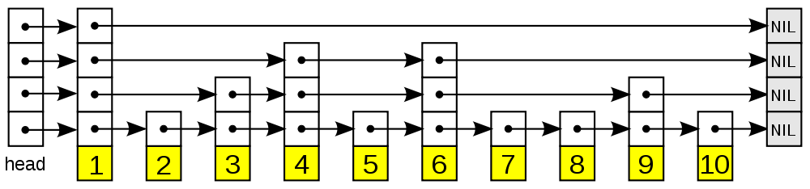
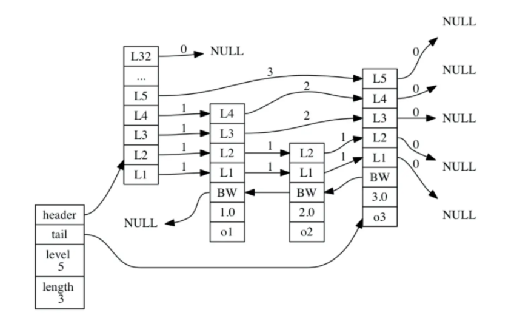
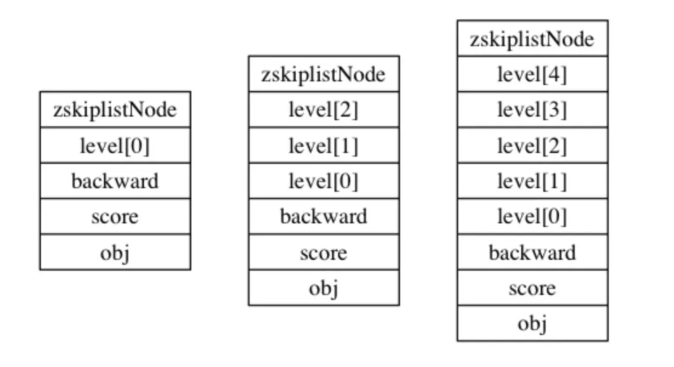
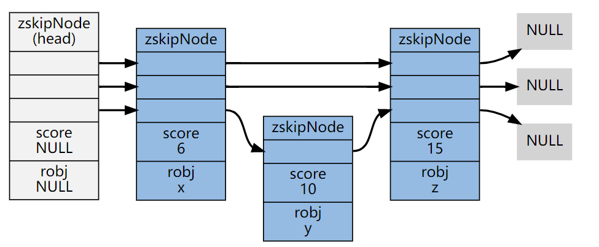

# 跳跃表

跳跃表是有序集合（zset）的底层实现，效率高，实现简单。

跳跃表（[skiplist](http://en.wikipedia.org/wiki/Skip_list)）是一种随机化的数据， 由 William Pugh 在论文[《Skip lists: a probabilistic alternative to balanced trees》](http://www.cl.cam.ac.uk/teaching/0506/Algorithms/skiplists.pdf)中提出， 跳跃表以有序的方式在层次化的链表中保存元素， 效率和平衡树媲美 —— 查找、删除、添加等操作都可以在对数期望时间下完成， 并且比起平衡树来说， 跳跃表的实现要简单直观得多。

以下是个典型的跳跃表例子（图片来自[维基百科](http://en.wikipedia.org/wiki/File:Skip_list.svg)）：



从图中可以看到， 跳跃表主要由以下部分构成：

- 表头（head）：负责维护跳跃表的节点指针。
- 跳跃表节点：保存着元素值，以及多个层。
- 层：保存着指向其他元素的指针。高层的指针越过的元素数量大于等于低层的指针，为了提高查找的效率，程序总是从高层先开始访问，然后随着元素值范围的缩小，慢慢降低层次。
- 表尾：全部由 `NULL` 组成，表示跳跃表的末尾。

因为跳跃表的定义可以在任何一本算法或数据结构的书中找到， 所以本章不介绍跳跃表的具体实现方式或者具体的算法， 而只介绍跳跃表在 Redis 的应用、核心数据结构和 API 。

## 一. 跳跃表的实现

Redis 的跳跃表由 `redis.h/zskiplistNode` 和 `redis.h/zskiplist` 两个结构定义， 其中 `zskiplistNode` 结构用于表示跳跃表节点， 而 `zskiplist` 结构则用于保存跳跃表节点的相关信息， 比如节点的数量， 以及指向表头节点和表尾节点的指针， 等等。



上图展示了一个跳跃表示例，位于图片最左边的示 zskiplist 结构，该结构包含以下属性：

- `header` ：指向跳跃表的表头节点。
- `tail` ：指向跳跃表的表尾节点。
- `level` ：记录目前跳跃表内，层数最大的那个节点的层数（表头节点的层数不计算在内）。
- `length` ：记录跳跃表的长度，也即是，跳跃表目前包含节点的数量（表头节点不计算在内）。

位于 `zskiplist` 结构右方的是四个 `zskiplistNode` 结构， 该结构包含以下属性：

- 层（level）：节点中用 `L1` 、 `L2` 、 `L3` 等字样标记节点的各个层， `L1` 代表第一层， `L2` 代表第二层，以此类推。每个层都带有两个属性：前进指针和跨度。前进指针用于访问位于表尾方向的其他节点，而跨度则记录了前进指针所指向节点和当前节点的距离。在上面的图片中，连线上带有数字的箭头就代表前进指针，而那个数字就是跨度。当程序从表头向表尾进行遍历时，访问会沿着层的前进指针进行。
- 后退（backward）指针：节点中用 `BW` 字样标记节点的后退指针，它指向位于当前节点的前一个节点。后退指针在程序从表尾向表头遍历时使用。
- 分值（score）：各个节点中的 `1.0` 、 `2.0` 和 `3.0` 是节点所保存的分值。在跳跃表中，节点按各自所保存的分值从小到大排列。
- 成员对象（obj）：各个节点中的 `o1` 、 `o2` 和 `o3` 是节点所保存的成员对象。

**注意**：表头节点和其他节点的构造是一样的： 表头节点也有后退指针、分值和成员对象， 不过表头节点的这些属性都不会被用到， 所以图中省略了这些部分， 只显示了表头节点的各个层。

### 1.1 跳跃表

跳跃表由 `redis.h/zskiplist` 结构定义：

```c
typedef struct zskiplist {
    // 头节点，尾节点
    struct zskiplistNode *header, *tail;
    // 节点数量
    unsigned long length;
    // 目前表内节点的最大层数
    int level;
} zskiplist;
```

### 1.2 跳跃表节点

跳跃表节点的实现由 `redis.h/zskiplistNode` 结构定义：

```c
typedef struct zskiplistNode {
    // 后退指针
    struct zskiplistNode *backward;
    // 分值
    double score;
    // 成员对象
    robj *obj;
    // 层
    struct zskiplistLevel {
        // 前进指针
        struct zskiplistNode *forward;
        // 跨度
        unsigned int span;
    } level[];
} zskiplistNode;
```

### 1.3 层

跳跃表节点的 level 数组可以包含多个元素，每个元素都包含一个指向其他节点的指针，程序可以通过这些层来加快访问其他节点的速度，一般来说，层的数量越多，访问其他节点的速度就越快。

每次创建一个新跳跃表节点的时候， 程序都根据幂次定律 （[power law](https://link.juejin.cn?target=http%3A%2F%2Fen.wikipedia.org%2Fwiki%2FPower_law)，越大的数出现的概率越小） 随机生成一个介于 `1` 和 `32` 之间的值作为 `level` 数组的大小， 这个大小就是层的“高度”。

下图分别展示了三个高度为 `1` 层、 `3` 层和 `5` 层的节点， 因为 C 语言的数组索引总是从 `0` 开始的， 所以节点的第一层是 `level[0]` ， 而第二层是 `level[1]` ， 以此类推。




以下是操作这两个数据结构的 API ，API 的用途与相应的算法复杂度：

| 函数                    | 作用                                                      | 复杂度                 |
| :---------------------- | :-------------------------------------------------------- | :--------------------- |
| `zslCreateNode`         | 创建并返回一个新的跳跃表节点                              | 最坏 O(1)              |
| `zslFreeNode`           | 释放给定的跳跃表节点                                      | 最坏 O(1)              |
| `zslCreate`             | 创建并初始化一个新的跳跃表                                | 最坏 O(1)              |
| `zslFree`               | 释放给定的跳跃表                                          | 最坏 O(N)              |
| `zslInsert`             | 将一个包含给定 `score` 和 `member` 的新节点添加到跳跃表中 | 最坏 O(N) 平均 O(logN) |
| `zslDeleteNode`         | 删除给定的跳跃表节点                                      | 最坏 O(N)              |
| `zslDelete`             | 删除匹配给定 `member` 和 `score` 的元素                   | 最坏 O(N) 平均 O(logN) |
| `zslFirstInRange`       | 找到跳跃表中第一个符合给定范围的元素                      | 最坏 O(N) 平均 O(logN) |
| `zslLastInRange`        | 找到跳跃表中最后一个符合给定范围的元素                    | 最坏 O(N) 平均 O(logN) |
| `zslDeleteRangeByScore` | 删除 `score` 值在给定范围内的所有节点                     | 最坏 O(N^2)            |
| `zslDeleteRangeByRank`  | 删除给定排序范围内的所有节点                              | 最坏 O(N^2)            |
| `zslGetRank`            | 返回目标元素在有序集中的排位                              | 最坏 O(N)平均 O(logN)  |
| `zslGetElementByRank`   | 根据给定排位，返回该排位上的元素节点                      | 最坏 O(N)平均 O(logN)  |

## 二. 跳跃表的应用

和字典、链表或者字符串这几种在 Redis 中大量使用的数据结构不同， 跳跃表在 Redis 的唯一作用， 就是实现有序集数据类型。

跳跃表将指向有序集的 `score` 值和 `member` 域的指针作为元素， 并以 `score` 值为索引， 对有序集元素进行排序。

举个例子， 以下代码创建了一个带有 3 个元素的有序集：

```shell
redis> ZADD s 6 x 10 y 15 z
(integer) 3

redis> ZRANGE s 0 -1 WITHSCORES
1) "x"
2) "6"
3) "y"
4) "10"
5) "z"
6) "15"
```

在底层实现中， Redis 为 `x` 、 `y` 和 `z` 三个 `member` 分别创建了三个字符串， 值分别为 `double` 类型的 `6` 、 `10` 和 `15` ， 然后用跳跃表将这些指针有序地保存起来， 形成这样一个跳跃表：



为了方便展示， 在图片中我们直接将 `member` 和 `score` 值包含在表节点中， 但是在实际的定义中， 因为跳跃表要和另一个实现有序集的结构（字典）分享 `member` 和 `score` 值， 所以跳跃表只保存指向 `member` 和 `score` 的指针。 更详细的信息，请参考《[有序集](https://redisbook.readthedocs.io/en/latest/datatype/sorted_set.html#sorted-set-chapter)》章节

## 三. 为啥 redis 使用跳表(skiplist)而不是使用红黑树

skiplist的复杂度和红黑树一样，而且实现起来更简单。

在并发环境下skiplist有另外一个优势，红黑树在插入和删除的时候可能需要做一些rebalance的操作，这样的操作可能会涉及到整个树的其他部分，而skiplist的操作显然更加局部性一些，锁需要盯住的节点更少，因此在这样的情况下性能好一些。

> 本文参考至：
>
> [深入理解Redis跳跃表的基本实现和特性 - 掘金 (juejin.cn)](https://juejin.cn/post/6893072817206591496)

