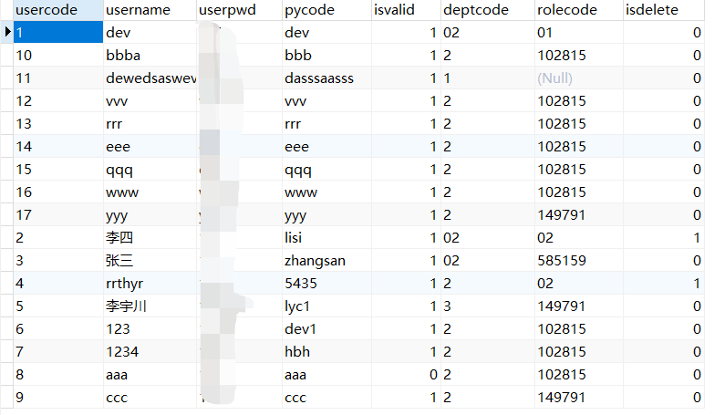

# CONVERT函数

## 语法

```sql
CONVERT ( data_type [ ( length ) ] , expression [ , style ] )
```

注意`[]`代表是参数可选，在书写参数时不要键入`[]`。

-  data_type ：目标数据类型
-  *length* ： 指定目标数据类型长度的可选整数，适用于允许用户指定长度的数据类型。 默认值为 30 
-  style ： 指定 CONVERT 函数将如何转换 expression 的整数表达式 。 对于 NULL 的样式值，则返回 NULL。 data_type 确定范围 。 


## 将字符串转换为整形



在上述数据库中，usercode数据类型为varchar，如果我们想根据usercode的整数大小排序，就需要将其准换为整形值：

```sql
select usercode from user order by convert(int,usercode) desc;
```


## 日期和时间样式

有时候我们需要将日期转换成指定格式的字符串，我们可以这样做：

```sql
select getdate(); --2019-11-06 14:35:47.527
select convert(varchar(50),getdate(),23); --2019-11-06
```

`23`代表的是具体的转换样式，详细的转换样式表参见： https://docs.microsoft.com/zh-cn/sql/t-sql/functions/cast-and-convert-transact-sql?view=sql-server-ver15#date-and-time-styles 

| style |      输出      |
| :---: | :------------: |
|  23   |   yyyy-mm-dd   |
|  111  | yyyy/mm/dd如果 |
