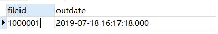

# 解决日期范围判断时边界值问题

有些时候我们需要对时间类型进行日期范围的判断，但是下界问题一直存在：

在

上面这条数据，我们通过下列语句是无法查到的：

```sql
select fileid,outdate from card_info where outdate <= '2019-07-18'
```

我们需要借助`datediff`函数来解决边界值的问题：

```sql
select fileid,outdate from t_emr_tracker_card_info where datediff(day,'1970-01-01',outdate) <= datediff(day,'1970-01-01','2019-07-18')
```

**思路**：算出日期离日期元年（1970-01-01）的天数，然后通过天数来控制范围。

实际上，还可优化成下列代码：

```sql
select fileid,outdate from t_emr_tracker_card_info where datediff(day,getdate(),outdate) <= datediff(day,getdate(),'2019-07-18')
```


`datediff`函数具体使用方法： https://docs.microsoft.com/zh-cn/sql/t-sql/functions/datediff-transact-sql?view=sql-server-ver15 

