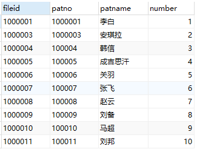
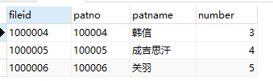

# SQL Server分页查询

首先我们可以将根据主键进行排序，然后为每一行添加一个行号：

```sql
select fileid,patno,patname,row_number() over (order by fileid) as number from t_emr_tracker_card_info 
```



然后根据行号进行分页查询：

```sql
select * from 
(
	select fileid,patno,patname,row_number() over (order by fileid) as number from t_emr_tracker_card_info 
)t where t.number>=1 and t.number<=10
```



