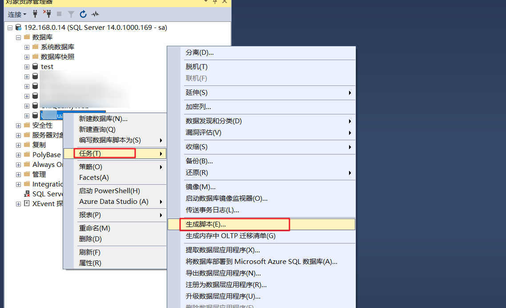
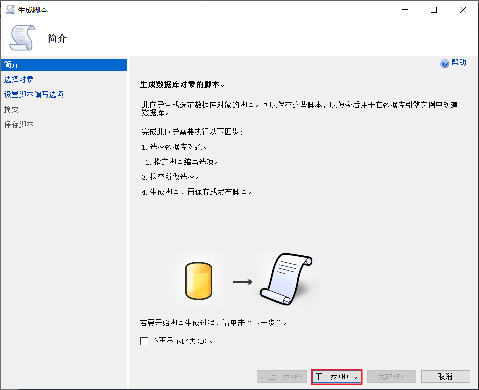
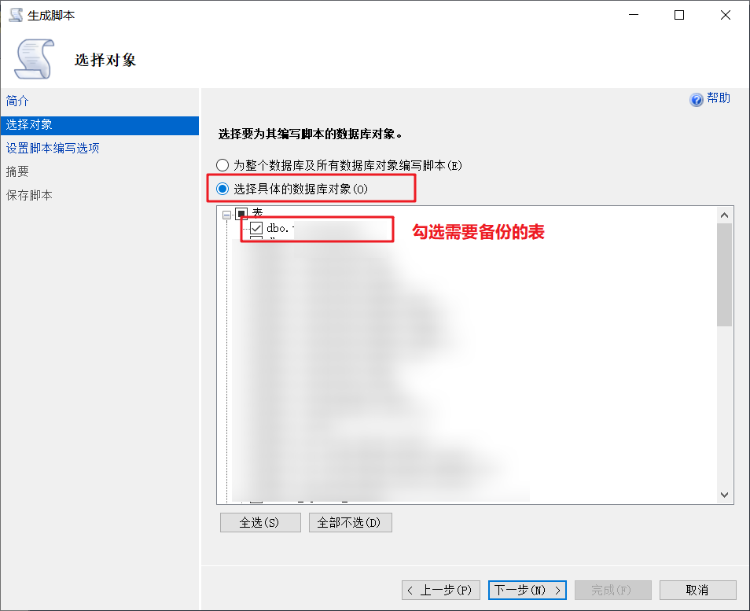
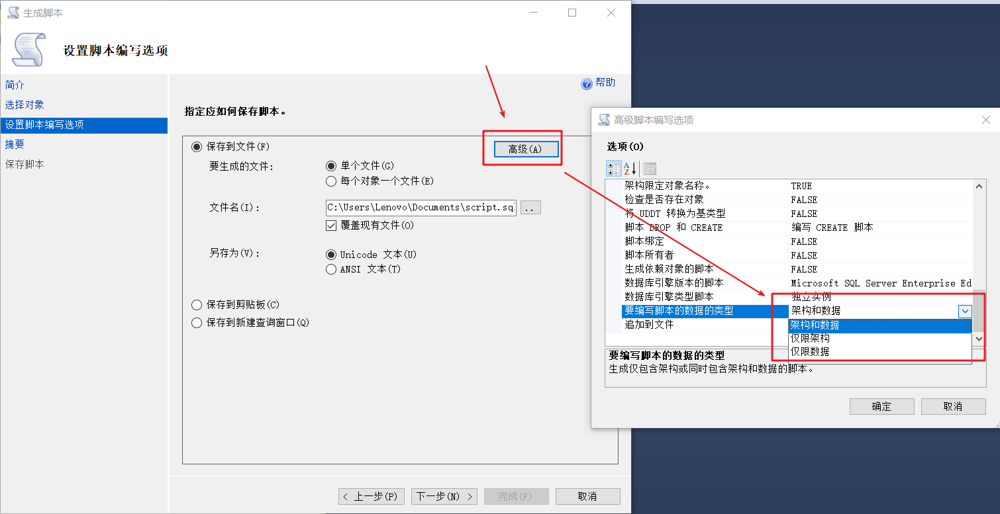

# SQL Server表与表之间小数据量的数据迁移操作

## 一. 数据库相同的情况

有时候我们需要在同一个库中将A表

### 1.1 将A表完整复制B表（B表未创建）

我么有时候需要复制一个表的数据作为备份，在数据量不大的情况下，可以使用下列语句达到效果：

```sql
select * into B from A
```

在执行上述语句时，会先查询A表中的数据，然后自动创建与A表结构一致的B然后将数据输入至B表中。

### 1.2 复制A的结构创建新表

如果我们只想通过复制A表的结构创建一个空的B表我们可以这么做：

```sql
select * into B from A where 1=2
```

### 1.3 表结构不一致的情况下数据迁移

有时候我们需要按条件查出A表中的数据插入到B表的某些列中，我们需要这么做：

```java
insert into B ( name, py, isvalid, qtymemo) select name,py,1,null from A
```

只需要select子句的列与insert子句中的列对应即可，不需要保证列名一致。例如，下列语句中将A表查出来的py列插入到B表的name中：

```sql
insert into B ( name, py, isvalid, qtymemo) select py,py,1,null from A
```


## 二. 数据库不相同的情况

在数据库不相同的情况下，我们如果需要A库的表的数据导入到B库中，我们就需要使用工具生成数据库脚本：

第一步：



第二步：



第三步：



第四步：选择"架构和数据"表示生成表结构的创建语句和数据的insert语句，具体选啥按情况来

