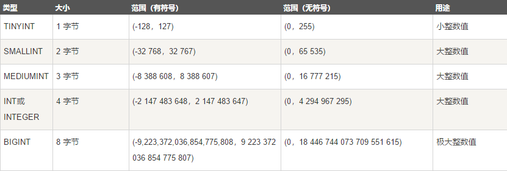
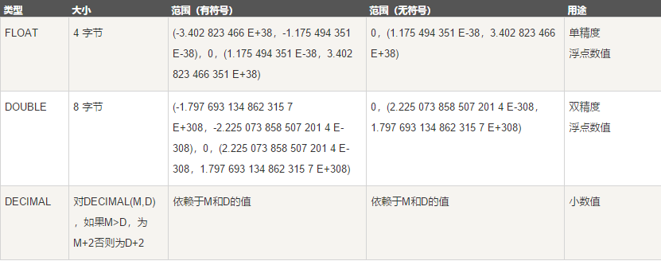

# MySQL支持的数据类型

MySQL中定义数据字段的类型对你数据库的优化是非常重要的。MySQL支持多种类型，大致可以分为三类：数值、日期/时间和字符串(字符)类型。

## 整数类型

MySQL支持所有标准SQL数值数据类型。

这些类型包括严格数值数据类型(INTEGER、SMALLINT、DECIMAL和NUMERIC)，以及近似数值数据类型(FLOAT、REAL和DOUBLE PRECISION)。

关键字INT是INTEGER的同义词，关键字DEC是DECIMAL的同义词。

BIT数据类型保存位字段值，并且支持MyISAM、MEMORY、InnoDB和BDB表。

作为SQL标准的扩展，MySQL也支持整数类型TINYINT、MEDIUMINT和BIGINT。下面的表显示了需要的每个整数类型的存储和范围。

我们经常选择id作为表的主键字段，而id的数据类型一般都选择int，基本上不使用bigint这种超大整数值，因为int unsigned数值范围可以达到42亿。

int(4)和int(10)有什么区别吗？很多人对这概念并不是很清楚，其实int(n)括号里面的n不管写成多少，都是占4个字节的空间，最多能存10位数。n不是代表能存几位数，只是代表显示宽度，在不定义填充模式的情况下，int(4)和int(10)没有区别。

但是如果定义了zerofill（填充零），那么int(4)和int(10)就有区别了。假如我们存入数值1，那么int(4)显示0001，而int(10)显示0000000001（注意：不要使用Navicat等数据库管理工具查看，他们会默认不显示填充零，直接在命令行模式查询数据即可看到填充零的效果）。

## 浮点型

在生产环境中应该避免使用float和double浮点类型，因为它不属于精确类型。在生成环境中我们大多使用decimal来存储金钱字段，decimal（M,D）M代表整数部分+小数部分的总位数，D代表小数部分位数，如果输入的数不含小数部分，则小数位自动补0，也就是说整数部分的最大位数为M-D。

对交易平台类型我们可以使用int来存储金钱，让int单位为分，这样就不存在四舍五入了，让存的数值更加精确。

## 日期和时间类型

表示时间值的日期和时间类型为DATETIME、DATE、TIMESTAMP、TIME和YEAR。

每个时间类型有一个有效值范围和一个"零"值，当指定不合法的MySQL不能表示的值时使用"零"值。

TIMESTAMP类型有专有的自动更新特性，将在后面描述。

在生产环境中大多使用datetime存储时间类型，有时也使用int类型来存储时间。

## 字符串类型

字符串类型指CHAR、VARCHAR、BINARY、VARBINARY、BLOB、TEXT、ENUM和SET。该节描述了这些类型如何工作以及如何在查询中使用这些类型。

char类型用于定长字符串，并且大小范围为0-255，如果字符数没有达到定义的位数，会在后面用空格不全存入数据库中；如果查过指定长度大小会被截断。

varchar是变长字符串，长度范围为0-65535，存储时如果字符数没有达到定义的位数并不会在后面补空格；如果超过指定长度也会被截断。

