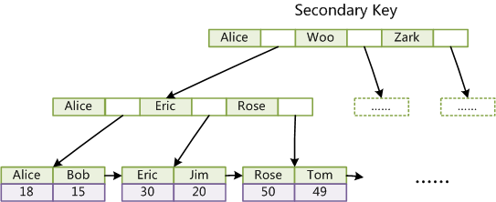
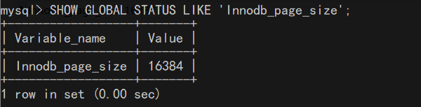
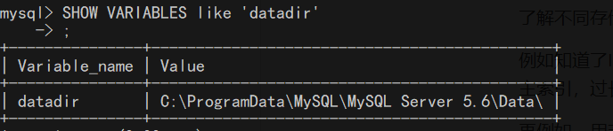
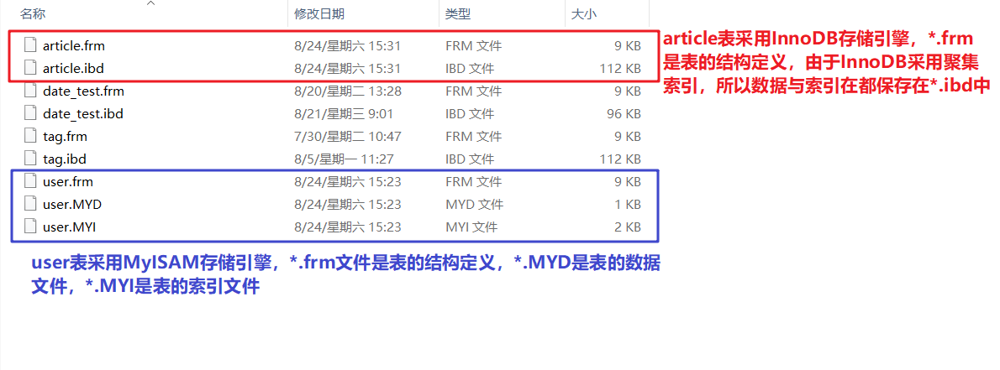

# MySQL索引实现原理

在MySQL中，索引属于存储引擎级别的概念，不同存储引擎对索引的实现方式是不同的，本文主要讨论MyISAM和InnoDB两个存储引擎的索引实现方式。需要注意的是存储引擎是表级别的概念，在一个数据库中不同的表可以采用不同的存储引擎。

## **1. MyISAM索引实现**

MyISAM引擎使用B+Tree作为索引结构，叶节点data域存放数据记录的地址


设Col1为主键，则图8是一个MyISAM表的主索引（Primary key）示例。

可以看出MyISAM的索引文件仅仅保存数据记录的地址。

在MyISAM中，主索引和辅索引（Secondary key）在结构上没有任何区别，只是主索引要求key是唯一的，而辅索引的key可以重复

如果我们在Col2上建立一个辅索引，则此索引的结构如下图所示：


同样也是一颗B+Tree，data域保存数据记录的地址。

因此，MyISAM中索引检索的算法为首先按照B+Tree搜索算法搜索索引，如果指定的Key存在，则取出其data域的值，然后以data域的值为地址，读取相应数据记录。 

MyISAM的索引方式也叫做“非聚集”的，之所以这么称呼是为了与InnoDB的聚集索引区分。


## **2. InnoDB索引实现**

虽然InnoDB也使用B+Tree作为索引结构，但具体实现方式却与MyISAM截然不同

第一个重大区别是InnoDB的数据文件本身就是索引文件。

从上文知：

- MyISAM索引文件和数据文件是分离的，索引文件仅保存数据记录的地址
- 而**在InnoDB中，表数据文件本身就是按B+Tree组织的一个索引结构**，这棵树的叶节点data域保存了完整的数据记录。这个索引的key是数据表的主键，因此InnoDB表数据文件本身就是主索引


可以看到叶节点包含了完整的数据记录。这种索引叫做聚集索引。

**因为InnoDB的数据文件本身要按主键聚集，所以InnoDB要求表必须有主键**（MyISAM可以没有），如果没有显式指定，则MySQL系统会自动选择一个可以唯一标识数据记录的列作为主键，如果不存在这种列，则MySQL自动为InnoDB表生成一个隐含字段作为主键，这个字段长度为6个字节，类型为长整形

第二个与MyISAM索引的不同是**InnoDB的辅索引data域存储相应记录主键值**而不是地址。换句话说，InnoDB的所有辅助索引都引用主键作为data域。例如：



这里以英文字符的ASCII码作为比较准则。聚集索引这种实现方式使得按主键的搜索十分高效，但是辅助索引搜索需要检索两遍索引：首先检索辅助索引获得主键，然后用主键到主索引中检索获得记录。

了解不同存储引擎的索引实现方式对于正确使用和优化索引都非常有帮助，

例如知道了InnoDB的索引实现后，就很容易明白为什么不建议使用过长的字段作为主键，因为所有辅索引都引用主索引，过长的主索引会令辅索引变得过大。

再例如，用非单调的字段作为主键在InnoDB中不是个好主意，因为InnoDB数据文件本身是一颗B+Tree，非单调的主键会造成在插入新记录时数据文件为了维持B+Tree的特性而频繁的分裂调整，十分低效，而使用自增字段作为主键则是一个很好的选择。

这里拓展一点，InnoDB索引的B+树节点的大小默认被锁定在16K（四个磁盘页的大小），我们可以通过下面这个命令查看：

```sql
SHOW GLOBAL STATUS LIKE 'Innodb_page_size'
```



至于为什么设置为16K，可以参考 [B树和B+树与磁盘读写之间的联系](../../数据结构与算法/subfile/_4B树和B+树与磁盘读写之间的联系.md)

## **3. MySQL数据库文件**

前面我们说到了MyISAM存储引擎是非聚集索引，而InnoDB存储引擎采用的是聚集索引，我们可以通过MySQL存储的本地文件来证明这一点。

首先我们需要确定MySQL存储文件的位置，我们进入命令行界面，执行如下命令得到本地数据文件地址：

```sql
SHOW VARIABLES like 'datadir';
```



进入test数据库所在文件目录，可以看到user表和article表的数据文件:



## **4. 总结**

1. MySQL的两个常用存储引擎（MyISAM和InnoDB）都采用B+树的数据结构来创建索引。
2. MyISAM的索引是非聚集索引，叶子节点只存储数据的地址；InnoDB的主键索引是聚集索引，并且表本身就是一个B+树索引。
3. InnoDB辅助索引的叶子节点只存储数据的主键值，需要通过主键索引查询到数据；MyISAM辅助索引存储的数据的物理地址，可直接读取到数据行。
4. 采用InnoDB存储引擎的表，必须包含主键，主键建议为整形值，并且为自增；MyISAM存储引擎不做要求。


**本文参考至**：

https://cloud.tencent.com/developer/article/1125452

