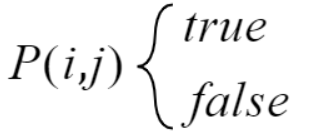
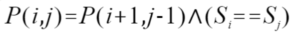
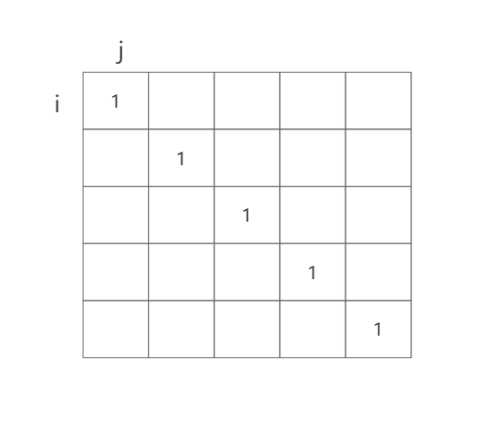
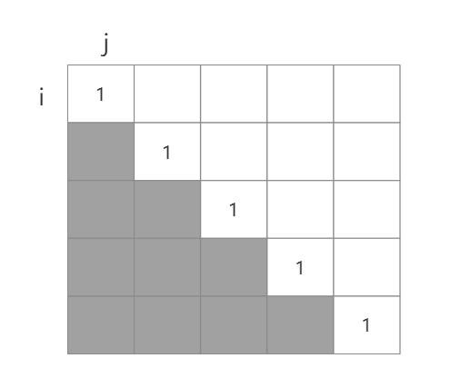
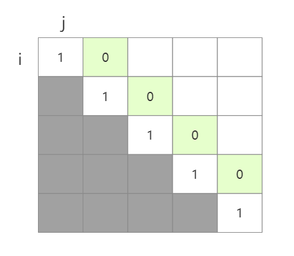
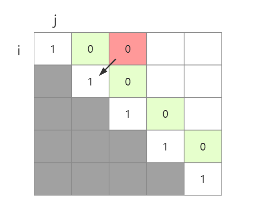
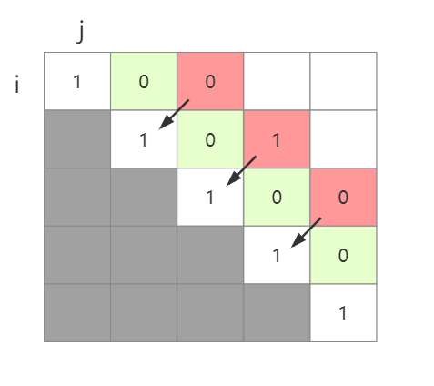
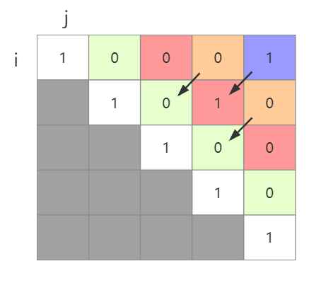
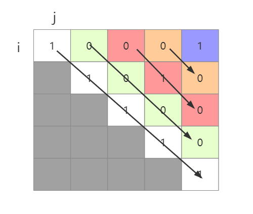

# 最长回文子串-动态规划

> 给你一个字符串 s，找到 s 中最长的回文子串。
>
> 示例 1：
>
> 输入：s = "babad"
> 输出："bab"
> 解释："aba" 同样是符合题意的答案。
> 示例 2：
>
> 输入：s = "cbbd"
> 输出："bb"
> 示例 3：
>
> 输入：s = "a"
> 输出："a"
> 示例 4：
>
> 输入：s = "ac"
> 输出："a"
>
> LeetCode：[最长回文子串 - 力扣（LeetCode） (leetcode-cn.com)](https://leetcode-cn.com/problems/longest-palindromic-substring/submissions/)

## 一. 思路分析

对于一个子串而言，如果它是回文串，并且长度大于 2，那么将它首尾的两个字母去除之后，它仍然是个回文串。例如对于字符串`ababa`，如果我们已经知道`bab`是回文串，那么`ababa`一定是一个回文串，因为它首尾两个字母都是`a`。

根据这样的思路，我们就可以用动态规划的方法解决本题。我们用 `P(i,j)` 表示字符串 s 的第 i 到 j 个字母组成的串（下文表示成 `s[i:j]`）是否为回文串。那么`P(i,j)`就有两种情况，一种是true一种是false：



那么我们就可以写出动态规划的状态转移方程：



也就是说从i到j的字符串是否是回文串取决于，去掉首尾字符（`P(i+1,j-1)`）后是否是回文串以及首尾字符是否完全相等决定。首尾字符是否相等比较容易判断，但是`P(i+1,j-1)`是否是回文串就需要借助DP数组的力量了。

我们假定一个字符串长度为5的字符串`baead`，然后创建一个5*5的二维数组用于记录子串是否是回文串。例如`P(i,j)`如果是回文串，则将`arr[i][j]`记为1，若不是则记为0。

由于长度为1的字符串都是回文串，那么这个二维数组的对角线则全部为1：



对应在图中就是`arr[0][0]、arr[1][1]、arr[2][2]....`全是1。

由于i是表示截断字符串的左边的指针，所以当i>j没有任何意义，我们不考虑数组的下半部分：



当`j-i==1`也就是子串长度为2时，是否是回文子串由两个元素是否相等决定，所以我们可以把长度为2的所有情况全部初始化一下，也就是下图中绿色部分的数据。对于`baead`字符串，我可以做如下初始化：



例如`P(0,1)`的子串为“ba”，它显然不是回文串，所以在`arr[0][1]`上设置为0，同理：

- P(1,2)=“ae”
- P(2,3)=“ea”
- P(3,4)=“ad”

都不是回文串，所以绿色部分的方格都为0。

初始化长度为1和2的数据，动态规划中的base cese就完成了。

当我们想要知道`P(0,2)`，也就是字符串“bab”是不是回文串，我们只需要看`P(0+1,2-1)`也就是`P(1,1)`的位置是否是1，如果是则比较首尾字符相等即可。从图中看就是比较当前位置左下角的那个方格：



则样我们可以按照规律，将所有长度为3的子串全部计算完毕，也就是图中红色部分：



按照这样的规律我们将长度为4和5的子串全部计算完毕后，所有的case就枚举完毕了，此时我们想要得到最长子串岂不是非常容易。



## 二. 代码实现

```java
public String longestPalindrome(String s) {
    //初始二维数组，默认全为false
    boolean[][] dp = new boolean[s.length()][s.length()];
    int maxLength = 1;//暂存最长回文子串的长度
    int maxI = 0; //暂存最长回文子串的起始下标
    for (int len = 0; len < s.length(); len++) {
        for (int i = 0; i + len < s.length(); i++) {
            if (len == 0) { //长度为1的情况，全部为true
                dp[i][i + len] = true;
            } else if (len == 1) { //长度为2的情况，只有当两个元素相等时才为回文子串
                if (s.charAt(i) == s.charAt(i + 1)) {
                    dp[i][i + len] = true;
                    if (len + 1 > maxLength) {
                        maxLength = len + 1;
                        maxI = i;
                    }
                } else {
                    dp[i][i + len] = false;
                }
            } else {
                if (dp[i + 1][i + len - 1] && s.charAt(i) == s.charAt(i + len)) {
                    dp[i][i + len] = true;
                    if (len + 1 > maxLength) {
                        maxLength = len + 1;
                        maxI = i;
                    }
                }
            }
        }
    }
    return s.substring(maxI, maxI + maxLength);
}
```

需要注意的是，循环遍历的顺序一定是按照长度优先，换句话说就是将长度为i的计算完成后，在计算长度i+1的回文串，反应到图中就是以对角线的路径进行遍历：



因为只有这种遍历路径才能保证你当前位置的左下角是已经计算过的值。