# 余弦相似度

相似度度量（Similarity），即计算个体间的相似程度，相似度度量的值越小，说明个体间相似度越小，相似度的值越大说明个体差异越大。

对于多个不同的文本或者短文本对话消息要来计算他们之间的相似度如何，一个好的做法就是将这些文本中词语，映射到向量空间，形成文本中文字和向量数据的映射关系，通过计算几个或者多个不同的向量的差异的大小，来计算文本的相似度。下面介绍一个详细成熟的向量空间余弦相似度方法计算相似度

## 一. 向量空间余弦相似度(Cosine Similarity)

余弦相似度用向量空间中两个向量夹角的余弦值作为衡量两个个体间差异的大小。余弦值越接近1，就表明夹角越接近0度，也就是两个向量越相似，这就叫"余弦相似性"。

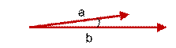

上图两个向量a,b的夹角很小可以说a向量和b向量有很高的的相似性，极端情况下，a和b向量完全重合。如下图：

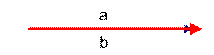

如上图二：可以认为a和b向量是相等的，也即a，b向量代表的文本是完全相似的，或者说是相等的。如果a和b向量夹角较大，或者反方向。如下图

如上图三: 两个向量a,b的夹角很大可以说a向量和b向量有很底的的相似性，或者说a和b向量代表的文本基本不相似。那么是否可以用两个向量的夹角大小的函数值来计算个体的相似度呢？

向量空间余弦相似度理论就是基于上述来计算个体相似度的一种方法。下面做详细的推理过程分析。

想到余弦公式，最基本计算方法就是初中的最简单的计算公式，计算夹角

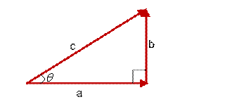

的余弦定值公式为：

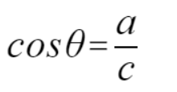

但是这个是只适用于直角三角形的,而在非直角三角形中，余弦定理的公式是

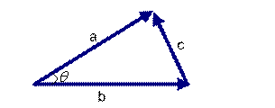

在向量表示的三角形中，假设a向量是`(x1, y1)`，b向量是`(x2, y2)`，那么可以将余弦定理改写成下面的形式：

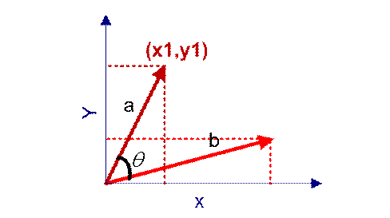

向量a和向量b的夹角的余弦计算如下：

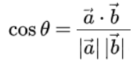

其中`a·b`称为**点积**又称**数量积**或**标量积**，在欧几里得空间中，点积可以直观地定义为：

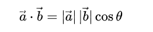

这里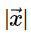表示向量的长度

两个N维向量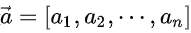和的点积定义为：

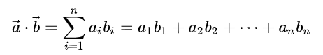

那么余弦的计算公式在N维坐标系上可化为：

tip：可能很多小伙伴对分母的转化有疑问，这里做出解释。根据欧几里得距离公式：

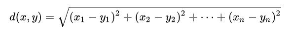

而向量的长度，就是坐标点到原点的距离，所以最终可化为：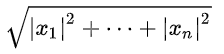

**余弦值越接近1，就表明夹角越接近0度，也就是两个向量越相似，夹角等于0，即两个向量相等，这就叫"余弦相似性"**。

## 二. 余弦相似度计算过程

举一个例子来说明，用上述理论计算文本的相似性。为了简单起见，先从句子着手。

- 句子A：这只皮靴号码大了。那只号码合适

- 句子B：这只皮靴号码不小，那只更合适

怎样计算上面两句话的相似程度？

基本思路是：如果这两句话的用词越相似，它们的内容就应该越相似。因此，可以从词频入手，计算它们的相似程度。

**第一步：分词**

- 句子A：这只/皮靴/号码/大了。那只/号码/合适。

- 句子B：这只/皮靴/号码/不/小，那只/更/合适。

**第二步：列出所有的词**

- 这只，皮靴，号码，大了。那只，合适，不，小，很

**第三步：计算词频**

- 句子A：这只1，皮靴1，号码2，大了1。那只1，合适1，不0，小0，更0

- 句子B：这只1，皮靴1，号码1，大了0。那只1，合适1，不1，小1，更1

**第四步：写出词频向量**

- 句子A：(1，1，2，1，1，1，0，0，0)

- 句子B：(1，1，1，0，1，1，1，1，1)

到这里，问题就变成了如何计算这两个向量的相似程度。我们可以把它们想象成空间中的两条线段，都是从原点（[0, 0, ...]）出发，指向不同的方向。两条线段之间形成一个夹角，如果夹角为0度，意味着方向相同、线段重合,这是表示两个向量代表的文本完全相等；如果夹角为90度，意味着形成直角，方向完全不相似；如果夹角为180度，意味着方向正好相反。因此，我们可以通过夹角的大小，来判断向量的相似程度。夹角越小，就代表越相似。

**第五步：计算余弦值**

根据**余弦计算公式**

计算两个句子词频向量的余弦值

句子A：(1，1，2，1，1，1，0，0，0)和句子B：(1，1，1，0，1，1，1，1，1)的向量余弦值来确定两个句子的相似度：

## 三. 总结

文本相似度计算的处理流程是:

  （1）找出两篇文章的关键词；

　（2）每篇文章各取出若干个关键词，合并成一个集合，计算每篇文章对于这个集合中的词的词频

　（3）生成两篇文章各自的词频向量；

　（4）计算两个向量的余弦相似度，值越大就表示越相似。

需要注意的是余弦相似度只是文本相似度，它只是从词频的角度去衡量相似度，并没有任何的语义分析不能将其视为语义相似度。在计算余弦相似度最关键的一个环节就是分词，而这一过程可以借助 [HanLP](https://github.com/hankcs/HanLP) 等分词工具进行分词。

本文参考至：

[余弦计算相似度度量_京东云成都团队的专栏-CSDN博客_余弦相似度计算](https://blog.csdn.net/u012160689/article/details/15341303)

[余弦相似性 - 维基百科，自由的百科全书 (wikipedia.org)](https://zh.wikipedia.org/wiki/余弦相似性)

[三角函数 - 维基百科，自由的百科全书 (wikipedia.org)](https://zh.wikipedia.org/wiki/三角函数)

[数量积 - 维基百科，自由的百科全书 (wikipedia.org)](https://zh.wikipedia.org/wiki/点积)

[范数 - 维基百科，自由的百科全书 (wikipedia.org)](https://zh.wikipedia.org/wiki/范数)