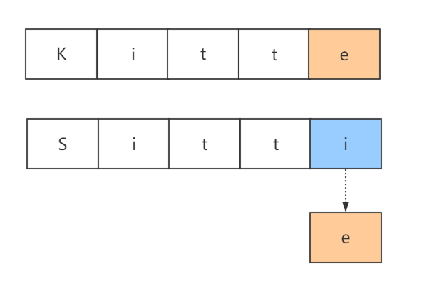
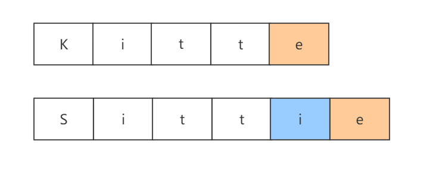
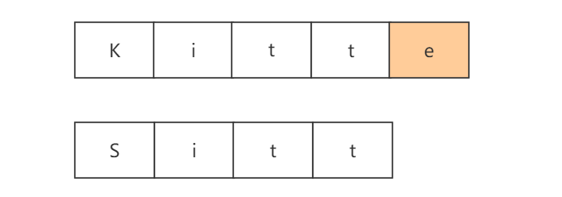
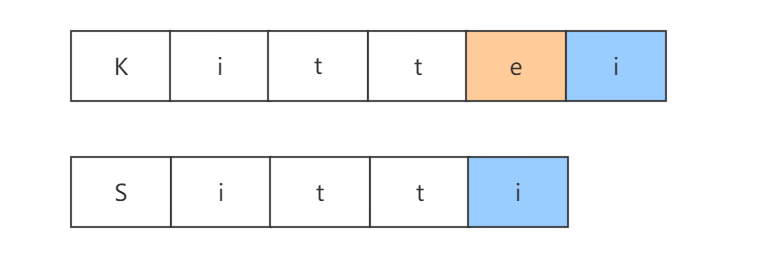
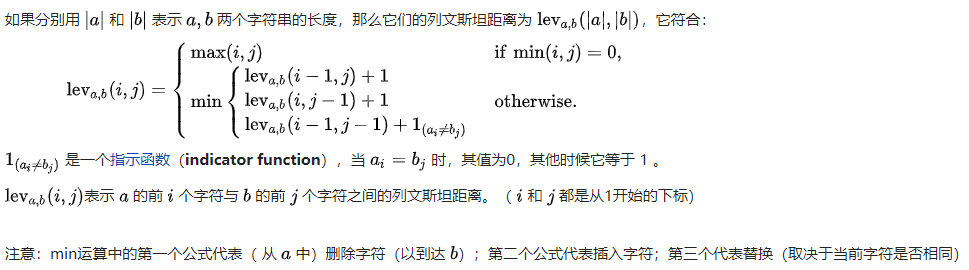
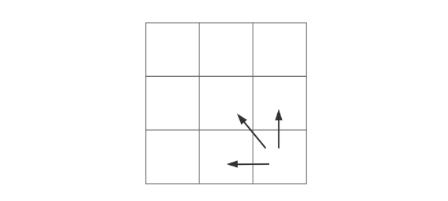
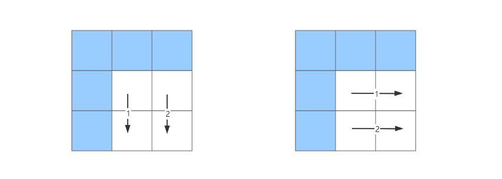

# 编辑距离（Levenshtein Distance）

## 一. 什么是Levenshtein Distance

`Levenshtein Distance`，一般称为编辑距离（`Edit Distance`，`Levenshtein Distance`只是编辑距离的其中一种）或者莱文斯坦距离，算法概念是俄罗斯科学家弗拉基米尔·莱文斯坦（Levenshtein · Vladimir I）在1965年提出。此算法的概念很简单：`Levenshtein Distance`指**两个字串之间，由一个转换成另一个所需的最少编辑操作次数**，允许的编辑操作包括：

- 将其中一个字符替换成另一个字符（`Substitutions`）。
- 插入一个字符（`Insertions`）。
- 删除一个字符（`Deletions`）。

## 二. 解题思路

假如，我们定义个方法，入参为两个字符串，返回两个字符串的编辑距离：

```java
public static int editDistance(String a,String b)
```

假设我们有“kitte”、“Sitti”两个字符串，我们暂且将这两个字符串成为”A“和”B“，我们的编辑操作大致可分为三种类型：

- 选择一：将B字符串最后一个字符替换，使得两个字符串相等



因为这个操作使得最后一个字符相等，那么我们只需要继续计算`minDistance(A[i-1],B[j-1])`的编辑距离即可（A[i-1]，其中i代表A字符串的长度，A[i-1]表示A字符串（0~length-1）的子串）

- 选择二：将B字符串增加一个字符，使得两个字符串最后一个字符相等：



这样我们只需要继续计算`minDisnace(A[i-1]，B[j])`的编辑距离即可

- 选择三：将B字符串最后一个字符删除



实际上，删除B字符串的最后一个字符与在A字符串添加一个字符是等价的：



因为他们的编辑过程都为1，最后都需要继续计算`minDistance(A[i],B[j-1])`的编辑距离。

需要注意的是，大家不要站在上帝视角认为此种情况下选择第一种方式，将最后一个字符替换即是最优解。因为小范围的最佳解，并不一定是大范围的最佳解，我们只有枚举出所有可能的情况才能得出最小的编辑距离。

综上所述，我们可以得出编辑距离算法的状态转移方程：



## 三. 动态规划

了解动态规划的同学应该都知道DP算法，需要借助DP数组去完成，但是DP数组的初始化会困扰很多同学，这里我可以给大家提供一个技巧，对于DP数组需要初始化哪些数据，我们可以观察状态转移方程依赖与哪些状态，以上面的例子来说：

`lev(i,j)`需要依赖于`lev(i-1,j)`、`lev(i,j-1)`、`lev(i-1,j-1)`三种状态：



这样我们就需要把这个二维数组蓝色部分初始化好后，才能根据初始化好的数组，将整个二维数组填满，当填满的那一刻，我们的最优解也就达到了。


至于计算的路径，我们从初始化好的状态以及依赖态的位置，我们可以得出两种计算路径：



这里就是我对动态规划DP数组的初始化以及计算路径的明确技巧。

可以使用动态规划的方法去测量`DP`的值，步骤大致如下：

- 初始化一个`DP`矩阵`(M,N)`，`M`和`N`分别是两个输入字符串的长度。
- 矩阵可以从左上角到右下角进行填充，每个水平或垂直跳转分别对应于一个插入或一个删除。
- 通过定义每个操作的成本为1，如果两个字符串不匹配，则对角跳转的代价为1，否则为0，简单来说就是：
  - 如果`[i][j]`位置的两个字符串相等，则从`[i][j]`位置左加1，上加1，左上加0，然后从这三个数中取出最小的值填充到`[i][j]`。
  - 如果`[i][j]`位置的两个字符串不相等，则从`[i][j]`位置左、左上、上三个位置的值中取最小值，这个最小值加1（或者说这三个值都加1然后取最小值），然后填充到`[i][j]`。
- 按照上面规则`LD`矩阵`(M,N)`填充完毕后，最终**矩阵右下角的数字**就是两个字符串的`LD`值。

这里不打算证明上面动态规划的结论（也就是默认这个动态规划的结果是正确的），直接举两个例子说明这个问题：

- 例子一（两个等长字符串）：`son`和`sun`。
- 例子二（两个非等长字符串）：`doge`和`dog`。

**例子一：**

初始化`LD`矩阵`(3,3)`：

|      |      | `s`  | `o`  | `n`  |
| :--: | :--: | :--: | :--: | :--: |
|      | `0`  | `1`  | `2`  | `3`  |
| `s`  | `1`  |      |      |      |
| `u`  | `2`  |      |      |      |
| `n`  | `3`  |      |      |      |

计算`[0][0]`的位置的值，因为`'s' = 's'`，所以`[0][0]的值 = min(1+1, 1+1, 0+0) = 0`。

|      |      | `s`  | `o`  | `n`  |
| :--: | :--: | :--: | :--: | :--: |
|      | `0`  | `1`  | `2`  | `3`  |
| `s`  | `1`  |  0   |      |      |
| `u`  | `2`  |      |      |      |
| `n`  | `3`  |      |      |      |

按照这个规则计算其他位置的值，填充完毕后的`LD`矩阵`如下：

|      |      | `s`  | `o`  | `n`  |
| :--: | :--: | :--: | :--: | :--: |
|      | `0`  | `1`  | `2`  | `3`  |
| `s`  | `1`  |  0   |  1   |  2   |
| `u`  | `2`  |  1   |  1   |  2   |
| `n`  | `3`  |  2   |  2   |  1   |

那么`son`和`sun`的`LD`值为1。

**例子二：**

初始化`LD`矩阵`(4,3)`：

|      |      | `d`  | `o`  | `g`  |
| :--: | :--: | :--: | :--: | :--: |
|      | `0`  | `1`  | `2`  | `3`  |
| `d`  | `1`  |      |      |      |
| `o`  | `2`  |      |      |      |
| `g`  | `3`  |      |      |      |
| `e`  | `4`  |      |      |      |

接着填充矩阵：

|      |      | `d`  | `o`  | `g`  |
| :--: | :--: | :--: | :--: | :--: |
|      | `0`  | `1`  | `2`  | `3`  |
| `d`  | `1`  | `0`  | `1`  | `2`  |
| `o`  | `2`  | `1`  | `0`  | `1`  |
| `g`  | `3`  | `2`  | `1`  | `0`  |
| `e`  | `4`  | `3`  | `2`  | `1`  |

那么`doge`和`dog`的`LD`值为1。

## 四. 代码实现

```java
public static int minDistance(String word1, String word2) {
    if (word1 == null || word2 == null) {
        throw new RuntimeException("参数不能为空");
    }
    int[][] dp = new int[word1.length() + 1][word2.length() + 1];
    //初始化DP数组
    for (int i = 0; i <= word1.length(); i++) {
        dp[i][0] = i;
    }
    for (int i = 0; i <= word2.length(); i++) {
        dp[0][i] = i;
    }
    int cost;
    for (int i = 1; i <= word1.length(); i++) {
        for (int j = 1; j <= word2.length(); j++) {
            if (word1.charAt(i - 1) == word2.charAt(j - 1)) {
                cost = 0;
            } else {
                cost = 1;
            }
            dp[i][j] = min(dp[i - 1][j] + 1, dp[i][j - 1] + 1, dp[i - 1][j - 1] + cost);
        }
    }
    return dp[word1.length()][word2.length()];
}

private static int min(int x, int y, int z) {
    return Math.min(x, Math.min(y, z));
}
```

## 五. 编辑距离的应用

- 搜索建议：当我们Google搜索`Jave`时，Google会智能的提醒我们是否在搜索`Java`
- DNA分析
- 抄袭侦测

…


> 本文参考至：
>
> - [编辑距离 - 编辑距离 - 力扣（LeetCode） (leetcode-cn.com)](https://leetcode-cn.com/problems/edit-distance/solution/bian-ji-ju-chi-by-leetcode-solution/)
> - [Levenshtein Distance（编辑距离）算法与使用场景 - throwable - 博客园 (cnblogs.com)](https://www.cnblogs.com/throwable/p/12445082.html)